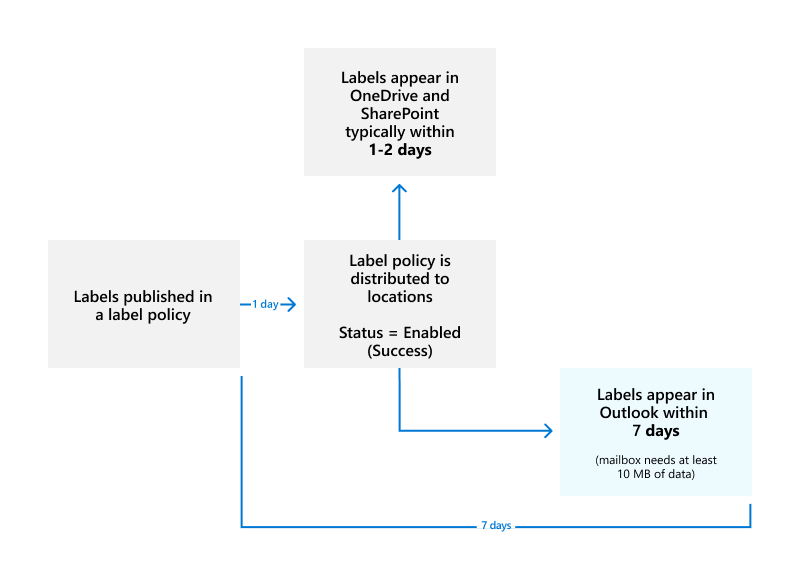
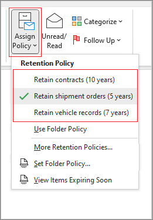
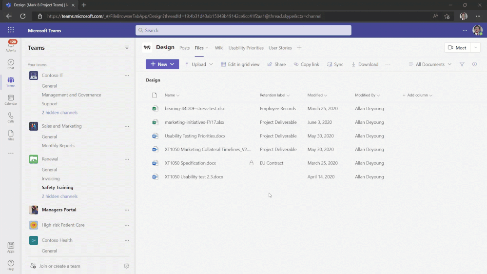

# Publish retention labels and apply them in apps

>*[Microsoft 365 licensing guidance for security & compliance](/office365/servicedescriptions/microsoft-365-service-descriptions/microsoft-365-tenantlevel-services-licensing-guidance/microsoft-365-security-compliance-licensing-guidance).*

> [!NOTE]
> This scenario is supported for all retention label configurations, including [regulatory records](records-management.md#records).

Use the following information to help you publish [retention labels](retention.md), and then apply them to documents and emails.

Retention labels help you retain what you need and delete what you don't at the item level (document or email). They're also used to declare an item as a record as part of a [records management](records-management.md) solution for your Microsoft 365 data.

Making retention labels available to people in your organization so that they can classify content is a two-step process: 

1. Create the retention labels.

2. Publish the retention labels by using a retention label policy.
  


Use the following instructions for the two admin steps.

[!INCLUDE [purview-preview](../includes/purview-preview.md)]

## Before you begin

The global admin for your organization has full permissions to create and edit retention labels and their policies. If you aren't signing in as a global admin, see the permissions information for [records management](get-started-with-records-management.md#permissions) or [data lifecycle management](get-started-with-data-lifecycle-management.md#permissions-for-retention-policies-and-retention-labels), depending on the solution you're using.

Make sure you have [created the retention labels](file-plan-manager.md#create-retention-labels) you want to apply to items.

## How to publish retention labels

Decide before you create your retention label policy whether it will be **adaptive** or **static**. For more information, see [Adaptive or static policy scopes for retention](retention.md#adaptive-or-static-policy-scopes-for-retention). If you decide to use an adaptive policy, you must create one or more adaptive scopes before you create your retention label policy, and then select them during the create retention label policy process. For instructions, see [Configuration information for adaptive scopes](purview-adaptive-scopes.md#configure-adaptive-scopes).

1. In the <a href="https://go.microsoft.com/fwlink/p/?linkid=2077149" target="_blank">Microsoft Purview compliance portal</a>, go to one of the following locations:
    
    - If you're using records management:
        - **Solutions** > **Records management** > > **Label policies** tab > **Publish labels**
    
    - If you're using data lifecycle management:
        - **Solutions** > **Data lifecycle management** > **Microsoft 365** > **Label policies** tab > **Publish labels**

2. Follow the prompts to create the retention label policy. Be careful what name you choose for the policy, because this can't be changed after the policy is saved.

3. Use the link to select the retention labels to publish, and then select **Next**.

4. For the **Assign admin units** page: This configuration is currently in preview. If your organization is using [administrative units in Azure Active Directory](/azure/active-directory/roles/administrative-units), a retention label policy that doesn't include SharePoint sites can be automatically restricted to specific users by selecting administrative units. If your account has been [assigned administrative units](microsoft-365-compliance-center-permissions.md#administrative-units-preview), you must select one or more administrative units.
    
    If you don't want to restrict the policy by using administrative units, or your organization hasn't configured administrative units, keep the default of **Full directory**. You must select **Full directory** for the policy to include the location for SharePoint sites.

5. For the **Choose the type of retention policy to create** page, select **Adaptive** or **Static**, depending on the choice you made from the [Before you begin](#before-you-begin) instructions. If you haven't already created adaptive scopes, you can select **Adaptive** but because there won't be any adaptive scopes to select, you won't be able to finish the configuration with this option.

6. Depending on your selected scope:
    
    - If you chose **Adaptive**: On the **Choose adaptive policy scopes and locations** page, select **Add scopes** and select one or more adaptive scopes that have been created. Then, select one or more locations. The locations that you can select depend on the [scope types](purview-adaptive-scopes.md#configure-adaptive-scopes) added. For example, if you only added a scope type of **User**, you'll be able to select **Exchange email** but not **SharePoint sites**.
    
    - If you chose **Static**: On the **Choose locations** page, toggle on or off any of the locations. For each location, you can leave it at the default to [apply the policy to the entire location](retention-settings.md#a-policy-that-applies-to-entire-locations), or [specify includes and excludes](retention-settings.md#a-policy-with-specific-inclusions-or-exclusions)
    
    For information about the location choices, see [Locations](retention-settings.md#locations).

To edit an existing retention label policy (the policy type is **Publish**), select it, and then select the **Edit** option to start the **Edit retention policy** configuration.

## When retention labels become available to apply

If you publish retention labels to SharePoint or OneDrive, those labels typically appear for users to select within one day. However, allow up to seven days. 

If you publish retention labels to Exchange, it can take up to seven days for those retention labels to appear for users. As with all retention settings for Exchange, the mailbox must contain at least 10 MB of data.



If the labels don't appear after seven days, check the **Status** of the label policy by selecting it from the **Label policies** page in the Microsoft Purview compliance portal. If you see **(Error)** included in the status and in the details for the locations see a message that it's taking longer than expected to deploy the policy or to try redeploying the policy, try running the [Set-AppRetentionCompliancePolicy](/powershell/module/exchange/set-appretentioncompliancepolicy) or [Set-RetentionCompliancePolicy](/powershell/module/exchange/set-retentioncompliancepolicy) PowerShell command to retry the policy distribution:

1. [Connect to Security & Compliance PowerShell](/powershell/exchange/connect-to-scc-powershell).

2. Run one of the following commands:
    
    - For the policy locations **Teams private channel messages**, **Yammer user messages** and **Yammer community messages**:
    
        ```PowerShell
        Set-AppRetentionCompliancePolicy -Identity <policy name> -RetryDistribution
        ```
    
    - For all other policy locations, such as **Exchange mailboxes**, **SharePoint classic and communication sites**, **Teams channel messages** etc.:
    
        ```PowerShell
        Set-RetentionCompliancePolicy -Identity <policy name> -RetryDistribution
        ```

### How to check on the status of retention labels published to Exchange

In Exchange Online, retention labels are made available to end users by a process that runs every seven days. By using PowerShell, you can see when this process last ran and therefore identify when it will run again.
  
1. [Connect to Exchange Online PowerShell](/powershell/exchange/connect-to-exchange-online-powershell).
    
2. Run these commands.
    
   ```powershell
   $logProps = Export-MailboxDiagnosticLogs <user> -ExtendedProperties
   ```

   ```powershell
   $xmlprops = [xml]($logProps.MailboxLog)
   ```

   ```powershell
   $xmlprops.Properties.MailboxTable.Property | ? {$_.Name -like "ELC*"}

In the results, the `ELCLastSuccessTimeStamp` (UTC) property shows when the system last processed your mailbox. If it hasn't happened since the time you created the policy, the labels aren't going to appear. To force processing, run  `Start-ManagedFolderAssistant -Identity <user>`.
    
If labels aren't appearing in Outlook on the web and you think they should be, make sure to clear the cache in your browser (CTRL+F5).
    

## How to apply published retention labels

Use the following sections to learn how published retention labels can be applied in apps:

- [Manually apply retention labels](#manually-apply-retention-labels)

- [Default labels for SharePoint and Outlook](#default-labels-for-sharepoint-and-outlook)
    
- [Automatically apply a retention label to email by using Outlook rules](#automatically-apply-a-retention-label-to-email-by-using-outlook-rules)

In addition, when you use [Microsoft Syntex](/microsoft-365/contentunderstanding/) and publish retention labels to SharePoint locations, you can [apply a retention label to a model](../contentunderstanding/apply-a-retention-label-to-a-model.md) so that identified files are automatically labeled.

After content is labeled, see the following information to understand when the applied label can be removed or changed: [Only one retention label at a time](retention.md#only-one-retention-label-at-a-time).

### Manually apply retention labels 

Users can manually apply retention labels from the following locations:

- Outlook
- OneDrive and SharePoint
- Teams site that's group-connected
    
Use the following tabs to understand how to manually apply retention labels for each location: 

# [Outlook](#tab/manual-outlook)

Your published retention labels display in Outlook alongside any legacy [MRM retention tags](data-lifecycle-management.md#exchange-legacy-features) that are assigned to the mailbox. Although you see references to retention policies, users can't select your Microsoft 365 retention policies in the Outlook apps.

To label an item in the Outlook desktop client, select the item. On the **Home** tab on the ribbon, select **Assign Policy**, and then choose the retention label. For example:
  


If you don't immediately see the option to assign policy, look for the **Tags** group on the ribbon.

You can also right-click an item, select **Assign Policy** in the context menu, and then choose the retention label. When you select multiple items, you can use this method to apply the same retention label to multiple items at once.

To label an item in Outlook on the web, right-click the item, select **Assign policy**, and then choose the retention label. Unlike Outlook desktop, you can't use this method if you multi-select items.
  

  
After the retention label is applied, you can view that retention label at the top of the item. For example:
  


For more information about the expiry date displayed to users, see [User notification of expiry date](retention-policies-exchange.md#user-notification-of-expiry-date).
  
# [OneDrive and SharePoint](#tab/spo-onedrive)

Manually applying retention labels is supported in the new experience only, and not the classic experience.

To label a document (including OneNote files) in OneDrive or SharePoint, first select the item. Then in the upper-right corner, open the details pane, and choose the retention label from **Apply retention label**.

You can also apply a retention label to a list item, folder, or document set, and you can set a [default retention label for a document library](#default-labels-for-sharepoint-and-outlook). 
  

  
After a retention label is applied to an item, you can view it in the details pane when that item's selected.
  


For SharePoint, but not OneDrive, you can create a view of the library that contains the **Labels** column or **Item is a Record** column. This view lets you see at a glance the retention labels assigned to all items and which items are records. Note, however, that you can't filter the view by the **Item is a Record** column. For instructions how to add columns, see [Show or hide columns in a list or library](https://support.microsoft.com/en-us/office/show-or-hide-columns-in-a-list-or-library-b820db0d-9e3e-4ff9-8b8b-0b2dbefa87e2).

# [Teams group-connected sites](#tab/teams-groupconnected)

When you publish retention labels to the **Microsoft 365 Groups** location, the retention labels appear in the SharePoint teams site but aren't supported by any email client for group mailboxes. The experience of applying a retention label in the site is identical to that for documents in SharePoint.

Users can also apply the retention labels directly in Teams, from the **Files** tab:



---

### Default labels for SharePoint and Outlook

After a retention label is published to SharePoint and Outlook, users can apply it as a default retention label so that it's inherited by all unlabeled items. Although the same label is applied, each item will be retained and deleted separately, according to the start of the retention period setting in the label.

When you use default retention labels, there are some scenarios that can result in the inherited label being replaced or removed. See each tab for details about the label behavior.

# [Default label for SharePoint](#tab/default-label-for-sharepoint)

<a name="applying-a-default-retention-label-to-all-content-in-a-sharepoint-library-folder-or-document-set"></a>You can apply a default retention label to all content in a SharePoint library, folder, or document set. Documents in that location then inherit your selected default retention label.
  
For a document library, the default label configuration is done on the **Library settings** page for a document library. When you choose the default retention label, you can also choose to apply it to existing items in the library.
  
For example, if you have a retention label for marketing materials, and you know a specific document library contains only that type of content, you can make the **Marketing Materials** retention label the default label for all documents in that library.
  


##### Label behavior when you use a default label for SharePoint

For standard retention labels that you apply as a default retention label to a library, folder, or document set:

- All new, unlabeled items in the container will have this retention label applied.

- For folders, the inheritance flows to any child folders and items inherit the label from their nearest folder.

- If you selected the option to apply the default label to existing items: Items that are already labeled retain their retention label, unless it was applied by a different default label.
    
- If you change the default retention label for the container: Existing retention labels applied to items in that container are changed only if you selected the option to apply the default label to existing items and those labels were applied by a default label.

- If you remove the default retention label for the container: Items retain their labels.
    
- If you move an item with a default retention label applied from one container to another container: The item keeps its existing default retention label, even if the new location has a different default retention label. Only if you then change the default label for this new location can the moved item inherit the default label from its current location.

When labels are applied that aren't standard retention labels but mark items as [records (or regulatory records)](records-management.md#records), these labels can only be manually changed or removed.

# [Default label for Outlook](#tab/default-label-for-outlook)

You can apply a default retention label to Outlook folders so that the label is inherited by all unlabeled items.

In the Outlook desktop client, right-click the folder, select **Properties**, the **Policy** tab, and then select the retention label you want to use as that folder's default retention label.

In Outlook on the web, right-click the folder, select **Assign policy**, and change **Use parent folder policy** to the retention label you want to use as that folder's default retention label.

##### Label behavior when you use a default label for Outlook

When you use a standard retention label as your default label for an Outlook folder:
  
- All unlabeled items in the folder have this retention label applied.

- The inheritance flows to any child folders and items inherit the label from their nearest folder.

- Items that are already labeled retain their retention label, unless it was applied by a different default label.

- If you change or remove the default retention label for the folder: Existing retention labels applied to items in that folder are also changed or removed only if those labels were applied by a default label.

- If you move an item with a default retention label from one folder to another folder with a different default retention label: The item gets the new default retention label.

- If you move an item with a default retention label from one folder to another folder with no default retention label: The old default retention label is removed.

When labels are applied that aren't standard retention labels but mark items as [records (or regulatory records)](records-management.md#records), these labels can only be manually changed or removed.

---

### Automatically apply a retention label to email by using Outlook rules

In Outlook, you can create rules to apply a retention label. For example, you can create a rule that applies a specific retention label to all messages sent to or from a specific distribution group.
  
To create a rule, right-click an item, select **Rules** \> **Create Rule** \> **Advanced Options** \> **Rules Wizard**. Specify the condition or conditions for the first step, and then **apply retention policy** for the action:
  


Although you see a reference to retention policies, retention labels are displayed and can be selected.

## Updating retention labels and their policies

If you [edit a retention label](file-plan-manager.md#edit-retention-labels) or a retention label policy, and the retention label or policy is already applied to content, your updated settings will automatically be applied to this content in addition to content that's newly identified.

Some settings can't be changed after the label or policy is created and saved, which include:
- Names for retention labels and their policies, the scope type (adaptive or static), and the retention settings except the retention period. However, you can't change the retention period when the retention period is based on when items were labeled.
- The option to mark items as a record.

### Deleting retention labels

To delete a retention label, all three conditions must apply:

- The label isn't included in any retention label policy
- The label isn't configured for event-based retention
- The label isn't configured to mark items as regulatory records

When all these conditions are met:

- You can always delete a retention label that doesn't mark items as records (sometimes referred to as a "standard retention label"). The deletion succeeds even if the label is applied to items, and the retention label is then removed from these items.

- You can delete a retention label that marks items as records only if the label isn't applied to items. If the label has been applied to items, the deletion fails and you see a link to content explorer to identify the labeled items. It can take up to two days for content explorer to show the items that are labeled. In this scenario, the retention label might be deleted without showing you the link to content explorer.

## Locking the policy to prevent changes

If you need to ensure that no one can turn off the policy, delete the policy, or make it less restrictive, see [Use Preservation Lock to restrict changes to retention policies and retention label policies](retention-preservation-lock.md).

## Troubleshooting retention label policies

If your retention label policies aren't working as expected or you see errors related to these policies, use the following troubleshooting resources:

- [Identify errors in Microsoft 365 retention and retention label policies](/microsoft-365/troubleshoot/retention/identify-errors-in-retention-and-retention-label-policies)
- [Resolve errors in Microsoft 365 retention and retention label policies](/microsoft-365/troubleshoot/retention/resolve-errors-in-retention-and-retention-label-policies)

## Next steps

To help you track the labels applied from your published retention labeling policies:

- [Monitoring retention labels](retention.md#monitoring-retention-labels)
- [Using Content Search to find all content with a specific retention label](retention.md#using-content-search-to-find-all-content-with-a-specific-retention-label)
- [Auditing retention actions](retention.md#auditing-retention-actions)

Event-based retention is another supported scenario for retention labels. For more information, see [Start retention when an event occurs](event-driven-retention.md).
