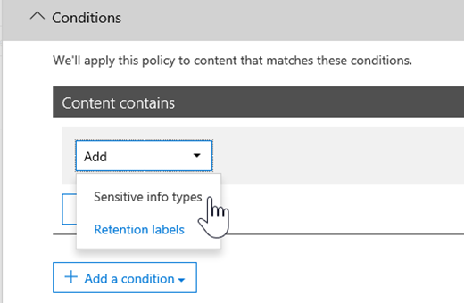

# Create custom sensitive information types with Exact Data Match based classification


[Custom sensitive information types](sensitive-information-type-learn-about.md) are used to help identify sensitive items so that you can prevent them from being inadvertently or inappropriately shared. You define a custom sensitive information type based on:

- patterns
- keyword evidence such as *employee*, *badge*, or *ID*
- character proximity to evidence in a particular pattern
- confidence levels

 Such custom sensitive information types meet business needs for many organizations.

But what if you wanted a custom sensitive information type (SIT) that uses exact data values, instead of one that found matches based on generic patterns? With Exact Data Match (EDM)-based classification, you can create a custom sensitive information type that is designed to:

- be dynamic and easily refreshed
- be more scalable
- result in fewer false-positives
- work with structured sensitive data
- handle sensitive information more securely
- be used with several Microsoft cloud services


EDM-based classification enables you to create custom sensitive information types that refer to exact values in a database of sensitive information. The database can be refreshed daily, and contain up to 100 million rows of data. So as employees, patients, or clients come and go, and records change, your custom sensitive information types remain current and applicable. And, you can use EDM-based classification with policies, such as [data loss prevention policies](dlp-learn-about-dlp.md) or [Microsoft Cloud App Security file policies](/cloud-app-security/data-protection-policies).

> [!NOTE]
> Microsoft 365 Information Protection supports in preview double byte character set languages for:
> - Chinese (simplified)
> - Chinese (traditional)
> - Korean
> - Japanese
> 
> This support is available for sensitive information types. See, [Information protection support for double byte character sets release notes (preview)](mip-dbcs-relnotes.md) for more information.
 

## Required licenses and permissions

You must be a global admin, compliance administrator, or Exchange Online administrator to perform the tasks described in this article. To learn more about DLP permissions, see [Permissions](data-loss-prevention-policies.md#permissions).

EDM-based classification is included in these subscriptions

- Office 365 E5
- Microsoft 365 E5
- Microsoft 365 E5 Compliance
- Microsoft E5/A5 Information Protection and Governance

## Portal links for your subscription


|Portal  |World Wide/GCC  |GCC-High  |DOD  |
|---------|---------|---------|---------|
|Office SCC     |  protection.office.com       |scc.office365.us         |scc.protection.apps.mil |
|Microsoft 365 Security center     |security.microsoft.com         |security.microsoft.us         |security.apps.mil|
|Microsoft 365 Compliance center     |compliance.microsoft.com         |compliance.microsoft.us         |compliance.apps.mil|


## The work flow at a glance

|Phase  |What's needed  |
|---------|---------|
|[Part 1: Set up EDM-based classification](#part-1-set-up-edm-based-classification)<br/><br/>(As needed)<br/>- [Edit the database schema](#editing-the-schema-for-edm-based-classification) <br/>- [Remove the schema](#removing-the-schema-for-edm-based-classification) |- Read access to the sensitive data<br/>- Database schema in XML format (example provided)<br/>- Rule package in XML format (example provided)<br/>- Admin permissions to the Security & Compliance Center (using PowerShell) |
|[Part 2: Hash and upload the sensitive data](#part-2-hash-and-upload-the-sensitive-data)<br/><br/>(As needed)<br/>[Refresh the data](#refreshing-your-sensitive-information-database) |- Custom security group and user account<br/>- Local admin access to machine with EDM Upload Agent<br/>- Read access to the sensitive data<br/>- Process and schedule for refreshing the data|
|[Part 3: Use EDM-based classification with your Microsoft cloud services](#part-3-use-edm-based-classification-with-your-microsoft-cloud-services) |- Microsoft 365 subscription with DLP<br/>- EDM-based classification feature enabled |

### Part 1: Set up EDM-based classification

Setting up and configuring EDM-based classification involves:

1. [Saving sensitive data in .csv format](#save-sensitive-data-in-csv-format)
2. [Define your sensitive information database schema](#define-the-schema-for-your-database-of-sensitive-information)
3. [Create a rule package](#set-up-a-rule-package)


#### Save sensitive data in .csv format

1. Identify the sensitive information you want to use. Export the data to an app, such as Microsoft Excel, and save the file in .csv format. The data file can include a maximum of:
      - Up to 100 million rows of sensitive data
      - Up to 32 columns (fields) per data source
      - Up to 5 columns (fields) marked as searchable

2. Structure the sensitive data in the .csv file such that the first row includes the names of the fields used for EDM-based classification. In your .csv file, you might have field names, such as "ssn", "birthdate", "firstname", "lastname". The column header names can't include spaces or underscores. For example, the sample .csv file that we use in this article is named *PatientRecords.csv*, and its columns include *PatientID*, *MRN*, *LastName*, *FirstName*, *SSN*, and more.

3. Pay attention to the format of the sensitive data fields. In particular, fields that may contain commas in their content (e.g. a street address that contains the value "Seattle,WA") would be parsed as two separate fields when parsed by the EDM tool. In order to avoid this, you need to ensure such fields are surrounded by single or double quotes in the sensitive data table. If fields with commas in them may also contain spaces, you would need to create a custom Sensitive Information Type that matches the corresponding format (e.g. a multi-word string with commas and spaces in it) to ensure the string is correctly matched when the document is scanned.

#### Define the schema for your database of sensitive information

If for business or technical reasons, you prefer not to use PowerShell or command line to create your schema and EDM sensitive info type pattern (rule package), you can use the [Exact Data Match Schema and Sensitive Information Type Wizard](sit-edm-wizard.md) to create them. When you are done creating the schema and EDM sensitive info type pattern, return to complete all the steps necessary to make your EDM based sensitive information type available for use.

> [!NOTE]
> The Exact Data Match Schema and Sensitive Information Type Wizard is only available for the World Wide and GCC clouds only.

1. Define the schema for the database of sensitive information in XML format (similar to our example below). Name this schema file **edm.xml**, and configure it such that for each column in the database, there is a line that uses the syntax: 

      `\<Field name="" searchable=""/\>`.

      - Use column names for *Field name* values.
      - Use *searchable="true"* for the fields that you want to be searchable up to a maximum of 5 fields. At least one field must be searchable.

      As an example, the following XML file defines the schema for a patient records database, with five fields specified as searchable: *PatientID*, *MRN*, *SSN*, *Phone*, and *DOB*.

      (You can copy, modify, and use our example.)

      ```xml
      <EdmSchema xmlns="http://schemas.microsoft.com/office/2018/edm">
            <DataStore name="PatientRecords" description="Schema for patient records" version="1">
                  <Field name="PatientID" searchable="true" caseInsensitive="true" ignoredDelimiters="-,/,*,#,^" />
                  <Field name="MRN" searchable="true" />
                  <Field name="FirstName" />
                  <Field name="LastName" />
                  <Field name="SSN" searchable="true" />
                  <Field name="Phone" searchable="true" />
                  <Field name="DOB" searchable="true" />
                  <Field name="Gender" />
                  <Field name="Address" />
            </DataStore>
      </EdmSchema>
      ```

##### Configurable match using the caseInsensitive and ignoredDelimiters fields

The above XML sample makes use of the `caseInsensitive` and the `ignoredDelimiters` fields. 

When you include the ***caseInsensitive*** field set to the value of `true` in your schema definition, EDM will not exclude an item based on case differences for `PatientID` field. So EDM will see, `PatientID` **FOO-1234** and **fOo-1234** as being identical.

When you include the ***ignoredDelimiters*** field with supported characters,  EDM will ignore those characters in the `PatientID`. So EDM will see, `PatientID` **FOO-1234** and `PatientID` **FOO#1234** as being identical. The `ignoredDelimiters` flag supports any non-alphanumeric character, here are some examples:
- \.
- \-
- \/
- \_
- \*
- \^
- \#
- \!
- \?
- \[
- \]
- \{
- \}
- \\
- \~
- \; 

The `ignoredDelimiters` flag doesn't support:
- characters 0-9
- A-Z
- a-z
- \"
- \,

In this example, where both `caseInsensitive` and `ignoredDelimiters` are used, EDM would see **FOO-1234** and **fOo#1234** as  identical and classify the item as a patient record sensitive information type. 

4. Connect to the Security & Compliance center using the procedures in [Connect to Security & Compliance Center PowerShell](/powershell/exchange/connect-to-scc-powershell).

5. To upload the database schema, run the following cmdlets, one at a time:

      ```powershell
      $edmSchemaXml=Get-Content .\\edm.xml -Encoding Byte -ReadCount 0
      New-DlpEdmSchema -FileData $edmSchemaXml -Confirm:$true
      ```

      You will be prompted to confirm, as follows:

      > Confirm
      >
      > Are you sure you want to perform this action?
      >
      > New EDM Schema for the data store 'patientrecords' will be imported.
      >
      > \[Y\] Yes \[A\] Yes to All \[N\] No \[L\] No to All \[?\] Help (default is "Y"):

> [!TIP]
> If you want your changes to occur without confirmation, in Step 5, use this cmdlet instead: New-DlpEdmSchema -FileData $edmSchemaXml

> [!NOTE]
> It can take between 10-60 minutes to update the EDMSchema with additions. The update must complete before you execute steps that use the additions.

#### Set up a rule package

1. Create a rule package in XML format (with Unicode encoding), similar to the following example. (You can copy, modify, and use our example.)

      When you set up your rule package, make sure to correctly reference your .csv file and **edm.xml** file. You can copy, modify, and use our example. In this sample xml the following fields needs to be customized to create your EDM sensitive type:

      - **RulePack id & ExactMatch id**: Use [New-GUID](/powershell/module/microsoft.powershell.utility/new-guid?view=powershell-6) to generate a GUID.

      - **Datastore**: This field specifies EDM lookup data store to be used. You provide a data source name of a configured EDM Schema.

      - **idMatch**: This field points to the primary element for EDM.
        - Matches: Specifies the field to be used in exact lookup. You provide a searchable field name in EDM Schema for the DataStore.
        - Classification: This field specifies the sensitive type match that triggers EDM lookup. You can provide the Name or GUID of an existing built-in or custom sensitive information type. Be aware that any string that matches the sensitive information type provided will be hashed and compared to every entry in the sensitive information table. In order to avoid causing performance issues, if you use a custom sensitive information type as the Classification element in EDM, avoid using one that will match a large percentage of content (such as "any number" or "any five-letter word") by adding supporting keywords or including formatting in the definition of the custom classification sensitive information type. 

      - **Match:** This field points to additional evidence found in proximity of idMatch.
        - Matches: You provide any field name in EDM Schema for DataStore.
      - **Resource:** This section specifies the name and description for sensitive type in multiple locales.
        - idRef: You provide GUID for ExactMatch ID.
        - Name & descriptions: customize as required.

      ```xml
      <RulePackage xmlns="http://schemas.microsoft.com/office/2018/edm">
        <RulePack id="fd098e03-1796-41a5-8ab6-198c93c62b11">
          <Version build="0" major="2" minor="0" revision="0" />
          <Publisher id="eb553734-8306-44b4-9ad5-c388ad970528" />
          <Details defaultLangCode="en-us">
            <LocalizedDetails langcode="en-us">
              <PublisherName>IP DLP</PublisherName>
              <Name>Health Care EDM Rulepack</Name>
              <Description>This rule package contains the EDM sensitive type for health care sensitive types.</Description>
            </LocalizedDetails>
          </Details>
        </RulePack>
        <Rules>
          <ExactMatch id = "E1CC861E-3FE9-4A58-82DF-4BD259EAB371" patternsProximity = "300" dataStore ="PatientRecords" recommendedConfidence = "65" >
            <Pattern confidenceLevel="65">
              <idMatch matches = "SSN" classification = "U.S. Social Security Number (SSN)" />
            </Pattern>
            <Pattern confidenceLevel="75">
              <idMatch matches = "SSN" classification = "U.S. Social Security Number (SSN)" />
              <Any minMatches ="3" maxMatches ="6">
                <match matches="PatientID" />
                <match matches="MRN"/>
                <match matches="FirstName"/>
                <match matches="LastName"/>
                <match matches="Phone"/>
                <match matches="DOB"/>
              </Any>
            </Pattern>
          </ExactMatch>
          <LocalizedStrings>
            <Resource idRef="E1CC861E-3FE9-4A58-82DF-4BD259EAB371">
              <Name default="true" langcode="en-us">Patient SSN Exact Match.</Name>
              <Description default="true" langcode="en-us">EDM Sensitive type for detecting Patient SSN.</Description>
            </Resource>
          </LocalizedStrings>
        </Rules>
      </RulePackage>
      ```

2. Upload the rule package by running the following PowerShell cmdlets, one at a time:

      ```powershell
      $rulepack=Get-Content .\\rulepack.xml -Encoding Byte -ReadCount 0
      New-DlpSensitiveInformationTypeRulePackage -FileData $rulepack
      ```

At this point, you have set up EDM-based classification. The next step is to hash the sensitive data, and then upload the hashes for indexing.

Recall from the previous procedure that our PatientRecords schema defines five fields as searchable: *PatientID*, *MRN*, *SSN*, *Phone*, and *DOB*. Our example rule package includes those fields and references the database schema file (**edm.xml**), with one *ExactMatch* item per searchable field. Consider the following ExactMatch item:

```xml
<ExactMatch id = "E1CC861E-3FE9-4A58-82DF-4BD259EAB371" patternsProximity = "300" dataStore ="PatientRecords" recommendedConfidence = "65" >
      <Pattern confidenceLevel="65">
        <idMatch matches = "SSN" classification = "U.S. Social Security Number (SSN)" />
      </Pattern>
      <Pattern confidenceLevel="75">
        <idMatch matches = "SSN" classification = "U.S. Social Security Number (SSN)" />
        <Any minMatches ="3" maxMatches ="100">
          <match matches="PatientID" />
          <match matches="MRN"/>
          <match matches="FirstName"/>
          <match matches="LastName"/>
          <match matches="Phone"/>
          <match matches="DOB"/>
        </Any>
      </Pattern>
    </ExactMatch>
```

In this example, note that:

- The dataStore name references the .csv file we created earlier: **dataStore = "PatientRecords"**.

- The idMatch value references a searchable field that is listed in the database schema file: **idMatch matches = "SSN"**.

- The classification value references an existing or custom sensitive information type: **classification = "U.S. Social Security Number (SSN)"**. (In this case, we use the existing sensitive information type of U.S. Social Security Number.)

> [!NOTE]
> It can take between 10-60 minutes to update the EDMSchema with additions. The update must complete before you execute steps that use the additions.
 
After you have imported your rule package with your EDM sensitive info type and have imported your sensitive data table, you can test your newly created type by using the **Test** function in the EDM wizard in the compliance center. See [Use the Exact Data Match Schema and Sensitive Information Type Wizard](sit-edm-wizard.md) for instructions on using this functionality.

#### Editing the schema for EDM-based classification

If you want to make changes to your **edm.xml** file, such as changing which fields are used for EDM-based classification, follow these steps:

> [!TIP]
> You can change your EDM schema and data file to take advantage of **configurable match**. When configured, EDM will ignore case differences and some delimiters when it evaluates an item. This makes defining your xml schema and your sensitive data files easier. To learn more see, [Modify Exact Data Match schema to use configurable match](sit-modify-edm-schema-configurable-match.md).

1. Edit your **edm.xml** file (this is the file discussed in the [Define the schema](#define-the-schema-for-your-database-of-sensitive-information) section of this article).

2. Connect to the Security & Compliance center using the procedures in [Connect to Security & Compliance Center PowerShell](/powershell/exchange/connect-to-scc-powershell).

3. To update your database schema, run the following cmdlets, one at a time:

      ```powershell
      $edmSchemaXml=Get-Content .\\edm.xml -Encoding Byte -ReadCount 0
      Set-DlpEdmSchema -FileData $edmSchemaXml -Confirm:$true
      ```

      You will be prompted to confirm, as follows:

      > Confirm
      >
      > Are you sure you want to perform this action?
      >
      > EDM Schema for the data store 'patientrecords' will be updated.
      >
      > \[Y\] Yes \[A\] Yes to All \[N\] No \[L\] No to All \[?\] Help (default is "Y"):

      > [!TIP]
      > If you want your changes to occur without confirmation, in Step 3, use this cmdlet instead: Set-DlpEdmSchema -FileData $edmSchemaXml

      > [!NOTE]
      > It can take between 10-60 minutes to update the EDMSchema with additions. The update must complete before you execute steps that use the additions.

#### Removing the schema for EDM-based classification

(As needed) If you want to remove the schema you're using for EDM-based classification, follow these steps:

1. Connect to the Security & Compliance center using the procedures in [Connect to Security & Compliance Center PowerShell](/powershell/exchange/connect-to-scc-powershell).

2. Run the following PowerShell cmdlets, substituting the data store name of "patient records" with the one you want to remove:

      ```powershell
      Remove-DlpEdmSchema -Identity patientrecords
      ```

      You will be prompted to confirm:

      > Confirm
      >
      > Are you sure you want to perform this action?
      >
      > EDM Schema for the data store 'patientrecords' will be removed.
      >
      > \[Y\] Yes \[A\] Yes to All \[N\] No \[L\] No to All \[?\] Help (default is "Y"):

      > [!TIP]
      >  If you want your changes to occur without confirmation, in Step 2, use this cmdlet instead: Remove-DlpEdmSchema -Identity patientrecords -Confirm:$false

### Part 2: Hash and upload the sensitive data

In this phase, you set up a custom security group and user account, and set up the EDM Upload Agent tool. Then, you use the tool to hash with salt value the sensitive data, and upload it.

The hashing and uploading can be done using one computer or you can separate the hashing step from the upload step for greater security.

If you want to hash and upload from one computer, you need to do it from a computer that can directly connect to your Microsoft 365 tenant. This requires that your clear text sensitive data files are on that computer for hashing.

If you do not want to expose your clear text sensitive data file, you can hash it on a computer in a secure location and then copy the hash file and the salt file to a computer that can directly connect to your Microsoft 365 tenant for upload. In this scenario, you will need the EDMUploadAgent on both computers.

> [!IMPORTANT]
> If you used the Exact Data Match schema and sensitive information type wizard to create your schema and pattern files, you ***must*** download the schema for this procedure.

> [!NOTE]
> If your organization has set up [Customer Key for Microsoft 365 at the tenant level](customer-key-overview.md), Exact data match will make use of its encryption functionality automatically. This is available only to E5 licensed tenants in the Commercial cloud.

#### Prerequisites

- a work or school account for Microsoft 365  that will be added to the **EDM\_DataUploaders** security group
- a Windows 10 or Windows Server 2016 machine with .NET version 4.6.2 for running the EDMUploadAgent
- a directory on your upload machine for the:
    -  EDMUploadAgent
    - your sensitive item file in csv format **PatientRecords.csv** in our examples
    -  and the output hash and salt files
    - the datastore name from the **edm.xml** file, for this example its `PatientRecords`
- If you used the [Exact Data Match schema and sensitive information type wizard](sit-edm-wizard.md) you ***must*** download it

#### Set up the security group and user account

1. As a global administrator, go to the admin center using the appropriate [link for your subscription](#portal-links-for-your-subscription) and [create a security group](/office365/admin/email/create-edit-or-delete-a-security-group?view=o365-worldwide) called **EDM\_DataUploaders**.

2. Add one or more users to the **EDM\_DataUploaders** security group. (These users will manage the database of sensitive information.)

#### Hash and upload from one computer

This computer must have direct access to your Microsoft 365 tenant.

>[!NOTE]
> Before you begin this procedure, make sure that you are a member of the **EDM\_DataUploaders** security group.

> [!TIP]
> Optionally, you can run a validation against your csv file before uploading by running:
>
>`EdmUploadAgent.exe /ValidateData /DataFile [data file] /Schema [schema file]`
>
>For more information on all the EdmUploadAgent.exe >supported parameters run
>
> `EdmUploadAgent.exe /?`


#### Links to EDM upload agent by subscription type

- [Commercial + GCC](https://go.microsoft.com/fwlink/?linkid=2088639) - most commercial customers should use this
- [GCC-High](https://go.microsoft.com/fwlink/?linkid=2137521) - This is specifically for high security government cloud subscribers
- [DoD](https://go.microsoft.com/fwlink/?linkid=2137807) - this is specifically for United States Department of Defense cloud customers

1. Create a working directory for the EDMUploadAgent. For example, **C:\EDM\Data**. Place the **PatientRecords.csv** file there.

2. Download and install the appropriate [EDM Upload Agent](#links-to-edm-upload-agent-by-subscription-type) for your subscription into the directory you created in step 1.

   > [!NOTE]
   > The EDMUploadAgent at the above links has been updated to automatically add a salt value to the hashed data. Alternately, you can provide your own salt value. Once you have used this version, you will not be able to use the previous version of the EDMUploadAgent.
   >
   > You can upload data with the EDMUploadAgent to any given data store only twice per day.

   > [!TIP]
   > To a get a list out of the supported command parameters, run the agent no arguments. For example 'EdmUploadAgent.exe'.

2. Authorize the EDM Upload Agent, open  Command Prompt window (as an administrator), switch to the **C:\EDM\Data** directory and then run the following command:

   `EdmUploadAgent.exe /Authorize`

3. Sign in with your work or school account for Microsoft 365 that was added to the EDM_DataUploaders security group. Your tenant information is extracted from the user account to make the connection.

   OPTIONAL: If you used the Exact Data Match schema and sensitive information type wizard to create your schema and pattern files, run the following command in a Command Prompt window:

   `EdmUploadAgent.exe /SaveSchema /DataStoreName <schema name> /OutputDir <path to output folder>`

4. To hash and upload the sensitive data, run the following command in Command Prompt window:

   `EdmUploadAgent.exe /UploadData /DataStoreName [DS Name] /DataFile [data file] /HashLocation [hash file location] /Schema [Schema file]`

   Example: **EdmUploadAgent.exe /UploadData /DataStoreName PatientRecords /DataFile C:\Edm\Hash\PatientRecords.csv /HashLocation C:\Edm\Hash /Schema edm.xml**

   This will automatically add a randomly generated salt value to the hash for greater security. Optionally, if you want to use your own salt value, add the **/Salt <saltvalue>** to the command. This value must be 64 characters in length and can only contain the a-z characters and 0-9 characters.

5. Check the upload status by running this command:

   `EdmUploadAgent.exe /GetSession /DataStoreName \<DataStoreName\>`

   Example: **EdmUploadAgent.exe /GetSession /DataStoreName PatientRecords**

   Look for the status to be in **ProcessingInProgress**. Check again every few minutes until the status changes to **Completed**. Once the status is completed, your EDM data is ready for use.

#### Separate Hash and upload

Perform the hash on a computer in a secure environment.

OPTIONAL: If you used the Exact Data Match schema and sensitive information type wizard to create your schema and pattern files, run the following command in a Command Prompt window:

`EdmUploadAgent.exe /SaveSchema /DataStoreName <schema name> /OutputDir <path to output folder>`

1. Run the following command in Command Prompt windows:

   `EdmUploadAgent.exe /CreateHash /DataFile [data file] /HashLocation [hash file location] /Schema [Schema file] >`

   For example:

   > **EdmUploadAgent.exe /CreateHash /DataFile C:\Edm\Data\PatientRecords.csv /HashLocation C:\Edm\Hash /Schema edm.xml**

   This will output a hashed file and a salt file with these extensions if you didn't specify the **/Salt <saltvalue>** option:
   - .EdmHash
   - .EdmSalt

2. Copy these files in a secure fashion to the computer you will use to upload your sensitive items csv file (PatientRecords) to your tenant.

   To upload the hashed data, run the following command in Windows Command Prompt:

   `EdmUploadAgent.exe /UploadHash /DataStoreName \<DataStoreName\> /HashFile \<HashedSourceFilePath\>`

   For example:

   > **EdmUploadAgent.exe /UploadHash /DataStoreName PatientRecords /HashFile C:\\Edm\\Hash\\PatientRecords.EdmHash**


   To verify that your sensitive data has been uploaded, run the following command in Command Prompt window:

   `EdmUploadAgent.exe /GetDataStore`

   You'll see a list of data stores and when they were last updated.

   If you want to see all the data uploads to a particular store, run the following command in a Windows command prompt:

   `EdmUploadAgent.exe /GetSession /DataStoreName <DataStoreName>`

   Proceed to set up your process and schedule for [Refreshing your sensitive information database](#refreshing-your-sensitive-information-database).

At this point, you are ready to use EDM-based classification with your Microsoft cloud services. For example, you can [set up a DLP policy using EDM-based classification](#to-create-a-dlp-policy-with-edm).

#### Refreshing your sensitive information database

You can refresh your sensitive information database daily, and the EDM Upload Tool can reindex the sensitive data and then reupload the indexed data.

1. Determine your process and frequency (daily or weekly) for refreshing the database of sensitive information.

2. Re-export the sensitive data to an app, such as Microsoft Excel, and save the file in .csv format. Keep the same file name and location you used when you followed the steps described in [Hash and upload the sensitive data](#part-2-hash-and-upload-the-sensitive-data).

      > [!NOTE]
      > If there are no changes to the structure (field names) of the .csv file, you won't need to make any changes to your database schema file when you refresh the data. But if you must make changes, make sure to edit the database schema and your rule package accordingly.

3. Use [Task Scheduler](/windows/desktop/TaskSchd/task-scheduler-start-page) to automate steps 2 and 3 in the [Hash and upload the sensitive data](#part-2-hash-and-upload-the-sensitive-data) procedure. You can schedule tasks using several methods:

      | Method             | What to do |
      | ---------------------- | ---------------- |
      | Windows PowerShell     | See the [ScheduledTasks](/powershell/module/scheduledtasks/?view=win10-ps) documentation and the [example PowerShell script](#example-powershell-script-for-task-scheduler) in this article |
      | Task Scheduler API     | See the [Task Scheduler](/windows/desktop/TaskSchd/using-the-task-scheduler) documentation                                                                                                                                                                                                                                                                                |
      | Windows user interface | In Windows, click **Start**, and type Task Scheduler. Then, in the list of results, right-click **Task Scheduler**, and choose **Run as administrator**.                                                                                                                                                                                                                                                                           |

#### Example PowerShell script for Task Scheduler

This section includes an example PowerShell script you can use to schedule your tasks for hashing data and uploading the hashed data:

##### To schedule hashing and upload in a combined step

```powershell
param(\[string\]$dataStoreName,\[string\]$fileLocation)
\# Assuming current user is also the user context to run the task
$user = "$env:USERDOMAIN\\$env:USERNAME"
$edminstallpath = 'C:\\Program Files\\Microsoft\\EdmUploadAgent\\'
$edmuploader = $edminstallpath + 'EdmUploadAgent.exe'
$csvext = '.csv'
$schemaext = '.xml'
\# Assuming CSV file name is same as data store name
$dataFile = "$fileLocation\\$dataStoreName$csvext"
\# Assuming location to store hash file is same as the location of csv file
$hashLocation = $fileLocation
\# Assuming Schema file name is same as data store name
$schemaFile = "$fileLocation\\$dataStoreName$schemaext"
$uploadDataArgs = '/UploadData /DataStoreName ' + $dataStoreName + ' /DataFile ' + $dataFile + ' /HashLocation' + $hashLocation + ' /Schema ' + $schemaFile
\# Set up actions associated with the task
$actions = @()
$actions += New-ScheduledTaskAction -Execute $edmuploader -Argument $uploadDataArgs -WorkingDirectory $edminstallpath
\# Set up trigger for the task
$trigger = New-ScheduledTaskTrigger -Weekly -DaysOfWeek Sunday -At 2am
\# Set up task settings
$principal = New-ScheduledTaskPrincipal -UserId $user -LogonType S4U -RunLevel Highest
$settings = New-ScheduledTaskSettingsSet -RunOnlyIfNetworkAvailable -StartWhenAvailable -WakeToRun
\# Create the scheduled task
$scheduledTask = New-ScheduledTask -Action $actions -Principal $principal -Trigger $trigger -Settings $settings
\# Get credentials to run the task
$creds = Get-Credential -UserName $user -Message "Enter credentials to run the task"
$password=\[Runtime.InteropServices.Marshal\]::PtrToStringAuto(\[Runtime.InteropServices.Marshal\]::SecureStringToBSTR($creds.Password))
\# Register the scheduled task
$taskName = 'EDMUpload\_' + $dataStoreName
Register-ScheduledTask -TaskName $taskName -InputObject $scheduledTask -User $user -Password $password
```

#### To schedule hashing and upload as separate steps

```powershell
param(\[string\]$dataStoreName,\[string\]$fileLocation)
\# Assuming current user is also the user context to run the task
$user = "$env:USERDOMAIN\\$env:USERNAME"
$edminstallpath = 'C:\\Program Files\\Microsoft\\EdmUploadAgent\\'
$edmuploader = $edminstallpath + 'EdmUploadAgent.exe'
$csvext = '.csv'
$edmext = '.EdmHash'
$schemaext = '.xml'
\# Assuming CSV file name is same as data store name
$dataFile = "$fileLocation\\$dataStoreName$csvext"
$hashFile = "$fileLocation\\$dataStoreName$edmext"
\# Assuming Schema file name is same as data store name
$schemaFile = "$fileLocation\\$dataStoreName$schemaext "

\# Assuming location to store hash file is same as the location of csv file
$hashLocation = $fileLocation
$createHashArgs = '/CreateHash' + ' /DataFile ' + $dataFile + ' /HashLocation ' + $hashLocation + ' /Schema ' + $schemaFile
$uploadHashArgs = '/UploadHash /DataStoreName ' + $dataStoreName + ' /HashFile ' + $hashFile
\# Set up actions associated with the task
$actions = @()
$actions += New-ScheduledTaskAction -Execute $edmuploader -Argument $createHashArgs -WorkingDirectory $edminstallpath
$actions += New-ScheduledTaskAction -Execute $edmuploader -Argument $uploadHashArgs -WorkingDirectory $edminstallpath
\# Set up trigger for the task
$trigger = New-ScheduledTaskTrigger -Weekly -DaysOfWeek Sunday -At 2am
\# Set up task settings
$principal = New-ScheduledTaskPrincipal -UserId $user -LogonType S4U -RunLevel Highest
$settings = New-ScheduledTaskSettingsSet -RunOnlyIfNetworkAvailable -StartWhenAvailable -WakeToRun
\# Create the scheduled task
$scheduledTask = New-ScheduledTask -Action $actions -Principal $principal -Trigger $trigger -Settings $settings
\# Get credentials to run the task
$creds = Get-Credential -UserName $user -Message "Enter credentials to run the task"
$password=\[Runtime.InteropServices.Marshal\]::PtrToStringAuto(\[Runtime.InteropServices.Marshal\]::SecureStringToBSTR($creds.Password))
\# Register the scheduled task
$taskName = 'EDMUpload\_' + $dataStoreName
Register-ScheduledTask -TaskName $taskName -InputObject $scheduledTask -User $user -Password $password

```

### Part 3: Use EDM-based classification with your Microsoft cloud services

These locations are support EDM sensitive information types:

- DLP for Exchange Online (email)
- OneDrive for Business (files)
- Microsoft Teams (conversations)
- DLP for SharePoint (files)
- Microsoft Cloud App Security DLP policies
- Server-side auto-labeling policies - available for commercial cloud customers <!--, and government cloud customers-->

#### To create a DLP policy with EDM

1. Go to the Security & Compliance Center using the appropriate [link for your subscription](#portal-links-for-your-subscription).

2. Choose **Data loss prevention** \> **Policy**.

3. Choose **Create a policy** \> **Custom** \> **Next**.

4. On the **Name your policy** tab, specify a name and description, and then choose **Next**.

5. On the **Choose locations** tab, select **Let me choose specific locations**, and then choose **Next**.

6. In the **Status** column, select **Exchange email, OneDrive accounts, Teams chat and channel message**, and then choose **Next**.

7. On the **Policy settings** tab, choose **Use advanced settings**, and then choose **Next**.

8. Choose **+ New rule**.

9. In the **Name** section, specify a name and description for the rule.

10. In the **Conditions** section, in the **+ Add a condition** list, choose **Content contains sensitive type**.

      

11. Search for the sensitive information type you created when you set up your rule package, and then choose **+ Add**.  
    Then choose **Done**.

12. Finish selecting options for your rule, such as **User notifications**, **User overrides**, **Incident reports**, and so on, and then choose **Save**.

13. On the **Policy settings** tab, review your rules, and then choose **Next**.

14. Specify whether to turn on the policy right away, test it out, or keep it turned off. Then choose **Next**.

15. On the **Review your settings** tab, review your policy. Make any needed changes. When you're ready, choose **Create**.

> [!NOTE]
> Allow approximately one hour for your new DLP policy to work its way through your data center.

## Related articles

- [Sensitive information type-entity definitions](sensitive-information-type-entity-definitions.md)
- [Learn about sensitive information types](sensitive-information-type-learn-about.md)
- [Learn about data loss prevention](dlp-learn-about-dlp.md)
- [Microsoft Cloud App Security](/cloud-app-security)
- [New-DlpEdmSchema](/powershell/module/exchange/new-dlpedmschema)
- [Modify Exact Data Match schema to use configurable match](sit-modify-edm-schema-configurable-match.md)
