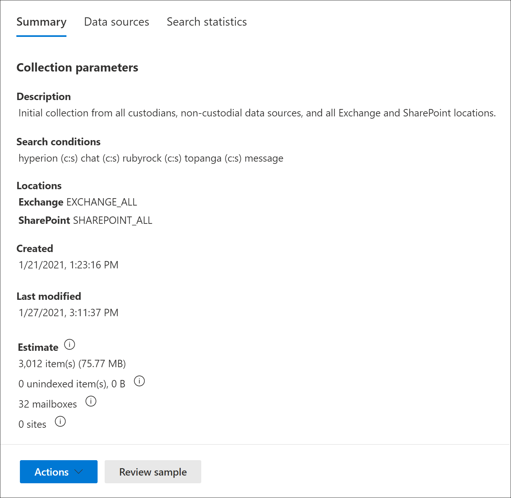

# Create a collection estimate in eDiscovery (Premium)

After you've identified custodians and any non-custodian data sources for the case, you're ready to identify and locate a set of documents that are relevant. You do this by using the Collections tool to search data sources for relevant content. You do this by creating a collection that searches specified data sources for content that matches your search criteria. You have the option to create a *collection estimate*, which is an estimate of the items are found or you can create a collection that automatically adds the items to a review set. When you create a collection estimate, you can views information about the estimated results that matched the search query, such as the total number and size of items found, the different data sources where they were found, and statistics about the search query. You can also preview a sample of items that were returned by the collection. Using these statistics, you can change the search query and rerun the collection estimate to narrow your results. Once you're satisfied with the collection results, you can commit the collection to a review set. When you commit a collection estimate, the items returned by the collection are added to a review set for review, analysis, and export.

[!INCLUDE [purview-preview](../includes/purview-preview.md)]

## Before you create a collection estimate

- Add custodians and non-custodial data sources to the case before you create a collection estimate. This is required so that you can select the data sources when you create a collection estimate. For more information, see:

  - [Add custodians to a case](add-custodians-to-case.md)

  - [Add non-custodial data sources to a case](non-custodial-data-sources.md)

- You can search additional data sources (ones that haven't been added to the case as custodial or non-custodial locations) in a collection estimate for content that may be relevant to the case. These data sources might include mailboxes, SharePoint sites, and Teams. If this situation is applicable to your case, compile a list of these data sources so you can add them to the collection.

## Create a collection estimate

1. In the Microsoft Purview compliance portal, open the eDiscovery (Premium) case, and then select the **Collections** tab.

2. On the **Collections** page, select **New collection** > **Standard collection**.

3. Type a name (required) and description (optional) for the collection. After the collection is created, you can't change the name, but you can modify the description.

4. On the **Custodial data sources** page, do one of the following things to identify the custodial data sources to collect content from:

   - Click **Select custodians** to search specific custodians that were added to the case. If you use this option, a list of the case custodians is displayed. Select one or more custodians. After you select and add the custodians, you can also select the specific data sources to search for each custodian. These data sources that are displayed were specified when the custodian was added to the case.

   - Click the **Select all** toggle to search all custodians that were added to the case. When you select this option, all data sources for all custodians are searched.

5. On the **Non-custodial data sources** page, do one of the following things to identify the non-custodial data sources to collect content from:

   - Click **Select non-custodial data sources** to select specific non-custodial data sources that were added to the case. If you use this option, a list of data sources displayed. Select one or more of these data sources.

   - Click the **Select all** toggle to select all non-custodial data sources that were added to the case.

6. On the **Additional data sources** page, you can select other mailboxes and sites to search as part of the collection. These types of data sources weren't added as custodial or non-custodial data locations in the case. You also have two options when searching additional data sources:

   - To search all content locations for a specific service (Exchange mailboxes, SharePoint and OneDrive sites, or Exchange public folders), click the corresponding **Select all** toggle in the **Status** column. This option will search all content locations in the selected service.

   - To search specific content location for a service, click the corresponding **Select all** toggle in the **Status** column, and then click **Users, groups or teams** (for Exchange mailboxes) or **Choose sites** for (SharePoint and OneDrive sites) to search specific content locations.

7. On the **Conditions** page, you can create the search query that is used to collect items from the data sources that you've identified in the previous wizard pages. You can search for keywords, property:value pairs, or use a keyword list. You can also add various search conditions to narrow the scope of the collection. For more information, see [Build search queries for collections](building-search-queries.md).

8. On the **Save as draft or add to review set** page, select **Save collection as draft**.

   > [!NOTE]
   > The other option on this page lets you collect items and add them direct to a review set. Instead of creating a collection estimate that you can review statistics for and preview a sample of the collection results, this option skips that process and automatically adds the collection to a review set. If you select the second option to add the collection to a review set, you have additional settings to configure, such as collecting entire chat conversation threads in Microsoft Teams and Yammer and collecting cloud attachments (also called *modern attachments*). For more information about these settings, see [Commit a collection estimate to a review set](commit-draft-collection.md).

9. On the **Review your collection** page, you can review and update the collection settings that you configured on the previous pages.

   - **Summary** tab:  Review and modify the name and description of the collection, the collection search criteria, additional data locations, and the collection type.

   - **Sources** tab: Review and modify the custodial and non-custodial data sources for the collection.

10. Click **Submit** to create the collection estimate. A page is displayed confirming that the collection was created.

## What happens after you create a collection estimate

After you create a collection estimate, it listed on the **Collections** page in the case and the status shows that it's in progress. A job named **Preparing search preview and estimates** is also created and displayed on the **Jobs** page in the case.

During the collection estimate process, eDiscovery (Premium) performs a search estimate using the search criteria and data sources that you specified in the collection. eDiscovery (Premium) also prepares a sampling of items that you can preview. When the collection is complete, the following columns and corresponding values on the **Collection** page are updated:

- **Status**: Indicates the status and type of collection. A value of **Estimated** indicates that a collection estimate is complete. This same value also indicates that the collection is a collection estimate, and that it hasn't been added to a review set. A value of **Committed** in the **Status** column indicates that the collection has been added to a review set.

- **Estimate status**: Indicates the status of the estimated search results and whether or not the search estimates and statistics are ready for review. A value of **Successful** indicates the results of the collection estimate are ready for review. After you first submit a collection estimate, a value of **In progress** is displayed to indicate the collection is still running

- **Preview status**: Indicates the status of the sample items that you can preview. A value of **Successful** indicates the items are ready for preview. After you first submit a collection estimate, a value of **In progress** is displayed to indicate that the collection is still running.

## Next steps after a collection estimate is complete

After the collection estimate is successfully completed, you can perform various tasks. To perform most of these tasks, just go the **Collections** tab and click the name of the collection estimate to display the flyout page.

Here's a list of things you can do from the collection flyout page:

- Select the **Summary** tab to view summary information about the collection and the estimated search results returned by the collection. This includes that total number of items and size of the estimated search results, the number of mailboxes and sites contained search results, and the search conditions (if used) used to scope the collection.

- Select the **Data sources** tab to view a list of custodians and non-custodial data sources) that were searched in the collection. Any additional content locations that were search are listed under **Locations** on the **Summary** tab.

- Select the **Search statistics** tab to view statistics about the collection. This includes the total number and size of items found in each service (for example, Exchange mailboxes or SharePoint sites) and a condition report that displays statistics about the number of items returned by different components of the search query used by the collection. For more information, see [Collection statistics and reports](collection-statistics-reports.md).

- Click **Review sample** (located at the bottom of the flyout page) to preview a sample of the items returned by the collection.

- Commit the collection estimate to a review set (by clicking **Actions** > **Edit collection**). This means that you rerun the collection (using the current settings) and add the items returned by the collection to a review set. As previously explained, you can also configure additional settings (such as conversation threading and cloud-based attachments) when you add the collection to a review set. For more information and step-by-step instructions, see [Commit a collection estimate to a review set](commit-draft-collection.md).

## Manage a collection estimate

You can use the options in the **Actions** menu on the flyout page of a collection estimate to perform various management tasks.

Here's are descriptions of the management options.

- **Edit collection**: Change the settings of the collection estimate. After you make changes, you can rerun the collection and update the search estimates and statistics. As previously explained, you use this option to commit a collection estimate to a review set.  

- **Delete collection**: Delete a collection estimate. Note that after a collection estimate is committed to a review set, it can't be deleted.

- **Refresh estimates**: Rerun the query (against the data sources) specified in the collection estimate to update the search estimates and statistics.

- **Export as report**: Exports information about the collection estimate to a CSV file that you can download to your local computer. The export report contains the following information:

  - The identity of each content location that contains items that match the search query in the collection estimate. These locations are typically mailboxes or sites.
  
  - The total number of items in each content location.
  
  - The total size (in bytes) of the items in each content location.

  - The service (such as Exchange or SharePoint) in which the content location is located.

- **Copy collection**: Create a new collection estimate by copying the settings from an existing collection. You have to use a different name for the new collection. You also have the option to modify the settings before you submit the new collection. After you submit it, the search query is run and new estimates and statistics are generated. The is a good way to quickly create additional collection estimate and then modify selected settings as necessary while still preserving information in the original collection. This also lets you easily compare the results of two similar collections.

> [!NOTE]
> After a collection estimate is committed to a review set, you can only copy the collection and export a report.
