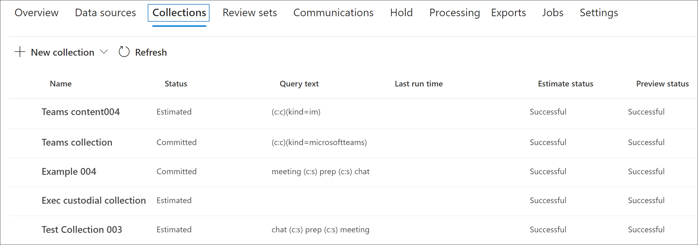

# Create a draft collection in Advanced eDiscovery

After you've identified custodians and any non-custodian data sources for the case, you're ready to identify and locate a set of documents that are relevant. You do this by using the Collections tool to search data sources for relevant content. You do this by creating a collection that searches specified data sources for content that matches your search criteria. You have the option to create a *draft collection*, which is an estimate of the items are found or you can create a collection that automatically adds the items to a review set. When you create a draft collection, you can views information about the estimated results that matched the search query, such as the total number and size of items found, the different data sources where they were found, and statistics about the search query. You can also preview a sample of 25 items that were returned by the search. Using these statistics, you can change the search query and rerun the draft collection to narrow your results. Once you're satisfied with the collection results, you can commit the collection to a review set. When you commit a draft collection, the items returned by the collection are added to a review set for further review and analysis.

## Before you create a draft collection

## Create a draft collection

1. In the Microsoft 365 compliance center, open the Advanced eDiscovery case, and then select the **Collections** tab.

2. On the **Collections** page, select **New collection** > **Standard collection**.

3. Type a name (required) and description (optional) for the collection. After the collection is created, you can't change the name, but you can modify the description.

4. On the **Custodial data sources** page, do one of the following things to identify the custodial data sources to collect content from:

   - Click **Select custodians** to search specific custodians that were added to the case. If you use this option, a list of the case custodians is displayed. Select one or more custodians. After you select and add the custodians, you also have the option to select the specific data sources to search for each custodian. These data sources that are displayed were specified when the custodian was added to the case.

   - Click the **Select all** toggle to search all custodians that were added to the case. When you select this option, all data sources for all custodians are searched.

5. On the **Non-custodial data sources** page, do one of the following things to identify the non-custodian data sources to collect content from:

   - Click **Select non-custodial data sources** to select specific non-custodial data sources that were added to the case. If you use this option, a list of data sources displayed. Select one or more of these data sources.

   - Click the **Select all** toggle to select all non-custodial data sources that were added to the case.

6. On the **Additional data sources** page, you can select other mailboxes and sites to search as part of the collection. These types of data sources weren't added as custodial or non-custodial data locations in the case. You also have two options when searching additional data sources:

   - To search all content locations for a specific service (Exchange mailboxes, SharePoint and OneDrive sites, or Exchange public folders), click the corresponding **Select all** toggle in the **Status** column. This option will search all content locations in the selected service.

   - To search specific content location for a service, click the corresponding **Select all** toggle in the **Status** column, and then click **Users, groups or teams** (for Exchange mailboxes) or **Choose sites** for (SharePoint and OneDrive sites) to search specific content locations.

7. On the **Conditions** page, you can create the search query that is used to collect items from the data sources that you've identified in the previous wizard pages. You can search for keywords, property:value pairs, or use a keyword list. You can also add various search conditions to narrow the scope of the collection. For more information, see [Build search queries for collections](building-search-queries.md).

8. On the **Save as draft or add to review set** page, select **Save collection as draft**.

   > [!NOTE]
   > The other option on this page lets you collect items and add them direct to a review set. Instead of creating a draft collection that you can review statistics for and preview a sample of the collection results, this option skips that process and automatically adds the collection to a review set. If you select the second option to add the collection to a review set, you have additional settings to configure, such as collecting entire chat conversation threads in Microsoft Teams and Yammer and collecting cloud attachments (also called *modern attachments*). For more information about these settings, see [Commit a draft collection to a review set](commit-draft-collection.md).

9. On the **Review your collection** page, you can review and update the collection settings that you configured on the previous pages.

   - **Summary** tab:  Review and modify the name and description of the collection, the collection search criteria, additional data locations, and the collection type.

   - **Sources** tab: Review and modify the custodial and non-custodial data sources for the collection.

10. Click **Submit** to create the draft collection. A page is displayed confirming that the collection was created.

## What happens after you create a draft collection

After you create a draft collection, it listed on the **Collections** page in the case and the status shows that it's in progress. A job named **Preparing search preview and estimates** is also created and displayed on the **Jobs** page in the case.

During the draft collection process, Advanced eDiscovery performs a search estimate using the search criteria and data sources that you specified in the collection. Advanced eDiscovery also prepares a sampling of items that you can preview. When the collection is complete, the following columns and corresponding values on the **Collection** page are updated:

- **Status**: Indicates the status and type of collection. A value of **Estimated** indicates that a draft collection is complete. This same value also indicates that the collection is a draft collection, and that it hasn't been added to a review set. A value of **Committed** indicates that the collection has been added to a review set.

- **Estimate status**: Indicates the status of the estimated search results and whether or not the search estimates and statistics are ready for review. A value of **Successful** indicates the results of the draft collection are ready for review. After you first submit a draft collection, a value of **In progress** is displayed to indicate the collection is still running

- **Preview status**: Indicates the status of the sample items that you can preview. A value of **Successful** indicates the items are ready for preview. After you first submit a draft collection, a value of **In progress** is displayed to indicate that the collection is still running.

## Next steps after draft collection is complete