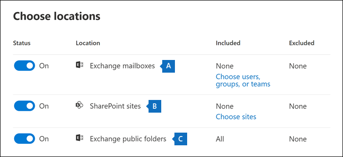
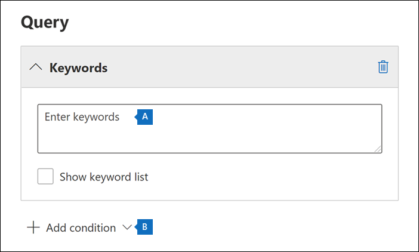
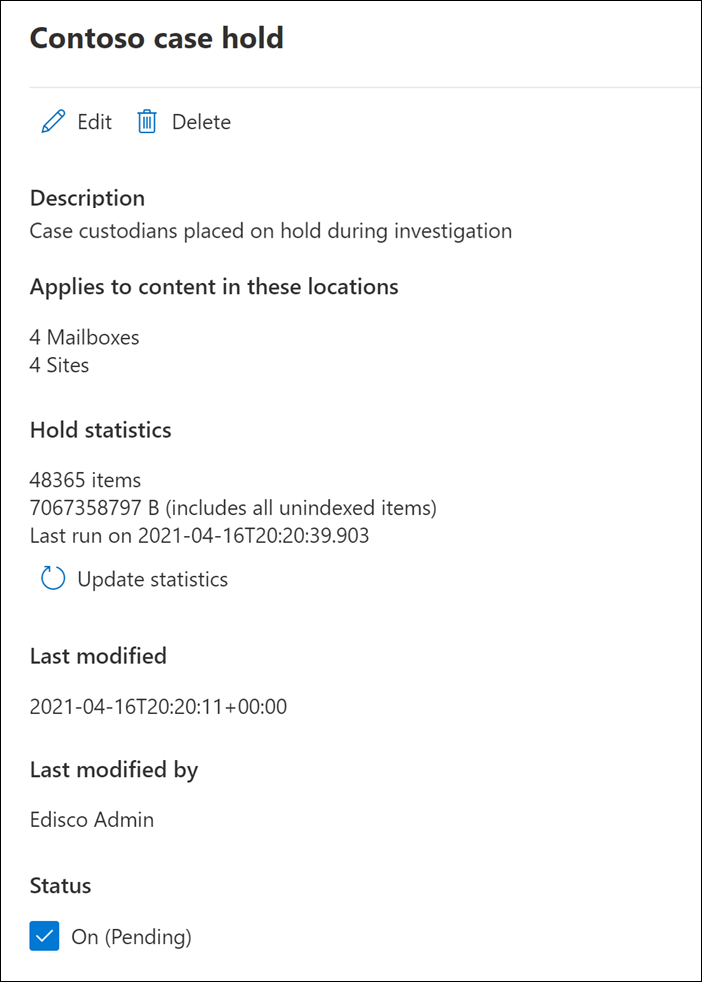

# Create an eDiscovery hold

You can use a Core eDiscovery case to create holds to preserve content that might be relevant to the case. You can place a hold on the Exchange mailboxes and OneDrive for Business accounts of people you're investigating in the case. You can also place a hold on the mailboxes and sites that are associated with Microsoft Teams, Office 365 Groups, and Yammer Groups. When you place content locations on hold, content is preserved until you remove the content location from the hold or until you delete the hold.

After you create an eDiscovery hold, it may take up to 24 hours for the hold to take effect.

When you create a hold, you have the following options to scope the content that's preserved in the specified content locations:
  
- Create an infinite hold where all content in the specified locations is placed on hold. Alternatively, you can create a query-based hold where only the content in the specified locations that matches a search query is placed on hold.

- Specify a date range to preserve only the content that was sent, received, or created within that date range. Alternatively, you can hold all content in specified locations regardless of when it was sent, received, or created.
  
## How to create an eDiscovery hold

To create an eDiscovery hold that's associated with a Core eDiscovery case:
  
1. Go to [https://compliance.microsoft.com](https://compliance.microsoft.com) and sign in using the credentials for user account that has been assigned the appropriate eDiscovery permissions.

2. In the left navigation pane of the Microsoft 365 compliance center, click **Show all**, and then click **eDiscovery > Core**.

3. On the **Core eDiscovery** page, click the name of the case that you want to create the hold in.

4. On the **Home** page for the case, click the **Hold** tab.
  
5. On the **Hold** page, click **Create**.

6. On the **Name your hold** wizard page, give the hold a name and add an optional description, and then click **Next**. The name of the hold must be unique in your organization.

7. On the **Choose locations** wizard page, choose the content locations that you want to place on hold. You can place mailboxes, sites, and public folders on hold.

    
  
   1. **Exchange mailboxes**: Set the toggle to **On** and then click **Choose users, groups, or teams** to specify the mailboxes to place on hold. Use the search box to find user mailboxes and distribution groups (to place a hold on the mailboxes of group members) to place on hold. You can also place a hold on the associated mailbox for a Microsoft Team, Office 365 Group, and Yammer Group. For more information about the application data that is preserved when a mailbox is placed on hold, see [Content stored in mailboxes for eDiscovery](what-is-stored-in-exo-mailbox.md).

   1. **SharePoint sites**: Set the toggle to **On** and then click **Choose sites** to specify SharePoint sites and OneDrive accounts to place on hold. Type the URL for each site that you want to place on hold. You can also add the URL for the SharePoint site for a Microsoft Team, Office 365 Group or a Yammer Group.
  
   1. **Exchange public folders**: Set the toggle to **On** to put all public folders in your Exchange Online organization on hold. You can't choose specific public folders to put on hold. Leave the toggle switch off if you don't want to put a hold on public folders.

   > [!NOTE]
   > You must add at least one content location to the hold. Otherwise, the eDiscovery hold statistics will show that no items are on hold.

8. When you're done adding locations to the hold, click **Next**.

9. To create a query-based hold using keywords or conditions, complete the following steps. To preserve all content in the specified content locations, click **Next**.

    
  
    1. In the box under **Keywords**, type a query to preserve only the content that matches the query criteria. You can specify keywords, email message properties, or site properties, such as file names. You can also use more complex queries that use a Boolean operator, such as **AND**, **OR**, or **NOT**.

    2. Click **Add condition** to add one or more conditions to narrow the query for the hold. Each condition adds a clause to the KQL search query that is created and run when you create the hold. For example, you can specify a date range so that email or site documents that were created within the date ranged are preserved. A condition is logically connected to the keyword query (specified in the **Keywords** box) and other conditions by the **AND** operator. That means items have to satisfy both the keyword query and the condition to be preserved.

    For more information about creating a search query and using conditions, see [Keyword queries and search conditions for eDiscovery](keyword-queries-and-search-conditions.md).

10. After configuring a query-based hold, click **Next**.

11. Review your settings (and edit them if necessary), and then click **Submit**.

## Query-based holds placed on sites

Keep the following things in mind when you place a query-based eDiscovery hold on documents located in SharePoint sites:

- A query-based hold initially preserves all documents in a site for a short period of time after they are deleted. That means when a document is deleted, it will be moved to the Preservation Hold library even if it doesn't match the criteria of the query-based hold. However, deleted documents that don't match a query-based hold will be removed by a timer job that processes the Preservation Hold library. The timer job runs periodically and compares all documents in the Preservation Hold library to your query-based eDiscovery holds (and other types of holds and retention policies). The timer job deletes the documents that don't match a query-based hold and preserves the documents that do.

- Query-based holds should not be used to perform targeted preservation, like preserving documents in a specific folder or site or by using other location-based hold criteria. Doing so may have unintended results. We recommend using non-location based hold criteria such as keywords, date ranges, or other document properties to preserve site documents.

## eDiscovery hold statistics

After you create an eDiscovery hold, information about the new hold is displayed on the flyout page for the selected hold. This information includes the number of mailboxes and sites on hold and statistics about the content that was placed on hold, such as the total number and size of items placed on hold and the last time the hold statistics were calculated. These hold statistics help you identify the amount of content related to the case is being preserved.
  

  
Keep the following things in mind about eDiscovery hold statistics:
  
- The total number of items on hold indicates the number of items from all content sources that are placed on hold. If you've created a query-based hold, this statistic indicates the number of items that match the query.

- The number of items on hold also includes unindexed items found in the content locations. If you create a query-based hold, all unindexed items in the content locations are placed on hold. This includes unindexed items that don't match the search criteria of a query-based hold and unindexed items that might fall outside of a date range condition. This is different than what happens when you run a search, in which unindexed items that don't match the search query or are excluded by a date range condition aren't included in the search results. For more information about unindexed items, see [Partially indexed items](partially-indexed-items-in-content-search.md).

- You can get the latest hold statistics by clicking **Update statistics** to rerun a search estimate that calculates the current number of items on hold.

- It's normal for the number of items on hold to increase over time because users whose mailbox or site is on hold are typically sending or receiving new email message and creating new documents in SharePoint and OneDrive.

- If an Exchange mailbox, SharePoint site, or OneDrive account is moved to a different region in a multi-geo environment, the statistics for that site won't be included in the hold statistics. But the content in those locations will still be preserved. Also, if a mailbox or site is moved to a different region, the SMTP address or URL that's displayed in the hold will not automatically be updated. You'll have to edit the hold and update the URL or SMTP address so the content locations are once again included in the hold statistics

## Search locations on eDiscovery hold

When you [search for content](search-for-content-in-core-ediscovery.md) in a Core eDiscovery case, you can quickly configure the search to only search the content locations that have been placed on a hold associated with the case.

Select the **Locations on hold** option to search all the content locations that have been placed on hold. If the case contains multiple eDiscovery holds, the content locations from all holds will be searched when you select this option. Additionally, if a content location was placed on a query-based hold, only the items that match the hold query will be searched when you run the search. In other words, only the content that matches both the hold criteria and the search criteria is returned with the search results. For example, if a user was placed on query-based case hold that preserves items that were sent or created before a specific date, only those items would be searched. This is accomplished by connecting the case hold query and the search query by an **AND** operator.

Here are some other things to keep in mind when searching locations on eDiscovery hold:

- If a content location is part of multiple holds within the same case, the hold queries are combined by **OR** operators when you search that content location using the all case content option. Similarly, if a content location is part of two different holds, where one is query-based and the other is an infinite hold (where all content is placed on hold), then all content is search because of the infinite hold.

- If a search is configured it to search locations on hold and then you change an eDiscovery hold in the case (by adding or removing a location or changing a hold query), the search configuration is updated with those changes. However, you have to rerun the search after the hold is changed to update the search results.

- If multiple eDiscovery holds are placed on a single location in an eDiscovery case and you select to search locations on hold, the maximum number of keywords for that search query is 500. That's because the search combines all the query-based holds by using the **OR** operator. If there are more than 500 keywords in the combined hold queries and the search query, then all content in the mailbox is searched, not just that content that matches the query-based case holds.

- If an eDiscovery hold has a status of **On (Pending)**, you can still search the locations on hold while the hold is being turned on.

## Preserve content in Microsoft Teams

Conversations that are part of a Microsoft Teams channel are stored in the mailbox that's associated with the Microsoft Team. Similarly, files that team members share in a channel are stored on the team's SharePoint site. Therefore, you have to place the Team mailbox and SharePoint site on eDiscovery hold to preserve conversations and files in a channel.

Alternatively, conversations that are part of the Chat list in Teams (called *1:1 chats* or *1:N group chats*) are stored in the mailboxes of the users who participate in the chat. And files that users share in chat conversations are stored in the OneDrive account of the user who shares the file. Therefore, you have to add the individual user mailboxes and OneDrive accounts to an eDiscovery hold to preserve conversations and files in the chat list. It's a good idea to place a hold on the mailboxes of members of a Microsoft Team in addition to placing the team mailbox and site on hold.

> [!NOTE]
> If your organization has an Exchange hybrid deployment (or your organization synchronizes an on-premises Exchange organization with Office 365) and has enabled Microsoft Teams, on-premises users can use the Teams chat application and participate in 1:1 chats and 1:N group chats. These conversations are stored in cloud-based storage that's associated with an on-premises user. If an on-premises user is placed on an eDiscovery hold, the Teams chat content in the cloud-based storage will be preserved. For more information, see [Search for Teams chat data for on-premises users](search-cloud-based-mailboxes-for-on-premises-users.md).

For more information about preserving Teams content, see [Place a Microsoft Teams user or team on legal hold](/MicrosoftTeams/legal-hold).

### Preserve card content

Similarly, card content generated by apps in Teams channels, 1:1 chats, and 1:N group chats is stored in mailboxes and is preserved when a mailbox is placed on an eDiscovery hold. A *card* is a UI container for short pieces of content. Cards can have multiple properties and attachments, and can include buttons that trigger card actions. For more information, see [Cards](/microsoftteams/platform/task-modules-and-cards/what-are-cards). Like other Teams content, where card content is stored is based on where the card was used. Content for cards used in a Teams channel is stored in the Teams group mailbox. Card content for 1:1 and 1xN chats are stored in the mailboxes of the chat participants.

### Preserve meeting and call information

Summary information for meetings and calls in a Teams channel is also stored in the mailboxes of users who dialed into the meeting or call. This content is also preserved when an eDiscovery hold is placed on user mailboxes.

### Preserve content in private channels

Starting in February 2020, we also turned on the ability to preserve content in private channels. Because private channel chats are stored in the mailboxes of the chat participants, placing a user mailbox on eDiscovery hold will preserve private channel chats. Also, if a user mailbox was placed on an eDiscovery hold prior to February 2020, the hold will now automatically apply to private channel messages stored in that mailbox. Preserving files shared in private channels is also supported.

### Preserve wiki content

Every Team or team channel also contains a Wiki for note taking and collaboration. The Wiki content is automatically saved to a file with a .mht format. This file is stored in the Teams Wiki Data document library on the team's SharePoint site. You can preserve the wiki content by adding the team's SharePoint site to an eDiscovery hold.

> [!NOTE]
> The capability to preserve Wiki content for a Team or team channel (when you place the team's SharePoint site on hold) was released on June 22, 2017. If a team site is on hold, the Wiki content will be retained starting on that date. However, if a team site is on hold and the Wiki content was deleted before June 22, 2017, the Wiki content was not preserved.

### Office 365 Groups

Teams is built on Office 365 Groups. Therefore, placing Office 365 Groups on eDiscovery hold is similar placing Teams content on hold.

Keep the following things in mind when placing both Teams and Office 365 Groups on an eDiscovery hold:

- As previously explained, to place content located in Teams and Office 365 Groups on hold, you have to specify the mailbox and SharePoint site that associated with a group or team.

- Run the **Get-UnifiedGroup** cmdlet in [Exchange Online PowerShell](/powershell/exchange/connect-to-exchange-online-powershell) to view properties for Teams and Office 365 Groups. This is a good way to get the URL for the site that's associated with a Team or Office 365 Group. For example, the following command displays selected properties for an Office 365 Group named Senior Leadership Team:

    ```text
    Get-UnifiedGroup "Senior Leadership Team" | FL DisplayName,Alias,PrimarySmtpAddress,SharePointSiteUrl

    DisplayName            : Senior Leadership Team
    Alias                  : seniorleadershipteam
    PrimarySmtpAddress     : seniorleadershipteam@contoso.onmicrosoft.com
    SharePointSiteUrl      : https://contoso.sharepoint.com/sites/seniorleadershipteam
    ```

    > [!NOTE]
    > To run the **Get-UnifiedGroup** cmdlet, you have to be assigned the View-Only Recipients role in Exchange Online or be a member of a role group that's assigned the View-Only Recipients role. 
  
- When a user's mailbox is searched, any Team or Office 365 Group that the user is a member of won't be searched. Similarly, when you place a Team or Office 365 Group on eDiscovery hold, only the group mailbox and group site are placed on hold. The mailboxes and OneDrive for Business sites of group members aren't placed on hold unless you explicitly add them to the eDiscovery hold. So if you have  to place a Team or Office 365 Group on hold for a legal reason, consider adding the mailboxes and OneDrive accounts of team or group members on the same hold.

- To get a list of the members of a Team or Office 365 Group, you can view the properties on the **Groups** page in the Microsoft 365 admin center. Alternatively, you can run the following command in Exchange Online PowerShell:

    ```powershell
    Get-UnifiedGroupLinks <group or team name> -LinkType Members | FL DisplayName,PrimarySmtpAddress
    ```

    > [!NOTE]
    > To run the **Get-UnifiedGroupLinks** cmdlet, you have to be assigned the View-Only Recipients role in Exchange Online or be a member of a role group that's assigned the View-Only Recipients role.

## Preserve content in OneDrive accounts

To collect a list of the URLs for the OneDrive for Business sites in your organization so you can add them to a hold or search associated with an eDiscovery case, see [Create a list of all OneDrive locations in your organization](/onedrive/list-onedrive-urls). The script in this article creates a text file that contains a list of all OneDrive sites in your organization. To run this script, you have to install and use the SharePoint Online Management Shell. Be sure to append the URL for your organization's MySite domain to each OneDrive site that you want to search. This is the domain that contains all your OneDrive; for example,  `https://contoso-my.sharepoint.com`. Here's an example of a URL for a user's OneDrive site:  `https://contoso-my.sharepoint.com/personal/sarad_contoso_onmicrosoft.com`.

> [!IMPORTANT]
> The URL for a user's OneDrive account includes their user principal name (UPN) (for example, `https://alpinehouse-my.sharepoint.com/personal/sarad_alpinehouse_onmicrosoft_com`). In the rare case that a person's UPN is changed, their OneDrive URL will also change to incorporate the new UPN. If a user's OneDrive account is part of an eDiscovery hold, old and their UPN is changed, you need to update the hold and you'll have to update the hold and add the user's new OneDrive URL and remove the old one. For more information, see [How UPN changes affect the OneDrive URL](/onedrive/upn-changes).

## Removing content locations from an eDiscovery hold

After a mailbox, SharePoint site, or OneDrive account is removed from an eDiscovery hold, a *delay hold* is applied. This means that the actual removal of the hold is delayed for 30 days to prevent data from being permanently deleted (purged) from a content location. This gives admins an opportunity to search for or recover content that will be purged after an eDiscovery hold is removed. The details of how the delay hold works for mailboxes and sites are different.

- **Mailboxes:** A delay hold is placed on a mailbox the next time the Managed Folder Assistant processes the mailbox and detects that an eDiscovery hold was removed. Specifically, a delay hold is applied to a mailbox when the Managed Folder Assistant sets one of the following mailbox properties to **True**:

   - **DelayHoldApplied:** This property applies to email-related content (generated by people using Outlook and Outlook on the web) that's stored in a user's mailbox.

   - **DelayReleaseHoldApplied:** This property applies to cloud-based content (generated by non-Outlook apps such as Microsoft Teams, Microsoft Forms, and Microsoft Yammer) that's stored in a user's mailbox. Cloud data generated by a Microsoft app is typically stored in a hidden folder in a user's mailbox.

   When a delay hold is placed on the mailbox (when either of the previous properties is set to **True**), the mailbox is still considered to be on hold for an unlimited hold duration, as if the mailbox was on Litigation Hold. After 30 days, the delay hold expires, and Microsoft 365 will automatically attempt to remove the delay hold (by setting the DelayHoldApplied or DelayReleaseHoldApplied property to **False**) so that the hold is removed. After either of these properties are set to **False**, the corresponding items that are marked for removal are purged the next time the mailbox is processed by the Managed Folder Assistant.

   For more information, see [Managing mailboxes on delay hold](identify-a-hold-on-an-exchange-online-mailbox.md#managing-mailboxes-on-delay-hold).

- **SharePoint and OneDrive sites:** Any SharePoint or OneDrive content that's being retained in the Preservation Hold library isn't deleted during the 30-day delay hold period after a site is removed from an eDiscovery hold. This is similar to what happens when a site is released from a retention policy. Additionally, you can't manually delete this content in the Preservation Hold library during the 30-day delay hold period. 

   For more information, see [Releasing a policy for retention](retention.md#releasing-a-policy-for-retention).

A delay hold is also applied to content locations on hold when you close a Core eDiscovery case because holds are turned off when a case is closed. For more information about closing a case, see [Close, reopen, and delete a Core eDiscovery case](close-reopen-delete-core-ediscovery-cases.md).

## eDiscovery hold limits

The following table lists the limits for eDiscovery cases and case holds.

  | Description of limit | Limit |
  |:-----|:-----|
  |Maximum number of cases for an organization.  <br/> |No limit  <br/> |
  |Maximum number of eDiscovery holds for an organization.  <br/> |10,000  <br/> |
  |Maximum number of mailboxes in a single eDiscovery hold. This limit includes the combined total of user mailboxes, and the mailboxes associated with Microsoft 365 Groups, Microsoft Teams, and Yammer Groups.  <br/> |1,000  <br/> |
  |Maximum number of sites in a single eDiscovery hold. This limit includes the combined total of OneDrive for Business sites, SharePoint sites, and the sites associated with Microsoft 365 Groups, Microsoft Teams, and Yammer Groups.  <br/> |100  <br/> |
  |Maximum number of cases displayed on the eDiscovery home page, and the maximum number of items displayed on the Holds, Searches, and Export tabs within a case. <sup>1</sup> |1,000|
  |||

   > [!NOTE]
   > <sup>1</sup> To view a list of more than 1,000 cases, holds, searches, or exports, you can use the corresponding Office 365 Security & Compliance PowerShell cmdlet:
   >
   > - [Get-ComplianceCase](/powershell/module/exchange/get-compliancecase)
   > - [Get-CaseHoldPolicy](/powershell/module/exchange/get-caseholdpolicy)
   > - [Get-ComplianceSearch](/powershell/module/exchange/get-compliancesearch)
   > - [Get-ComplianceSearchAction](/powershell/module/exchange/get-compliancesearchaction)
