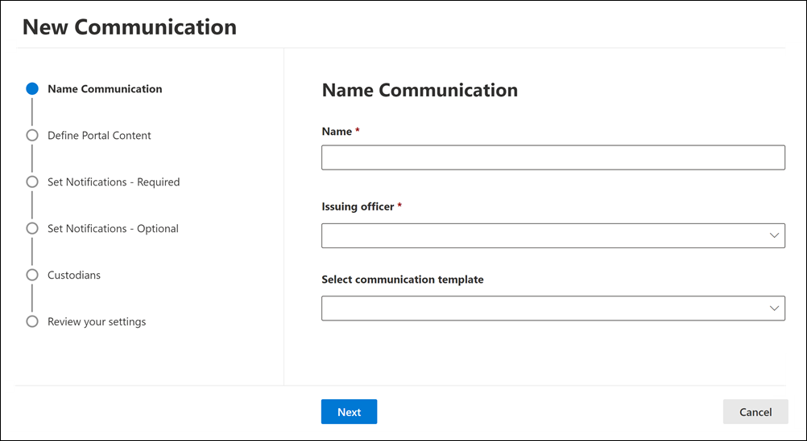

# Create a legal hold notice

Using eDiscovery (Premium) custodian communications, organizations can manage their workflow around communicating with custodians. Through the Communications tool, legal teams can systematically send, collect, and track legal hold notifications. The flexible creation process also allows teams to customize the hold notification workflow and the content in the notices sent to custodians.

The article outlines the steps in the hold notification workflow.

[!INCLUDE [purview-preview](../includes/purview-preview.md)]

## Step 1: Specify communication details

The first step is to specify the appropriate details for legal hold notices or other custodian communications.

1. In the Microsoft Purview compliance portal, go to **eDiscovery > Advanced** to display the list of cases in your organization.

2. Select a case, click the **Communications** tab, and then click **New communication**.

3. On the **Name communication** page, specify the following communication settings.

    - **Name**: This is the name for the communication.

    - **Issuing officer**: The drop-down list displays users in your organization who can be selected as the issuing officer for the communication. Each communication sent to custodians will be sent on behalf of the selected issuing officer. The list of users in the drop-down consists of the members of the case and the organization-wide issuing officers. These issuing officers are added by an eDiscovery Administrator, and are available in all eDiscovery (Premium) cases in your organization. For more information, see [Manage issuing officers](advanced-ediscovery-issuing-officers.md).

    - **Select communication template**: The drop-down list displays the templates from the Communications library on the eDiscovery (Premium) settings page. If you select a template, it will be displayed on the **Define portal content** as a starting point for the text of the notification that you're creating. If you don't select a template, then you'll have to create the notice yourself from scratch. For more information about communication templates, see [Manage custodian communications templates](advanced-ediscovery-communications-library.md).

4. Click **Next**.

## Step 2: Define the portal content

Next, you can create and add the content of the hold notice. On the **Define portal content** page in the **Create communication** wizard, specify the contents of the hold notice. This content will be automatically appended to the Issuance, Re-Issue, Reminder, and Escalation notices. Additionally, this content will appear in the custodian's Compliance Portal. If you selected a template from the Communications library, it will be displayed and provide a starting point for the notice you're creating.

To create the portal content:

1. Type (or cut and paste from another document) your hold notice in the textbox for the portal content. If you selected a communications template on the previous wizard page, the template is displayed. You can edit the template content as necessary.

2. Insert merge variables into your notice to customize the notice and share the Custodian Compliance Portal.

3. Click **Next**.

  > [!TIP]
  > To learn more about how to can customize the content and format of the portal content, see [Use the Communications Editor](using-communications-editor.md).

## Step 3: Set the required notifications

After you've defined the contents of the hold notice, you can set up the workflows around sending and managing the notification process. Notifications are email messages that are sent to notify and follow up with custodians. Every custodian added to the communication will receive the same notification.

To set up and send a hold notice, you must include Issuance, Re-Issuance, and Release notifications.

### Issuance notification

After the communication is created, the **Issuance Notification** is initiated by the specified Issuing Officer. The Issuance notification is the first communication sent to the custodian to inform them about their preservation obligations.

To create an issuance notification:

1. In the **Issuance** tile, click **Edit**.

2. If necessary, add additional case members or staff to the **Cc** and **Bcc** fields. To add multiple users to these fields, separate email addresses with a semi-colon.

3. Specify the **Subject** for the notice (required).

4. Specify the contents or additional instructions that you would like to provide to the custodian (required). The portal content you defined in Step 2 is added to the end of the issuance notice.

5. Click **Save**.

### Re-Issuance notification

As the case progresses, custodians may be required to preserve additional or less data than was previously instructed. After you update the portal content, the reissuance notification is sent and alerts custodians about any changes to their preservation obligations.

To create a reissuance notification:

1. In the **Reissue** tile, click **Edit**.

2. If necessary, add additional case members or staff to the **Cc** and **Bcc** fields. To add multiple users to these fields, separate email addresses with a semi-colon.

3. Specify the **Subject** for the notice (required).

4. Specify the contents or additional instructions that you would like to provide to the custodian (required). The portal content you defined in Step 2 is added to the end of the reissuance notice.

5. Click **Save**.

> [!NOTE]
> If the portal content is modified (on the **Define Portal Content** page in the **Edit communication** wizard), the re-issuance notification will be automatically sent to all custodians assigned to the notice. After the notification is sent, custodians will be asked to re-acknowledge their hold notice. If you have set up any reminder or escalation workflows, these will also re-start. For more information about what other case management events trigger communications, see [Events that trigger notifications](#events-that-trigger-notifications).

### Release notification

After a matter is resolved or if a custodian is no longer subject to preserve content, you can release the custodian from a case. If the custodian was previously issued a hold notice, the release notification can be used to alert custodians that they've been released from their obligation.

To create a release notification:

1. In the **Release** tile, click **Edit**.

2. If necessary, add additional case members or staff to the **Cc** and **Bcc** fields. To add multiple users to these fields, separate email addresses with a semi-colon.

3. Specify the **Subject** for the notice (required).

4. Specify the contents or additional instructions that you would like to provide to the custodian (required).

5. Click **Save** and go to the next step.

## (Optional) Step 4: Set the optional notifications

Optionally, you can simplify the workflow for following up with unresponsive custodians by creating and scheduling automated reminder and escalation notifications.

### Reminders

After you have sent a hold notification, you can follow up with unresponsive custodians by defining a reminder workflow.

To schedule reminders:

1. In the **Reminder** tile, click **Edit**.

2. Enable the **Reminder** workflow by turning on the **Status** toggle (required).

3. Specify the **Reminder interval (in days)** (required). This is the number of days to wait before sending the first and follow-up reminder notifications. For example, if you set the reminder interval to seven days, then the first reminder would be sent seven days after the hold notification was initially issued. All subsequent reminders would also be sent every seven days.

4. Specify the **Number of reminders** (required). This field specifies how many reminders to send to unresponsive custodians. For example, if you set the number of reminders to 3, then a custodian would receive a maximum of three reminders. After a custodian acknowledges the hold notification, reminders will no longer be sent to that user.

5. Specify the **Subject** for the notice (required).

6. Specify the contents or additional instructions that you would like to provide to the custodian (required). The portal content you defined in Step 2 is added to the end of the reminder notice.

7. Click **Save** and go the next step.

### Escalations

In some situations, you may need additional ways to follow up with unresponsive custodians. If a custodian doesn't acknowledge a hold notification after receiving the specified number of reminders, the legal team can specify a workflow to automatically send an escalation notice to the custodian and their manager.

To schedule escalations:

1. In the **Escalation** tile, click **Edit**.

2. Enable the **Escalation** workflow by turning on the **Status** toggle.

3. Specify the **Escalation interval (in days)** (required).

4. Specify the **Number of escalations** (required). This field specifies how many escalations to send to unresponsive custodians. For example, if you set the number of escalations to 3, then an escalation notice would be sent to the custodian and their manager a maximum of three times. After a custodian acknowledges the hold notification, escalations will no longer be sent.

5. Specify the **Subject** for the notice (required).

6. Specify the contents or additional instructions that you would like to provide to the custodian (required). The portal content you defined in Step 2 is added to the end of the escalation notice.

7. Click **Save** and go the next step.

## Step 5: Assign custodians to receive notifications

After you've finalized the content for notifications, select the custodians that you would like to send notifications to.

To add custodians:

1. Assign custodians to the communication by clicking the checkbox next to their name.

    After the communication is created, the notification workflow will automatically apply to the selected custodians.

2. Click **Next** to review the communication settings and details.

> [!NOTE]
> You can only add custodians who have been added to the case and haven't been sent another notification within the case.

## Step 6: Review settings

After you review the settings and click **Send** to complete the communication, the system will automatically start the communication workflow by sending the issuance notice.

## Events that trigger notifications

The following table describes events in the case management process that trigger when the different types of notifications are sent to custodians.

|Type of communication|Trigger |
|:---------|:---------|
|Issuance notices|The initial creation of the notification. You can also manually resend a hold notification. |
|Reissuance notices|Updating the portal content on the **Define Portal Content** page in the **Edit communication** wizard.|
|Release notices|The custodian is released from the case.|
|Reminders|The interval and number of reminders configured for the reminder.|
|Escalations|The interval and number of reminders configured for the escalation.|
|||
