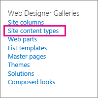

# Create and apply information management policies

Information management policies enable your organization to control how long to retain content, to audit what people do with content, and to add barcodes or labels to documents. A policy can help enforce compliance with legal and governmental regulations or internal business processes. As an administrator, you can set up a policy to control how to track documents and how long to retain documents.

You can create an information management policy can at three different locations in the site hierarchy, from the broadest to the narrowest:

- Create a policy to use on multiple content types within a site collection.
- Create a policy for a site content type.
- Create a policy for a list or library.

For more information, see [Introduction to information management policies](intro-to-info-mgmt-policies.md).

[!INCLUDE [purview-preview](../includes/purview-preview.md)]

## Create a policy for multiple content types within a site collection

To ensure that an information policy is applied to all documents of a certain type within a site collection, consider creating the policy at the site collection level and then later apply the policy to content types. These are referred to as site collection policies.

1. On the site collection home page \> **Settings** \> **Site Settings**.

    In a SharePoint group-connected site, click **Settings**, click **Site Contents**, and then click **Site Settings**.

2. On the Site Settings page, under **Site Collection Administration** \> **Content Type Policy Templates**.

   

3. On the Policies page \> **Create**.

4. Enter a name and description for the policy, and then write a brief policy statement that explains to users what the policy is for.

5. See the next section on creating policies for a site content type to learn how to set up the features you want to associate with the policy.

6. Choose **OK**.

## Create a policy for a site content type

Adding an information management policy to a content type makes it easy to associate policy features with multiple lists or libraries. You can choose to add an existing information management policy to a content type or create a unique policy specific to an individual content type.

 You can also add an information management policy to a content type that is specific to lists. This has the effect of applying the policy only to items in that list that are using the content type.

1. On the site collection home page \> **Settings** \> **Site Settings**.

    In a SharePoint group-connected site, click **Settings**, click **Site Contents**, and then click **Site Settings**.

2. On the Site Settings page, under **Web Designer Galleries** \> **Site content types**.

   

3. On the Site Content Type Settings page, select the content type that you want to add a policy to.

4. On the Site Content Type page, under **Settings** \> **Information management policy settings**.

5. On the Edit Policy page, enter a name and description for the policy, and then write a brief description that explains to users what the policy is for.

6. In the next sections, select the individual policy features that you want to add to your information management policy.

   

7. To specify a retention period for documents and items that are subject to this policy, choose **Enable Retention**, and then specify the retention period and the actions that you want to occur when the items expire.

   To specify a retention period:

   1. Choose **Add a retention stage for records**.

   2. Select a retention period option to specify when documents or items are set to expire. Do one of the following steps:
      - To set the expiration date based on a date property, under **Event** \> **This stage is based off a date property on the item**, and then select the document or item action (for example, Created or Modified) and the increment of time after this action (for example, the number of days, months, or years) when you want the item to expire.
      - To use a custom retention formula to determine expiration, choose **Set by a custom retention formula installed on this server**.

        > [!NOTE]
        > This option is only available if a custom formula has been set up by your administrator.

   3. The **Start a workflow** option is available only if you are defining a policy for a list, library, or content type that already has a workflow associated with it. You will then be given a choice of workflows to choose from.

   4. In the **Recurrence** section, select **Repeat this stage's action...**, and then enter how often you want the action to reoccur.

      > [!NOTE]
      >  This option is only available if the action you selected can be repeated. For example, you cannot set recurrence for the action **Permanently Delete**.

   5. Choose **OK**.

8. To enable auditing for the documents and items that are subject to this policy, choose **Enable Auditing**, and then specify the events you want to audit.

   To enable auditing:

   1. On the Edit Policy page under **Auditing** select **Enable auditing**, and then select the check boxes next to the events you want to keep an audit trail for.

   2. To prompt users to insert these barcodes into documents, choose **Prompt users to insert a barcode before saving or printing**.

   3. Choose **OK** to apply the auditing feature to the policy.

   The Auditing Policy feature enables organizations to create and analyze audit trails for documents and to list items such as task lists, issues lists, discussion groups, and calendars. This policy feature provides an audit log that records events, such as when content is viewed, edited, or deleted.

   When auditing is enabled as part of an information management policy, administrators can view the audit data in policy usage reports that are based in Microsoft Excel and that summarize current usage. Administrators can use these reports to determine how information is being used within the organization. These reports can also help organizations to verify and document their regulatory compliance or to investigate potential concerns.

   The audit log records the following information: event name, date and time of the event, and system name of the user who performed the action.

9. When barcodes are enabled as part of a policy, they are added to document properties and displayed in the header area of the document to which the barcode is applied. Like labels, barcodes can also be manually removed from a document. You can specify whether users should be prompted to include the barcode when printing or saving an item or if the barcode should be inserted manually using the **Insert** tab in 2010 Office release programs.

   To enable barcodes:

   1. On the **Edit Policy** page under **Barcodes**, select **Enable Barcodes**.

   2. To prompt users to insert these barcodes into documents, choose **Prompt users to insert a barcode before saving or printing**.

   3. Choose **OK** to apply the barcode feature to the policy.

   The barcode policy generates Code 39 standard barcodes. Each barcode image includes text below the barcode symbol that represents the barcode value. This enables the barcode data to be used even when scanning hardware is not available. Users can manually type the barcode number into the search box to locate the item on a site.    |

10. To require that documents that are subject to this policy have labels, choose **Enable Labels**, and then specify the settings that you want for the labels.

    To enable labels:

    1. To require users to add a label to a document, choose **Prompt users to insert a label before saving or printing**.

       > [!NOTE]
       > If you want labels to be optional, do not select this check box.

    2. To lock a label so that it cannot be changed after it has been inserted, choose **Prevent changes to labels after they are added**.

       This setting prevents the label text from updating once the label has been inserted into an item within a client application such as Word, Excel, or PowerPoint. If you want the label to be updated when the properties for this document or item are updated, do not select this check box.

    3. In the Label format box, enter the text for the label as you want it to be displayed. Labels can contain up to 10 column references, each of which can be up to 255 characters long. To create the format for your label, do the following steps:
       - Type the names of the columns that you want to include in the label in the order in which you want them to appear. Enclose the column names in curly brackets ({}), as shown in the example on the Edit Policy page.
       - Type words to identify the columns outside the brackets, as shown in the example on the Edit Policy page.

    4. To add a line break, enter **\n** where you want the line break to appear.

    5. Select the font size and style that you want, and specify whether you want the label positioned left, center, or right within the document.

       Select a font and style that are available on the users' computers. The size of the font affects how much text can be displayed on the label.

    6. Enter the height and width of the label. Label height can range from .25 inches to 20 inches, and label width can range from .25 inches to 20 inches. Label text is always vertically centered within the label image.

    7. Choose **Refresh** to preview the label content.

11. Choose **OK**.

## Create a policy for a list, library or folder (location-based retention policy)

You can define a retention policy that applies only to a specific list, library or folder. However, if you create a retention policy this way, you cannot reuse this policy on other lists, libraries, folders or sites, and you cannot apply a site collection policy to a location based policy.

If you want to apply a single retention policy to all types of content in a single location, you will most likely want to use location-based retention. In most other cases, you will want to verify that a retention policy is specified for all content types.

Each subfolder inherits the retention policy of its parent, unless you choose to break inheritance and define a new retention policy at the child level.

If you want to define an information management policy other than retention to a list or library, you need to define an information management policy for each individual list content type associated with that list or library.

If at any point you decide to switch from content type to location-based policies for a list or library, only the retention policy will be used as the location-based policy. All other management policies (audits, barcodes, and barcodes) will be inherited from the associated content types.

Location based policies can be disabled for a site collection by deactivating the Library and Folder Based Retention feature. This enables site collection administrators to ensure that their content type policies are not overridden by a list administrator's location based policies.

You need at least the Manage Lists permission to change the information management policy settings for a list or library.

1. Navigate to the list or library for which you want to specify an information management policy.

2. On the ribbon, choose the **Library** or **List** tab \> **Library Settings** or **List Settings**.

   In SharePoint Online, click **Settings** and then click **List settings** or **Library settings**.

3. Under **Permissions and Management**\> **Information management policy settings**.

   

4. On the Information Management Policy Settings page, make sure that the source of retention for the list or library is set to Library and Folders.

   If **Content Type** appears as the source, click **Change Source**, and then click **Library and Folders**. You are alerted that content type retention policies will be ignored. Choose **OK**.

5. On the Edit Policy page, under **Library Based Retention Schedule**, enter a brief description for the policy you are creating.

6. Choose **Add a retention stage...**

   Note that under Records, you can choose to define different retention policies for records by selecting the Define different retention stages for records option.

7. In the Stage properties dialog, select a retention period option to specify when documents or items are set to expire. Do one of the following:

   - To set the expiration date based on a date property, under **Event** \> **This stage is based off a date property on the item**, and then select the document or item action (for example, Created or Modified) and the increment of time after this action (for example, the number of days, months, or years) when you want the item to expire.

   - To use a custom retention formula to determine expiration, choose **Set by a custom retention formula installed on this server**.

     > [!NOTE]
     >  This option is only available if a custom formula has been set up by your administrator.

   - Under **Action**, specify what you want to happen when the document or item expires. To enable a specific action to happen to the document or item (such as deletion), select an action from the list.

8. The **Start a workflow** option is available only if you are defining a policy for a list, library, or content type that already has a workflow associated with it. You will then be given a choice of workflows to choose from.

9. Under **Recurrence**, choose **Repeat this stage's action...** and enter how often you want the action to reoccur.

   > [!NOTE]
   >  This option is only available if the action you selected can be repeated. For example, you cannot set recurrence for the action **Permanently Delete**.

10. Choose **OK**.

## Apply a site collection policy to a content type

If information management policies have already been created for your site as site collection policies, you can apply one of the policies to a content type. By doing this, you can apply the same policy to multiple content types in a site collection that do not share the same parent content type.

 If you want to apply policies to multiple content types in a site collection, and you have a Managed Metadata Service configured, you can use Content Type Publishing to publish out information management policies to multiple site collections. See the section [Apply a policy across site collections](#apply-a-policy-across-site-collections) for more information.

1. Navigate to the list or library that contains the content type to which you want to apply a policy.

2. On the ribbon, choose the **Library** or **List** tab \> **Library Settings** or **List Settings**.

   In SharePoint Online, click **Settings** and then click **List settings** or **Library settings**.

3. Under **Permissions and Management** \> **Information management policy settings**.

   

4. Verify that the policy source is set to **Content Types**, and under **Content Type Policies** select the content type you want to apply the policy to.

5. Under **Specify the Policy** \> **Use a site collection policy**, and then select the policy that you want to apply from the list.

   > [!NOTE]
   >  If the **Use a site collection policy** option is not available, no site collection policies have been defined for the site collection.

6. Choose **OK**.

   If the list or library you are working with supports the management of multiple content types, under **Content Types** you can choose the content type for which you want to specify an information management policy. This will take you directly to Step 5 above.

## Apply a policy across site collections

Share content types across site collections by using a Managed Metadata service application to set up content type publishing. Content type publishing helps you manage content and metadata consistently across your sites because content types can be created and updated centrally, and updates can be published out to multiple subscribing site collections or Web applications.

## Create a template from an existing policy to use across site collections

You can define an information management policy and then create a template from it to use as needed across multiple site collections. This method can be used if you want to have a backup of your information policies, or it can also be used as an alternate method to using content type publishing for applying one policy across site collections. You create a template or backup of the policy by exporting the policy from one site collection and then importing it to a saved location or to another site collection.

> [!IMPORTANT]
> If you using the export/import feature as a way to make a set of policy templates, keep in mind that a unique identifier exists in the policy .xml file. Because of this, you cannot import that policy into a site more than once without changing this unique identifier.

### Export a policy

1. On the site collection home page, choose **Settings**\> **Site Settings**.

   In a SharePoint group-connected site, click **Settings**, click **Site Contents**, and then click **Site Settings**.

2. On the Site Settings page, under **Site Collection Administration** \> **Content Type Policy Templates**.

   

3. Choose the policy you want to export \> scroll to the bottom \> **Export**.

4. At the prompt to save or open the file, choose **Save**, and then select a location to save the file to. Be sure to select a location that is available to the site collections that are importing the policy.

5. When the Download Complete dialog is displayed, choose **Close**.

### Import a policy to a different site collection

Importing an information management policy enables you to apply it to multiple content types at the site or list level within any given site collection. The benefits of doing this are twofold: you don't have to re-define and apply the policy on each content type, and you can more easily manage policy modifications by making changes to the policy in just one place.

1. On the home page of the site collection to which you want to apply the policy, choose **Settings**\> **Site Settings**.

   In a SharePoint group-connected site, click **Settings**, click **Site Contents**, and then click **Site Settings**.

2. On the Site Settings page, under **Site Collection Administration** \> **Content Type Policy Templates**.

3. On the Policies page \> **Import** \> **Browse** to find the XML file for the policy.

4. Select the XML file in which the policy has been saved \> **Open**.

5. On the Import a Site Collection Policy page \> **Import** to add the policy to the site collection.

Your imported policy can now be applied to one or many content types at the site or list level.

Information management policies enable your organization to control how long to retain content, to audit what people do with content, and to add barcodes or labels to documents. A policy can help enforce compliance with legal and governmental regulations or internal business processes. As an administrator, you can set up a policy to control how to track documents and how long to retain documents.

You can create an information management policy can at three different locations in the site hierarchy, from the broadest to the narrowest:

- Create a policy to use on multiple content types within a site collection.
- Create a policy for a site content type.
- Create a policy for a list or library.

For more information, see [Introduction to information management policies](intro-to-info-mgmt-policies.md).
