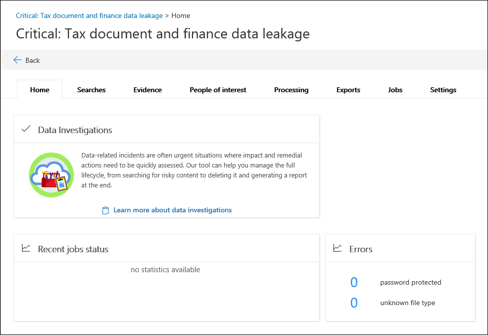

# Create a new investigation in Data Investigations (preview)

1. Go to [https://compliance.microsoft.com](https://compliance.microsoft.com).
    
2. Sign in using your work or school account.
    
3. In the compliance center, click **Data Investigations**.
 
4. On the **Data Investigations (preview)** page, click **Create new investigation**.
    
5. On the **New data investigation** flyout page, give the investigation a name (required), and then type an optional investigation number and description. The investigation name must be unique in your organization.

6. Under **Do you want to configure additional settings after creating this investigation?**, do one of the following:

    - Click **Yes** to create the investigation, and display the **Settings** page in the new investigation. This allows you to add members to the investigation.
    
    - Click **No** to just create the investigation and display it in the list of investigations on the **Data Investigations (preview)** page. If you choose this option, you will be added as the only member of the investigation and the default search and analytics settings will be used. You can add members or change settings anytime after the investigation is created.

7. Click **Save** to create the investigation.

    The new investigation is displayed in the list of investigations on the **Data Investigations (preview)** page. 

8. To open an investigation, click the name of the investigation. 

    The **Home** tab for the investigation is displayed. For example, here's a new investigation named *Critical: Tax document and finance data leakage*.

    
