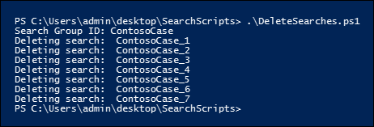

# Create, report on, and delete multiple Content Searches

 Quickly creating and reporting discovery searches is often an important step in eDiscovery and investigations when you're trying to learn about the underlying data, and the richness and quality of your searches. To help you do this, the Security & Compliance Center PowerShell offers a set of cmdlets to automate time-consuming Content Search tasks. These scripts provide a quick and easy way to create a number of searches, and then run reports of the estimated search results that can help you determine the quantity of data in question. You can also use the scripts to create different versions of searches to compare the results each one produces. These scripts can help you to quickly and efficiently identify and cull your data.

## Before you create a Content Search

- You have to be a member of the eDiscovery Manager role group in the Security & Compliance Center to run the scripts that are described in this topic.

- To collect a list of the URLs for the OneDrive for Business sites in your organization that you can add to the CSV file in Step 1, see [Create a list of all OneDrive locations in your organization](/onedrive/list-onedrive-urls).

- Be sure to save all the files that you create in this topic to the same folder. That will make it easier to run the scripts.

- The scripts include minimal error handling. Their primary purpose is to quickly create, report on, and delete multiple Content Searches.

- The sample scripts provided in this topic aren't supported under any Microsoft standard support program or service. The sample scripts are provided AS IS without warranty of any kind. Microsoft further disclaims all implied warranties including, without limitation, any implied warranties of merchantability or of fitness for a particular purpose. The entire risk arising out of the use or performance of the sample scripts and documentation remains with you. In no event shall Microsoft, its authors, or anyone else involved in the creation, production, or delivery of the scripts be liable for any damages whatsoever (including, without limitation, damages for loss of business profits, business interruption, loss of business information, or other pecuniary loss) arising out of the use of or inability to use the sample scripts or documentation, even if Microsoft has been advised of the possibility of such damages.

## Step 1: Create a CSV file that contains information about the searches you want to run

The comma separated value (CSV) file that you create in this step contains a row for each user that want to search. You can search the user's Exchange Online mailbox (which includes the archive mailbox, if it's enabled) and their OneDrive for Business site. Or you can search just the mailbox or the OneDrive for Business site. You can also search any site in your SharePoint Online organization. The script that you run in Step 3 will create a separate search for each row in the CSV file.

1. Copy and paste the following text into a .txt file using NotePad. Save this file to a folder on your local computer. You'll save the other scripts to this folder as well.

   ```text
   ExchangeLocation,SharePointLocation,ContentMatchQuery,StartDate,EndDate
   sarad@contoso.onmicrosoft.com,https://contoso-my.sharepoint.com/personal/sarad_contoso_onmicrosoft_com,(lawsuit OR legal),1/1/2000,12/31/2005
   sarad@contoso.onmicrosoft.com,https://contoso-my.sharepoint.com/personal/sarad_contoso_onmicrosoft_com,(lawsuit OR legal),1/1/2006,12/31/2010
   sarad@contoso.onmicrosoft.com,https://contoso-my.sharepoint.com/personal/sarad_contoso_onmicrosoft_com,(lawsuit OR legal),1/1/2011,3/21/2016
   ,https://contoso.sharepoint.com/sites/contoso,,,3/21/2016
   ,https://contoso-my.sharepoint.com/personal/davidl_contoso_onmicrosoft_com,,1/1/2015,
   ,https://contoso-my.sharepoint.com/personal/janets_contoso_onmicrosoft_com,,1/1/2015,
   ```

   The first row, or header row, of the file lists the parameters that will be used by **New-ComplianceSearch** cmdlet (in the script in Step 3) to create a new Content Searches. Each parameter name is separated by a comma. Make sure there aren't any spaces in the header row. Each row under the header row represents the parameter values for each search. Be sure to replace the placeholder data in the CSV file with your actual data.

2. Open the .txt file in Excel, and then use the information in the following table to edit the file with information for each search.

   ****

   |Parameter|Description|
   |---|---|
   |`ExchangeLocation`|The SMTP address of the user's mailbox.|
   |`SharePointLocation`|The URL for the user's OneDrive for Business site or the URL for any site in your organization. For the URL for OneDrive for Business sites, use this format: ` https://<your organization>-my.sharepoint.com/personal/<user alias>_<your organization>_onmicrosoft_com `. For example,  `https://contoso-my.sharepoint.com/personal/sarad_contoso_onmicrosoft_com`.|
   |`ContentMatchQuery`|The search query for the search. For more information about creating a search query, see [Keyword queries and search conditions for Content Search](keyword-queries-and-search-conditions.md).|
   |`StartDate`|For email, the date on or after a message was received by a recipient or sent by the sender. For documents on SharePoint or OneDrive for Business sites, the date on or after a document was last modified.|
   |`EndDate`|For email, the date on or before a message was sent by a sent by the user. For documents on SharePoint or OneDrive for Business sites, the date on or before a document was last modified.|
   |

3. Save the Excel file as a CSV file to a folder on your local computer. The script that you create in Step 3 will use the information in this CSV file to create the searches.

## Step 2: Connect to Security & Compliance Center PowerShell

The next step is to connect to Security & Compliance Center PowerShell for your organization. For step-by-step instructions, see [Connect to Security & Compliance Center PowerShell](/powershell/exchange/connect-to-scc-powershell).

## Step 3: Run the script to create and start the searches

The script in this step will create a separate Content Search for each row in the CSV file that you created in Step 1. When you run this script, you'll be prompted for two values:

- **Search Group ID** - This name provides an easy way to organize the searches that are created from the CSV file. Each search that's created is named with the Search Group ID, and then a number is appended to the search name. For example, if you enter **ContosoCase** for the Search Group ID, then the searches are named **ContosoCase_1**, **ContosoCase_2**, **ContosoCase_3**, and so on. Note that the name you type is case sensitive. When you use the Search Group ID in Step 4 and Step 5, you have to use the same case as you did when you created it.

- **CSV file** - The name of the CSV file that you created in Step 1. Be sure to include the use the full filename, include the .csv file extension; for example,  `ContosoCase.csv`.

To run the script:

1. Save the following text to a Windows PowerShell script file by using a filename suffix of .ps1; for example, `CreateSearches.ps1`. Save the file to the same folder where you saved the other files.

   ```Powershell
   # Get the Search Group ID and the location of the CSV input file
   $searchGroup = Read-Host 'Search Group ID'
   $csvFile = Read-Host 'Source CSV file'

   # Do a quick check to make sure our group name will not collide with other searches
   $searchCounter = 1
   import-csv $csvFile |
     ForEach-Object{

    $searchName = $searchGroup +'_' + $searchCounter
    $search = Get-ComplianceSearch $searchName -EA SilentlyContinue
    if ($search)
    {
       Write-Error "The Search Group ID conflicts with existing searches.  Please choose a search group name and restart the script."
       return
    }
    $searchCounter++
   }

   $searchCounter = 1
   import-csv $csvFile |
     ForEach-Object{

    # Create the query
    $query = $_.ContentMatchQuery
    if(($_.StartDate -or $_.EndDate))
    {
          # Add the appropriate date restrictions.  NOTE: Using the Date condition property here because it works across Exchange, SharePoint, and OneDrive for Business.
          # For Exchange, the Date condition property maps to the Sent and Received dates; for SharePoint and OneDrive for Business, it maps to Created and Modified dates.
          if($query)
          {
              $query += " AND"
          }
          $query += " ("
          if($_.StartDate)
          {
              $query += "Date >= " + $_.StartDate
          }
          if($_.EndDate)
          {
              if($_.StartDate)
              {
                  $query += " AND "
              }
              $query += "Date <= " + $_.EndDate
          }
          $query += ")"
    }

     # -ExchangeLocation can't be set to an empty string, set to null if there's no location.
     $exchangeLocation = $null
     if ( $_.ExchangeLocation)
     {
           $exchangeLocation = $_.ExchangeLocation
     }

    # Create and run the search
    $searchName = $searchGroup +'_' + $searchCounter
    Write-Host "Creating and running search: " $searchName -NoNewline
    $search = New-ComplianceSearch -Name $searchName -ExchangeLocation $exchangeLocation -SharePointLocation $_.SharePointLocation -ContentMatchQuery $query

    # Start and wait for each search to complete
    Start-ComplianceSearch $search.Name
    while ((Get-ComplianceSearch $search.Name).Status -ne "Completed")
    {
       Write-Host " ." -NoNewline
       Start-Sleep -s 3
    }
    Write-Host ""

    $searchCounter++
   }
   ```

2. In Windows PowerShell, go to the folder where you saved the script in the previous step, and then run the script; for example:

   ```Powershell
   .\CreateSearches.ps1
   ```

3. At the **Search Group ID** prompt, type a search group name, and then press **Enter**; for example,  `ContosoCase`. Remember that this name is case sensitive, so you'll have to type it the same way in the subsequent steps.

4. At the **Source CSV file** prompt, type the name of the CSV file, including the .csv file extension; for example,  `ContosoCase.csv`.

5. Press **Enter** to continue running the script.

   The script displays the progress of creating and running the searches. When the script is complete, it returns to the prompt.

   

## Step 4: Run the script to report the search estimates

After you create the searches, the next step is to run a script that displays a simple report of the number of search hits for each search that was created in Step 3. The report also includes the size of results for each search, and the total number of hits and total size of all searches. When you run the reporting script, you'll be prompted for the Search Group ID, and a CSV filename if you want to save the report to a CSV file.

1. Save the following text to a Windows PowerShell script file by using a filename suffix of .ps1; for example, `SearchReport.ps1`. Save the file to the same folder where you saved the other files.

   ```Powershell
   $searchGroup = Read-Host 'Search Group ID'
   $outputFile = Read-Host 'Enter a file name or file path to save the report to a .csv file. Leave blank to only display the report'
   $searches = Get-ComplianceSearch | ?{$_.Name -clike $searchGroup + "_*"}
   $allSearchStats = @()
   foreach ($partialObj in $searches)
   {
      $search = Get-ComplianceSearch $partialObj.Name
      $sizeMB = [System.Math]::Round($search.Size / 1MB, 2)
      $searchStatus = $search.Status
      if($search.Errors)
      {
          $searchStatus = "Failed"
      }elseif($search.NumFailedSources -gt 0)
      {
          $searchStatus = "Failed Sources"
      }
      $searchStats = New-Object PSObject
      Add-Member -InputObject $searchStats -MemberType NoteProperty -Name Name -Value $search.Name
      Add-Member -InputObject $searchStats -MemberType NoteProperty -Name ContentMatchQuery -Value $search.ContentMatchQuery
      Add-Member -InputObject $searchStats -MemberType NoteProperty -Name Status -Value $searchStatus
      Add-Member -InputObject $searchStats -MemberType NoteProperty -Name Items -Value $search.Items
      Add-Member -InputObject $searchStats -MemberType NoteProperty -Name "Size" -Value $search.Size
      Add-Member -InputObject $searchStats -MemberType NoteProperty -Name "Size(MB)" -Value $sizeMB
      $allSearchStats += $searchStats
   }
   # Calculate the totals
   $allItems = ($allSearchStats | Measure-Object Items -Sum).Sum
   # Convert the total size to MB and round to the nearst 100th
   $allSize = ($allSearchStats | Measure-Object 'Size' -Sum).Sum
   $allSizeMB = [System.Math]::Round($allSize  / 1MB, 2)
   # Get the total successful searches and total of all searches
   $allSuccessCount = ($allSearchStats |?{$_.Status -eq "Completed"}).Count
   $allCount = $allSearchStats.Count
   $allStatus = [string]$allSuccessCount + " of " + [string]$allCount
   # Totals Row
   $totalSearchStats = New-Object PSObject
   Add-Member -InputObject $totalSearchStats -MemberType NoteProperty -Name Name -Value "Total"
   Add-Member -InputObject $totalSearchStats -MemberType NoteProperty -Name Status -Value $allStatus
   Add-Member -InputObject $totalSearchStats -MemberType NoteProperty -Name Items -Value $allItems
   Add-Member -InputObject $totalSearchStats -MemberType NoteProperty -Name "Size(MB)" -Value $allSizeMB
   $allSearchStats += $totalSearchStats
   # Just get the columns we're interested in showing
   $allSearchStatsPrime = $allSearchStats | Select-Object Name, Status, Items, "Size(MB)", ContentMatchQuery
   # Print the results to the screen
   $allSearchStatsPrime |ft -AutoSize -Wrap
   # Save the results to a CSV file
   if ($outputFile)
   {
      $allSearchStatsPrime | Export-Csv -Path $outputFile -NoTypeInformation
   }
   ```

2. In Windows PowerShell, go to the folder where you saved the script in the previous step, and then run the script; for example:

   ```Powershell
   .\SearchReport.ps1
   ```

3. At the **Search Group ID** prompt, type a search group name, and then press **Enter**; for example  `ContosoCase`. Remember that this name is case sensitive, so you'll have to type it the same way you did when you ran the script in Step 3.

4. At the **File path to save the report to a CSV file (leave blank to just display the report)** prompt, type a file name of complete filename path (including the .csv file extension) if you want to save the report to a CSV file. name of the CSV file, including the .csv file extension. For example, you could type  `ContosoCaseReport.csv` to save it to the current directory or you could type  `C:\Users\admin\OneDrive for Business\ContosoCase\ContosoCaseReport.csv` to save it to a different folder. You can also leave the prompt blank to display the report but not save it to a file.

5. Press **Enter**.

   The script displays the progress of creating and running the searches. When the script is complete, the report is displayed.

   

> [!NOTE]
> If the same mailbox or site is specified as a content location in more than one search in a search group, the total results estimate in the report (for both the number of items and the total size) might include results for the same items. That's because the same email message or document will be counted more than once if it matches the query for different searches in the search group.

## Step 5: Run the script to delete the searches

Because you might be creating a lot of searches, this last script just makes it easy to quickly delete the searches you created in Step 3. Like the other scripts, this one also prompts you for the Search Group ID. All searches with the Search Group ID in the search name will be deleted when you run this script.

1. Save the following text to a Windows PowerShell script file by using a filename suffix of .ps1; for example, `DeleteSearches.ps1`. Save the file to the same folder where you saved the other files.

   ```Powershell
   # Delete all searches in a search group
   $searchGroup = Read-Host 'Search Group ID'
   Get-ComplianceSearch |
      ForEach-Object{
      # If the name matches the search group name pattern (case sensitive), delete the search
      if ($_.Name -cmatch $searchGroup + "_\d+")
      {
          Write-Host "Deleting search: " $_.Name
          Remove-ComplianceSearch $_.Name -Confirm:$false
      }
   }
   ```

2. In Windows PowerShell, go to the folder where you saved the script in the previous step, and then run the script; for example:

   ```Powershell
   .\DeleteSearches.ps1
   ```

3. At the **Search Group ID** prompt, type a search group name for the searches that you want to delete, and then press **Enter**; for example,  `ContosoCase`. Remember that this name is case sensitive, so you'll have to type it the same way you did when you ran the script in Step 3.

   The script displays the name of each search that's deleted.

   
