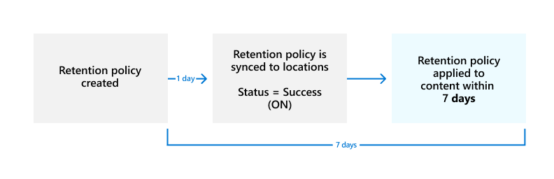

# Create and configure retention policies

>*[Microsoft 365 licensing guidance for security & compliance](/office365/servicedescriptions/microsoft-365-service-descriptions/microsoft-365-tenantlevel-services-licensing-guidance/microsoft-365-security-compliance-licensing-guidance).*

Use a retention policy to manage the data for your organization by deciding proactively whether to retain content, delete content, or retain and then delete the content.

A retention policy lets you do this very efficiently by assigning the same retention settings at the container level to be automatically inherited by content in that container. For example, all items in SharePoint sites, all email messages in users' Exchange mailboxes, all channel messages for teams that are used with Microsoft Teams. If you're not sure whether to use a retention policy at the container level or a retention label at the item level, see [Retention policies and retention labels](retention.md#retention-policies-and-retention-labels).

For more information about retention policies and how retention works in Microsoft 365, see [Learn about retention policies and retention labels](retention.md).

> [!NOTE]
> The information on this page is for compliance administrators. If you are not an administrator and want to understand how retention policies have been configured for the apps that you use, contact your help desk, IT department, or administrator. If you're seeing messages about retention policies in Teams chats and channel messages, you might find it helpful to review [Teams messages about retention policies](https://support.microsoft.com/office/teams-messages-about-retention-policies-c151fa2f-1558-4cf9-8e51-854e925b483b).

[!INCLUDE [purview-preview](../includes/purview-preview.md)]

## Before you begin

The global admin for your organization has full permissions to create and edit retention policies. If you aren't signing in as a global admin, see the [permissions information for data lifecycle management](get-started-with-data-lifecycle-management.md#permissions-for-retention-policies-and-retention-labels).

Decide before you create your retention policy whether it will be **adaptive** or **static**. For more information, see [Adaptive or static policy scopes for retention](retention.md#adaptive-or-static-policy-scopes-for-retention). If you decide to use an adaptive policy, you must create one or more adaptive scopes before you create your retention policy, and then select them during the create retention policy process. For instructions, see [Configuration information for adaptive scopes](retention-settings.md#configuration-information-for-adaptive-scopes).

## Create and configure a retention policy

Although a retention policy can support multiple services that are identified as "locations" in the retention policy, you can't create a single retention policy that includes all the supported locations:

- Exchange email
- SharePoint site
- OneDrive accounts
- Microsoft 365 groups
- Skype for Business
- Exchange public folders
- Teams channel messages
- Teams chats
- Teams private channel messages
- Yammer community messages
- Yammer user messages

If you select the Teams or Yammer locations when you create a retention policy, the other locations are automatically excluded. This means that the instructions to follow depend on whether you need to include the Teams or Yammer locations:

- [Instructions for a retention policy for Teams locations](#retention-policy-for-teams-locations)
- [Instructions for a retention policy for Yammer locations](#retention-policy-for-yammer-locations)
- [Instructions for a retention policy for locations other than Teams and Yammer](#retention-policy-for-locations-other-than-teams-and-yammer)

> [!NOTE]
> When you use adaptive policies instead of static policies, you can configure a single retention policy to include both Teams and Yammer locations. This isn't the case for static policies where Teams and Yammer locations require their own retention policy.

When you've more than one retention policy, and when you also use retention labels, see [The principles of retention, or what takes precedence?](retention.md#the-principles-of-retention-or-what-takes-precedence) to understand the outcome when multiple retention settings apply to the same content.

### Retention policy for Teams locations

> [!NOTE]
> Retention policies support [shared channels](/MicrosoftTeams/shared-channels). When you configure retention settings for the **Teams channel message** location, if a team has any shared channels, they inherit retention settings from their parent team.
> 
> Retention policies also support newly created call data records, which are system-generated messages that contain [metadata for meetings and calls](/MicrosoftTeams/ediscovery-investigation#teams-metadata). All call data records are always included with the **Teams chats** location, even call data records for Teams channel messages and Teams proviate channel messages.

1. From the [Microsoft Purview compliance portal](https://compliance.microsoft.com/), select **Data lifecycle management** > **Microsoft 365** > **Retention Policies**.

2. Select **New retention policy** to start the **Create retention policy** configuration, and name your new retention policy.

3. For the **Choose the type of retention policy to create** page, select **Adaptive** or **Static**, depending on the choice you made from the [Before you begin](#before-you-begin) instructions. If you haven't already created adaptive scopes, you can select **Adaptive** but because there won't be any adaptive scopes to select, you won't be able to finish the configuration with this option.

4. Depending on your selected scope:
    
    - If you chose **Adaptive**: On the **Choose adaptive policy scopes and locations** page, select **Add scopes** and select one or more adaptive scopes that have been created. Then, select one or more locations. The locations that you can select depend on the [scope types](retention-settings.md#configuration-information-for-adaptive-scopes) added. For example, if you only added a scope type of **User**, you'll be able to select **Teams chats** but not **Teams channel messages**. 
    
    - If you chose **Static**: On the **Choose locations to apply the policy** page, select one or more locations for Teams:
        - **Teams channel message**: Messages from standard and shared channel chats, and standard and shared channel meetings, but not from [private channels](/microsoftteams/private-channels) that have their own policy location.
        - **Teams chats**: Messages from private 1:1 chats, group chats, meeting chats, and chat with yourself.
        - **Teams private channel messages**: Messages from private channel chats and private channel meetings. If you select this option, you can't select the other Teams locations in the same retention policy.
        
       By default, [all teams and all users are selected](retention-settings.md#a-policy-that-applies-to-entire-locations), but you can refine this by selecting the [**Choose** and **Exclude** options](retention-settings.md#a-policy-with-specific-inclusions-or-exclusions).

5. For **Decide if you want to retain content, delete it, or both** page, specify the configuration options for retaining and deleting content.

   You can create a retention policy that just retains content without deleting, retains and then deletes after a specified period of time, or just deletes content after a specified period of time. For more information, see [Settings for retaining and deleting content](retention-settings.md#settings-for-retaining-and-deleting-content).

6. Complete the configuration and save your settings.

For guidance when to use retention policies for Teams and understand the end user experience, see [Manage retention policies for Microsoft Teams](/microsoftteams/retention-policies) from the Teams documentation.

For technical details about how retention works for Teams, including what elements of messages are supported for retention and timing information with example walkthroughs, see [Learn about retention for Microsoft Teams](retention-policies-teams.md).

#### Known configuration issues for Teams retention policies

- Although you can select the option to start the retention period when items were last modified, the value of **When items were created** is always used. For messages that are edited, a copy of the original message is saved with its original timestamp to identify when this pre-edited message was created, and the post-edited message has a newer timestamp.

- When you select **Edit** for the Teams chats location, you might see guests and non-mailbox users. Retention policies aren't designed for these users, so don't select them.

- To include newly created call data records for Teams channel messages and Teams private channel messages, you must select the **Teams chats** location, instead of the **Teams channel messages** and **Teams private channel messages** locations.


#### Additional retention policy needed to support Teams

Teams is more than just chats and channel messages. If you have teams that were created from a Microsoft 365 group (formerly Office 365 group), you should additionally configure a retention policy that includes that Microsoft 365 group by using the **Microsoft 365 Groups** location. This retention policy applies to content in the group's mailbox, site, and files.

If you have team sites that aren't connected to a Microsoft 365 group, you need a retention policy that includes the **SharePoint sites** or **OneDrive accounts** locations to retain and delete files in Teams:

- Files that are shared in chat are stored in the OneDrive account of the user who shared the file.

- Files that are uploaded to channels are stored in the SharePoint site for the team.

> [!TIP]
> You can apply a retention policy to the files of just a specific team when it's not connected to a Microsoft 365 group by selecting the SharePoint site for the team, and the OneDrive accounts of users in the Team.

It's possible that a retention policy that's applied to Microsoft 365 groups, SharePoint sites, or OneDrive accounts could delete a file that's referenced in a Teams chat or channel message before those messages get deleted. In this scenario, the file still displays in the Teams message, but when users select the file, they get a "File not found" error. This behavior isn't specific to retention policies and could also happen if a user manually deletes a file from SharePoint or OneDrive.

### Retention policy for Yammer locations

> [!NOTE]
> Retention policies for Yammer currently do not inform users when messages are deleted as a result of a retention policy.
>
> To use this feature, your Yammer network must be [Native Mode](/yammer/configure-your-yammer-network/overview-native-mode), not Hybrid Mode.

1. From the [Microsoft Purview compliance portal](https://compliance.microsoft.com/), select **Data lifecycle management** > **Microsoft 365** > **Retention Policies**.

2. Select **New retention policy** to create a new retention policy.

3. For the **Choose the type of retention policy to create** page, select **Adaptive** or **Static**, depending on the choice you made from the [Before you begin](#before-you-begin) instructions. If you haven't already created adaptive scopes, you can select **Adaptive** but because there won't be any adaptive scopes to select, you won't be able to finish the configuration with this option.

4. Depending on your selected scope:
    
    - If you chose **Adaptive**: On the **Choose adaptive policy scopes and locations** page, select **Add scopes** and select one or more adaptive scopes that have been created. Then, select one or more locations. The locations that you can select depend on the [scope types](retention-settings.md#configuration-information-for-adaptive-scopes) added. For example, if you only added a scope type of **User**, you'll be able to select **Yammer user messages** but not **Yammer community messages**. 
    
    - If you chose **Static**: On the **Choose locations to apply the policy** page, toggle on one or both of the locations for Yammer: **Yammer community message** and **Yammer user messages**.
        
        By default, all communities and users are selected, but you can refine this by specifying communities and users to be included or excluded.
        
        For Yammer user messages: 
        - If you leave the default at **All users**, Azure B2B guest users are not included. 
        - If you select **Edit** for **All users**, you can apply a retention policy to external users if you know their account.

5. For **Decide if you want to retain content, delete it, or both** page, specify the configuration options for retaining and deleting content. 
    
    You can create a retention policy that just retains content without deleting, retains and then deletes after a specified period of time, or just deletes content after a specified period of time. For more information, see [Settings for retaining and deleting content](retention-settings.md#settings-for-retaining-and-deleting-content).

6. Complete the configuration and save your settings.

For technical details about how retention works for Yammer, including what elements of messages are supported for retention and timing information with example walkthroughs, see [Learn about retention for Yammer](retention-policies-yammer.md).

#### Known configuration issues for Yammer retention policies

- Although you can select the option to start the retention period when items were last modified, the value of **When items were created** is always used. For messages that are edited, a copy of the original message is saved with its original timestamp to identify when this pre-edited message was created, and the post-edited message has a newer timestamp.

- When you select **Edit** for the Yammer user messages location, you might see guests and non-mailbox users. Retention policies aren't designed for these users, so don't select them.

#### Additional retention policies needed to support Yammer

Yammer is more than just community messages and private messages. To retain and delete email messages for your Yammer network, configure an additional retention policy that includes any Microsoft 365 groups that are used for Yammer, by using the **Microsoft 365 Groups** location.

This location will also include files that are uploaded to Yammer communities. These files are stored in the group-connected SharePoint site for the Yammer community.

It's possible that a retention policy that's applied to SharePoint sites could delete a file that's referenced in a Yammer message before those messages get deleted. In this scenario, the file still displays in the Yammer message, but when users select the file, they get a "File not found" error. This behavior isn't specific to retention policies and could also happen if a user manually deletes a file from SharePoint.

### Retention policy for locations other than Teams and Yammer

Use the following instructions for retention policies that apply to any of these services:

- Exchange: Email and public folders
- SharePoint: Sites
- OneDrive: Accounts
- Microsoft 365 groups
- Skype for Business

1. From the [Microsoft Purview compliance portal](https://compliance.microsoft.com/), select **Data lifecycle management** > **Microsoft 365** > **Retention Policies**.

2. Select **New retention policy** to start the **Create retention policy** configuration, and name your new retention policy.

3. For the **Choose the type of retention policy to create** page, select **Adaptive** or **Static**, depending on the choice you made from the [Before you begin](#before-you-begin) instructions. If you haven't already created adaptive scopes, you can select **Adaptive** but because there won't be any adaptive scopes to select, you won't be able to finish the configuration with this option. Adaptive policies don't support the locations for Exchange public folders or Skype for Business.

4. Depending on your selected scope:
    
    - If you chose **Adaptive**: On the **Choose adaptive policy scopes and locations** page, select **Add scopes** and select one or more adaptive scopes that have been created. Then, select one or more locations. The locations that you can select depend on the [scope types](retention-settings.md#configuration-information-for-adaptive-scopes) added. For example, if you only added a scope type of **User**, you'll be able to select **Exchange email** but not **SharePoint sites**. 
    
    - If you chose **Static**: On the **Choose locations** page, toggle on or off any of the locations except the locations for Teams and Yammer. For each location, you can leave it at the default to [apply the policy to the entire location](retention-settings.md#a-policy-that-applies-to-entire-locations), or [specify includes and excludes](retention-settings.md#a-policy-with-specific-inclusions-or-exclusions).
    
    Information specific to locations:
    - [Exchange email and Exchange public folders](retention-settings.md#configuration-information-for-exchange-email-and-exchange-public-folders)
    - [SharePoint sites and OneDrive accounts](retention-settings.md#configuration-information-for-sharepoint-sites-and-onedrive-accounts)
    - [Microsoft 365 Groups](retention-settings.md#configuration-information-for-microsoft-365-groups)
    - [Skype for Business](retention-settings.md#configuration-information-for-skype-for-business)

5. For **Decide if you want to retain content, delete it, or both** page, specify the configuration options for retaining and deleting content.
    
    You can create a retention policy that just retains content without deleting, retains and then deletes after a specified period of time, or just deletes content after a specified period of time. For more information, see [Settings for retaining and deleting content](retention-settings.md#settings-for-retaining-and-deleting-content) on this page.

6. Complete the configuration and save your settings.

## How long it takes for retention policies to take effect

When you create and submit a retention policy, it can take up to seven days for the retention policy to be applied:
  


First, the retention policy needs to be distributed to the locations that you selected, and then applied to content. You can always check the distribution status of the retention policy by selecting it from the **Retention policies** page in the Microsoft Purview compliance portal. From the flyout pane, if you see **(Error)** included in the status, and in the details for the locations see a message that it's taking longer than expected to deploy the policy or to try redeploying the policy, try running the [Set-AppRetentionCompliancePolicy](/powershell/module/exchange/set-appretentioncompliancepolicy) or [Set-RetentionCompliancePolicy](/powershell/module/exchange/set-retentioncompliancepolicy) PowerShell command to retry the policy distribution:

1. [Connect to Security & Compliance PowerShell](/powershell/exchange/connect-to-scc-powershell).

2. Run one of the following commands:
    
    - For the policy locations **Teams private channel messages**, **Yammer user messages** and **Yammer community messages**:
    
        ```PowerShell
        Set-AppRetentionCompliancePolicy -Identity <policy name> -RetryDistribution
        ```
    
    - For all other policy locations, such as **Exchange email**, **SharePoint sites**, and **Teams channel messages**:
    
        ```PowerShell
        Set-RetentionCompliancePolicy -Identity <policy name> -RetryDistribution
        ```

## Updating retention policies

When settings from the retention policy are already applied to content, a change in configuration to the policy will be automatically applied to this content in addition to content that's newly identified.

Some settings can't be changed after the policy is created and saved, which include the name of the retention policy, the scope type (adaptive or static), and the retention settings except the retention period.

## Next steps

If some items for Exchange, SharePoint, OneDrive, or Microsoft 365 Groups need different retention settings from the retention policy settings you've configured, [create retention labels for these exceptions](create-retention-labels-data-lifecycle-management.md).

However, if you're looking to manage high-value items for business, legal, or regulatory record-keeping requirements, [use file plan to create and manage retention labels](file-plan-manager.md).
