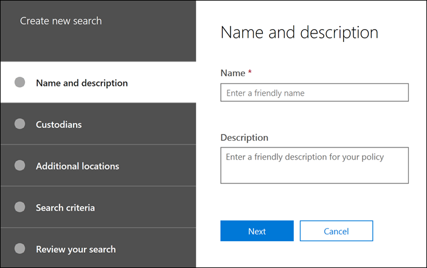

# Create a search

On the **Searches** tab in your case, you can create a new search by clicking **New search** and following the wizard.

## Name the search and give it a description

Each search with a case should have a unique name. You can optionally provide a description for your search. 

## Choose the custodians and custodial locations to search

Choose custodian content locations to search by specifying that custodians you have added to the case. By selecting a custodian, you will run the search against all data sources mapped to the custodian. You also have the option to narrow the search to selected data sources for each custodian. For more information about how to add custodians and manage their data sources, see [Work with custodians](managing-custodians.md).

## Choose non-custodial locations

In some cases, you may want to search data sources that are not associated with a custodian. In this case, you can specify the locations you want to search, or choose to search all content locations for a specific Microsoft service (such as searching all Exchange mailboxes or all SharePoint sites and OneDrive accounts).

## Define the search query and conditions

You can define the keywords query and any conditions for the search by using the pre-built condition cards or using Keyword Query Language (KQL). For more information, see [Build search queries](building-search-queries.md).
