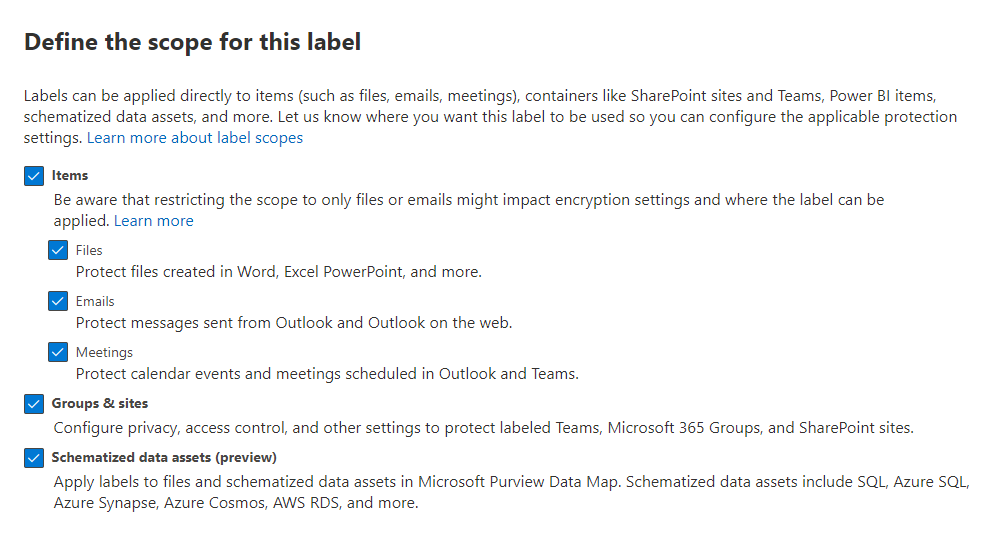

# Create and configure sensitivity labels and their policies

>*[Microsoft 365 licensing guidance for security & compliance](/office365/servicedescriptions/microsoft-365-service-descriptions/microsoft-365-tenantlevel-services-licensing-guidance/microsoft-365-security-compliance-licensing-guidance).*

All Microsoft Purview Information Protection solutions are implemented by using [sensitivity labels](sensitivity-labels.md). To create and publish these labels, go to the <a href="https://go.microsoft.com/fwlink/p/?linkid=2077149" target="_blank">Microsoft Purview compliance portal</a>.

First, create and configure the sensitivity labels that you want to make available for apps and other services. For example, the labels you want users to see and apply from Office apps.

Then, create one or more label policies that contain the labels and policy settings that you configure. It's the label policy that publishes the labels and settings for your chosen users and locations.

> [!TIP]
> If you don't yet have any sensitivity labels, you might be eligible for the automatic creation of default labels and a default label policy. Even if you have some labels, you might find it useful to see the configuration of these default labels that we're creating for new customers. For example, you can make the same manual configurations to help accelerate your own label deployment.
> 
> For more information, see [Default labels and policies for Microsoft Purview Information Protection](mip-easy-trials.md).

[!INCLUDE [purview-preview](../includes/purview-preview.md)]

## Before you begin

The global admin for your organization has full permissions to create and manage all aspects of sensitivity labels. If you aren't signing in as a global admin, see [Permissions required to create and manage sensitivity labels](get-started-with-sensitivity-labels.md#permissions-required-to-create-and-manage-sensitivity-labels).

## Create and configure sensitivity labels

1. From the [Microsoft Purview compliance portal](https://compliance.microsoft.com/), select **Solutions** > **Information protection** > **Labels**

2. On the **Labels** page, select **+ Create a label** to start the new sensitivity label configuration: 
    
    :::image type="content" source="../media/create-sensitivity-label-full.png" alt-text="Create a sensitivity label." lightbox="../media/create-sensitivity-label-full.png":::

    > [!NOTE]
    > By default, tenants don't have any labels and you must create them. The labels in the example picture show default labels that were [migrated from Azure Information Protection](/azure/information-protection/configure-policy-migrate-labels).

3. On the **Define the scope for this label** page, the options selected determine the label's scope for the settings that you can configure and where they will be visible when they're published:

    

    - If **Items** is selected, you can configure settings that apply to apps that support sensitivity labels, such as Office Word and Outlook. If this option isn't selected, you see the first page of these settings but you can't configure them and the labels won't be available for users to select in these apps.

    - If **Groups & sites** is selected, you can configure settings that apply to Microsoft 365 groups, and sites for Teams and SharePoint. If this option isn't selected, you see the first page of these settings but you can't configure them and the labels won't be available for users to select for groups and site.

    For information about the **Schematized data assets** scope, see [Automatically label your content in Microsoft Purview Data Map](/azure/purview/create-sensitivity-label).

4. Follow the configuration prompts for the label settings.

    For more information about the label settings, see [What sensitivity labels can do](sensitivity-labels.md#what-sensitivity-labels-can-do) from the overview information and use the help in the UI for individual settings.

5. Repeat these steps to create more labels. However, if you want to create a sublabel, first select the parent label and select **...** for **More actions**, and then select **Add sub label**.

6. When you've created all the labels you need, review their order and if necessary, move them up or down. To change the order of a label, select **...** for **More actions**, and then select **Move up** or **Move down**. For more information, see [Label priority (order matters)](sensitivity-labels.md#label-priority-order-matters) from the overview information.

To edit an existing label, select it, and then select the **Edit label** button:


This button starts the **Edit sensitivity label** configuration, which lets you change all the label settings in step 4.

Don't delete a label unless you understand the impact for users. For more information, see the [Removing and deleting labels](#removing-and-deleting-labels) section. 

> [!NOTE]
> If you edit a label that's already published by using a label policy, no extra steps are needed when you finish the configuration. For example, you don't need to add it to a new label policy for the changes to become available to the same users. However, allow up to 24 hours for the changes to replicate to all apps and services.

Until you publish your labels, they won't be available to select in apps or for services. To publish the labels, they must be [added to a label policy](#publish-sensitivity-labels-by-creating-a-label-policy).

> [!IMPORTANT]
> On this **Labels** tab, do not select the **Publish labels** tab (or the **Publish label** button when you edit a label) unless you need to create a new label policy. You need multiple label policies only if users need different labels or different policy settings. Aim to have as few label policies as possible—it's not uncommon to have just one label policy for the organization.

### Additional label settings with Security & Compliance PowerShell

Additional label settings are available with the [Set-Label](/powershell/module/exchange/set-label) cmdlet from [Security & Compliance PowerShell](/powershell/exchange/scc-powershell).

For example:

- Use the *LocaleSettings* parameter for multinational deployments so that users see the label name and tooltip in their local language. The [following section](#example-configuration-to-configure-a-sensitivity-label-for-different-languages) has an example configuration that specifies the label name and tooltip text for French, Italian, and German.

- Advanced settings supported by built-in labeling are included in the PowerShell documentation. For more help in specifying these PowerShell advanced settings, see the [PowerShell tips for specifying the advanced settings](#powershell-tips-for-specifying-the-advanced-settings) section. For additional advanced settings supported by the Azure Information Protection unified labeling client, see the [documentation from this client's admin guide](/azure/information-protection/rms-client/clientv2-admin-guide-customizations#available-advanced-settings-for-labels).

#### Example configuration to configure a sensitivity label for different languages

The following example shows the PowerShell configuration for a label named "Public" with placeholder text for the tooltip. In this example, the label name and tooltip text are configured for French, Italian, and German.

As a result of this configuration, users who have Office apps that use those display languages see their label names and tooltips in the same language. Similarly, if you have the Azure Information Protection unified labeling client installed to label files from File Explorer, users who have those language versions of Windows see their label names and tooltips in their local language when they use the right-click actions for labeling.

For the languages that you need to support, use the Office [language identifiers](/deployoffice/office2016/language-identifiers-and-optionstate-id-values-in-office-2016#language-identifiers) (also known as language tags), and specify your own translation for the label name and tooltip.

Before you run the commands in PowerShell, you must first [connect to Security & Compliance PowerShell](/powershell/exchange/connect-to-scc-powershell).

```powershell
$Languages = @("fr-fr","it-it","de-de")
$DisplayNames=@("Publique","Publico","Oeffentlich")
$Tooltips = @("Texte Français","Testo italiano","Deutscher text")
$label = "Public"
$DisplayNameLocaleSettings = [PSCustomObject]@{LocaleKey='DisplayName';
Settings=@(
@{key=$Languages[0];Value=$DisplayNames[0];}
@{key=$Languages[1];Value=$DisplayNames[1];}
@{key=$Languages[2];Value=$DisplayNames[2];})}
$TooltipLocaleSettings = [PSCustomObject]@{LocaleKey='Tooltip';
Settings=@(
@{key=$Languages[0];Value=$Tooltips[0];}
@{key=$Languages[1];Value=$Tooltips[1];}
@{key=$Languages[2];Value=$Tooltips[2];})}
Set-Label -Identity $Label -LocaleSettings (ConvertTo-Json $DisplayNameLocaleSettings -Depth 3 -Compress),(ConvertTo-Json $TooltipLocaleSettings -Depth 3 -Compress)
```

#### PowerShell tips for specifying the advanced settings

Although you can specify a sensitivity label by its name, we recommend using the label GUID to avoid potential confusion over specifying the label name or display name. The label name is unique in your tenant, so you can be sure you're configuring the correct label. The display name isn't unique and could result in configuring the wrong label. To find the GUID and confirm the label's scope:

````powershell
Get-Label | Format-Table -Property DisplayName, Name, Guid, ContentType
````

To remove an advanced setting from a sensitivity label, use the same AdvancedSettings parameter syntax, but specify a null string value. For example:

````powershell
Set-Label -Identity 8faca7b8-8d20-48a3-8ea2-0f96310a848e -AdvancedSettings @{DefaultSharingScope=""}
````

To check your label's configuration, including advanced settings, use the following syntax with your own label GUID:

```powershell
(Get-Label -Identity 8faca7b8-8d20-48a3-8ea2-0f96310a848e).settings
```

## Publish sensitivity labels by creating a label policy

1. From the [Microsoft Purview compliance portal](https://compliance.microsoft.com/), select **Solutions** > **Information protection** > **Label policies**

2. On the **Label policies** page, select **Publish label** to start the **Create policy** configuration:
    
   :::image type="content" source="../media/publish-sensitivity-labels-full.png" alt-text="Publish labels." lightbox="../media/publish-sensitivity-labels-full.png":::
    
    > [!NOTE]
    > By default, tenants don't have any label policies and you must create them. 

3. On the **Choose sensitivity labels to publish** page, select the **Choose sensitivity labels to publish** link. Select the labels that you want to make available in apps and to services, and then select **Add**.

    > [!IMPORTANT]
    > If you select a sublabel, make sure you also select its parent label.

4. Review the selected labels and to make any changes, select **Edit**. Otherwise, select **Next**.

5. Follow the prompts to configure the policy settings.

    The policy settings that you see match the scope of the labels that you selected. For example, if you selected labels that have just the **Items** scope, you don't see the policy settings **Apply this label by default to groups and sites** and **Require users to apply a label to their groups and sites**.

    For more information about these settings, see [What label policies can do](sensitivity-labels.md#what-label-policies-can-do) from the overview information and use the help in the UI for individual settings.

    For labels configured for **Microsoft Purview Data Map assets (preview)**: These labels don't have any associated policy settings.

6. Repeat these steps if you need different policy settings for different users or scopes. For example, you want additional labels for a group of users, or a different default label for a subset of users. Or, if you have configured labels to have different scopes.

7. If you create more than one label policy that might result in a conflict for a user, review the policy order and if necessary, move them up or down. To change the order of a label policy, select **...** for **More actions**, and then select **Move up** or **Move down**. For more information, see [Label policy priority (order matters)](sensitivity-labels.md#label-policy-priority-order-matters) from the overview information.

Completing the **Create policy** configuration automatically publishes the label policy. To make changes to a published policy, simply edit it. There's no specific publish or republish action for you to select.

To edit an existing label policy, select it, and then select the **Edit Policy** button: 


This button starts the **Create policy** configuration, which lets you edit which labels are included and the label settings. When you complete the configuration, any changes are automatically replicated to the selected users and services.

### Additional label policy settings with Security & Compliance PowerShell

Additional label policy settings are available with the [Set-LabelPolicy](/powershell/module/exchange/set-labelpolicy) cmdlet from [Security & Compliance PowerShell](/powershell/exchange/scc-powershell).

This documentation includes the advanced settings that are supported by built-in labeling. For additional advanced settings supported by the Azure Information Protection unified labeling client, see the [documentation from this client's admin guide](/azure/information-protection/rms-client/clientv2-admin-guide-customizations#available-advanced-settings-for-label-policies).

## When to expect new labels and changes to take effect

For labels and label policy settings, allow 24 hours for the changes to propagate through the services. There are many external dependencies that each have their own timing cycles, so it's a good idea to wait this 24-hour time period before you spend time troubleshooting labels and label policies for recent changes.

However, there are some scenarios where label and label policy changes can take effect much faster or be longer than 24 hours. For example, for new and deleted sensitivity labels for Word, Excel, and PowerPoint on the web, you might see updates replicate within the hour. But for configurations that depend on populating a new group and group membership changes, or network replication latency and bandwidth restrictions, these changes might take 24-48 hours.

## Use PowerShell for sensitivity labels and their policies

You can now use [Security & Compliance PowerShell](/powershell/exchange/scc-powershell) to create and configure all the settings you see in your labeling admin center. This means that in addition to using PowerShell for settings that aren't available in the labeling admin centers, you can now fully script the creation and maintenance of sensitivity labels and sensitivity label policies. 

See the following documentation for supported parameters and values:

- [New-Label](/powershell/module/exchange/new-label)
- [New-LabelPolicy](/powershell/module/exchange/new-labelpolicy)
- [Set-Label](/powershell/module/exchange/set-label)
- [Set-LabelPolicy](/powershell/module/exchange/set-labelpolicy)

> [!TIP]
> When you're configuring advanced settings for a sensitivity label, you might find it helpful to reference the [PowerShell tips for specifying the advanced settings](#powershell-tips-for-specifying-the-advanced-settings) section on this page.

You can also use [Remove-Label](/powershell/module/exchange/remove-label) and [Remove-LabelPolicy](/powershell/module/exchange/remove-labelpolicy) if you need to script the deletion of sensitivity labels or sensitivity label policies. However, before you delete sensitivity labels, make sure you read the next section.

## Removing and deleting labels

In a production environment, it's unlikely that you will need to remove sensitivity labels from a label policy, or delete sensitivity labels. It's more likely that you might need to do one or either of these actions during an initial testing phase. Make sure you understand what happens when you do either of these actions.

Removing a label from a label policy is less risky than deleting it, and can always be added back later if needed. You won't be able to delete a label if it's still in a label policy.

When you remove a label from a label policy so that the label is no longer published to the originally specified users, the next time the label policy is refreshed, users no longer see that label to select in their Office apps. If that label is already applied, the label isn't removed from the content or container. For example, users who are using built-in labeling in desktop apps for Word, Excel, and PowerPoint, still see the applied label name on the status bar. An applied container label continues to protect the Teams or SharePoint site.

In comparison, when you delete a label:

- If the label applied encryption, the underlying protection template is archived so that previously protected content can still be opened. Because of this archived protection template, you won't be able to create a new label with the same name. Although it's possible to delete a protection template by using [PowerShell](/powershell/module/aipservice/remove-aipservicetemplate), don't do this unless you're sure you don't need to open content that was encrypted with the archived template.

- For documents stored in SharePoint or OneDrive and you've [enabled sensitivity labels for Office files](sensitivity-labels-sharepoint-onedrive-files.md): When you open the document in Office for the web, you won't see the label applied in the app, and the label name no longer displays in the **Sensitivity** column in SharePoint. If the deleted label applied encryption and the services can process the encrypted contents, the encryption is removed. Egress actions from these services result in the same outcome. For example, download, copy to, move to, and open with an Office desktop or mobile app. Although the label information remains in the file's metadata, apps can no longer map the label ID to a display name, so users will assume a file isn't labeled.

- For documents stored outside SharePoint and OneDrive or you haven't enabled sensitivity labels for Office files, and for emails: When you open the content, the label information in the metadata remains, but without the label ID to name mapping, users don't see the applied label name displayed (for example, on the status bar for desktop apps). If the deleted label applied encryption, the encryption remains and users still see the name and description of the now archived protection template.

- For containers, such as sites in SharePoint and Teams: The label is removed and any settings that were configured with that label are no longer enforced. This action typically takes between 48-72 hours for SharePoint sites, and can be quicker for Teams and Microsoft 365 Groups.

As with all label changes, removing a sensitivity label from a label policy or deleting a sensitivity label takes time to replicate to all users and services.

## Next steps

To configure and use your sensitivity labels for specific scenarios, use the following articles:

- [Restrict access to content by using encryption in sensitivity labels](encryption-sensitivity-labels.md)

- [Apply a sensitivity label to content automatically](apply-sensitivity-label-automatically.md)

- [Use sensitivity labels with teams, groups, and sites](sensitivity-labels-teams-groups-sites.md)

- [Enable sensitivity labels for Office files in SharePoint and OneDrive](sensitivity-labels-sharepoint-onedrive-files.md)

To monitor how your labels are being used, see [Get started with data classification](data-classification-overview.md).
