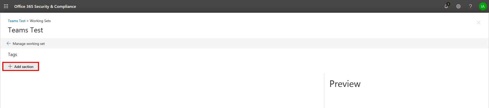

# Create tag groups

Before you or other people can tag documents in a review set, the tags must be created. You can do this by creating tag groups that contain child tags. Tags are displayed in the tagging panel when reviewing documents in a review set.

To create a tag group:

1.  In a review set, click **Manage review set**.

    

2.  In the **Tags** tile, click **Manage tags**.

    

Once inside the tag management, tags can be created to meet the requirements of your case. You can start by creating a tag group.

1.  Click **Add section**.

    

    The preview screen will update when you save so you can preview the tag panel without having to close the tag management screen and go back to the working set.

2. Enter a title and optional description. 

3. To create a tag within that group, click the ellipses on the new tag group to create tags in that new section.
    
    

   - **Option tags** will force users to select one tag from a group of tags.
   
   - **Check box tags** will allow users to select any combination of tags. |

## Nested tags

To nest tags, click the ellipses next to a tag and then select a new tag to add.

