# Create, test, and tune a DLP policy

Data loss prevention (DLP) helps you prevent the unintentional or accidental sharing of sensitive information.

DLP examines email messages and files for sensitive information, like a credit card number. Using DLP you can detect sensitive information, and take action such as:

- Log the event for auditing purposes
- Display a warning to the end user who is sending the email or sharing the file
- Actively block the email or file sharing from taking place

## Permissions

Members of your compliance team who will create DLP policies need permissions to the Compliance Center. By default, your tenant admin will have access can give compliance officers and other people access. Follow these steps:
  
1. Create a group in Microsoft 365 and add compliance officers to it.
    
2. Create a role group on the **Permissions** page of the Security &amp; Compliance Center. 

3. While creating the role group, use the **Choose Roles** section to add the following role to the role group: **DLP Compliance Management**.
    
4. Use the **Choose Members** section to add the Microsoft 365 group you created before to the role group.

Use the **View-Only DLP Compliance Management** role to create role group with view-only privileges to the DLP policies and DLP reports.

For more information, see [Give users access to the Office 365 Compliance Center](../security/office-365-security/grant-access-to-the-security-and-compliance-center.md).
  
These permissions are required to create and apply a DLP policy not to enforce policies.

## How sensitive information is detected by DLP

DLP finds sensitive information by regular expression (RegEx) pattern matching, in combination with other indicators such as the proximity of certain keywords to the matching patterns. For example, a VISA credit card number has 16 digits. But, those digits can be written in different ways, such as 1111-1111-1111-1111, 1111 1111 1111 1111, or 1111111111111111.

Any 16-digit string is not necessarily a credit card number, it could be a ticket number from a help desk system, or a serial number of a piece of hardware. To tell the difference between a credit card number and a harmless 16-digit string, a calculation is performed (checksum) to confirm that the numbers match a known pattern from the various credit card brands.

If DLP finds keywords such as "VISA" or "AMEX", near date values that might be the credit card expiry date, DLP also uses that data to help it decide whether the string is a credit card number or not.

In other words, DLP is smart enough to recognize the difference between these two strings of text in an email:

- "Can you order me a new laptop. Use my VISA number 1111-1111-1111-1111, expiry 11/22, and send me the estimated delivery date when you have it."
- "My laptop serial number is 2222-2222-2222-2222 and it was purchased on 11/2010. By the way, is my travel visa approved yet?"

See [Sensitive information type entity definitions](sensitive-information-type-entity-definitions.md) that explains how each information type is detected.

## Where to start with data loss prevention

When the risks of data leakage aren't entirely obvious, it's difficult to work out where exactly you should start with implementing DLP. Fortunately, DLP policies can be run in "test mode", allowing you to gauge their effectiveness and accuracy before you turn them on.

DLP policies for Exchange Online can be managed through the Exchange admin center. But you can configure DLP policies for all workloads through the Security & Compliance Center, so that's what I'll use for demonstrations in this article. In the Security & Compliance Center, you'll find the DLP policies under **Data loss prevention** > **Policy**. Choose **Create a policy** to start.

Microsoft 365 provides a range of [DLP policy templates](what-the-dlp-policy-templates-include.md) you can use to create policies. Let's say that you're an Australian business. You can filter the templates on Australia, and choose Financial, Medical and Health, and Privacy.

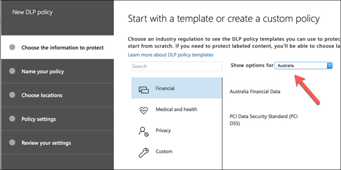

For this demonstration I'll choose Australian Personally Identifiable Information (PII) Data, which includes the information types of Australian Tax File Number (TFN) and Driver's License Number.

Give your new DLP policy a name. The default name will match the DLP policy template, but you should choose a more descriptive name of your own, because multiple policies can be created from the same template.

Choose the locations that the policy will apply to. DLP policies can apply to Exchange Online, SharePoint Online, and OneDrive for Business. I am going to leave this policy configured to apply to all locations.

At the first **Policy Settings** step, just accept the defaults for now. You can customize DLP policies, but the defaults are a fine place to start.

After clicking Next,** you'll be presented with an more **Policy Settings** page with more customization options. For a policy that you are just testing, here's where you can start to make some adjustments.

- I've turned off policy tips for now, which is a reasonable step to take if you're just testing things out and don't want to display anything to users yet. Policy tips display warnings to users that they're about to violate a DLP policy. For example, an Outlook user will see a warning that the file they've attached contains credit card numbers and will cause their email to be rejected. The goal of policy tips is to stop the non-compliant behavior before it happens.
- I've also decreased the number of instances from 10 to 1, so that this policy will detect any sharing of Australian PII data, not just bulk sharing of the data.
- I've also added another recipient to the incident report email.

Finally, I've configured this policy to run in test mode initially. Notice there's also an option here to disable policy tips while in test mode. This gives you the flexibility to have policy tips enabled in the policy, but then decide whether to show or suppress them during your testing.

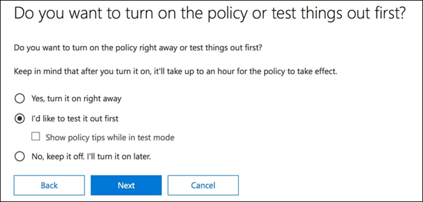

On the final review screen, click **Create** to finish creating the policy.

## Test a DLP policy

Your new DLP policy will begin to take effect within about 1 hour. You can sit and wait for it to be triggered by normal user activity, or you can try to trigger it yourself. Earlier I linked to [Sensitive information type entity definitions](sensitive-information-type-entity-definitions.md), which provides you with information about how to trigger DLP matches.

As an example, the DLP policy I created for this article will detect Australian tax file numbers (TFN). According to the documentation, the match is based on the following criteria.

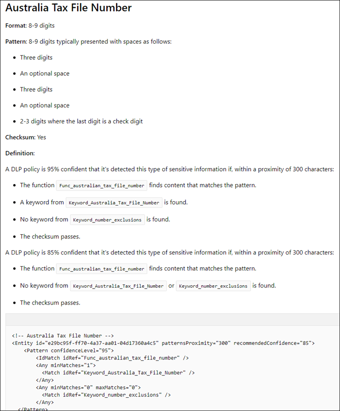
 
To demonstrate TFN detection in a rather blunt manner, an email with the words "Tax file number" and a nine digit string in close proximity will sail through without any issues. The reason it does not trigger the DLP policy is that the nine digit string must pass the checksum that indicates it is a valid TFN and not just a harmless string of numbers.

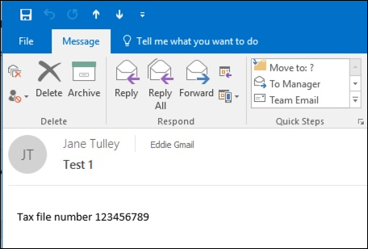

In comparison, an email with the words "Tax file number" and a valid TFN that passes the checksum will trigger the policy. For the record here, the TFN I'm using was taken from a website that generates valid, but not genuine, TFNs. Such sites are useful because one of the most common mistakes when testing a DLP policy is using a fake number that's not valid and won't pass the checksum (and therefore won't trigger the policy).

The incident report email includes the type of sensitive information that was detected, how many instances were detected, and the confidence level of the detection.

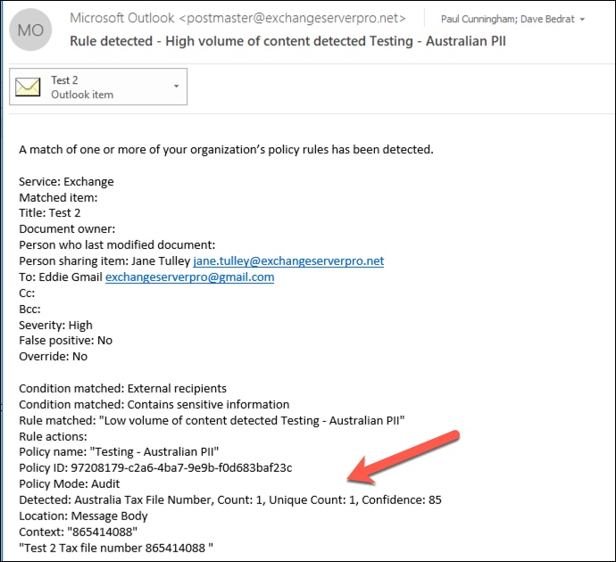

If you leave your DLP policy in test mode and analyze the incident report emails, you can start to get a feel for the accuracy of the DLP policy and how effective it will be when it is enforced. In addition to the incident reports, you can [use the DLP reports](view-the-dlp-reports.md) to see an aggregated view of policy matches across your tenant.

## Tune a DLP policy

As you analyze your policy hits, you might want to make some adjustments to how the policies behave. As a simple example, you might determine that one TFN in an email is not a problem (I think it still is, but let's go with it for the sake of demonstration), but two or more instances are a problem. Multiple instances could be a risky scenario such as an employee emailing a CSV export from the HR database to an external party, for example an external accounting service. Definitely something you would prefer to detect and block.

In the Compliance Center you can edit an existing policy to adjust the behavior.

 
You can adjust the location settings so that the policy is applied only to specific workloads, or to specific sites and accounts.

You can also adjust the policy settings and edit the rules to better suit your needs.

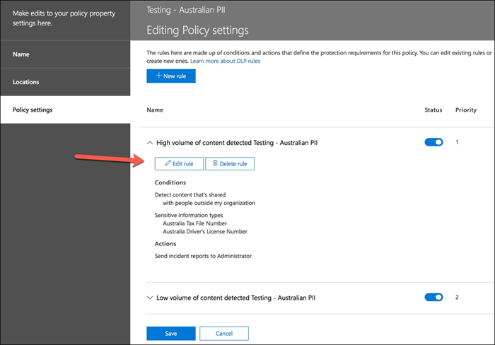

When editing a rule within a DLP policy, you can change:

- The conditions, including the type and number of instances of sensitive data that will trigger the rule.
- The actions that are taken, such as restricting access to the content.
- User notifications, which are policy tips that are displayed to the user in their email client or web browser.
- User overrides determines whether users can choose to proceed with their email or file sharing anyway.
- Incident reports, to notify administrators.

For this demonstration I've added user notifications to the policy (be careful of doing this without adequate user awareness training), and allowed users to override the policy with a business justification or by flagging it as a false positive. You can also customize the email and policy tip text if you want to include any additional information about your organization's policies, or prompt users to contact support if they have questions.

The policy contains two rules for handling of high volume and low volume, so be sure to edit both with the actions that you want. This is an opportunity to treat cases differently depending on their characteristics. For example, you might allow overrides for low volume violations, but not allow overrides for high volume violations.

Also, if you want to actually block or restrict access to content that is in violation of policy, you need to configure an action on the rule to do so.

After saving those changes to the policy settings, I also need to return to the main settings page for the policy and enable the option to show policy tips to users while the policy is in test mode. This is an effective way to introduce DLP policies to your end users, and do user awareness training, without risking too many false positives that impact their productivity.

On the server side (or cloud side if you prefer), the change may not take effect immediately, due to various processing intervals. If you're making a DLP policy change that will display new policy tips to a user, the user may not see the changes take effect immediately in their Outlook client, which checks for policy changes every 24 hours. If you want to speed things up for testing, you can use this registry fix to [clear the last download time stamp from the PolicyNudges key](https://support.microsoft.com/en-au/help/2823261/changes-to-a-data-loss-prevention-policy-don-t-take-effect-in-outlook?__hstc=18650278.46377037dc0a82baa8a30f0ef07a7b2f.1538687978676.1538693509953.1540315763430.3&__hssc=18650278.1.1540315763430&__hsfp=3446956451). Outlook will download the latest policy information the next time you restart it and begin composing an email message.

If you have policy tips enabled, the user will begin to see the tips in Outlook, and can report false positives to you when they occur.

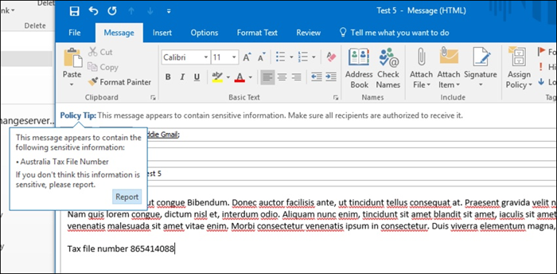

## Investigate false positives

DLP policy templates are not perfect straight out of the box. It's likely that you'll find some false positives occurring in your environment, which is why it's so important to ease your way into a DLP deployment, taking the time to adequately test and tune your policies.

Here's an example of a false positive. This email is quite harmless. The user is providing their mobile phone number to someone, and including their email signature.

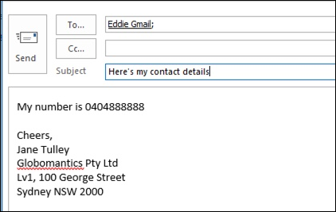
 
But the user sees a policy tip warning them that the email contains sensitive information, specifically, an Australian driver's license number.

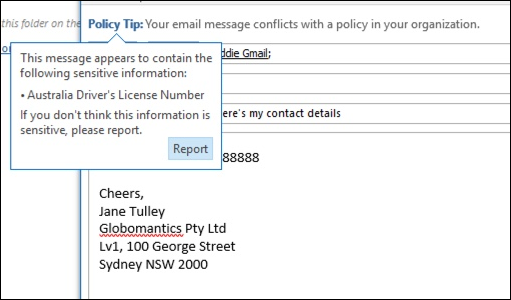

The user can report the false positive, and the administrator can look into why it has occurred. In the incident report email, the email is flagged as a false positive.

This driver's license case is a good example to dig into. The reason this false positive has occurred is that the "Australian Driver's License" type will be triggered by any 9-digit string (even one that is part of a 10-digit string), within 300 characters proximity to the keywords "Sydney nsw" (not case sensitive). So it's triggered by the phone number and email signature, only because the user happens to be in Sydney.

One option is to remove the Australian driver's license information type from the policy. It's in there because it's part of the DLP policy template, but we're not forced to use it. If you're only interested in Tax File Numbers and not driver's licenses, you can just remove it. For example, you can remove it from the low volume rule in the policy, but leave it in the high volume rule so that lists of multiple drivers licenses are still detected.
 
Another option is to increase the instance count, so that a low volume of driver's licenses is only detected when there are multiple instances.

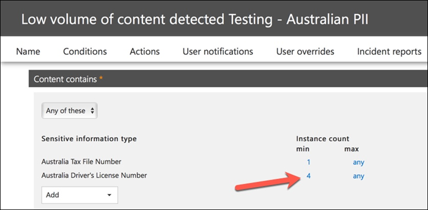

In addition to changing the instance count, you can also adjust the match accuracy (or confidence level). If your sensitive information type has multiple patterns, you can adjust the match accuracy in your rule, so that your rule matches only specific patterns. For example, to help reduce false positives, you can set the match accuracy of your rule so that it matches only the pattern with the highest confidence level. For more information on confidence levels, see [How to use confidence level to tune your rules](data-loss-prevention-policies.md#match-accuracy).

Finally, if you want to get even a bit more advanced, you can customize any sensitive information type -- for example, you can remove "Sydney NSW" from the list of keywords for [Australia driver's license number](sensitive-information-type-entity-definitions.md#australia-drivers-license-number), to eliminate the false positive triggered above. To learn how to do this by using XML and PowerShell, see [customizing a built-in sensitive information type](customize-a-built-in-sensitive-information-type.md).

## Turn on a DLP policy

When you're happy that your DLP policy is accurately and effectively detecting sensitive information types, and that your end users are ready to deal with the policies being in place, then you can enable the policy.

 
If you're waiting to see when the policy will take effect, [Connect to Security & Compliance Center PowerShell](/powershell/exchange/connect-to-scc-powershell) and run the [Get-DlpCompliancePolicy cmdlet](/powershell/module/exchange/get-dlpcompliancepolicy) to see the DistributionStatus.

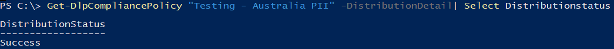

After turning on the DLP policy, you should run some final tests of your own to make sure that the expected policy actions are occurring. If you're trying to test things like credit card data, there are websites online with information on how to generate sample credit card or other personal information that will pass checksums and trigger your policies.

Policies that allow user overrides will present that option to the user as part of the policy tip.

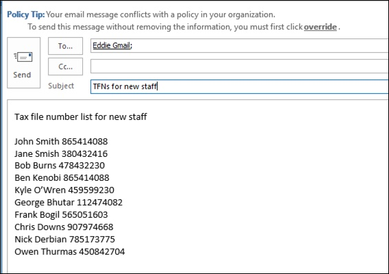

Policies that restrict content will present the warning to the user as part of the policy tip, and prevent them from sending the email.

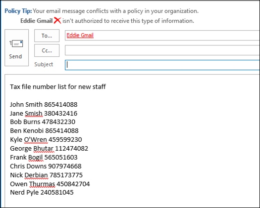

## Summary

Data loss prevention policies are useful for organizations of all types. Testing some DLP policies is a low risk exercise due to the control you have over things like policy tips, end-user overrides, and incident reports. You can quietly test some DLP policies to see what type of violations are already occurring in your organization, and then craft policies with low false positive rates, educate your users on what is allowed and not allowed, and then roll out your DLP policies to the organization.