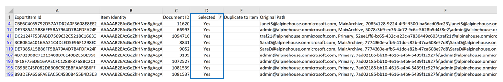
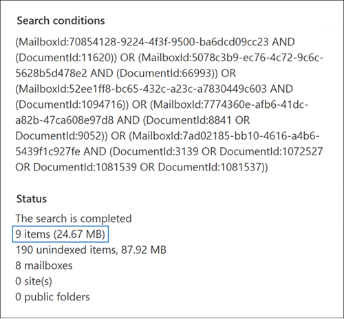

# Prepare a CSV file for an ID list Content search

You can search for specific mailbox email messages and other mailbox items using a list of Exchange IDs. To create an ID list search, you submit a comma-separated value (CSV) file that identifies the specific mailbox items to search for. For this CSV file, you use the **Results.csv** file or the **Unindexed Items.csv** file that are included when you export the Content search results or export a Content search report from an existing Content search. Then you edit one of these files to indicate the specific items to search for, create a new ID list search, and submit the CSV file.

**Why create an ID list search?** If you're unable to determine if an item is responsive to an eDiscovery request based on the metadata in the **Results.csv** or **Unindexed Items.csv** files, you can use an ID list search to find, preview, and then export that item to determine if it's responsive to the case you're investigating. ID list searches are typically used to search for and return a specific set of unindexed items.

Here's a quick overview of the process for creating an ID list search.

1. Create and run a new search in the Microsoft 365 compliance center.

2. Export the content search results or the content search report. For more information, see:

    - [Export Content search results](export-search-results.md)

    - [Export a Content search report](export-a-content-search-report.md)

3. Edit the **Results.csv** file or **Unindexed Items.csv** file and identify the specific mailbox items to include in the ID list search. See the [instructions](#prepare-the-csv-file-for-an-id-list-search) for preparing a CSV file for an ID list search.

4. Create a new ID list search (see the [instructions](#create-an-id-list-search)) and submit the CSV file that you prepared. The search query that's created will only search for the items selected in the CSV file.

> [!NOTE]
> ID list searches are only supported for mailbox items. You can't search for SharePoint and OneDrive documents in an ID list search.

## Prepare the CSV file for an ID list search

After you export the search results or report for a search, perform the following steps to prepare the CSV file for an ID list search. This CSV file identifies every item in the ID list search.

You can use a CSV file from a search that included SharePoint sites and OneDrive accounts, but you can only select mailbox items for an ID list search. If you select a document in SharePoint or OneDrive, the CSV file will fail validation when you create an ID list search.

1. Open the **Results.csv** or **Unindexed Items.csv** file in Excel.

2. In the **Selected** column, type **Yes** in the cell that corresponds to the item that you want to search for. Repeat this step for every item that you want to search for.

    > [!IMPORTANT]
    > When you open the CSV file in Excel, the data format for the **Document ID** column may have been changed to **General**. This results in displaying the document ID for an item in scientific notation. For example, the document ID of "481037338205" is displayed as "4.81037E+11". If this happens, you have to perform the next steps to change the data format of the **Document ID** column to **Number** to restore the correct format for the document ID. If you don't do this, the ID list search that uses the CSV file will fail.

3. Right-click the entire **Document ID** column and select **Format Cells**.

4. In the **Category** box, click **Number**.

5. Change the number of decimal places to **0**, and then click **OK** to save your changes. Notice that the values in the Document ID column are changed to numbers.

    Here's an example of a CSV file that's ready to be submitted for an ID list content search.

    

6. Save the CSV file or use **Save As** to the save the file with different file name. In both cases, be sure to save the file with the CSV format.

## Create an ID list search

The next step is to create a new ID list search and submit the CSV file that you prepared in the previous step.

> [!IMPORTANT]
> You should create an ID list search no more than 2 days after exporting the search results or report. If the search results or report where exported more than 2 days ago, you should re-export the search results or report to generate updated CSV files. Then you can prepare one of the updated CSV files and use it to create an ID list search.

1. Go to <https://compliance.microsoft.com> and sign in.

2. In the left navigation pane of the Microsoft 365 compliance center, click **Show all**, and then click **Content search**.

3. On the **Content search** page, click **Search by ID List**.

4. On the **Search by ID List** flyout, name the search (and optionally describe it) and then click **Browse** and select the CSV file that you prepared in the previous step.

    Microsoft 365 attempts to validate the CSV file. If the validation is unsuccessful, an error message is displayed that might help you troubleshoot the validation errors. The CSV file has to be successfully validated to create an ID list search.

5. After the CSV file is successfully validated, click **Search** to create the ID list search.

    Here's an example of the flyout page from an ID list search that shows the query that's generated and the estimated number of search results.

    

    The number of estimated items displayed in statistics for the ID search should match the number of items that you selected in the CSV file.

6. Preview or export the items returned by the ID list search.

## More information

If you move a mailbox after creating an ID list search, the query for the search won't return the specified items. That's because the **DocumentId** property for mailbox items is changed when a mailbox is moved. In the rare instance when a mailbox is moved after you create an ID list search, you should create a new Content search (or update the search results for an existing search) and then export the search results or report to generate updated CSV files that can be used to create a new ID list search.
