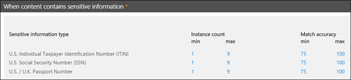

# Custom sensitive information types

Microsoft 365 includes many built-in sensitive information types that are ready for you to use in your organization, such as for [data loss prevention](data-loss-prevention-policies.md) (DLP), or with [Microsoft Cloud App Security](https://docs.microsoft.com/cloud-app-security). Built-in sensitive information types can help identify and protect credit card numbers, bank account numbers, passport numbers, and more, based on patterns that are defined by a regular expression (regex) or a function. To learn more, see [What the sensitive information types look for](what-the-sensitive-information-types-look-for.md).

But what if you need to identify and protect a different type of sensitive information, such as for employee IDs or project numbers, using a format that's specific to your organization? To do this, you can create a custom sensitive information type.

The fundamental parts of a custom sensitive information type are:

- **Primary pattern**: employee ID numbers, project numbers, etc. This is typically identified by a regular expression (RegEx), but it can also be a list of keywords.

- **Additional evidence**: Suppose you're looking for a nine-digit employee ID number. Not all nine-digit numbers are employee ID numbers, so you can look for additional text: keywords like "employee", "badge", "ID", or other text patterns based on additional regular expressions. This supporting evidence (also known as _supporting_ or _corroborative_ evidence) increases the likelihood that nine-digit number found in content is really an employee ID number.

- **Character proximity**: It makes sense that the closer the primary pattern and the supporting evidence are to each other, the more likely the detected content is going to be what you're looking for. You can specify the character distance between the primary pattern and the supporting evidence (also known as the _proximity window_) as shown in the following diagram:

    

- **Confidence level**: The more supporting evidence you have, the higher the likelihood that a match contains the sensitive information you're looking for. You can assign higher levels of confidence for matches that are detected by using more evidence.

  When satisfied, a pattern returns a count and confidence level, which you can use in the conditions in your DLP policies. When you add a condition for detecting a sensitive information type to a DLP policy, you can edit the count and confidence level as shown in the following diagram:

    

## Creating custom sensitive information types

To create custom sensitive information types in the Security & Compliance Center, you can choose from several options:

- **Use EDM** You can set up custom sensitive information types using Exact Data Match (EDM)-based classification. This method enables you to create a dynamic sensitive information type using a secure database that you can refresh periodically. See [Create a custom sensitive information type with Exact Data Match based classification](create-custom-sensitive-information-types-with-exact-data-match-based-classification.md).

- **Use PowerShell** You can set up custom sensitive information types using PowerShell. Although this method is more complex than using the UI, you have more configuration options. See [Create a custom sensitive information type in Security & Compliance Center PowerShell](create-a-custom-sensitive-information-type-in-scc-powershell.md).

- **Use the UI** You can set up a custom sensitive information type using the Security & Compliance Center UI. With this method, you can use regular expressions, keywords, and keyword dictionaries. To learn more, see [Create a custom sensitive information type](create-a-custom-sensitive-information-type.md).

> [!NOTE]
> Microsoft 365 Information Protection now  supports in preview double byte character set languages for:
> - Chinese (simplified)
> - Chinese (traditional)
> - Korean
> - Japanese

>This support is available for sensitive information types. See, [Information protection support for double byte character sets release notes (preview)](mip-dbcs-relnotes.md) for more information.

