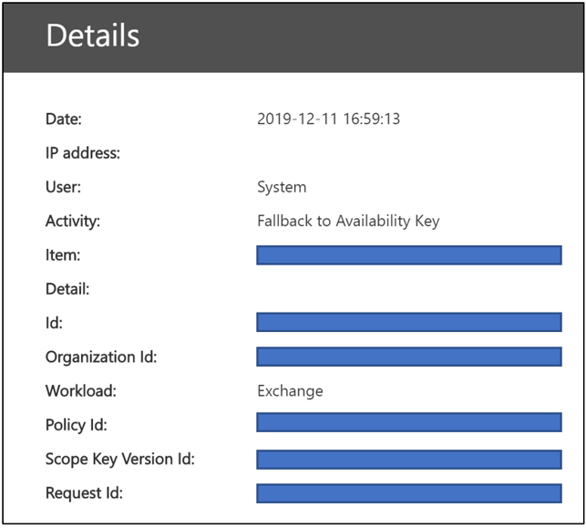

# Learn about the availability key for Customer Key

The availability key is a root key automatically generated and provisioned when you create a data encryption policy. Microsoft 365 stores and protects the availability key. The availability key is functionally like the two root keys that you supply for service encryption with Customer Key. The availability key wraps the keys one tier lower in the key hierarchy. Unlike the keys that you provide and manage in Azure Key Vault, you can't directly access the availability key. Microsoft 365 automated services manage the availability key programatically. These services initiate automated operations that never involve direct access to the availability key.

The primary purpose of the availability key is to provide recovery capability from the unanticipated loss of root keys that you manage. Loss could be a result of mismanagement or malicious action. If you lose control of your root keys, contact Microsoft Support and Microsoft will assist you through the process of recovery using the availability key. You'll use the availability key to migrate to a new Data Encryption Policy with new root keys you provision.

Storage and control of the availability key are deliberately different from Azure Key Vault keys for three reasons:

- The availability key provides a recovery, "break-glass" capability if control over both Azure Key Vault keys is lost.
- The separation of logical controls and secure storage locations provides defense-in-depth and protects against the loss of all keys, and your data, from a single attack or point of failure.
- The availability key provides a high-availability capability if Microsoft 365 services are unable to reach keys hosted in Azure Key Vault due to transient errors. This rule only applies to Exchange Online and Skype for Business service encryption. SharePoint Online, OneDrive for Business, and Teams files never use the availability key unless you explicitly instruct Microsoft to initiate the recovery process.

Sharing the responsibility to protect your data, using a variety of protections and processes for key management, ultimately reduces the risk that all keys (and therefore your data) will be permanently lost or destroyed. Microsoft provides you with sole authority over the disablement or destruction of the availability key when you leave the service. By design, no one at Microsoft has access to the availability key: it is only accessible by Microsoft 365 service code.

See the [Microsoft Trust Center](https://www.microsoft.com/trustcenter/Privacy/govt-requests-for-data) for more information about how we secure keys.
  
## Availability key uses

The availability key provides recovery capability for scenarios in which an external malefactor or malicious insider steals control of your key vault, or when inadvertent mismanagement results in loss of root keys. This recovery capability applies to all Microsoft 365 services compatible with Customer Key. Individual services use the availability key differently. Microsoft 365 only uses the availability key in the ways described below.

### Exchange Online and Skype for Business uses

In addition to the recovery capability, Exchange Online and Skype for Business use the availability key to ensure data availability during transient, or intermittent operational issues, related to the service accessing root keys. When the service cannot reach either of your Customer Keys in Azure Key Vault due to transient errors, the service automatically uses the availability key. The service NEVER goes directly to the availability key.

Automated systems in Exchange Online and Skype for Business may use the availability key during transient errors to support automated back-end services such as anti-virus, e-discovery, data loss prevention, mailbox moves, and data indexing.

### SharePoint Online, OneDrive for Business, and Teams files uses

For SharePoint Online, OneDrive for Business, and Teams files, the availability key is NEVER used outside of the recovery capability and customers must explicitly instruct Microsoft to initiate use of the availability key during a recovery scenario. Automated service operations solely rely on your Customer Keys in Azure Key vault. For in-depth information about how the key hierarchy works for these services, see [How SharePoint Online, OneDrive for Business, and Teams files use the availability key](#how-sharepoint-online-onedrive-for-business-and-teams-files-use-the-availability-key).

## Availability key security

Microsoft shares the responsibility of data protection with you by instantiating the availability key and taking extensive measures to protect it. Microsoft does not expose direct control of the availability key to customers. For example, you can only roll (rotate) the keys that you own in Azure Key Vault. For more information, see [Roll or rotate a customer key or an availability key](customer-key-availability-key-roll.md).

### Availability key secret stores

Microsoft protects availability keys in access-controlled, internal secret stores like the customer-facing Azure Key Vault. We implement access controls to prevent Microsoft administrators from directly accessing the secrets contained within. Secret Store operations, including key rotation and deletion, occur through automated commands that never involve direct access to the availability key. Secret store management operations are limited to specific engineers and require privilege escalation through an internal tool, Lockbox. Privilege escalation requires manager approval and justification prior to being granted. Lockbox ensures access is time bound with automatic access revocation upon time expiration or engineer log out.

**Exchange Online and Skype for Business** availability keys are stored in an Exchange Online Active Directory secret store. Availability keys are securely stored inside tenant specific containers within the Active Directory Domain Controller. This secure storage location is separate and isolated from the SharePoint Online, OneDrive for Business, and Teams files secret store.

**SharePoint Online, OneDrive for Business, and Teams files** availability keys are stored in an internal secret store managed by the service team. This secured, secrets storage service has front-end servers with application endpoints and a SQL Database as the back end. Availability keys are stored in the SQL Database and are wrapped (encrypted) by secret store encryption keys that use a combination of AES-256 and HMAC to encrypt the availability key at rest. The secret store encryption keys are stored in a logically isolated component of the same SQL Database and are further encrypted with RSA-2048 keys contained in certificates managed by the Microsoft certificate authority (CA). These certificates are stored in the secret store front-end servers that perform operations against the database.

### Defense-in-depth

Microsoft employs a defense-in-depth strategy to prevent malicious actors from impacting the confidentiality, integrity, or availability of customer data stored in the Microsoft Cloud. Specific preventive and detective controls are implemented to protect the secret store and the availability key as part of the overarching security strategy.

Microsoft 365 is built to prevent misuse of the availability key. The application layer is the only method through which keys, including the availability key, can be used to encrypt and decrypt data. Only Microsoft 365 service code has the ability to interpret and traverse the key hierarchy for encryption and decryption activities. Logical isolation exists between the storage locations of Customer Keys, availability keys, other hierarchical keys, and customer data. This isolation mitigates the risk of data exposure in the event one or more locations are compromised. Each layer in the hierarchy has built in 24x7 intrusion detection capabilities to protect data and secrets stored.

Access controls are implemented to prevent unauthorized access to internal systems, including availability key secret stores. Microsoft engineers don't have direct access to the availability key secret stores. For additional detail on access controls, review [Administrative Access Controls in Microsoft 365](/Office365/securitycompliance/office-365-administrative-access-controls-overview).

Technical controls prevent Microsoft personnel from logging into highly-privileged service accounts, which might otherwise be used by attackers to impersonate Microsoft services. For example, these controls prevent interactive logon.

Security logging and monitoring controls are another defense-in-depth safeguard implemented that mitigate risk to Microsoft services and your data. Microsoft service teams have deployed active monitoring solutions that generate alerts and audit logs. All service teams upload their logs to a central repository where the logs are aggregated and processed. Internal tools automatically examine records to confirm that services are functioning in an optimal, resilient, and secure state. Unusual activity is flagged for further review.

Any log event that indicates a potential violation of the Microsoft Security Policy is immediately brought to the attention of Microsoft security teams. Microsoft 365 security has configured alerts to detect attempted access to availability key secret stores. Alerts are also generated if Microsoft personnel attempt interactive logon to service accounts, which is prohibited and protected by access controls. Microsoft 365 security also detects and alerts upon deviations of the Microsoft 365 service from normal baseline operations. Malefactors attempting to misuse Microsoft 365 services would trigger alerts resulting in the offender's eviction from the Microsoft cloud environment.

## Use the availability key to recover from key loss

If you lose control of your Customer Keys, the availability key provides you the ability to recover and re-encrypt your data.

### Recovery procedure for Exchange Online and Skype for Business

If you lose control of your Customer Keys, the availability key gives you the capability to recover your data and bring your impacted Microsoft 365 resources back online. The availability key continues to protect your data while you recover.At a high level, to fully recover from key loss, you'll need to create a new DEP and move impacted resources to the new policy.

To encrypt your data with new Customer Keys, create new keys in Azure Key Vault, create a new DEP using the new Customer Keys, then assign the new DEP to the mailboxes currently encrypted with the previous DEP for which the keys were lost or compromised.

This re-encryption process can take up to 72 hours. This is the standard duration when you change a DEP.
  
### Recovery procedure for SharePoint Online, OneDrive for Business, and Teams files

For SharePoint Online, OneDrive for Business, and Teams files, the availability key is NEVER used outside of the recovery capability. You must explicitly instruct Microsoft to initiate use of the availability key during a recovery scenario. To initiate the recovery process, contact Microsoft to activate the availability key. Once activated, the availability key is automatically used to decrypt your data allowing you to encrypt the data with a newly-created DEP associated to new Customer Keys.  

This operation is proportional to the number of sites in your organization. Once you call Microsoft to use the availability key, you should be fully online within about four hours.

## How Exchange Online and Skype for Business use the availability key

When you create a DEP with Customer Key, Microsoft 365 generates a Data Encryption Policy Key (DEP Key) associated with that DEP. The service encrypts the DEP Key three times: once with each of the customer keys and once with the availability key. Only the encrypted versions of the DEP Key are stored, and a DEP Key can only be decrypted with the customer keys or the availability key. The DEP Key is then used to encrypt Mailbox Keys, which encrypt individual mailboxes.
  
Microsoft 365 follows this process to decrypt and provide data when customers are using the service:
  
1. Decrypt the DEP Key using the Customer Key.

2. Use the decrypted DEP Key to decrypt a Mailbox Key.

3. Use the decrypted Mailbox Key to decrypt the mailbox itself, allowing you to access the data within the mailbox.

## How SharePoint Online, OneDrive for Business, and Teams files use the availability key

The SharePoint Online and OneDrive for Business architecture and implementation for Customer Key and availability key are different from Exchange Online and Skype for Business.
  
When an organization moves to customer-managed keys, Microsoft 365 creates an organization-specific intermediate key (TIK). Microsoft 365 encrypts the TIK twice, once with each of the customer keys, and stores the two encrypted versions of the TIK. Only the encrypted versions of the TIK are stored, and a TIK can only be decrypted with the customer keys. The TIK is then used to encrypt site keys, which are then used to encrypt blob keys (also called file chunk keys). Depending on file size, the service may split a file into multiple file chunks each with a unique key. The blobs (file chunks) themselves are encrypted with the blob keys and stored in the Microsoft Azure Blob storage service.
  
Microsoft 365 follows this process to decrypt and provide customer files when customers are using the service:

1. Decrypt the TIK using the Customer Key.

2. Use the decrypted TIK to decrypt a site key.

3. Use the decrypted site key to decrypt a blob key.

4. Use the decrypted blob key to decrypt the blob.

Microsoft 365 decrypts a TIK by issuing two decryption requests to Azure Key Vault with a slight offset. The first one to finish furnishes the result, canceling the other request.
  
In case you lose access to your customer keys, Microsoft 365 also encrypts the TIK with an availability key and stores this along with the TIKs encrypted with each customer key. The TIK encrypted with the availability key is used only when the customer calls Microsoft to enlist the recovery path when they have lost access to their keys, maliciously or accidentally.
  
For availability and scale reasons, decrypted TIKs are cached in a time-limited memory cache. Two hours before a TIK cache is set to expire, Microsoft 365 attempts to decrypt each TIK. Decrypting the TIKs extends the lifetime of the cache. If TIK decryption fails for a significant amount of time, Microsoft 365 generates an alert to notify engineering prior to the cache expiration. Only if the customer calls Microsoft will Microsoft 365 initiate the recovery operation, which involves decrypting the TIK with the availability key stored in Microsoft's secret store and onboarding the tenant again using the decrypted TIK and a new set of customer-supplied Azure Key Vault keys.
  
As of today, Customer Key is involved in the encryption and decryption chain of SharePoint Online file data stored in the Azure blob store, but not SharePoint Online list items or metadata stored in the SQL Database. Microsoft 365 does not use the availability key for Exchange Online, Skype for Business, SharePoint Online, OneDrive for Business, and Teams files other than the case described above, which is customer-initiated. Human access to customer data is protected by Customer Lockbox.

## Availability key triggers

Microsoft 365 triggers the availability key only in specific circumstances. These circumstances differ by service.

### Triggers for Exchange Online and Skype for Business
  
1. Microsoft 365 reads the DEP to which the mailbox is assigned in order to determine the location of the two Customer Keys in Azure Key Vault.

2. Microsoft 365 randomly chooses one of the two Customer Keys from the DEP and sends a request to Azure Key Vault to unwrap the DEP key using the Customer Key.

3. If the request to unwrap the DEP key using the Customer Key fails, Microsoft 365 sends a second request to Azure Key Vault, this time instructing it to use the alternate (second) Customer Key.

4. If the second request to unwrap the DEP key using the Customer Key fails, Microsoft 365 examines the results of both requests.

    - If the examination determines that the requests failed returning a system ERROR:

       - Microsoft 365 triggers the availability key to decrypt the DEP key.

       - Microsoft 365 then uses the DEP key to decrypt the mailbox key and complete the user request. 

       - In this case, Azure Key Vault is either unable to respond or unreachable due to a transient ERROR.

    - If the examination determines that the requests failed returning ACCESS DENIED:

       - This means deliberate, inadvertent, or malicious action has been taken to render the customer keys unavailable (for example, during the data purge process as part of leaving the service).

       - In this case, the availability key will be used only for system actions and not for user actions, the user request fails, and the user receives an error message.

>[!IMPORTANT]
>Microsoft 365 service code always has a valid login token for reasoning over customer data to provide value-adding cloud services. Therefore, until the availability key has been deleted, it can be used as a fallback for actions initiated by, or internal to, Exchange Online and Skype for Business such as search index creation or moving mailboxes. This applies to both transient ERRORS and ACCESS DENIED requests to Azure Key Vault.

### Triggers for SharePoint Online, OneDrive for Business, and Teams files

For SharePoint Online, OneDrive for Business, and Teams files, the availability key is NEVER used outside of the recovery capability and customers must explicitly instruct Microsoft to initiate use of the availability key during a recovery scenario.

## Audit logs and the availability key

Automated systems in Microsoft 365 process all data as it flows through the system to provide cloud services, for example, anti-virus, e-discovery, data loss prevention, and data indexing. Microsoft 365 does not generate customer-visible logs for this activity. In addition, Microsoft personnel do not access your data as part of these normal system operations.

### Exchange Online and Skype for Business availability key logging

When Exchange Online and Skype for Business accesses availability key to provide service, Microsoft 365 publishes customer-visible logs accessible from the Security and Compliance Center. An audit log record for the availability key operation is generated each time the service uses the availability key. A new record type called "Customer Key Service Encryption" with activity type "Fallback to Availability Key" allows admins to filter [Unified Audit Log](./search-the-audit-log-in-security-and-compliance.md) search results to view availability key records.

Log records include attributes such as date, time, activity, organization ID, and data encryption policy ID. The record is available as part of Unified Audit Logs and is accessible from the Security & Compliance Center Audit Log Search tab.

Exchange Online and Skype for Business availability key records use the Office 365 Management Activity [common schema](/office/office-365-management-api/office-365-management-activity-api-schema#common-schema) with added custom parameters: Policy Id, Scope Key Version Id, and Request Id.

### SharePoint Online, OneDrive for Business, and Teams files availability key logging

Availability key logging isn't available yet for these services. For SharePoint Online, OneDrive for Business, and Teams files, the availability key is only activated by Microsoft, when instructed by you, for recovery purposes. As a result, you already know every event in which the availability key is used for these services.

## Availability key in the Customer Key hierarchy
  
Microsoft 365 uses the availability key to wrap the tier of keys lower in the key hierarchy established for Customer Key service encryption. Different key hierarchies exist between services. Key algorithms also differ between availability keys and other keys in the hierarchy of each applicable service. The availability key algorithms used by the different services are as follows:

- The Exchange Online and Skype for Business availability keys use AES-256.

- The SharePoint Online, OneDrive for Business, and Teams files availability keys use RSA-2048.

### Encryption ciphers used to encrypt keys for Exchange Online and Skype for Business

### Encryption ciphers used to encrypt keys for SharePoint Online and OneDrive for Business

## Related articles

- [Service encryption with Customer Key](customer-key-overview.md)

- [Set up Customer Key](customer-key-set-up.md)

- [Manage Customer Key](customer-key-manage.md)

- [Roll or rotate a Customer Key or an availability key](customer-key-availability-key-roll.md)