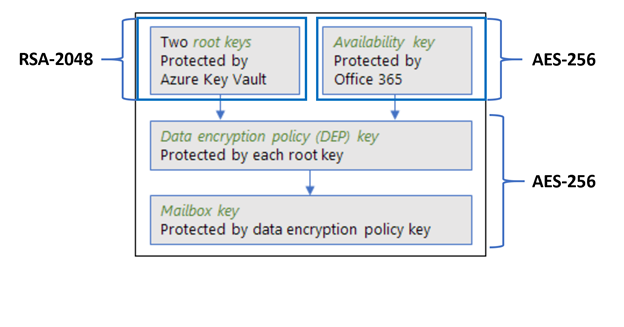

# Service encryption with Customer Key in Office 365

> [!IMPORTANT]
> @REVIEWERS - This topic is made up of the OVERVIEW/CONCEPTUAL content from the FAQ. This needs review for content, readability, and especially REDUNDANCY (the faq had lots of that). **AYLA: My goal is to get rid of the FAQ**. This topic will introduce Service encryption (as it relates to customer key), lockbox and customer lockbox (as they relate to Customer Key), Customer Key itself (what it is and isn't), and BYOK (as it relates to Customer Key). This article then introduces the rest of the customer key articles in logical order.

Office 365 provides baseline, volume-level encryption enabled through BitLocker and Distributed Key Manager (DKM). Office 365 offers an added layer of encryption at the application level for your content. This content includes data from Exchange Online, Skype for Business, SharePoint Online, OneDrive for Business, and Teams files. This added layer of encryption is called service encryption.

## How service encryption, BitLocker, and Customer Key work together

Service encryption ensures that content at rest is encrypted at the application layer. **Your data is always encrypted at rest in the Office 365 service with BitLocker and DKM**. For more information, see the "Security, Privacy, and Compliance Information for Office 365", and [How Exchange Online secures your email secrets](https://support.office.com/article/989BA10C-F73F-4EFB-AD1B-AF3322E5F376). Customer Key provides additional protection against viewing of data by unauthorized systems or personnel, and complements BitLocker disk encryption in Microsoft datacenters. Service encryption is not meant to prevent Microsoft personnel from accessing customer data. The primary purpose is to assist customers in meeting regulatory or compliance obligations for controlling root keys. Customers explicitly authorize O365 services to use their encryption keys to provide value added cloud services, such as eDiscovery, anti-malware, anti-spam, search indexing, etc.

Customer Key is built on service encryption and lets you provide and control encryption keys. Office 365 then uses these keys to encrypt your data at rest as described in the [Online Services Terms (OST)](https://www.microsoft.com/en-us/Licensing/product-licensing/products.aspx). Customer Key helps you meet compliance obligations because you control the encryption keys that Office 365 uses to encrypt and decrypt data.
  
Customer Key enhances the ability of your organization to meet the demands of compliance requirements that specify key arrangements with the cloud service provider. With Customer Key, you provide and control the encryption keys for your Office 365 data at-rest at the application level. As a result, you exercise control over your organization's keys. If you decide to exit the service, you revoke your organization's keys. By revoking the keys, the data is unreadable to the service. For all Office 365 services, key revocation is the first step on the path towards data deletion.

With Customer Key, you control your organization's encryption keys and then configure Office 365 to use them to encrypt your data at rest in Microsoft's data centers. In other words, Customer Key allows customers to add a layer of encryption that belongs to them, with their keys. Data at rest includes data from Exchange Online and Skype for Business stored in mailboxes and files stored in SharePoint Online and OneDrive for Business.

## Customer Key encrypts data at rest in Office 365

Using keys you provide, Customer Key for Office 365 encrypts:

- SharePoint Online, OneDrive for Business, and Teams files.
- Files uploaded to OneDrive for Business.
- Exchange Online mailbox content including e-mail body content, calendar entries, and the content within email attachments.
- Text conversations from Skype for Business.

We don't currently offer customer control of the encryption keys for Skype Meeting Broadcast and Skype Meeting content uploads. Instead, this content is encrypted along with all other content in Office 365.

### Customer Key with hybrid deployments

Customer Key only encrypts data at rest in the cloud. Customer Key does not work to protect your on-premises mailboxes and files. You can encrypt your on-premises data using another method, such as BitLocker.

## About the data encryption policy (DEP)

> [!WARNING]
> @REVIEWERS a customer points out in github issues that we never define the dep. we tell them what we DO with it but not what it is. i gave this a whirl please refine this section.

A data encryption policy defines the encryption hierarchy Customer Key uses to encrypt each of the keys you provide as well as the availability key protected by Microsoft. You create one or more DEPs when you set up Customer Key. Next, you assign a DEP to parts of each service that you can encrypt. For example:

**Exchange Online and Skype for Business** You can create up to 50 DEPs for your organization. You assign each mailbox to one DEP. When you assign the DEP, ***encryption doesn't begin automatically, it's triggered by a powershell cmdlet or a mailbox move as described in [Set up Customer Key for Office 365](customer-key-set-up.md). Later, you can reassign the mailbox to another DEP as described in [Manage Customer Key for Office 365](customer-key-manage.md). Each mailbox must have appropriate licenses. (For more information, see [Customer Key licensing](#about-customer-key-licensing).)

**SharePoint Online, including Team Sites, and OneDrive for Business** You can create up 1 DEP per geo for your organization. If you're not using the multi-geo feature, you can create one DEP. You assign each geo to one DEP. When you assign the DEP, ***encryption doesn't begin automatically, it's triggered by a powershell cmdlet as described in [Set up Customer Key for Office 365](customer-key-set-up.md). Later, you can reassign the mailbox to another DEP as described in [Manage Customer Key for Office 365](customer-key-manage.md). Each mailbox must have appropriate licenses. (For more information, see [Customer Key licensing](#about-customer-key-licensing).)

## About the keys used by Customer Key

> [!WARNING]
> @KC Add VERY brief into about the keys here then point off to more info about availability keys.

### Customer-managed keys

These are keys you provide and store in Azure Key Vault.

The data purge feature is not available with Microsoft-managed keys; only Customer Key offers this ability. For information about the data purge process and key revocation, see [Revoke your keys and start the data purge path process](customer-key-manage.md#revoke-your-keys-and-start-the-data-purge-path-process).

> [!WARNING]
> @REVIEWERS! What else to say here? You can generate and store these in a Thales ? HSM or some other mechanism? Move some of the overview material about the keys here? differentiate between the customer keys and the availability key here. Keep this VERY brief.

### Availability key

The availability key is a Microsoft-managed key (is it?) that provides you with the capability to recover from the unanticipated loss of root keys that you manage. For more information about the availability key, see [Understand the availability key for Office 365 Customer Key](customer-key-availability-key-understand.md).

### Encryption ciphers used by Customer Key

> [!WARNING]
> **@Reviewers!!** Need to redo these graphics these are placeholders for now. Please confirm the data on them is still accurate. Also, I'd like to remove the "microsoft-managed" from the SPO piece as this will undoubtedly cause confusion. @Jeff McDowell Please verify.

Customer Key uses a variety of encryption ciphers to encrypt keys as shown in the following figures.

#### Encryption ciphers used to encrypt keys for Exchange Online and Skype for Business



#### Encryption ciphers used to encrypt keys for SharePoint Online and OneDrive for Business


## Use Customer Key and Bring Your Own Key (BYOK) with Azure Information Protection for Exchange Online

Both options enable you to provide and control your own encryption keys; however, service encryption with Customer Key for Office 365 encrypts your data at rest, residing in Office 365 servers. BYOK with Azure Information Protection for Exchange Online encrypts your data-in-transit and provides persistent online and offline protection for email messages and attachments for Office 365. Customer Key and BYOK with Azure Information Protection for Exchange Online are complementary, and whether you choose to use Microsoft's service-managed keys or your own keys, encrypting your data-at-rest and in-transit can provide added protection from malicious attacks.
  
BYOK with Azure Information Protection for Exchange Online is offered with the new Office 365 Message Encryption capabilities. 

> [!WARNING]
> @REVIEWERS - For more information, see *** Azure or OME content?

## About Customer Key licensing

> [!WARNING]
> @REVIEWERS - This is unusual information for pubs to publish. Normally we link out to marketing content for this. I REALLY want to delete all the rest of this article except the link to the trust center. Please provide me with a link to replace this content. One excellent option would be to ensure that the service description is up to date. I can point there. That would be optimal.

Customer Key is offered in the Office 365 Enterprise Suite, "E5", and the Advanced Compliance SKU. Additionally, you must also purchase the appropriate license for using Azure Key Vault.
  
Each user benefiting from Customer Key needs to be licensed if they want to be covered by Customer Key.
  
For SharePoint Online, the Office 365 Administrator who configures Customer Key also needs to be licensed, to perform the setup steps. Additionally, the users that benefit from Customer Key need to be licensed - this includes the site owner and any users accessing files on one or more sites that are encrypted using Customer Key. External users do not need to be licensed to access files on one or more sites that are encrypted using Customer Key.
  
For Exchange Online, "user" mailboxes and "mail user" mailboxes must be licensed. All others, such as shared mailboxes, are not required to have a license for Customer Key. To check that your Exchange Online mailbox is properly licensed, run the Get-Mailbox cmdlet as follows:
  
```powershell
(Get-Mailbox <alias>).PersistedCapabilities
```

If the cmdlet returns the string BPOS_S_EquivioAnalytics, then the mailbox is properly licensed. If not, you must apply the proper license in order to use Customer Key with this mailbox.
  
## Customer Key and trial subscriptions

You can't enable Customer Key with a trial subscription. By definition, trial subscriptions have a limited lifetime. Encryption keys that are hosted in trial subscriptions can be lost at the end of the trial lifetime. Because Microsoft cannot and does not prevent customers from putting important customer data in trial subscriptions, the use of Customer Key with trial subscriptions is prohibited.
  
## Estimating Customer Key costs

In addition to the licensing required for Customer Key, you will incur a cost for Key Vault usage. [Azure Key Vault pricing details](https://azure.microsoft.com/en-us/pricing/details/key-vault/) describes the cost model and assists you with estimating. There is no way to predict the exact cost that you'll incur because usage patterns vary. Experience has shown that the cost is very low and generally falls within the range of $0.002 to $0.005 per user per month plus the cost of HSM-backed keys. The cost also varies according to the logging configuration you choose and the amount of Azure storage you use for Azure Key Vault logs.

## Microsoft's approach to third-party data requests

Customer Key wasn't designed to respond to law enforcement subpoenas. Regulated customers use Customer Key to meet their internal or external compliance obligations. Microsoft takes third-party requests for customer data very seriously. As a cloud service provider, we always advocate for the privacy of customer data. In the event we get a subpoena, we always attempt to redirect the third party to the customer to obtain the information.
  
See the [Microsoft Trust Center](https://www.microsoft.com/en-us/trustcenter/Privacy/govt-requests-for-data) regarding third-party data requests and for periodic updates about requests that we receive. Also, see "Disclosure of Customer Data" in the [Online Services Terms (OST)](https://www.microsoft.com/en-us/Licensing/product-licensing/products.aspx).

## We welcome your feedback

To provide feedback on Customer Key, including the documentation, send your ideas, suggestions, and perspectives to customerkeyfeedback@microsoft.com.
  
## Related articles

- [Learn about the availability key](customer-key-availability-key-understand.md)

- [Set up Customer Key for Office 365](customer-key-set-up.md)

- [Manage Customer Key for Office 365](customer-key-manage.md)

- [Roll or rotate a Customer Key or an availability key](customer-key-availability-key-roll.md)

- [Customer Lockbox in Office 365](customer-lockbox-requests.md)

- [Office 365 Service Encryption](office-365-service-encryption.md)
