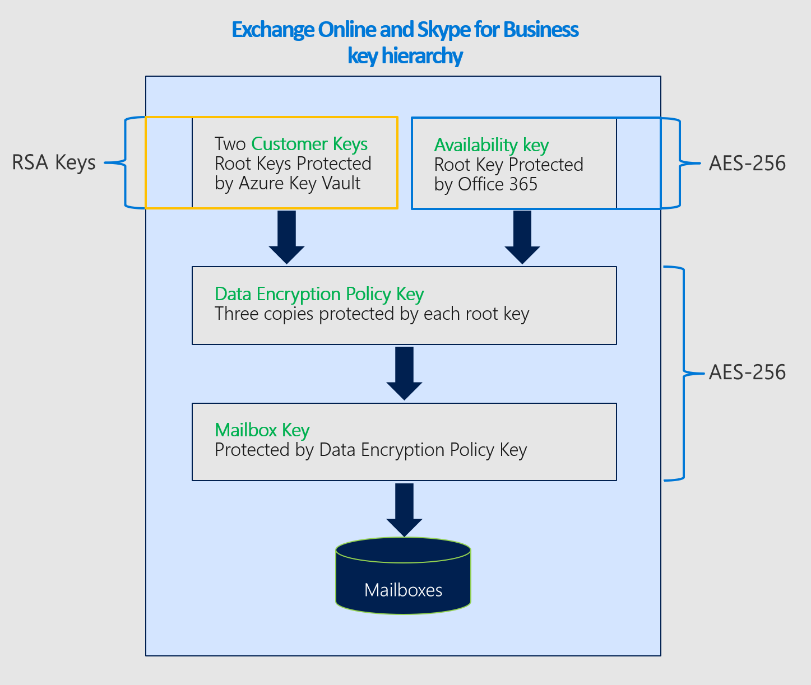
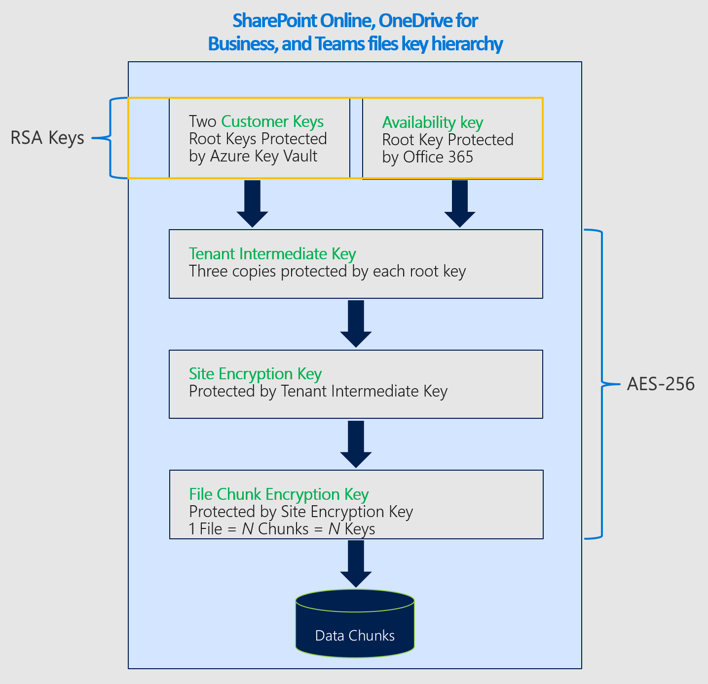

# Service encryption with Customer Key

Microsoft 365 provides baseline, volume-level encryption enabled through BitLocker and Distributed Key Manager (DKM). Microsoft 365 offers an added layer of encryption for your content. This content includes data from Exchange Online, Skype for Business, SharePoint Online, OneDrive for Business, and Microsoft Teams.

## How service encryption, BitLocker, and Customer Key work together

Your data is always encrypted at rest in the Microsoft 365 service with BitLocker and DKM. For more information, see [How Exchange Online secures your email secrets](exchange-online-secures-email-secrets.md). Customer Key provides extra protection against viewing of data by unauthorized systems or personnel, and complements BitLocker disk encryption in Microsoft data centers. Service encryption is not meant to prevent Microsoft personnel from accessing your data. Instead, Customer Key helps you meet regulatory or compliance obligations for controlling root keys. You explicitly authorize Microsoft 365 services to use your encryption keys to provide value added cloud services, such as eDiscovery, anti-malware, anti-spam, search indexing, and so on.

Customer Key is built on service encryption and lets you provide and control encryption keys. Microsoft 365 then uses these keys to encrypt your data at rest as described in the [Online Services Terms (OST)](https://www.microsoft.com/licensing/product-licensing/products.aspx). Customer Key helps you meet compliance obligations because you control the encryption keys that Microsoft 365 uses to encrypt and decrypt data.
  
Customer Key enhances the ability of your organization to meet the demands of compliance requirements that specify key arrangements with the cloud service provider. With Customer Key, you provide and control the root encryption keys for your Microsoft 365 data at-rest at the application level. As a result, you exercise control over your organization's keys.

## Customer Key with hybrid deployments

Customer Key only encrypts data at rest in the cloud. Customer Key does not work to protect your on-premises mailboxes and files. You can encrypt your on-premises data using another method, such as BitLocker.

## About data encryption policies

A data encryption policy (DEP) defines the encryption hierarchy. This hierarchy is used by the service to encrypt data using each of the keys you manage and the availability key that's protected by Microsoft. You create DEPs using PowerShell cmdlets, and then assign those DEPs to encrypt application data. There are three types of DEPs supported by Microsoft 365 Customer Key, each policy type uses different cmdlets and provides coverage for a different type of data. The DEPs you can define include:

**DEP for multiple Microsoft 365 workloads** These DEPs encrypt data across multiple M365 workloads for all users within the tenant. These workloads include:

- Teams chat messages (1:1 chats, group chats, meeting chats and channel conversations)
- Teams media messages (images, code snippets, video messages, audio messages, wiki images)
- Teams call and meeting recordings stored in Teams storage
- Teams chat notifications
- Teams chat suggestions by Cortana
- Teams status messages
- User and signal information for Exchange Online
- Exchange Online mailboxes that aren't already encrypted by mailbox DEPs
- MIP exact data match (EDM) data – (data file schemas, rule packages, and the salts used to hash the sensitive data).
  For MIP exact data match (EDM) and Microsoft Teams, the multi-workload DEP encrypts new data from the time you assign the DEP to the tenant. For Exchange Online, Customer Key encrypts all existing and new data.

Multi-workload DEPs don't encrypt the following types of data. Instead, Microsoft 365 uses other types of encryption to protect this data.

- SharePoint and OneDrive for Business data.
- Microsoft Teams files and some Teams call and meeting recordings saved in OneDrive for Business and SharePoint Online are encrypted using the SharePoint Online DEP.
- Other Microsoft 365 workloads such as Yammer and Planner that aren't currently supported by Customer Key.
- Teams Live Events and Q&A in Live Events. For Teams, this scenario is the only one that isn't encrypted by Customer Key using multi-workload DEP.

You can create multiple DEPs per tenant but only assign one DEP at a time. When you assign the DEP, encryption begins automatically but takes some time to complete depending on the size of your tenant.

**DEPs for Exchange Online mailboxes** Mailbox DEPs provide more precise control over individual mailboxes within Exchange Online. Use mailbox DEPs to encrypt data stored in EXO mailboxes of different types such as UserMailbox, MailUser, Group, PublicFolder, and Shared mailboxes. You can have up to 50 active DEPs per tenant and assign those DEPs to individual mailboxes. You can assign one DEP to multiple mailboxes.

By default your mailboxes get encrypted using Microsoft-managed keys. When you assign a Customer Key DEP to a mailbox:

- If the mailbox is encrypted using a multi-workload DEP, the service rewraps the mailbox using the new mailbox DEP as long as a user or a system operation accesses the mailbox data.

- If the mailbox is already encrypted using Microsoft-managed keys, the service rewraps the mailbox using the new mailbox DEP as long as a user or a system operation accesses the mailbox data.

- If the mailbox is not yet encrypted using default encryption, then the service marks the mailbox for a move. The encryption takes place once the move is complete. Mailbox moves are governed based on priorities set for all of Microsoft 365. For more information, see, [Move requests in the Microsoft 365 service](/exchange/mailbox-migration/office-365-migration-best-practices#move-requests-in-the-office-365-service). If the mailboxes aren't encrypted within the specified time, contact Microsoft.

Later, you can either refresh the DEP or assign a different DEP to the mailbox as described in [Manage Customer Key for Office 365](customer-key-manage.md). Each mailbox must have appropriate licenses to be assigned a DEP. For more information about licensing, see [Before you set up Customer Key](customer-key-set-up.md#before-you-set-up-customer-key).

DEPs can be assigned to a shared mailbox, public folder mailbox, and Microsoft 365 group mailbox for tenants that meet the licensing requirement for user mailboxes. You don't need separate licenses for non-user-specific mailboxes to assign Customer Key DEP.

For Customer Key DEPs that you assign to individual mailboxes, you can request that Microsoft purge specific DEPs when you leave the service. For information about the data purge process and key revocation, see [Revoke your keys and start the data purge path process](customer-key-manage.md#revoke-your-keys-and-start-the-data-purge-path-process).

When you revoke access to your keys as part of leaving the service, the availability key is deleted, resulting in cryptographic deletion of your data. Cryptographic deletion mitigates the risk of data remanence, which is important for meeting both security and compliance obligations.

**DEP for SharePoint Online and OneDrive for Business** This DEP is used to encrypt content stored in SPO and OneDrive for Business, including Microsoft Teams files stored in SPO. If you're using the multi-geo feature, you can create one DEP per geo for your organization. If you're not using the multi-geo feature, you can only create one DEP per tenant. Refer to the details in [Set up Customer Key](customer-key-set-up.md).

### Encryption ciphers used by Customer Key

Customer Key uses various encryption ciphers to encrypt keys as shown in the following figures.

The key hierarchy used for DEPs that encrypt data for multiple Microsoft 365 workloads is similar to the hierarchy used for DEPs for individual Exchange Online mailboxes. The only difference is that the Mailbox Key is replaced with the corresponding Microsoft 365 Workload Key.

#### Encryption ciphers used to encrypt keys for Exchange Online and Skype for Business

#### Encryption ciphers used to encrypt keys for SharePoint Online, OneDrive for Business, and Teams files

## Related articles

- [Set up Customer Key](customer-key-set-up.md)

- [Manage Customer Key](customer-key-manage.md)

- [Roll or rotate a Customer Key or an availability key](customer-key-availability-key-roll.md)

- [Learn about the availability key](customer-key-availability-key-understand.md)

- [Customer Lockbox](customer-lockbox-requests.md)

- [Service Encryption](office-365-service-encryption.md)