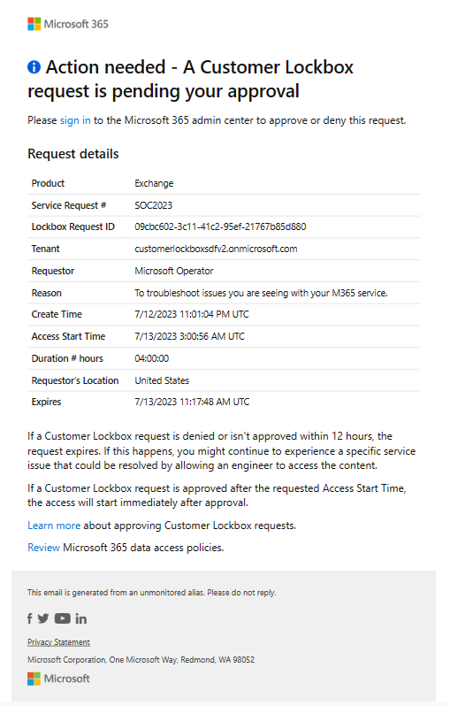
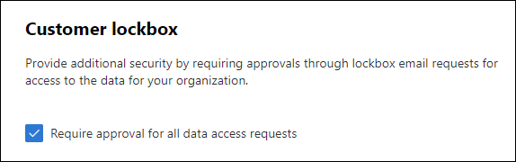

# Microsoft Purview Customer Lockbox

This article provides deployment and configuration guidance for Customer Lockbox. Customer Lockbox supports requests to access data in Exchange Online, SharePoint Online, OneDrive for Business, and Teams. To recommend support for other services, submit a request at [Feedback Portal](https://feedbackportal.microsoft.com).

To see the options for licensing your users to benefit from Microsoft Purview offerings, see the [Microsoft 365 licensing guidance for security & compliance](/office365/servicedescriptions/microsoft-365-service-descriptions/microsoft-365-tenantlevel-services-licensing-guidance/microsoft-365-security-compliance-licensing-guidance).

Customer Lockbox ensures that Microsoft can't access your content to do service operations without your explicit approval. Customer Lockbox brings you into the approval workflow process that Microsoft uses to ensure only authorized requests allow access to your content. To learn more about Microsoft's workflow process, see [Privileged access management](privileged-access-management-solution-overview.md).

Occasionally, Microsoft engineers help troubleshoot and fix issues that arise with the service. Usually, engineers fix issues using extensive telemetry and debugging tools Microsoft has in place for its services. However, some cases require a Microsoft engineer to access your content to determine the root cause and fix the issue. Customer Lockbox requires the engineer to request access from you as a final step in the approval workflow. This gives you the option to approve or deny the request for your organization, and provide direct-access control to your content.

## Customer Lockbox overview video

> [!VIDEO https://www.microsoft.com/videoplayer/embed/8fecf10b-1f03-4849-8b67-76d3d2a43f26?autoplay=false]

## Customer Lockbox workflow

These steps outline the typical workflow when a Microsoft engineer starts a Customer Lockbox request:

1. Someone at an organization experiences an issue with their Microsoft 365 mailbox.

2. After the user troubleshoots the issue, but can't fix it, they open a support request with Microsoft Support.

3. A Microsoft support engineer reviews the service request and determines a need to access the organization's tenant to repair the issue.

4. The Microsoft support engineer logs into the Customer Lockbox request tool and makes a data access request that includes the organization's tenant name, service request number, and the estimated time the engineer needs access to the data.

5. After a Microsoft Support manager approves the request, Customer Lockbox sends the designated approver at the organization an email notification about the pending access request from Microsoft.

    

   Anyone who is assigned the [Customer Lockbox access approver](/office365/admin/add-users/about-admin-roles) admin role in Microsoft 365 admin center can approve Customer Lockbox requests.

6. The approver signs in to the Microsoft 365 admin center and approves the request. This step triggers the creation of an audit record available by searching the audit log. For more information, see [Auditing Customer Lockbox requests](#auditing-customer-lockbox-requests).

   If the customer rejects the request or doesn't approve the request within 12 hours, the request expires and no access is granted to the Microsoft engineer.

   > [!IMPORTANT]
   > Microsoft does not include any links in Customer Lockbox email notifications requiring you to sign in to Office 365.

7. After the approver from the organization approves the request, the Microsoft engineer receives the approval message, logs into the tenant, and fixes the customer's issue. Microsoft engineers have the requested duration to fix the issue after which the access is automatically revoked.

> [!NOTE]
> All actions performed by a Microsoft engineer are logged in the audit log. You can search for and review these audit records.

## Turn Customer Lockbox requests on or off

You can turn on Customer Lockbox controls in the Microsoft 365 admin center. When you turn on Customer Lockbox, Microsoft must obtain your organization's approval before accessing any of your tenant's content.

1. Using a work or school account that has either the global administrator or the **Customer Lockbox access approver** role assigned, go to [https://admin.microsoft.com](https://admin.microsoft.com) and sign in.

2. Choose **Settings** > **Org Settings** > **Security & Privacy**.

3. Select **Security & Privacy**, then select **Customer Lockbox** in the left column. Check the **Require approval for all data access requests** checkbox and save the changes to turn on the feature.

    

## Approve or deny a Customer Lockbox request

1. Using a work or school account that has either the global administrator or the **Customer Lockbox access approver** role assigned, go to [https://admin.microsoft.com](https://admin.microsoft.com) and sign in.

2. Choose **Support > Customer Lockbox Requests**.

    

    A list of Customer Lockbox requests displays.

    

3. Select a Customer Lockbox request, and then choose **Approve** or **Deny**.

    

    A confirmation message about the approval of the Customer Lockbox request displays.

    

> [!NOTE]
> Use the Set-AccessToCustomerDataRequest cmdlet to approve, deny, or cancel Microsoft Purview Customer Lockbox requests that control access to your data by Microsoft support engineers. For more information, see [Set-AccessToCustomerDataRequest](/powershell/module/exchange/set-accesstocustomerdatarequest).

## Auditing Customer Lockbox requests

Audit records that correspond to Customer Lockbox requests are logged in the Microsoft 365 audit log. You can access these logs by using the [audit log search tool](search-the-audit-log-in-security-and-compliance.md) in the Microsoft Purview compliance portal. Actions related to accepting or denying a Customer Lockbox request and actions performed by Microsoft engineers (when access requests are approved) are also logged in the audit log. You can search for and review these audit records.

### Search the audit log for activity related to Customer Lockbox requests

Before you can use the audit log to track requests for Customer Lockbox, there are some steps you need to take to set up audit logging, including assigning permissions to search the audit log. For more information, see [Set up Microsoft Purview Audit (Standard)](set-up-basic-audit.md). Once you've completed the setup, use these steps to create an audit log search query to return audit records related to Customer Lockbox:

1. Go to <https://compliance.microsoft.com>.
  
2. Sign in using an account that has been assigned the appropriate permissions to search the audit log.

3. In the left pane of the compliance center, choose **Audit**.

    The **Search** tab on the **Audit** page is displayed.

    
  
4. Configure the following search criteria:

   1. **Start date** and **End date**. Select a date and time range to display the events that occurred within that period.  

   2. **Activities**. Leave this field blank so that the search returns audit records for all activities. This is necessary to return any audit records related to Customer Lockbox requests and corresponding activity performed by Microsoft engineers.

   3. **Users**. Leave this field blank.

   4. **File, folder, or site**. Leave this field blank.

5. Click **Search** to run the search using your search criteria.

    The search results are displayed after a few moments. More search results will be added to the page until the search is complete.

6. Click the header in the **Activity** column to sort the results alphabetically based on the values in the **Activity** column.

7. Scroll down and look for audit records with an activity of **Set-AccessToCustomerDataRequest**. Records with this activity are related to an approver in your organization approving or denying a Customer Lockbox request.

8. Alternatively, click the header in the **User** column to sort the results alphabetically using the values in the **User** column. Look for the value of **Microsoft Operator**, which indicates activities performed by a Microsoft engineer in response to an approved Customer Lockbox request. The **Activity** column displays the action performed by the engineer.

      

9. In the list of results, click an audit record to display it.

### Export the audit log search results

You can also export the audit log search results to a CSV file and then open the file in Excel to use the filtering and sorting capabilities to make it easier to find and view audit records related to a Customer Lockbox access request.

To export audit records, use the previous steps to search the audit log. When the search is complete, select **Export > Download all results** at the top of the search results page. When the export process is complete, you can download the CSV file to your local computer. For more detailed instructions, see [Export, configure, and view audit log records](export-view-audit-log-records.md).

After you download the file, you can open it in Excel and then filter on the **Operations** column to display audit records for **Set-AccessToCustomerDataRequest** activities. You can also filter on the **UserIds** column (using the value **Microsoft Operator**) to display audit records for activities performed by Microsoft engineers.

> [!NOTE]
> When viewing audit records in the CSV file, additional information is contained in the **AuditData** column. The information in this column is contained in a JSON object, which contains multiple properties that are configured as *property:value* pairs separated by commas. You can use the JSON transform feature in the Power Query Editor in Excel to split each property in the JSON object in the **AuditData** column into multiple columns so that each property has its own column. This makes it easier to interpret this information. For detail instructions, see [Format the exported audit log using the Power Query Editor](export-view-audit-log-records.md#step-2-format-the-exported-audit-log-using-the-power-query-editor).

### Use PowerShell to search and export audit records

An alternative to using the audit search tool in the Microsoft Purview compliance portal is to run the [Search-UnifiedAuditLog](/powershell/module/exchange/search-unifiedauditlog) cmdlet in Exchange Online PowerShell. One advantage of using PowerShell is that you can specifically search for **Set-AccessToCustomerDataRequest** activities or activities performed by Microsoft engineers related to a Customer Lockbox request.

After you [connect to Exchange Online PowerShell](/powershell/exchange/connect-to-exchange-online-powershell), run one of the following commands. Replace the placeholders with a specific date range.

Search for `Set-AccessToCustomerDataRequest` activities

```powershell
Search-UnifiedAuditLog -StartDate xx/xx/xxxx -EndDate xx/xx/xxxx -Operations Set-AccessToCustomerDataRequest
```

Search for activities performed by Microsoft engineers

```powershell
Search-UnifiedAuditLog -StartDate xx/xx/xxxx -EndDate xx/xx/xxxx -UserIds "Microsoft Operator"
```

For more information and examples, see [Use PowerShell to search and export audit log records](export-view-audit-log-records.md#use-powershell-to-search-and-export-audit-log-records).

We've also provided a PowerShell script that you can use to search the audit log and export the results to a CSV file. For more information, see [Use a PowerShell script to search the audit log](audit-log-search-script.md).

### Audit record for a Customer Lockbox request

When a person in your organization approves or denies a Customer Lockbox request, the audit record is logged in the audit log contains the following information.

| Audit record property| Description|
|:---------- |:----------|
| Date       | The date and time when the Customer Lockbox request was approved or denied.
| IP address | The IP address of the machine the approver used to approve or deny a request. |
| User       | The service account BOXServiceAccount@\[customerforest\].prod.outlook.com.            |
| Activity   | Set-AccessToCustomerDataRequest; this is the auditing activity that is logged when you approve or deny a Customer Lockbox request.                                |
| Item       | The Guid of the Customer Lockbox request                             |

The following screenshot shows an example of an audit record that corresponds to an approved Customer Lockbox request. If a Customer Lockbox request was denied, then the value of `ApprovalDecision` parameter would be `Deny`.


### Audit record for an action performed by a Microsoft engineer

The actions performed by a Microsoft engineer after a Customer Lockbox request is approved (and that may result in accessing customer content) are logged in the audit log. These records contain the following information.

| Audit record property| Description|
|:---------- |:----------|
| Date       | Date time when the action was performed. The time that this action was performed will be within 4 hours of when the Customer Lockbox request was approved.              |
| IP address | The IP Address of the machine Microsoft engineer used. |
| User       | Microsoft Operator; this value indicates the record is related to a Customer Lockbox request.                                  |
| Activity   | Name of the activity performed by the Microsoft engineer.|
| Item       | \<empty\>                                             |

## Frequently asked questions

### Which Microsoft 365 services does Customer Lockbox apply to?

Customer Lockbox is currently supported in Exchange Online, SharePoint Online, OneDrive for Business, and Teams.

### Is Customer Lockbox available to all customers?

Customer Lockbox is included with the Microsoft 365 or Office 365 E5 subscriptions and can be added to other plans with an Information Protection and Compliance or an Advanced Compliance add-on subscription. See [Plans and pricing](https://products.office.com/business/office-365-enterprise-e5-business-software) for more information.

### What is customer content?

Customer content is the data created by users of Microsoft 365 services and applications. Examples of customer content include:

- Email body or email attachments

- SharePoint site contents

- Information in the body of a SharePoint file

- Skype for Business presentation file body

- Instant messages (IM) or voice conversations

- Text entered in Teams chats and Teams channels, for example, 1:1 chats, group chats, shared channels, private channels, and meeting chat

- Other data pasted into Teams chat threads, such as code snippets, images, audio and video messages, and links

- App and bot data in Teams chats and Teams channels

- Teams activity feed

- Teams meeting recordings and transcripts

- Voicemail

- Files posted to Teams chats and Teams channels

- Customer-generated blob or structured storage data (for example, SQL Containers)

- Customer-owned security information (for example, certificates, encryption keys, and passwords)

- Inferences, and all subsequent inferences, if customer content remains

For more information about customer content in Office 365, see the [Office 365 Trust Center](https://products.office.com/business/office-365-trust-center-privacy/).

### Who is notified when there is a request to access my content?

Global administrators and anyone assigned the Customer Lockbox access approver admin role are notified. These are also the same users who can approve for Customer Lockbox requests.

### Who can approve or reject these requests in my organization?

Global administrators and anyone assigned the Customer Lockbox access approver admin role can approve Customer Lockbox requests. Customers control these role assignments in their organizations.

### How do I opt in to Customer Lockbox?

A global administrator can enable and configure Customer Lockbox in the Microsoft 365 admin center.

### If I approve a Customer Lockbox request, what can the engineer do and how will I know what the Microsoft engineer did?

After you approve a Customer Lockbox request, the Microsoft engineer granted these necessary privileges to access customer content by using pre-approved cmdlets. Actions taken by Microsoft engineers in response to Customer Lockbox requests are logged and accessible in the audit log in the Security & Compliance Center.

### How do I know that Microsoft follows the approval process?

You can cross-reference the email approval notifications sent to admins and approvers in your organization with the Customer Lockbox request history in the [Microsoft 365 admin center](https://go.microsoft.com/fwlink/p/?linkid=2024339).

Customer Lockbox is included in the latest [SOC 1 SSAE 16 audit report](https://servicetrust.microsoft.com/ViewPage/MSComplianceGuide?command=Download&downloadType=Document&downloadId=91592749-e86a-43ac-801e-121382614681&docTab=4ce99610-c9c0-11e7-8c2c-f908a777fa4d_SOC%20%2F%20SSAE%2016%20Reports). For more details, you can find the latest reports in the [Microsoft Service Trust Portal](https://servicetrust.microsoft.com/ViewPage/MSComplianceGuide?command=Download&downloadType=Document&downloadId=91592749-e86a-43ac-801e-121382614681&docTab=4ce99610-c9c0-11e7-8c2c-f908a777fa4d_SOC%20%2F%20SSAE%2016%20Reports).

### Can Microsoft modify the list of approvers for my tenant? If not, how is it prevented?

Only a global administrator in your organization can specify who can approve Customer Lockbox requests. That means only the members of the Global administrator group in Azure Active Directory can specify who can approve request. Membership of the Global administrator group in Azure Active Directory is managed only by your organization.

### What if I need more information about a content access request to approve it?

Each Customer Lockbox request contains a Microsoft 365 service request number. You can contact Microsoft Support and reference this service number to get more information about the request.

### When a Customer Lockbox request is approved, how long are the permissions valid?

Currently, the maximum period for the access permissions granted to the Microsoft engineer is 4 hours. The Microsoft engineer can also request a shorter period.

### How can I get a history of all Customer Lockbox requests?

All Customer Lockbox requests are viewed in the [Microsoft 365 admin center](https://go.microsoft.com/fwlink/p/?linkid=2024339).

### How do I correlate the content access requests with the related audit logs?

The Compliance Center Activity Feed contains log activities of Customer Lockbox. Customers can cross-reference the Customer Lockbox log activities from the activity feed against the email request they receive.

### What happens when a customer doesn't respond to a Customer Lockbox request?

Customer Lockbox requests have a default duration of 12 hours. If you don't respond to a request within 12 hour, the request expires.

### What does Microsoft do when a customer rejects a Customer Lockbox request?

If a customer rejects a Customer Lockbox request, no access to customer content occurs. If a user in your organization continues to experience a service issue requiring Microsoft to access customer content to resolve the issue, then the service issue might persist and Microsoft will inform the user about this.

### How do I set up alerts whenever a request has been approved?

There is no built-in option to alert administrators. However, administrators can set up alerts using [Microsoft Defender for Cloud Apps](/cloud-app-security/getting-started-with-cloud-app-security#to-create-policies).

### Does Customer Lockbox protect against data requests from law enforcement agencies or other third parties?

No. Microsoft takes third-party requests for customer data seriously. As a cloud service provider, Microsoft always advocates for the privacy of customer data. In the event we get a subpoena, Microsoft always attempts to redirect the third party to the customer to obtain the information. (Read Brad Smith's blog: [Protecting customer data from government snooping](https://blogs.microsoft.com/blog/2013/12/04/protecting-customer-data-from-government-snooping/)). We periodically publish [detailed information](https://www.microsoft.com/corporate-responsibility/lerr) about the law enforcement requests that Microsoft receives.

See the [Microsoft Trust Center](https://www.microsoft.com/trustcenter/default.aspx) regarding third-party data requests and the "Disclosure of Customer Data" section in the [Online Services Terms](https://www.microsoft.com/Licensing/product-licensing/products.aspx) for more information.

### How does Microsoft ensure that a member of its staff doesn't have standing access to customer content in Office 365 applications?

Microsoft implements extensive preventive measures through access control systems, and detective measures to identify and address attempts to circumvent these access control systems. Microsoft 365 operates with the principles of least privilege and just-in-time access. Therefore, no Microsoft personnel have permission to access customer content on an ongoing basis. If permission is granted, it is for a limited duration.

Microsoft 365 uses an access control system called *Lockbox* to process requests for permissions that grant the ability to perform operational and administrative functions within the service. An operator must request access to customer content using Lockbox, which then requires a second person to take action on the request (for example, approve it) before access is granted. That second person can't be the requestor and must be designated to approve access to customer content. Only if the request is approved does the operator acquire temporary access to customer content. After the elevation period expires, Lockbox revokes access.

Refer to the [Online Services Terms](https://www.microsoft.com/licensing/product-licensing/products) for more details about Microsoft general security practices.

### Under what circumstances do Microsoft engineers need access to my content?

The most common scenario where Microsoft engineers need access customer content is when the customer makes a support request that requires access for troubleshooting. A foundational principle of Microsoft 365 is that the service operates without Microsoft access to customer content. Nearly all service operations performed by Microsoft are fully automated and human involvement is highly controlled and abstracted away from customer content. The goal for Microsoft 365 is access to customer content to support the service isn't needed until the customer approves a specific request for Microsoft access.

### I already thought my data was secure with the Microsoft cloud, so why do I need Customer Lockbox?

Customer Lockbox provides an extra layer of control by offering customers the ability to give explicit access authorization for service operations. By demonstrating that procedures are in place for explicit data access authorization, Customer Lockbox also helps customers meet certain compliance obligations such as HIPAA and FEDRAMP.
