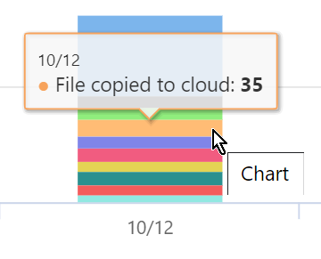
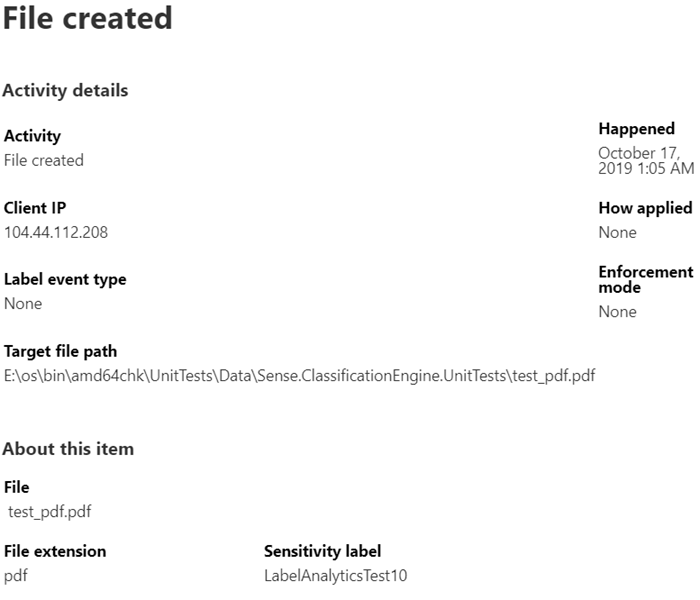

# Get started with activity explorer

The data classification overview and content explorer tabs give you visibility into what content has been discovered and labeled, and where that content is. Activity explorer rounds out this suite of functionality by allowing you to monitor what's being done with your labeled content. Activity explorer provides a historical view.

There are over 30 different filters available for use, some are:

- date range
- activity type
- location
- user
- sensitivity label
- retention label
- file path
- DLP policy

## Prerequisites

Every account that accesses and uses data classification must have a license assigned to it from one of these subscriptions:

- Microsoft 365 (E5)
- Office 365 (E5)
- Advanced Compliance (E5) add-on
- Advanced Threat Intelligence (E5) add-on

### Permissions

 In order to get access to the activity explorer tab, an account must be assigned membership in any one of these roles or role groups.

**Microsoft 365 role groups**

- Global administrator
- Compliance administrator
- Security administrator
- Compliance data administrator

## Activity type

Microsoft 365 monitors and reports on 12 types of activities across SharePoint Online, and OneDrive.

- File created
- File modified
- File renamed
- File copied to cloud
- File accessed by unallowed app
- File printed
- File copied to removable media
- File copied to network share
- File read
- file copied to clipboard
- Label applied
- Label changed (upgraded, downgraded, or removed)

The value of understanding what actions are being taken with your sensitive labeled content is that you can see if the controls that you have already put into place, such as [data loss prevention policies](data-loss-prevention-policies.md) are effective or not. If not, or if you discover something unexpected, such as a large number of items that are labeled `highly confidential` and are downgraded `general`, you can manage your various policies and take new actions to restrict the undesired behavior.

Once your filters are set, you can:

- hover over a segment of the bar chart to see the number of items that fall into that category

- export the data
- select any given item from the list and view the details of the action in the fly-out

## See also
- [Sensitivity labels](sensitivity-labels.md)
- [Retention labels](labels.md)
- [Sensitive information type entity definitions](sensitive-information-type-entity-definitions.md)
- [Overview of retention policies](retention-policies.md)
