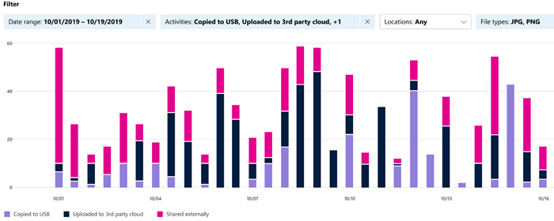

# Get started with activity explorer

The [data classification overview](data-classification-overview.md) and [content explorer](data-classification-content-explorer.md) tabs give you visibility into what content has been discovered and labeled, and where that content is. Activity explorer rounds out this suite of functionality by allowing you to monitor what's being done with your labeled content. Activity explorer provides a historical view of activities on your labeled content. The activity information is collected from the Microsoft 365 unified audit logs, transformed and made available in the Activity explorer UI. 

There are over 30 different filters available for use, some are:

- date range
- activity type
- location
- user
- sensitivity label
- retention label
- file path
- DLP policy

## Prerequisites

Every account that accesses and uses data classification must have a license assigned to it from one of these subscriptions:

- Microsoft 365 (E5)
- Office 365 (E5)
- Advanced Compliance (E5) add-on
- Advanced Threat Intelligence (E5) add-on
- Microsoft 365 E5/A5 Info Protection & Governance
- Microsoft 365 E5/A5 Compliance

### Permissions

 In order to get access to the activity explorer tab, an account must be explicitly assigned membership in any one of these role groups or explicitly granted the role.

<!--
> [!IMPORTANT]
> Access to Activity explorer via the Security reader or Device Management role groups or other has been removed-->

**Microsoft 365 role groups**

- Global administrator
- Compliance administrator
- Security administrator
- Compliance data administrator

**Microsoft 365 roles**

- Compliance administrator
- Security administrator

## Activity types

Activity explorer gathers activity information from the audit logs on multiple sources of activities. For more detailed information on what labeling activity makes it to Activity explorer, see [Labeling events available in Activity explorer](data-classification-activity-explorer-available-events.md).

**Sensitivity label activities** and **Retention labeling activities** from Office native applications, Azure Information Protection add-in, SharePoint Online, Exchange Online (sensitivity labels only) and OneDrive. Some examples are:

- label applied
- label changed (upgraded, downgraded, or removed)
- auto-labeling simulation
- file read 

**Azure Information Protection (AIP) scanner and AIP clients**

- protection applied
- protection changed
- protection removed
- files discovered 

Activity explorer also gathers **DLP policy matches** events from Exchange Online, SharePoint Online, OneDrive, Teams Chat and Channel (preview), on-premises SharePoint folders and libraries, and on-premises file shares, and Windows 10 devices via **Endpoint data loss prevention (DLP)**. Some examples events from Windows 10 devices are file:

- deletions
- creations
- copied to clipboard
- modified
- read
- printed
- renamed
- copied to network share
- accessed by unallowed app 

The value of understanding what actions are being taken with your sensitive labeled content is that you can see if the controls that you have already put into place, such as [data loss prevention](dlp-learn-about-dlp.md) are effective or not. If not, or if you discover something unexpected, such as a large number of items that are labeled `highly confidential` and are downgraded `general`, you can manage your various policies and take new actions to restrict the undesired behavior.

> [!NOTE]
> Activity explorer doesn't currently monitor retention activities for Exchange Online.

## See also

- [Learn about sensitivity labels](sensitivity-labels.md)
- [Learn about retention policies and retention labels](retention.md)
- [Learn about sensitive information types](sensitive-information-type-learn-about.md)
- [Learn about data classification](data-classification-overview.md)
