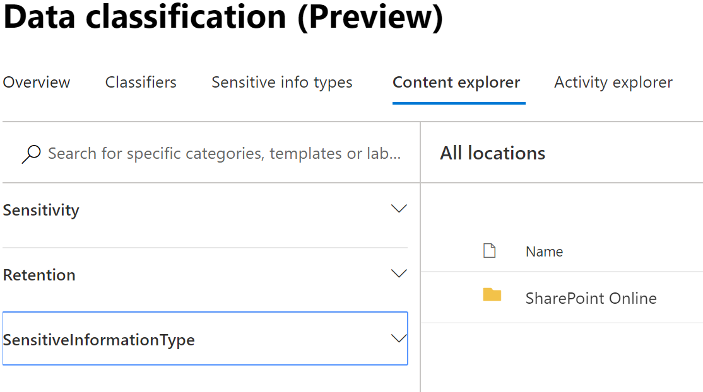
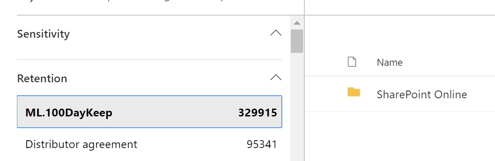

# Using data classification content explorer

The data classification content explorer allows you to natively view the items that were summarized on the overview page.

## Content explorer

Content explorer is a current snapshot of the items that have a sensitivity label, a retention label or have been classified as a sensitive information type in your organization.

### How to use content explorer

1. Open [Microsoft 365 compliance center](https://compliance.microsoft.com/dataclassification?viewid=overview) > **Data classification** > **Content explorer**.
2. If you know the name of the label, or the sensitive information type, you can type that into the search box.
3. Alternately, you can browse for the item by expanding the label type and selecting the label from the list, an item from the retention label portion of the list is show below.

4. Select a location under **All locations** and drill down the folder structure to the item.
5. Double click to open the item natively in content explorer.

## See also
- [Sensitivity labels](sensitivity-labels.md)
- [Retention labels](labels.md)
- [What the sensitive information types look for](what-the-sensitive-information-types-look-for.md)
- [Overview of retention policies](retention-policies.md)