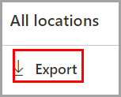
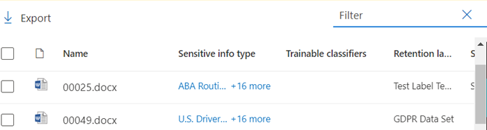

# Get started with content explorer

The data classification content explorer allows you to natively view the items that were summarized on the overview page.

## Prerequisites

Every account that accesses and uses data classification must have a license assigned to it from one of these subscriptions:

- Microsoft 365 (E5)
- Office 365 (E5)
- Advanced Compliance (E5) add-on
- Advanced Threat Intelligence (E5) add-on
- Microsoft 365 E5/A5 Info Protection & Governance
- Microsoft 365 E5/A5 Compliance

### Permissions

In order to get access to the content explorer tab, an account must be assigned membership in any one of these roles or role groups. 

**Microsoft 365 role groups**

- Global administrator
- Compliance administrator
- Security administrator
- Compliance data administrator

> [!IMPORTANT]
> Membership in these role groups does not allow you to view the list of items in content explorer or to view the contents of the items in content explorer.

### Required permissions to access items in content explorer

Access to content explorer is highly restricted because it lets you read the contents of scanned files.

> [!IMPORTANT]
> These permissions supercede permissions that are locally assigned to the items, which allows viewing of the content. 

There are two roles that grant access to content explorer and it is granted using the [Microsoft Security & Compliance Center](https://protection.office.com/permissions):

- **Content Explorer List viewer**: Membership in this role group allows you to see each item and its location in list view. The `data classification list viewer` role has been pre-assigned to this role group.

- **Content Explorer Content viewer**: Membership in this role group allows you to view the contents of each item in the list. The `data classification content viewer` role has been pre-assigned to this role group.

The account you use to access content explorer must be in one or both of the role groups. These are independent role groups and are not cumulative. For example, if you want to grant an account the ability to view the items and their locations only, grant Content Explorer List viewer rights. If you want that same account to also be able to view the contents of the items in the list, grant Content Explorer Content viewer rights as well.

You can also assign either or both of the roles to a custom role group to tailor access to content explorer.

A Global admin, Compliance admin, or Data admin can assign the necessary Content Explorer List Viewer, and Content Explorer Content Viewer role group membership.

## Content explorer

Content explorer shows a current snapshot of the items that have a sensitivity label, a retention label or have been classified as a sensitive information type in your organization.

### Sensitive information types

A [DLP policy](dlp-learn-about-dlp.md) can help protect sensitive information, which is defined as a **sensitive information type**. Microsoft 365 includes [definitions for many common sensitive information types](sensitive-information-type-entity-definitions.md) from across many different regions that are ready for you to use. For example, a credit card number, bank account numbers, national ID numbers, and Windows Live ID service numbers.

> [!NOTE]
> Content explorer doesn't currently scan for sensitive information types in Exchange Online.

### Sensitivity labels

A [sensitivity label](sensitivity-labels.md) is simply a tag that indicates the value of the item to your organization. It can be applied manually, or automatically. Once applied it gets embedded in the document and will follow it everywhere it goes. A sensitivity label enables various protective behaviors, such as mandatory watermarking or encryption.

Sensitivity labels must be enabled for files that are in SharePoint and OneDrive in order for the corresponding data to surface in the data classification page. For more information, see [Enable sensitivity labels for Office files in SharePoint and OneDrive](sensitivity-labels-sharepoint-onedrive-files.md).

### Retention labels

A [retention label](retention.md) allows you to define how long a labeled item is kept and the steps to be taken prior to deleting it. They are applied manually or automatically via policies. They can play a role in helping your organization stay in compliance with legal and regulatory requirements.

### How to use content explorer

1. Open **Microsoft 365 compliance center**  > **Data classification** > **Content explorer**.
2. If you know the name of the label, or the sensitive information type, you can type that into the filter box.
3. Alternately, you can browse for the item by expanding the label type and selecting the label from the list.
4. Select a location under **All locations** and drill down the folder structure to the item.
5. Double-click to open the item natively in content explorer.

### Export
The **export** control will create a .csv file that contains a listing of whatever is showing in the **All locations** pane.

### Search

When you drill down into a location, such as an Exchange folder, or a SharePoint or OneDrive site, the **search** tool appears.

The scope of the search tool is what is displaying in the **All locations** pane and what you can search on varies depending on the selected location. 

When **Exchange** is the selected location, you can search on the full email address of the mailbox, for example `user@domainname.com`.

When either **SharePoint** or **OneDrive** are selected location, the search tool will appear when you drill down to site names, folders and files. 

> [!NOTE]
> **OneDrive** We have listened to your valuable feedback on OneDrive integration during our preview program. Based on that feedback, the OneDrive functionality will remain in preview till all fixes are in place. Depending on your tenant, some customers may not see OneDrive as a location. We appreciate your continued support on this.

You can search on:

|value|example  |
|---------|---------|
|full site name    |`https://contoso.onmicrosoft.com/sites/sitename`    |
|root folder name - gets all subfolders    | `/sites`        |
|file name    |    `RES_Resume_1234.txt`     |
|text at the beginning of file name| `RES`|
|text after an underscore character ( _ ) in file name|`Resume` or `1234`| 
|file extension|`txt`|

## See also

- [Learn about sensitivity labels](sensitivity-labels.md)
- [Learn about retention policies and retention labels](retention.md)
- [Sensitive information type entity definitions.md](sensitive-information-type-entity-definitions.md)
- [Learn about data loss prevention](dlp-learn-about-dlp.md)