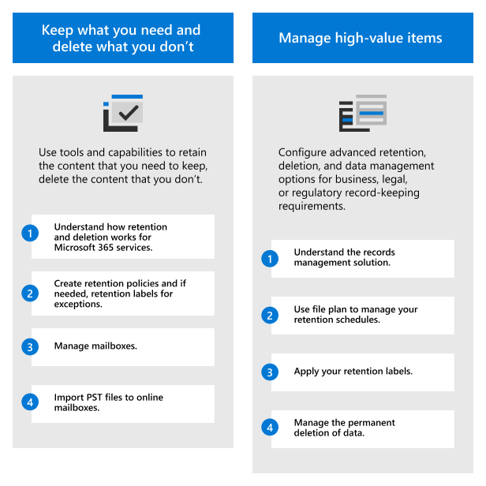
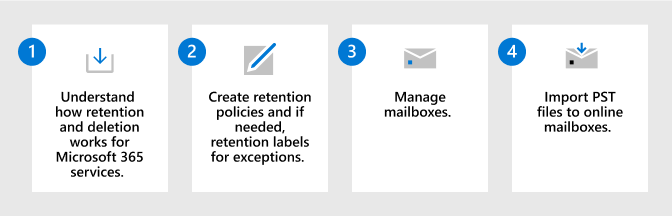
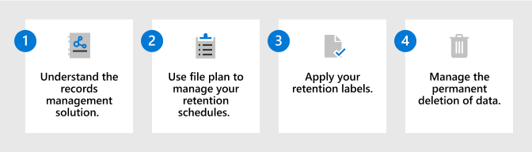

# Deploy a data governance solution with Microsoft Purview

>*[Microsoft 365 licensing guidance for security & compliance](/office365/servicedescriptions/microsoft-365-service-descriptions/microsoft-365-tenantlevel-services-licensing-guidance/microsoft-365-security-compliance-licensing-guidance).*

Use **Microsoft Purview Data Lifecycle Management** (formerly Microsoft Information Governance) and **Microsoft Purview Records Management** to govern your Microsoft 365 data for compliance or regulatory requirements.

For data governance that maps and manages data across your data estate, including multi-cloud, and software-as-a-service (SaaS), use [Microsoft Purview Data Map, Microsoft Purview Data Catalog, and Microsoft Purview Data Estate Insights](/azure/purview/overview).

For a data protection solution, see [Deploy an information protection solution with Microsoft Purview](information-protection-solution.md).

[!INCLUDE [purview-preview](../includes/purview-preview.md)]

## Licensing

To understand your licensing requirements and options, see the information from the Microsoft 365 guidance for security & compliance, [Microsoft Purview Data Lifecycle Management & Microsoft Purview Records Management](/office365/servicedescriptions/microsoft-365-service-descriptions/microsoft-365-tenantlevel-services-licensing-guidance/microsoft-365-security-compliance-licensing-guidance#microsoft-purview-data-lifecycle-management--microsoft-purview-records-management) section for feature-level licensing requirements.

## Keep what you need and delete what you don't

Use **Microsoft Purview Data Lifecycle Management** (formerly Microsoft Information Governance) to keep what you need and delete what you don't.

|Step|Description|More information|
|:---|:----------|:---------------|
|1| Understand how retention and deletion works for Microsoft 365 services.    After you understand how you can use retention policies and retention labels, identify your workloads that need a retention policy and whether you need to create retention labels for exceptions. | [Learn about retention policies and retention labels](retention.md)|
|2| Create retention policies and if needed, retention labels for exceptions.    The most commonly used retention policies are for Exchange, SharePoint, Teams, Microsoft 365 Groups, and Yammer. You can configure exceptions for documents and emails. | [Create retention policies](create-retention-policies.md) 
 [Create and apply retention labels for your exceptions](create-retention-labels-information-governance.md)|
|3| Manage mailboxes.    Enable mailboxes for archiving and auto-expanding archiving, consider whether you need to customize when emails are moved to the archive mailbox, and make mailboxes inactive when users leave the organization.| [Enable archive mailboxes](enable-archive-mailboxes.md) 
 [Enable auto-expanding archiving](enable-autoexpanding-archiving.md) 
 [Create and manage inactive mailboxes](create-and-manage-inactive-mailboxes.md)|
|4| Import PST files to online mailboxes.     If you have PST files that contain data you want to govern, you can import them by using network upload or drive shipping.| [Use network upload to import your organization's PST files](use-network-upload-to-import-pst-files.md) 
 [Use drive shipping to import your organization's PST files](use-drive-shipping-to-import-pst-files-to-office-365.md)|

To learn more about the capabilities from this solution, see [Learn about data lifecycle management](information-governance.md).

## Manage high-value items

Use **Microsoft Purview Records Management** to manage your organization's high-value items for business, legal, or regulatory record-keeping requirements.

|Step|Description|More information|
|:---|:----------|:---------------|
|1| Understand the records management solution.    Use retention labels with more flexible configuration options and when required, declare items as records. | [Learn about records management](records-management.md)|
|2| Use file plan to manage your retention schedules.    File plan lets you create retention labels interactively or import in bulk, and export for analysis. Labels that you create with file plan support additional administrative information to help you identify and track business or regulatory requirements. | [Use file plan to create and manage retention labels](file-plan-manager.md)|
|3| Apply your retention labels.    Your retention labels can be published and applied manually or automatically in apps, or automatically applied based on sensitive information, keywords or searchable properties, trainable classifiers, or cloud attachments. |[Publish retention labels and apply them in apps](create-apply-retention-labels.md) 
 [Apply a retention label to content automatically](apply-retention-labels-automatically.md)|
|4| Manage the permanent deletion of data.    Known as the disposition of data, you can require a manual review of content before it's permanently deleted, and provide proof of disposition for records. |[Manage content disposition](disposition.md)|

> [!TIP]
> Check the list of [common scenarios](get-started-with-records-management.md#common-scenarios) for additional configurations supported by records management.

To learn more about the capabilities from this solution, see [Learn about records management](records-management.md).

## Training resources

Learning modules for consultants and admins:

- [Introduction to information protection and data lifecycle management in Microsoft Purview](/training/modules/m365-compliance-information-governance)
- [Manage the data lifecycle in Microsoft Purview](/training/modules/m365-compliance-information-govern-information/)
- [Manage records in Microsoft Purview](/training/modules/m365-compliance-information-manage-records/)

For documentation to support users when these solutions are deployed, see the end user documentation sections for [data lifecycle management](get-started-with-information-governance.md#end-user-documentation) and [records management](get-started-with-records-management.md#end-user-documentation).
