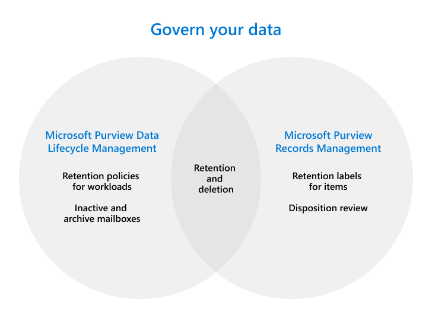

# Deploy a data governance solution with Microsoft Purview

[!include[Purview banner](../includes/purview-rebrand-banner.md)]

>*[Microsoft 365 licensing guidance for security & compliance](/office365/servicedescriptions/microsoft-365-service-descriptions/microsoft-365-tenantlevel-services-licensing-guidance/microsoft-365-security-compliance-licensing-guidance).*

Use the capabilities from **Microsoft Purview Data Lifecycle Management** (formerly Microsoft Information Governance) and **Microsoft Purview Records Management** to govern your data for compliance or regulatory requirements.

Both solutions support retention and deletion of data for Microsoft 365 apps and services. Use the following graphic to help you identify the main configurable components for these solutions that each have their own configuration area in the Microsoft Purview compliance portal:

Looking to protect your data? See [Protect your data with Microsoft Purview](information-protection.md).

## Licensing

To understand your licensing requirements and options, see the following sections from the [Microsoft 365 licensing documentation](/office365/servicedescriptions/microsoft-365-service-descriptions/microsoft-365-tenantlevel-services-licensing-guidance/microsoft-365-security-compliance-licensing-guidance): 
- [Information Governance](/office365/servicedescriptions/microsoft-365-service-descriptions/microsoft-365-tenantlevel-services-licensing-guidance/microsoft-365-security-compliance-licensing-guidance#information-governance) 
- [Records Management](/office365/servicedescriptions/microsoft-365-service-descriptions/microsoft-365-tenantlevel-services-licensing-guidance/microsoft-365-security-compliance-licensing-guidance#records-management) 

Any additional licensing requirements will be included in the documentation instructions. For example, licensing specific to managing mailboxes might require licenses from Exchange Online.

## Keep what you need and delete what you don't

Use Microsoft Purview Data Lifecycle Management (formerly Microsoft Information Governance) to keep what you need and delete what you don't:

|Step|Description|More information|
|:---|:----------|:---------------|
|1| Understand how retention and deletion works for Microsoft 365 services.    After you understand how you can use retention policies and retention labels, identify your workloads that need a retention policy and whether you need to create retention labels for exceptions. | [Learn about retention](retention.md)|
|2| Create retention policies and if needed, retention labels for exceptions. | [Create retention policies](create-retention-policies.md) 
 [Create and apply retention labels for your exceptions](create-retention-labels-information-governance.md)|
|3| Manage mailboxes.     Enable mailboxes for archiving and auto-expanding archiving, consider whether you need to customize when emails are moved to the archive mailbox, and make mailboxes inactive when users leave the organization.| [Enable archive mailboxes in the Microsoft Purview compliance portal](enable-archive-mailboxes.md) 
 [Enable auto-expanding archiving](enable-autoexpanding-archiving.md) 
 [Create and manage inactive mailboxes](create-and-manage-inactive-mailboxes.md)|
|4| Import PST files to online mailboxes.     If you have PST files that contain data you want to govern, you can import them them by using network upload or drive shipping.| [Use network upload to import your organization's PST files](use-network-upload-to-import-pst-files.md) 
 [Enable auto-expanding archiving](enable-autoexpanding-archiving.md) 
 [Use drive shipping to import your organization's PST files](use-drive-shipping-to-import-pst-files-to-office-365.md)|

To learn more about these capabilities, see [Learn about data lifecycle management](information-governance.md).

## Manage high-value items

Use Microsoft Purview Records Management to manage your organization's high-value items for business, legal, or regulatory record-keeping requirements:

|Step|Description|More information|
|:---|:----------|:---------------|
|1| Understand the records management solution.    Use retention labels with more flexible configuration options, require disposition review, and optionally declare items as records | [Learn about records management](records-management.md)|
|2| Use file plan to create and manage retention schedules.    File plan lets you create retention labels interactively or import in bulk, and export for analysis. Labels that you create with file plan support additional administrative information to help you identify and track business or regulatory requirements | [Use file plan to create and manage retention labels](file-plan-manager.md)|
|3| Publish and apply your retention labels. Your retention labels can be applied manually or automatically. |[Publish retention labels and apply them in apps](create-apply-retention-labels.md) 
 [Apply a retention label to content automatically](apply-retention-labels-automatically.md)|
|4| Manage content disposition.    You can require the manual review of content before it's permanently deleted, and provide proof of disposition of records |[Manage content disposition](disposition.md)|

To learn more about these capabilities, see [Learn about records management](records-management.md).

## Training resources

Learning modules for consultants and admins:

- [Introduction to information protection and governance in Microsoft 365](/learn/modules/m365-compliance-information-governance)
- [Govern information in Microsoft 365](/learn/modules/m365-compliance-information-govern-information/)
- [Manage records in Microsoft 365](/learn/modules/m365-compliance-information-manage-records/)

For your users, see the [end-user documentation](get-started-with-records-management.md#end-user-documentation) section.

- 

