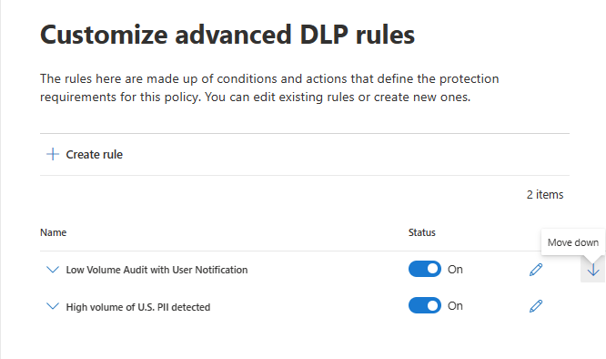

# Data loss prevention reference
 
> [!IMPORTANT]
> This is reference topic is no longer the main resource for Microsoft 365 data loss prevention (DLP) information. The DLP content set is being updated and restructured. The topics covered in this article will be moving to new, updated articles. For more information about DLP, see [Learn about data loss prevention](dlp-learn-about-dlp.md).

<!-- this topic needs to be split into smaller, more coherent ones. It is confusing as it is. -->
<!-- move this note to a more appropriate place, no topic should start with a note -->
> [!NOTE]
> Data loss prevention capabilities were recently added to Microsoft Teams chat and channel messages for users licensed for Office 365 Advanced Compliance, which is available as a standalone option and is included in Office 365 E5 and Microsoft 365 E5 Compliance. To learn more about licensing requirements, see [Microsoft 365 Tenant-Level Services Licensing Guidance](/office365/servicedescriptions/microsoft-365-service-descriptions/microsoft-365-tenantlevel-services-licensing-guidance).

<!-- MOVED TO LEARN ABOUT To comply with business standards and industry regulations, organizations must protect sensitive information and prevent its inadvertent disclosure. Sensitive information can include financial data or personally identifiable information (PII) such as credit card numbers, social security numbers, or health records. With a data loss prevention (DLP) policy in the Office 365 Security &amp; Compliance Center, you can identify, monitor, and automatically protect sensitive information across Office 365.
  
With a DLP policy, you can:
  
- **Identify sensitive information across many locations, such as Exchange Online, SharePoint Online, OneDrive for Business, and Microsoft Teams.**
    
    For example, you can identify any document containing a credit card number that's stored in any OneDrive for Business site, or you can monitor just the OneDrive sites of specific people.
    
- **Prevent the accidental sharing of sensitive information**. 
    
    For example, you can identify any document or email containing a health record that's shared with people outside your organization, and then automatically block access to that document or block the email from being sent.
    
- **Monitor and protect sensitive information in the desktop versions of Excel, PowerPoint, and Word.**
    
    Just like in Exchange Online, SharePoint Online, and OneDrive for Business, these Office desktop programs include the same capabilities to identify sensitive information and apply DLP policies. DLP provides continuous monitoring when people share content in these Office programs.
    
- **Help users learn how to stay compliant without interrupting their workflow.**
    
    You can educate your users about DLP policies and help them remain compliant without blocking their work. For example, if a user tries to share a document containing sensitive information, a DLP policy can both send them an email notification and show them a policy tip in the context of the document library that allows them to override the policy if they have a business justification. The same policy tips also appear in Outlook on the web, Outlook, Excel, PowerPoint, and Word.
    
- **View DLP alerts and reports showing content that matches your organization’s DLP policies.**
    
    To view alerts and metadata related to your DLP policies you can use the [DLP Alerts Management Dashboard](dlp-configure-view-alerts-policies.md). You can also view policy match reports to assess how your organization is complying with a DLP policy. If a DLP policy allows users to override a policy tip and report a false positive, you can also view what users have reported

-->    
## Create and manage DLP policies

You create and manage DLP policies on the Data loss prevention page in the Microsoft 365 Compliance center.
  

  
<!-- MOVED TO LEARN ABOUT ## What a DLP policy contains

A DLP policy contains a few basic things:
  
- Where to protect the content: **locations** such as Exchange Online, SharePoint Online, and OneDrive for Business sites, as well as Microsoft Teams chat and channel messages. 
    
- When and how to protect the content by enforcing **rules** comprised of: 
    
  - **Conditions** the content must match before the rule is enforced. For example, a rule might be configured to look only for content containing Social Security numbers that's been shared with people outside your organization. 
    
  - **Actions** that you want the rule to take automatically when content matching the conditions is found. For example, a rule might be configured to block access to a document and send both the user and compliance officer an email notification. -->
    
You can use a rule to meet a specific protection requirement, and then use a DLP policy to group together common protection requirements, such as all of the rules needed to comply with a specific regulation.
  
For example, you might have a DLP policy that helps you detect the presence of information subject to the Health Insurance Portability and Accountability Act (HIPAA). This DLP policy could help protect HIPAA data (the what) across all SharePoint Online sites and all OneDrive for Business sites (the where) by finding any document containing this sensitive information that's shared with people outside your organization (the conditions) and then blocking access to the document and sending a notification (the actions). These requirements are stored as individual rules and grouped together as a DLP policy to simplify management and reporting.
  

  
<!-- MOVED TO LEARN ABOUT ### Locations

DLP policies are applied to sensitive items across Microsoft 365 locations and can be further scoped as detailed in this table.

|Location | Include/exclude by|
|---------|---------|
|Exchange email| distribution groups|
|SharePoint sites |sites |
|OneDrive accounts |accounts |
|Teams chat and channel messages |accounts |
|Windows 10 devices |user or group |
|Microsoft Cloud App Security |instance |
 -->

If you choose to include specific distribution groups in Exchange, the DLP policy will be scoped only to the members of that group. Similarly excluding a distribution group will exclude all the members of that distribution group from policy evaluation. You can choose to scope a policy to the members of distribution lists, dynamic distribution groups, and security groups. A DLP policy can contain no more than 50 such inclusions and exclusions.

If you choose to include or exclude specific SharePoint sites, a DLP policy can contain no more than 100 such inclusions and exclusions. Although this limit exists, you can exceed this limit by applying either an org-wide policy or a policy that applies to entire locations.

If you choose to include or exclude specific OneDrive accounts or groups, a DLP policy can contain no more than 100 user accounts or 50 groups as inclusion or exclusion.

> [!NOTE]
> OneDrive for business policy scoping using accounts or groups is in public preview. During this phase, you can either include or exclude user accounts and groups as part of a DLP policy. Both inclusion and exclusion as part of the same policy is not supported.
  
### Rules

> [!NOTE]
> The default behavior of a DLP policy, when there is no alert configured, is not to alert or trigger. This applies only to default information types. For custom information types, the system will alert even if there is no action defined in the policy.

Rules are what enforce your business requirements on your organization's content. A policy contains one or more rules, and each rule consists of conditions and actions. For each rule, when the conditions are met, the actions are taken automatically. Rules are executed sequentially, starting with the highest-priority rule in each policy.
  
A rule also provides options to notify users (with policy tips and email notifications) and admins (with email incident reports) that content has matched the rule.
  
Here are the components of a rule, each explained below.
  

  
#### Conditions

Conditions are important because they determine what types of information you're looking for, and when to take an action. For example, you might choose to ignore content containing passport numbers unless the content contains more than 10 such numbers and is shared with people outside your organization.
  
Conditions focus on the **content**, such as what types of sensitive information you're looking for, and also on the **context**, such as who the document is shared with. You can use conditions to assign different actions to different risk levels. For example, sensitive content shared internally might be lower risk and require fewer actions than sensitive content shared with people outside the organization. 
  

  
The conditions now available can determine if:
  
- Content contains a type of sensitive information.
    
- Content contains a label. For more information, see the below section [Using a retention label as a condition in a DLP policy](#using-a-retention-label-as-a-condition-in-a-dlp-policy).
    
- Content is shared with people outside or inside your organization.

  > [!NOTE]
  > Users who have non-guest accounts in a host organization's Active Directory or Azure Active Directory tenant are considered as people inside the organization.
    
#### Types of sensitive information

A DLP policy can help protect sensitive information, which is defined as a **sensitive information type**. Microsoft 365 includes definitions for many common sensitive information types across many different regions that are ready for you to use, such as a credit card number, bank account numbers, national ID numbers, and passport numbers. 
  

  
When a DLP policy looks for a sensitive information type such as a credit card number, it doesn't simply look for a 16-digit number. Each sensitive information type is defined and detected by using a combination of:
  
- Keywords.
    
- Internal functions to validate checksums or composition.
    
- Evaluation of regular expressions to find pattern matches.
    
- Other content examination.
    
This helps DLP detection achieve a high degree of accuracy while reducing the number of false positives that can interrupt peoples' work.
  
#### Actions

When content matches a condition in a rule, you can apply actions to automatically protect the content.
  

  
With the actions now available, you can:
  
- **Restrict access to the content** Depending on your need, you can restrict access to content in three ways:

  1. Restrict access to content for everyone.
  2. Restrict access to content for people outside the organization.
  3. Restrict access to "Anyone with the link."

  For site content, this means that permissions for the document are restricted for everyone except the primary site collection administrator, document owner, and person who last modified the document. These people can remove the sensitive information from the document or take other remedial action. When the document is in compliance, the original permissions are automatically restored. When access to a document is blocked, the document appears with a special policy tip icon in the library on the site. 
    
  
  
  For email content, this action blocks the message from being sent. Depending on how the DLP rule is configured, the sender sees an NDR or (if the rule uses a notification) a policy tip and/or email notification.
    
  
  
#### User notifications and user overrides

You can use notifications and overrides to educate your users about DLP policies and help them remain compliant without blocking their work. For example, if a user tries to share a document containing sensitive information, a DLP policy can both send them an email notification and show them a policy tip in the context of the document library that allows them to override the policy if they have a business justification.
  

  
The email can notify the person who sent, shared, or last modified the content and, for site content, the primary site collection administrator and document owner. In addition, you can add or remove whomever you choose from the email notification.
  
In addition to sending an email notification, a user notification displays a policy tip:
  
- In Outlook and Outlook on the web.
    
- For the document on a SharePoint Online or OneDrive for Business site.
    
- In Excel, PowerPoint, and Word, when the document is stored on a site included in a DLP policy.
    
The email notification and policy tip explain why content conflicts with a DLP policy. If you choose, the email notification and policy tip can allow users to override a rule by reporting a false positive or providing a business justification. This can help you educate users about your DLP policies and enforce them without preventing people from doing their work. Information about overrides and false positives is also logged for reporting (see below about the DLP reports) and included in the incident reports (next section), so that the compliance officer can regularly review this information.
  
Here's what a policy tip looks like in a OneDrive for Business account.
  

 To learn more about user notifications and policy tips in DLP policies, see [Use notifications and policy tips](use-notifications-and-policy-tips.md).

#### Alerts and Incident reports

When a rule is matched, you can send an alert email to your compliance officer ( or any person(s) you choose) with details of the alert. This alert email will carry a link of the [DLP Alerts Management Dashboard](dlp-configure-view-alerts-policies.md) which the compliance officer can go to view the details of alert and events. The dashboard contains details of the event that triggered the alert along with details of the DLP policy matched and the sensitive content detected.

In addition, you can also send an incident report with details of the event. This report includes information about the item that was matched, the actual content that matched the rule, and the name of the person who last modified the content. For email messages, the report also includes as an attachment the original message that matches a DLP policy.

> [!div class="mx-imgBorder"]
> 

DLP scans email differently from items in SharePoint Online or OneDrive for Business. In SharePoint Online and OneDrive for Business, DLP scans existing items as well as new ones and generates an alert and incident report whenever a match is found. In Exchange Online, DLP only scans new email messages and generates a report if there is a policy match. DLP ***does not*** scan or match previously existing email items that are stored in a mailbox or archive.
  
## Grouping and logical operators

Often your DLP policy has a straightforward requirement, such as to identify all content that contains a U.S. Social Security Number. However, in other scenarios, your DLP policy might need to identify more loosely defined data.
  
For example, to identify content subject to the U.S. Health Insurance Act (HIPAA), you need to look for:
  
- Content that contains specific types of sensitive information, such as a U.S. Social Security Number or Drug Enforcement Agency (DEA) Number.
    
    AND
    
- Content that's more difficult to identify, such as communications about a patient's care or descriptions of medical services provided. Identifying this content requires matching keywords from very large keyword lists, such as the International Classification of Diseases (ICD-9-CM or ICD-10-CM).
    
You can easily identify such loosely defined data by using grouping and logical operators (AND, OR). When you create a DLP policy, you can:
  
- Group sensitive information types.
    
- Choose the logical operator between the sensitive information types within a group and between the groups themselves.
    
### Choosing the operator within a group

Within a group, you can choose whether any or all of the conditions in that group must be satisfied for the content to match the rule.
  

  
### Adding a group

You can quickly add a group, which can have its own conditions and operator within that group.
  

  
### Choosing the operator between groups

Between groups, you can choose whether the conditions in just one group or all of the groups must be satisfied for the content to match the rule.
  
For example, the built-in **U.S. HIPAA** policy has a rule that uses an **AND** operator between the groups so that it identifies content that contains: 
  
- from the group **PII Identifiers** (at least one SSN number **OR** DEA number) 
    
    **AND**
    
- from the group **Medical Terms** (at least one ICD-9-CM keyword **OR** ICD-10-CM keyword) 
    

  
## The priority by which rules are processed

When you create rules in a policy, each rule is assigned a priority in the order in which it's created — meaning, the rule created first has first priority, the rule created second has second priority, and so on.

> [!div class="mx-imgBorder"]
> 
  
After you have set up more than one DLP policy, you can change the priority of one or more policies. To do that, select a policy, choose **Edit policy**, and use the **Priority** list to specify its priority.

> [!div class="mx-imgBorder"]
> 

When content is evaluated against rules, the rules are processed in priority order. If content matches multiple rules, the rules are processed in priority order and the most restrictive action is enforced. For example, if content matches all of the following rules, Rule 3 is enforced because it's the highest priority, most restrictive rule:
  
- Rule 1: only notifies users
    
- Rule 2: notifies users, restricts access, and allows user overrides
    
- Rule 3: notifies users, restricts access, and does not allow user overrides
    
- Rule 4: only notifies users
    
- Rule 5: restricts access
    
- Rule 6: notifies users, restricts access, and does not allow user overrides
    
In this example, note that matches for all of the rules are recorded in the audit logs and shown in the DLP reports, even though only the most restrictive rule is enforced.
  
Regarding policy tips, note that:
  
- Only the policy tip from the highest priority, most restrictive rule will be shown. For example, a policy tip from a rule that blocks access to content will be shown over a policy tip from a rule that simply sends a notification. This prevents people from seeing a cascade of policy tips.
    
- If the policy tips in the most restrictive rule allow people to override the rule, then overriding this rule also overrides any other rules that the content matched.
    
## Tuning rules to make them easier or harder to match

After people create and turn on their DLP policies, they sometimes run into these issues:
  
- Too much content that **is not** sensitive information matches the rules — in other words, too many false positives. 
    
- Too little content that **is** sensitive information matches the rules. In other words, the protective actions aren't being enforced on the sensitive information. 
    
To address these issues, you can tune your rules by adjusting the instance count and match accuracy to make it harder or easier for content to match the rules. Each sensitive information type used in a rule has both an instance count and match accuracy.
  
### Instance count

Instance count means simply how many occurrences of a specific type of sensitive information must be present for content to match the rule. For example, content matches the rule shown below if between 1 and 9 unique U.S. or U.K. passport numbers are identified.

> [!NOTE]
> The instance count includes only **unique** matches for sensitive information types and keywords. For example, if an email contains 10 occurrences of the same credit card number, those 10 occurrences count as a single instance of a credit card number.
  
To use instance count to tune rules, the guidance is straightforward:
  
- To make the rule easier to match, decrease the **min** count and/or increase the **max** count. You can also set **max** to **any** by deleting the numerical value. 
    
- To make the rule harder to match, increase the **min** count. 
    
Typically, you use less restrictive actions, such as sending user notifications, in a rule with a lower instance count (for example, 1-9). And you use more restrictive actions, such as restricting access to content without allowing user overrides, in a rule with a higher instance count (for example, 10-any).
  

  
### Match accuracy

As described above, a sensitive information type is defined and detected by using a combination of different types of evidence. Commonly, a sensitive information type is defined by multiple such combinations, called patterns. A pattern that requires less evidence has a lower match accuracy (or confidence level), while a pattern that requires more evidence has a higher match accuracy (or confidence level). To learn more about the actual patterns and confidence levels used by every sensitive information type, see [Sensitive information type entity definitions](sensitive-information-type-entity-definitions.md).
  
For example, the sensitive information type named Credit Card Number is defined by two patterns:
  
- A pattern with 65% confidence that requires:
    
  - A number in the format of a credit card number.
    
  - A number that passes the checksum.
    
- A pattern with 85% confidence that requires:
    
  - A number in the format of a credit card number.
    
  - A number that passes the checksum.
    
  - A keyword or an expiration date in the right format.
    
You can use these confidence levels (or match accuracy) in your rules. Typically, you use less restrictive actions, such as sending user notifications, in a rule with lower match accuracy. And you use more restrictive actions, such as restricting access to content without allowing user overrides, in a rule with higher match accuracy.
  
It's important to understand that when a specific type of sensitive information, such as a credit card number, is identified in content, only a single confidence level is returned:
  
- If all of the matches are for a single pattern, the confidence level for that pattern is returned.
    
- If there are matches for more than one pattern (that is, there are matches with two different confidence levels), a confidence level higher than any of the single patterns alone is returned. This is the tricky part. For example, for a credit card, if both the 65% and 85% patterns are matched, the confidence level returned for that sensitive information type is greater than 90% because more evidence means more confidence.
    
So if you want to create two mutually exclusive rules for credit cards, one for the 65% match accuracy and one for the 85% match accuracy, the ranges for match accuracy would look like this. The first rule picks up only matches of the 65% pattern. The second rule picks up matches with **at least one** 85% match and **can potentially have** other lower-confidence matches. 
  

  
For these reasons, the guidance for creating rules with different match accuracies is:
  
- The lowest confidence level typically uses the same value for **min** and **max** (not a range). 
    
- The highest confidence level is typically a range from just above the lower confidence level to 100.
    
- Any in-between confidence levels typically range from just above the lower confidence level to just below the higher confidence level.
    
## Using a retention label as a condition in a DLP policy

When you use a previously created and published [retention label](retention.md#retention-labels) as a condition in a DLP policy, there are some things to be aware of:

- The retention label must be created and published before you attempt to use it as a condition in a DLP policy.
- Published retention labels can take from one to seven days to sync. For more information, see [When retention labels become available to apply](create-apply-retention-labels.md#when-retention-labels-become-available-to-apply) for retention labels published in a retention policy, and [How long it takes for retention labels to take effect](apply-retention-labels-automatically.md#how-long-it-takes-for-retention-labels-to-take-effect) for retention labels that are auto-published.
- Using a retention label in a policy **is only supported for items in SharePoint and OneDrive***.

  

  You might want to use a retention label in a DLP policy if you have items that are under retention and disposition, and you also want to apply other controls to them, for example:

  - You published a retention label named **tax year 2018**, which when applied to tax documents from 2018 that are stored in SharePoint retains them for 10 years then disposes of them. You also don't want those items being shared outside your organization, which you can do with a DLP policy.

  > [!IMPORTANT]
  > You'll get this error if you specify a retention label as a condition in a DLP policy and you also include Exchange and/or Teams as a location: **"Protecting labeled content in email and teams messages isn't supported. Either remove the label below or turn off Exchange and Teams as a location."** This is because Exchange transport does not evaluate the label metadata during message submission and delivery. 

### Using a sensitivity label as a condition in a DLP policy

[Learn more](./dlp-sensitivity-label-as-condition.md) about using Sensitivity label as a condition in DLP policies.
  
### How this feature relates to other features

Several features can be applied to content containing sensitive information:
  
- A [retention label and a retention policy](retention.md) can both enforce **retention** actions on this content. 
    
- A DLP policy can enforce **protection** actions on this content. And before enforcing these actions, a DLP policy can require other conditions to be met in addition to the content containing a label. 
    

  
Note that a DLP policy has a richer detection capability than a label or retention policy applied to sensitive information. A DLP policy can enforce protective actions on content containing sensitive information, and if the sensitive information is removed from the content, those protective actions are undone the next time the content's scanned. But if a retention policy or label is applied to content containing sensitive information, that's a one-time action that won't be undone even if the sensitive information is removed.
  
By using a label as a condition in a DLP policy, you can enforce both retention and protection actions on content with that label. You can think of content containing a label exactly like content containing sensitive information - both a label and a sensitive information type are properties used to classify content, so that you can enforce actions on that content.
  

  
## Simple settings vs. advanced settings

When you create a DLP policy, you'll choose between simple or advanced settings:
  
- **Simple settings** make it easy to create the most common type of DLP policy without using the rule editor to create or modify rules. 
    
- **Advanced settings** use the rule editor to give you complete control over every setting for your DLP policy. 
    
Don't worry, under the covers, simple settings and advanced settings work exactly the same, by enforcing rules comprised of conditions and actions—only with simple settings, you don't see the rule editor. It's a quick way to create a DLP policy.
  
### Simple settings

By far, the most common DLP scenario is creating a policy to help protect content containing sensitive information from being shared with people outside your organization, and taking an automatic remediating action such as restricting who can access the content, sending end-user or admin notifications, and auditing the event for later investigation. People use DLP to help prevent the inadvertent disclosure of sensitive information.
  
To simplify achieving this goal, when you create a DLP policy, you can choose **Use simple settings**. These settings provide everything you need to implement the most common DLP policy, without having to go into the rule editor.
  

  
### Advanced settings

If you need to create more customized DLP policies, you can choose **Use advanced settings**.
  
The advanced settings present you with the rule editor, where you have full control over every possible option, including the instance count and match accuracy (confidence level) for each rule.
  
To jump to a section quickly, click an item in the top navigation of the rule editor to go to that section below.
  

  
## DLP policy templates

The first step in creating a DLP policy is choosing what information to protect. By starting with a DLP template, you save the work of building a new set of rules from scratch, and figuring out which types of information should be included by default. You can then add to or modify these requirements to fine tune the rule to meet your organization's specific requirements.
  
A preconfigured DLP policy template can help you detect specific types of sensitive information, such as HIPAA data, PCI-DSS data, Gramm-Leach-Bliley Act data, or even locale-specific personally identifiable information (P.I.). To make it easy for you to find and protect common types of sensitive information, the policy templates included in Microsoft 365 already contain the most common sensitive information types necessary for you to get started.
  

  
Your organization may also have its own specific requirements, in which case you can create a DLP policy from scratch by choosing the **Custom policy** option. A custom policy is empty and contains no premade rules. 
  
## Roll out DLP policies gradually with test mode

When you create your DLP policies, you should consider rolling them out gradually to assess their impact and test their effectiveness before fully enforcing them. For example, you don't want a new DLP policy to unintentionally block access to thousands of documents that people require access to in order to get their work done.
  
If you're creating DLP policies with a large potential impact, we recommend following this sequence:
  
1. **Start in test mode without Policy Tips** and then use the DLP reports and any incident reports to assess the impact. You can use DLP reports to view the number, location, type, and severity of policy matches. Based on the results, you can fine tune the rules as needed. In test mode, DLP policies will not impact the productivity of people working in your organization. 
    
2. **Move to Test mode with notifications and Policy Tips** so that you can begin to teach users about your compliance policies and prepare them for the rules that are going to be applied. At this stage, you can also ask users to report false positives so that you can further refine the rules. 
    
3. **Start full enforcement on the policies** so that the actions in the rules are applied and the content's protected. Continue to monitor the DLP reports and any incident reports or notifications to make sure that the results are what you intend. 

    

    You can turn off a DLP policy at any time, which affects all rules in the policy. However, each rule can also be turned off individually by toggling its status in the rule editor.

    

    You can also change the priority of multiple rules in a policy. To do that, open a policy for editing. In a row for a rule, choose the ellipses (**...**), and then choose an option, such as **Move down** or **Bring to last**.

    > [!div class="mx-imgBorder"]
    > 
  
## DLP reports

After you create and turn on your DLP policies, you'll want to verify that they're working as you intended and helping you stay compliant. With DLP reports, you can quickly view the number of DLP policy and rule matches over time, and the number of false positives and overrides. For each report, you can filter those matches by location, time frame, and even narrow it down to a specific policy, rule, or action.
  
With the DLP reports, you can get business insights and:
  
- Focus on specific time periods and understand the reasons for spikes and trends.
    
- Discover business processes that violate your organization's compliance policies.
    
- Understand any business impact of the DLP policies.
    
In addition, you can use the DLP reports to fine tune your DLP policies as you run them.
  

  
## How DLP policies work

DLP detects sensitive information by using deep content analysis (not just a simple text scan). This deep content analysis uses keyword matches, dictionary matches, the evaluation of regular expressions, internal functions, and other methods to detect content that matches your DLP policies. Potentially only a small percentage of your data is considered sensitive. A DLP policy can identify, monitor, and automatically protect just that data, without impeding or affecting people who work with the rest of your content.
  
### Policies are synced

After you create a DLP policy in the Security &amp; Compliance Center, it's stored in a central policy store, and then synced to the various content sources, including:
  
- Exchange Online, and from there to Outlook on the web and Outlook.
    
- OneDrive for Business sites.
    
- SharePoint Online sites.
    
- Office desktop programs (Excel, PowerPoint, and Word).

- Microsoft Teams channels and chat messages.
    
After the policy's synced to the right locations, it starts to evaluate content and enforce actions.
<!-- what is the time delay for first deployment of a policy and what is the sync schedule? -->
  
### Policy evaluation in OneDrive for Business and SharePoint Online sites

Across all of your SharePoint Online sites and OneDrive for Business sites, documents are constantly changing — they're continually being created, edited, shared, and so on. This means documents can conflict or become compliant with a DLP policy at any time. For example, a person can upload a document that contains no sensitive information to their team site, but later, a different person can edit the same document and add sensitive information to it.
  
For this reason, DLP policies check documents for policy matches frequently in the background. You can think of this as asynchronous policy evaluation.
<!-- what is the frequency? looks like it is tied to the search crawl schedule -->
  
#### How it works
 
As people add or change documents in their sites, the search engine scans the content, so that you can search for it later. While this is happening, the content's also scanned for sensitive information and to check if it's shared. Any sensitive information that's found is stored securely in the search index, so that only the compliance team can access it, but not typical users. Each DLP policy that you've turned on runs in the background (asynchronously), checking search frequently for any content that matches a policy, and applying actions to protect it from inadvertent leaks.
  

  
<!-- conflict with a DLP policy is bad wording -->
Finally, documents can conflict with a DLP policy, but they can also become compliant with a DLP policy. For example, if a person adds credit card numbers to a document, it might cause a DLP policy to block access to the document automatically. But if the person later removes the sensitive information, the action (in this case, blocking) is automatically undone the next time the document is evaluated against the policy.
  
DLP evaluates any content that can be indexed. For more information on what file types are crawled by default, see [Default crawled file name extensions and parsed file types in SharePoint Server](/SharePoint/technical-reference/default-crawled-file-name-extensions-and-parsed-file-types).

> [!NOTE]
> In order to prevent documents from being shared before DLP policies had the opportunity to analyze them, sharing of new files in SharePoint can be blocked until its content has been indexed. See, [Mark new files as sensitive by default](/sharepoint/sensitive-by-default) for detailed information. 
  
### Policy evaluation in Exchange Online, Outlook, and Outlook on the web

When you create a DLP policy that includes Exchange Online as a location, the policy's synced from the Office 365 Security &amp; Compliance Center to Exchange Online, and then from Exchange Online to Outlook on the web and Outlook.
  
When a message is being composed in Outlook, the user can see policy tips as the content being created is evaluated against DLP policies. And after a message is sent, it's evaluated against DLP policies as a normal part of mail flow, along with Exchange mail flow rules (also known as transport rules) and DLP policies created in the Exchange admin center. DLP policies scan both the message and any attachments.
  
### Policy evaluation in the Office desktop programs

<!-- same capability to identify sensitive information line conflates sensitive information types and such -->
Excel, PowerPoint, and Word include the same capability to identify sensitive information and apply DLP policies as SharePoint Online and OneDrive for Business. These Office programs sync their DLP policies directly from the central policy store, and then continuously evaluate the content against the DLP policies when people work with documents opened from a site that's included in a DLP policy.
  
DLP policy evaluation in Office is designed not to affect the performance of the programs or the productivity of people working on content. If they're working on a large document, or the user's computer is busy, it might take a few seconds for a policy tip to appear.

### Policy evaluation in Microsoft Teams
 <!--what do you mean that it's synched to user accounts?  I thought DLP policies were applied to locations not users like sensitivity labels are  -->

When you create a DLP policy that includes Microsoft Teams as a location, the policy's synced from the Office 365 Security &amp; Compliance Center to user accounts and Microsoft Teams channels and chat messages. Depending on how DLP policies are configured, when someone attempts to share sensitive information in a Microsoft Teams chat or channel message, the message can be blocked or revoked. And, documents that contain sensitive information and that are shared with guests (external users) won't open for those users. To learn more, see [Data loss prevention and Microsoft Teams](dlp-microsoft-teams.md).
 
## Permissions

Members of your compliance team who will create DLP policies need permissions to the Security &amp; Compliance Center. By default, your tenant admin will have access to this location and can give compliance officers and other people access to the Security &amp; Compliance Center, without giving them all of the permissions of a tenant admin. To do this, we recommend that you:
  
1. Create a group in Microsoft 365 and add compliance officers to it.
    
2. Create a role group on the **Permissions** page of the Security &amp; Compliance Center. 

3. While creating the role group, use the **Choose Roles** section to add the following role to the Role Group: **DLP Compliance Management**.
    
4. Use the **Choose Members** section to add the Microsoft 365 group you created before to the role group.

You can also create a role group with view-only privileges to the DLP policies and DLP reports by granting the **View-Only DLP Compliance Management** role.

For more information, see [Give users access to the Office 365 Compliance Center](../security/office-365-security/grant-access-to-the-security-and-compliance-center.md).
  
These permissions are required only to create and apply a DLP policy. Policy enforcement does not require access to the content.
  
## Find the DLP cmdlets

To use most of the cmdlets for the Security &amp; Compliance Center, you need to:
  
1. [Connect to the Office 365 Security &amp; Compliance Center using remote PowerShell](/powershell/exchange/connect-to-scc-powershell).
    
2. Use any of these [policy-and-compliance-dlp cmdlets](/powershell/module/exchange/export-dlppolicycollection).
    
However, DLP reports need pull data from across Microsoft 365, including Exchange Online. For this reason, **the cmdlets for the DLP reports are available in Exchange Online Powershell -- not in Security &amp; Compliance Center Powershell**. Therefore, to use the cmdlets for the DLP reports, you need to:
  
1. [Connect to Exchange Online using remote PowerShell](/powershell/exchange/connect-to-exchange-online-powershell).
    
2. Use any of these cmdlets for the DLP reports:
    
    - [Get-DlpDetectionsReport](/powershell/module/exchange/Get-DlpDetectionsReport)

    - [Get-DlpDetailReport](/powershell/module/exchange/Get-DlpDetailReport)
    
## More information

- [Create a DLP policy from a template](create-a-dlp-policy-from-a-template.md)
    
- [Send notifications and show policy tips for DLP policies](use-notifications-and-policy-tips.md)
    
- [Create a DLP policy to protect documents with FCI or other properties](protect-documents-that-have-fci-or-other-properties.md)
    
- [What the DLP policy templates include](what-the-dlp-policy-templates-include.md)
    
- [Sensitive information type entity definitions](sensitive-information-type-entity-definitions.md)
    
- [What the DLP functions look for](what-the-dlp-functions-look-for.md)
    
- [Create a custom sensitive information type](create-a-custom-sensitive-information-type.md)
