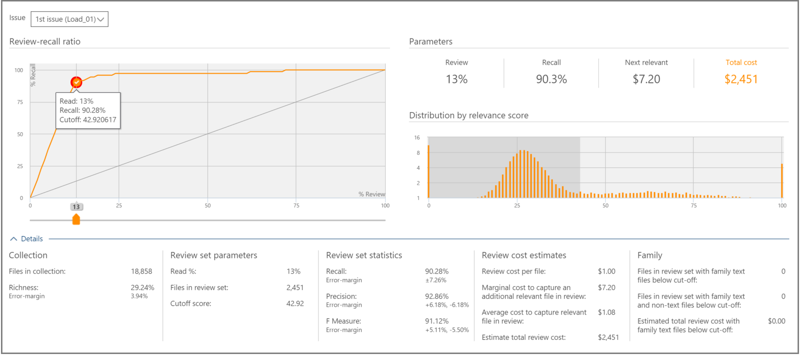

# Decision based on the results in Advanced eDiscovery (classic)

> [!NOTE]
> Advanced eDiscovery requires an Office 365 E3 with the Advanced Compliance add-on or an E5 subscription for your organization. If you don't have that plan and want to try Advanced eDiscovery, you can [sign up for a trial of Office 365 Enterprise E5](https://go.microsoft.com/fwlink/p/?LinkID=698279). 
  
 In Advanced eDiscovery, the Decide tab provides additional information for viewing and using decision-support statistics for determining the size of the review set of case files. 
  
## Using the Decide tab

  
This tab includes the following components:
  
- **Issue**: From here, you can select the issue of interest from the list. 
    
- **Review-recall ratio**: Comparisons of Advanced eDiscovery review according to Relevance scores. The Cutoff point in the chart represents the percentage of files to review, mapped to a Relevance score. This is used in the Relevance Test phase and as an Export threshold for culling. The default cutoff point, for the number of files to review is at the point in which the balance between Recall and Precision is optimal. The actual cutoff point should be determined by the user depending on objectives and the cost tradeoff (%review) and risk (%recall). Using the slider, you can adjust the cutoff point and see the effect on the graph and parameters, when adjusting the percent of relevant files to be retrieved, and before validating a decision.
    
- **Parameters**: Review, Recall, Next relevant and Total cost parameters are cumulative calculated statistics pertaining to the review set in relation to the collection for the entire case. Definitions for these parameters are as follows:
    
    **Review**: Percentage of files to review based on this cutoff. 
    
    **Recall**: Percentage of relevant files in the review set. 
    
    **Next relevant**: Cost to review and identify an additional relevant file that is not currently in the review set. 
    
    **Total cost**: Cost for reviewing this percentage of the case files. Cost parameter settings can be set by the Case manager.
    
- **Distribution by relevance score**: Files in the dark gray display to the left are below the cutoff score. A tool-tip displays the Relevance score and the related percentage of files in the review file set in relation to the total files.
    
The expanded Details pane displays additional details. Files in collection figures do not include empty or nebulous files. Family files figures represent files that are not loaded in Relevance, yet still counted as part of the family.
  
