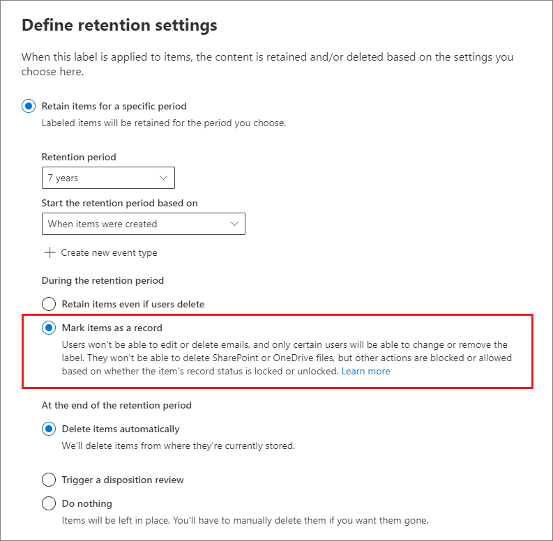
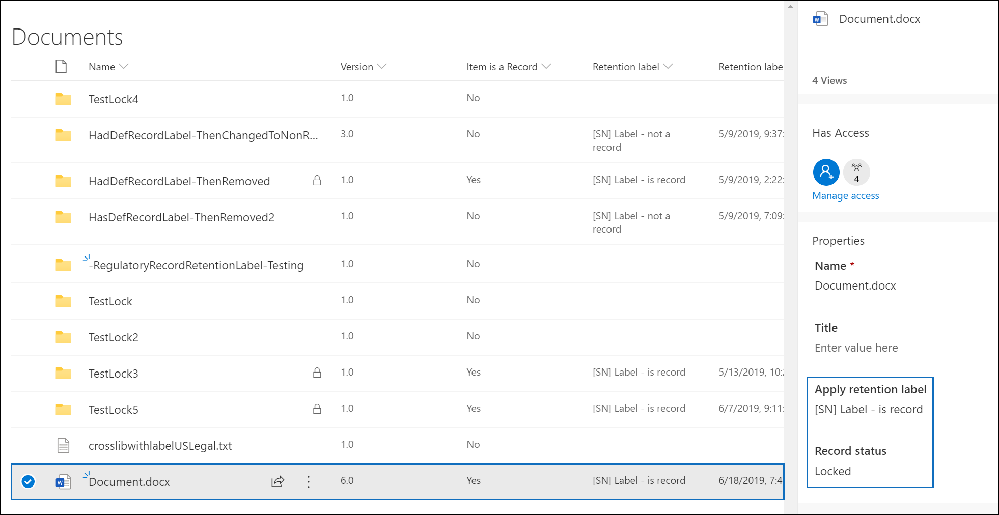

# Declare records by using retention labels

>*[Microsoft 365 licensing guidance for security & compliance](/office365/servicedescriptions/microsoft-365-service-descriptions/microsoft-365-tenantlevel-services-licensing-guidance/microsoft-365-security-compliance-licensing-guidance).*

To declare documents and emails as [records](records-management.md#records), you use [retention labels](retention.md#retention-labels) that mark the content as a **record** or a **regulatory record**.

If you're not sure whether to use a record or a regulatory record, see [Compare restrictions for what actions are allowed or blocked](records-management.md#compare-restrictions-for-what-actions-are-allowed-or-blocked). If you need to use regulatory records, you must first run a PowerShell command, as described in the next section.

You can then either publish those labels in a retention label policy so that users and administrators can apply them to content, or for labels that mark items as records (but not regulatory records), auto-apply those labels to content that you want to declare a record.

## How to display the option to mark content as a regulatory record

>[!NOTE] 
> The following procedure is an auditable action, logging **Enabled regulatory record option for retention labels** in the [Retention policy and retention label activities](search-the-audit-log-in-security-and-compliance.md#retention-policy-and-retention-label-activities) section of the audit log.

By default, the retention label option to mark content as a regulatory record isn't displayed in the retention label wizard. To display this option, you must first run a PowerShell command:

1. [Connect to the Office 365 Security & Compliance Center Powershell](/powershell/exchange/office-365-scc/connect-to-scc-powershell/connect-to-scc-powershell).

2. Run the following cmdlet:
    
    ```powershell
    Set-RegulatoryComplianceUI -Enabled $true
    ````
    There is no prompt to confirm and the setting takes effect immediately.

If you change your mind about seeing this option in the retention label wizard, you can hide it again by running the same cmdlet with the **false** value: `Set-RegulatoryComplianceUI -Enabled $false` 

## Configuring retention labels to declare records

When you create a retention label from the **Records Management** solution in the Microsoft 365 compliance center, you have the option to mark items as a record. If you ran the PowerShell command from the previous section, you can alternatively mark items as a regulatory record.

For example:



Using this retention label, you can now apply it to SharePoint or OneDrive documents and Exchange emails, as needed. 

For full instructions:

- [Create retention labels and apply them in apps](create-apply-retention-labels.md)

- [Apply a retention label to content automatically](apply-retention-labels-automatically.md) (not supported for regulatory records)


## Applying the configured retention label to content

When retention labels that mark items as a record or regulatory record are made available for users to apply them in apps:

- For Exchange, any user with write-access to the mailbox can apply these labels. 
- For SharePoint and OneDrive, any user in the default Members group (the Contribute permission level) can apply these labels.

Example of a document marked as record by using a retention label:



## Next steps

For a list of scenarios supported by records management, see [Common scenarios for records management](get-started-with-records-management.md#common-scenarios-for-records-management).