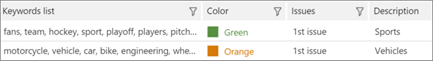
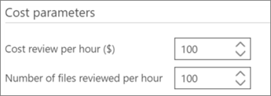

# Define highlighted keywords and advanced options in Advanced eDiscovery (classic)

> [!NOTE]
> Advanced eDiscovery requires an Office 365 E3 with the Advanced Compliance add-on or an E5 subscription for your organization. If you don't have that plan and want to try Advanced eDiscovery, you can [sign up for a trial of Office 365 Enterprise E5](https://go.microsoft.com/fwlink/p/?LinkID=698279). 
  
In Advanced eDiscovery, it's possible to add user-defined keywords to Relevance in order to help you identify relevant files while tagging. Keywords will be displayed in the specified colors in **Relevance \> Tag**. 
  
As described below, keyword lists can be added, and colors assigned to the Keywords list and the related issues. A tooltip displays the keyword's description, if one exists, as indicated by a double underline.
  
> [!IMPORTANT]
> Hit highlighting in Relevance and viewing keyword hit results within documents during Relevance tagging does not work for the Japanese, Chinese, and Korean double-byte character sets. 
  
## Adding highlighted keywords

1. In the **Relevance \> Relevance setup** tab, select **Highlighted keywords**.
    
2. Click the **+** icon to add keywords. The **Add new keywords** dialog is displayed. 
    
3. In **Keywords**, type the keywords list, separating keywords with commas. 
    
4. In the **Color** list, select the color to highlight the entered keywords list. 
    
5. In the **Select issue** list, select whether to apply the keywords list to "All issues" or to selected issues. 
    
6. In **Description**, type the keywords list (optional).
    
    
  
7. Click **OK** when done. The created list is added to the keywords list table and can be edited or deleted. 
    
    
  
The user-defined keywords will be displayed, in the specified colors in Relevance \> Tag. 
  
## Specifying Relevance setup advanced settings

These settings affect the Track and Decide graphs in Relevance.
  
1. In the **Relevance \> Relevance setup** tab, select **Advanced settings**.
    
2. In the **Cost parameters** dialog, make the following selections: 
    
1. In the **Cost review per hour ($)** list, select the amount in dollars or accept the default. 
    
2. In the **Number of files reviewed by hour** list, select the amount or accept the default. 
    
    
  
3. Click **Save**. The selected settings are saved.
    
## See also

[Advanced eDiscovery (classic)](office-365-advanced-ediscovery.md)
  
[Defining issues and assigning users](define-issues-and-assign-users.md)
  
[Setting up loads to add imported files](set-up-loads-to-add-imported-files.md)

