# Deploy a connector to archive Facebook Business pages data

This article contains the step-by-step process to deploy a connector that uses the Office 365 Import service to import data from Facebook Business pages to Microsoft 365. For a high-level overview of this process and a list of prerequisites required to deploy a Facebook connector, see [Set up a connector to archive Facebook data](archive-facebook-data-with-sample-connector.md).

## Step 1: Create an app in Azure Active Directory

1. Go to <https://portal.azure.com> and sign in using the credentials of a global admin account.

    

2. In the left navigation pane, click **Azure Active Directory**.

    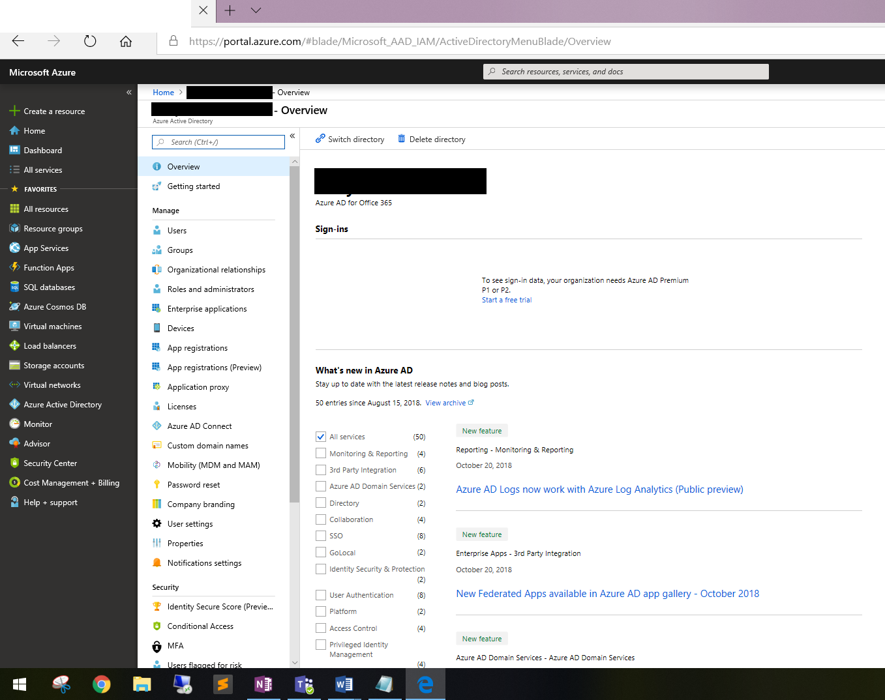

3. In the left navigation pane, click **App registrations (Preview)** and then click **New registration**.

    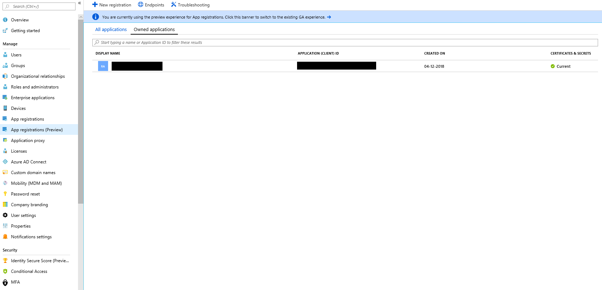

4. Register the application. Under Redirect URI, select Web in the application type dropdown list and then type <https://portal.azure.com> in the box for the URI.

   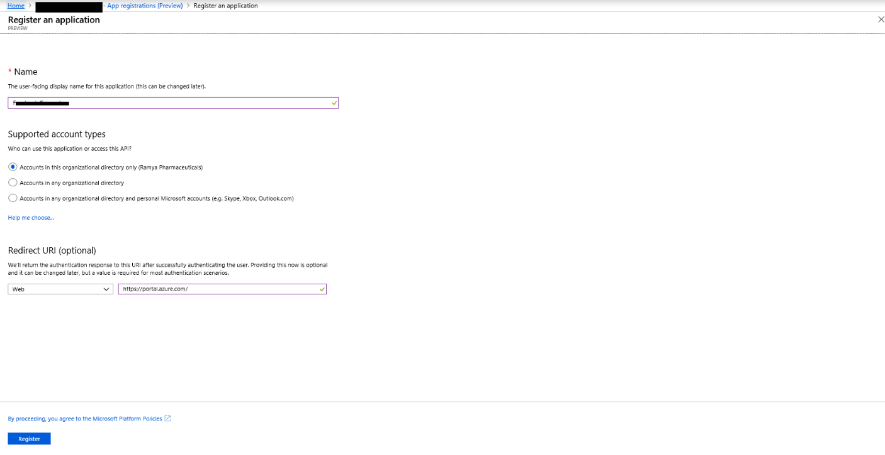

5. Copy the **Application (client) ID** and **Directory (tenant) ID** and save them to a text file or other safe location. You use these IDs in later steps.

   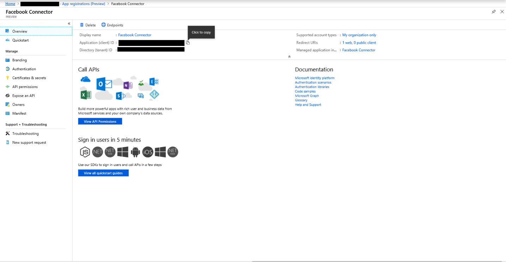

6. Go to **Certificates & secrets for the new app.**

   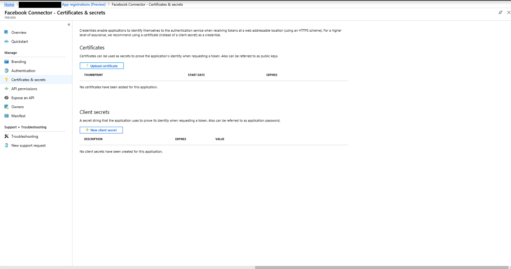

7. Click **New client secret**

   

8. Create a new secret. In the description box, type the secret and then choose an expiration period.

    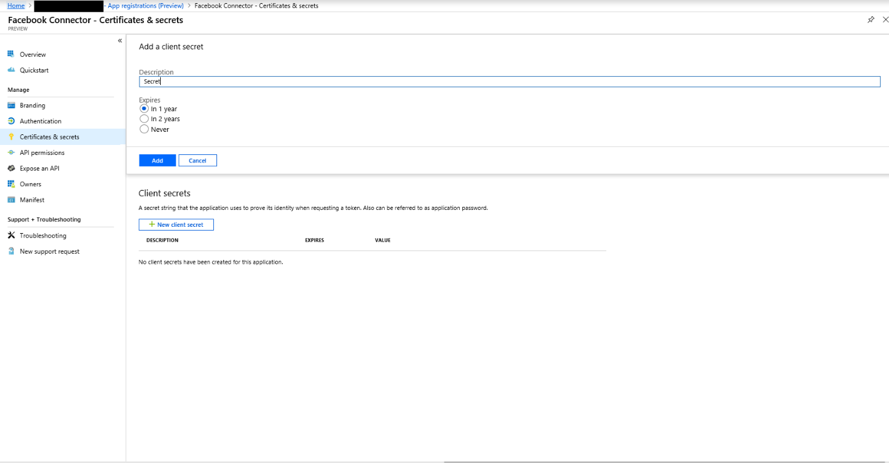

9. Copy the value of the secret and save it to a text file or other storage location. This is the AAD application secret that you use in later steps.

   

## Step 2: Deploy the connector web service from GitHub to your Azure account

1. Go to [this GitHub site](https://github.com/microsoft/m365-sample-connector-csharp-aspnet) and click **Deploy to Azure**.

    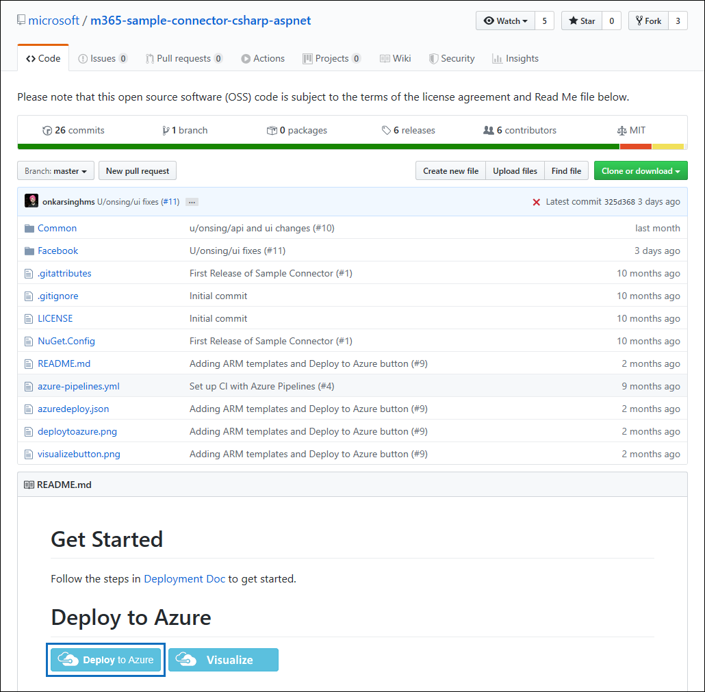

2. After you click **Deploy to Azure**, you will be redirected to an Azure portal with a custom template page. Fill in the **Basics** and **Settings** details and then click **Purchase**.

   - **Subscription:** Select your Azure subscription that you want to deploy the Facebook Business pages connector web service to.

   - **Resource group:** Choose or create a new resource group. A resource group is a container that holds related resources for an Azure solution.

   - **Location:** Choose a location.

   - **Web App Name:** Provide a unique name for the connector web app. Th name must be between 3 and 18 characters in length. This name is used to create the Azure app service URL; for example, if you provide the Web app name of **fbconnector** then the Azure app service URL  will be **fbconnector.azurewebsites.net**.

   - **tenantId:** The tenant ID of your Microsoft 365 organization that you copied after creating the Facebook connector app in Azure Active Directory in Step 1.

   - **APISecretKey:** You can type any value as the secret. This is used to access the connector web app in Step 5.

     

3. After the deployment is successful, the page will look similar to the following screenshot:

   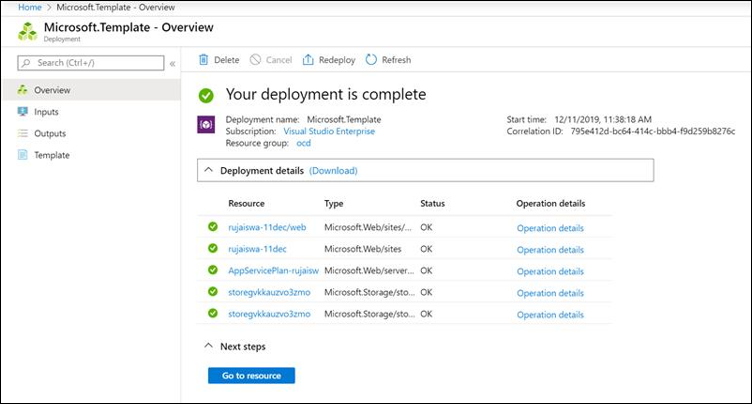

## Step 3: Register the Facebook app

1. Go to <https://developers.facebook.com>, log in using the credentials for the account for your organization's Facebook Business pages, and then click **Add New App**.

   

2. Create a new app ID.

   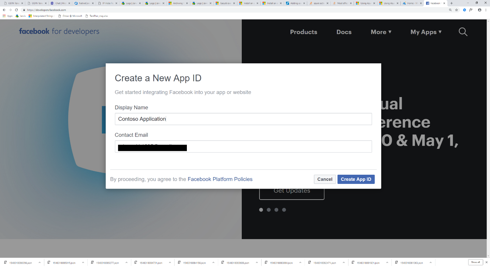

3. In the left navigation pane, click **Add Products** and then click **Set Up** in the **Facebook Login** tile.

   

4. On the Integrate Facebook Login page, click **Web**.

   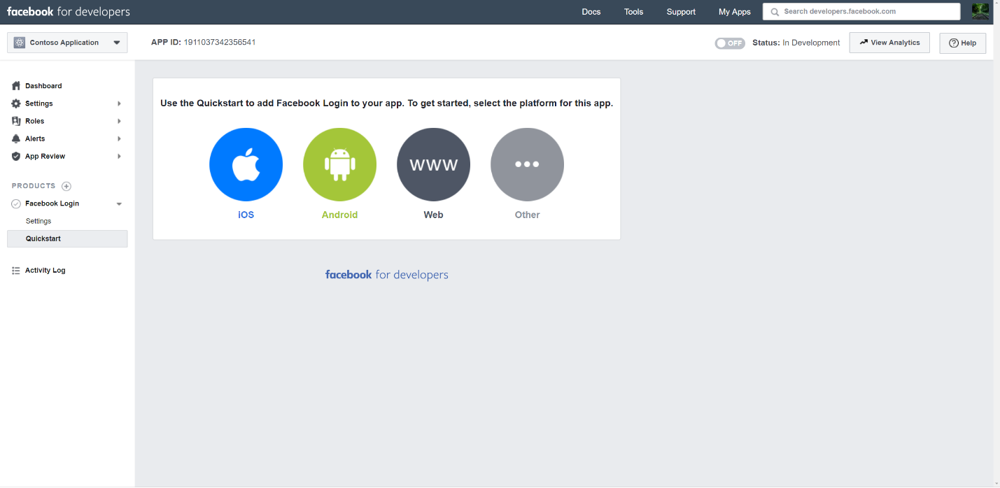

5. Add the Azure app service URL; for example `https://fbconnector.azurewebsites.net`.

   

6. Complete the QuickStart section of the Facebook Login setup.

   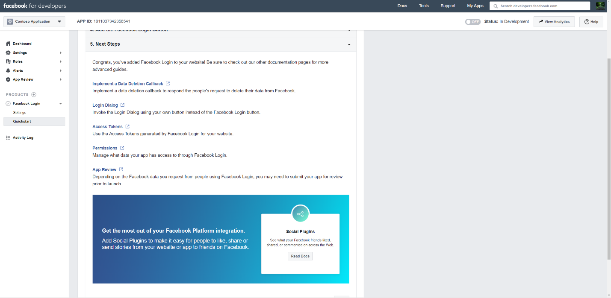

7. In the left navigation pane under **Facebook Login**, click **Settings**, and add the OAuth redirect URI in the **Valid OAuth Redirect URIs** box. Use the format **\<connectorserviceuri>/Views/FacebookOAuth**, where the value for connectorserviceuri is the Azure app service URL for your organization; for example, `https://fbconnector.azurewebsites.net`.

   

8. In the left navigation pane, click **Add Products** and then click **Webhooks.** In the **Page** pull-down menu, click **Page**.

   

9. Add Webhooks Callback URL and add a verify token. The format of the callback URL, use the format **<connectorserviceuri>/api/FbPageWebhook**, where the value for connectorserviceuri is the Azure app service URL for your organization; for example `https://fbconnector.azurewebsites.net`.

   The verify token should similar to a strong password. Copy the verify token to a text file or other storage location.

   

10. Test and subscribe to the endpoint for feed.

    

11. Add a privacy URL, app icon, and business use. Also, copy the app ID and app secret to a text file or other storage location.

    

12. Make the app public.

    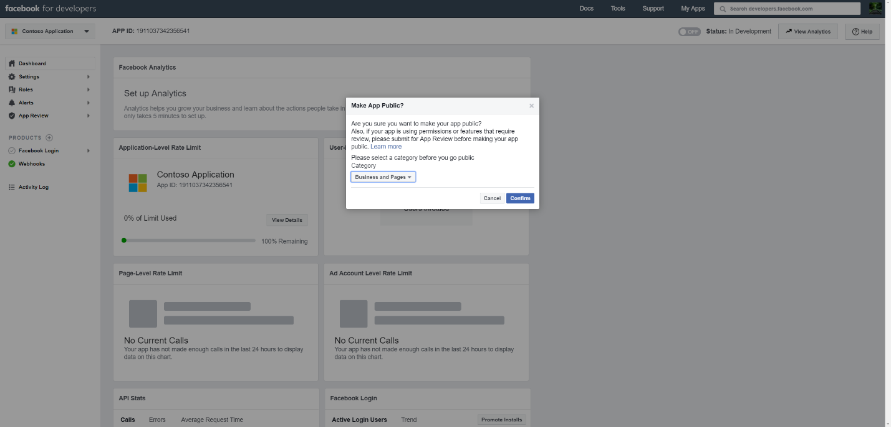

13. Add user to the admin or tester role.

    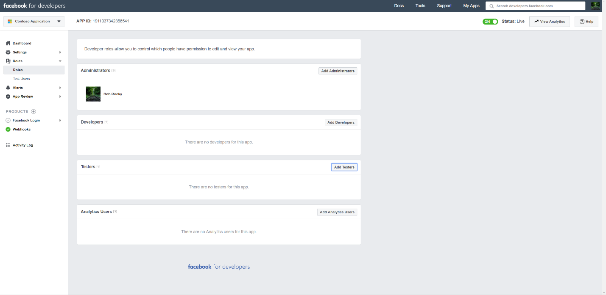

14. Add the **Page Public Content Access** permission.

    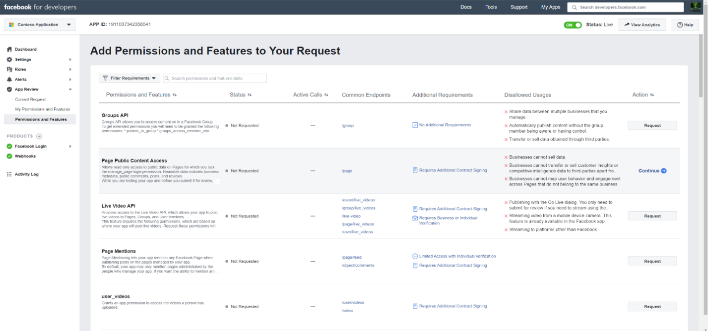

15. Add Manage Pages permission.

    

16. Get the application reviewed by Facebook.

    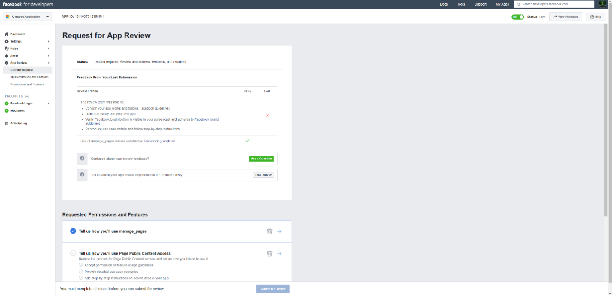

## Step 4: Configure the connector web app

1. Go to `https://<AzureAppResourceName>.azurewebsites.net` (where AzureAppResourceName is the name of your Azure app resource that you named in Step 4). For example, if the name is **fbconnector**, go to `https://fbconnector.azurewebsites.net`. The home page of the app will look like the following screenshot:

   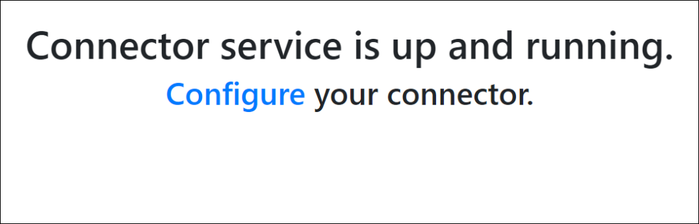

2. Click **Configure** to display a sign in page.

   

3. In the Tenant Id box, type or paste your tenant Id (that you obtained in Step 2). In the password box, type or paste the APISecretKey (that you obtained in Step 2), and then click **Set Configuration Settings** to display the configuration details page.

    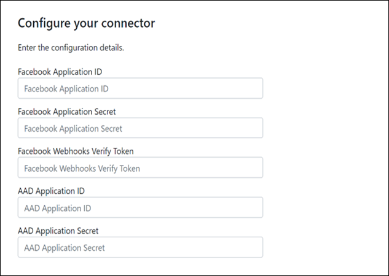

4. Enter the following configuration settings

   - **Facebook application ID:** The app ID for the Facebook application that you obtained in Step 3.

   - **Facebook application secret:** The app secret for the Facebook application that you obtained in Step 3.

   - **Facebook webhooks verify token:** The verify token that you created in Step 3.

   - **AAD application ID:** The application ID for the Azure Active Directory app that you created in Step 1.

   - **AAD application secret:** The value for the APISecretKey secret that you created in Step 1.

5. Click **Save** to save the connector settings.

## Step 5: Set up a Facebook connector in the Microsoft 365 compliance center

1. Go to [https://compliance.microsoft.com](https://compliance.microsoft.com) and then click **Data connectors** in the left nav.

2. On the **Data connectors** page under **Facebook Business pages**, click **View**.

3. On the **Facebook business pages** page, click **Add connector**.

4. On the **Terms of service** page, click **Accept**.

5. On the **Add credentials for your connector app** page, enter the following information and then click **Validate connection**.

   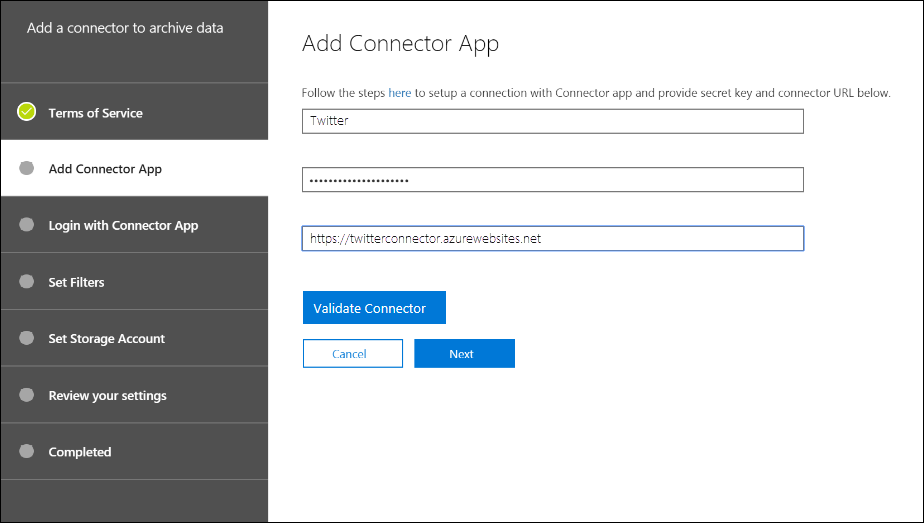

   - In the **Name** box, type a name for the connector, such as **Facebook news page**.

   - In the **Connection URL** box, type or paste the Azure app service URL; for example `https://fbconnector.azurewebsites.net`.

   - In the **Password** box, type or paste the value of the APISecretKey that you added in Step 2.

   - In the **Azure App ID** box, type or paste the value of the Application (client) ID also called as AAD Application ID that you created in Step 1.

6. After the connection is successfully validated, click **Next**.

7. On the **Authorize Microsoft 365 to import data** page, type or paste the APISecretKey again and then click **Login web app**.

8. On the **Configure Facebook connector app** page, click **Login with Facebook** and log in using the credentials for the account for your organization's Facebook Business pages. Make sure the Facebook account that you logged in to is assigned the admin role for your organization's Facebook Business pages.

   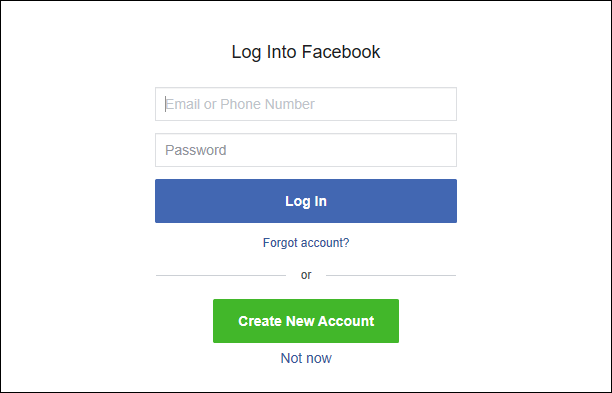

9. A list of the business pages managed by the Facebook account that you logged in to is displayed. Select the page to archive and then click **Next**.

   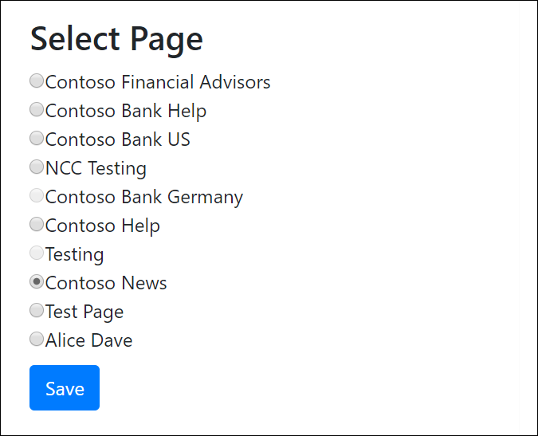

10. Click **Continue** to exit the setup of the connector service app.

11. On the **Set filters** page, you can apply a filter to initially import items that are a certain age. Select an age, and then click **Next**.

12. On the **Choose storage location** page, type the email address of Microsoft 365 mailbox that the Facebook items will be imported to, and then click **Next**.

13. Click **Next** to review the connector settings and then click **Finish** to complete the connector setup.

14. In the compliance center, go to the **Data connectors** page, and click the **Connectors** tab to see the progress of the import process.
