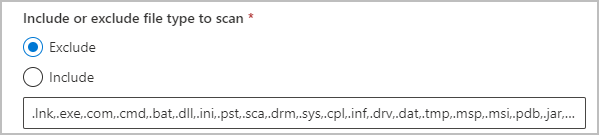

# Learn about the information protection scanner

Use the information in this section to learn about the Microsoft Purview Information Protection scanner, and then how to successfully install, configure, run and if necessary, troubleshoot it.

This scanner runs as a service on Windows Server and lets you discover, classify, and protect files on the following data stores:

- **UNC paths** for network shares that use the SMB or NFS (Preview) protocols.

- **SharePoint document libraries and folder** for SharePoint Server 2019 through SharePoint Server 2013.

To classify and protect your files, the scanner uses [sensitivity labels](sensitivity-labels.md) configured in the Microsoft Purview compliance portal.

## Overview of the scanner

The information protection scanner can inspect any files that Windows can index. If you've configured sensitivity labels to apply automatic classification, the scanner can label discovered files to apply that classification, and optionally apply or remove protection. 

The following image shows the scanner architecture, where the scanner discovers files across your on-premises and SharePoint servers.

:::image type="content" source="../media/scanner-arch.png" alt-text="Microsoft Purview Information Protection scanner architecture":::

To inspect your files, the scanner uses IFilters installed on the computer. To determine whether the files need labeling, the scanner uses sensitive information types and pattern detection, or regex patterns.

The scanner uses the Azure Information Protection client, and can classify and protect the same types of files as the client. For more information, see [File types supported by the Azure Information Protection unified labeling client](/azure/information-protection/rms-client/clientv2-admin-guide-file-types).

Do any of the following to configure your scans as needed:

- **Run the scanner in discovery mode only** to create reports that check to see what happens when your files are labeled.
- **Run the scanner to discover files with sensitive information**, without configuring labels that apply automatic classification.
- **Run the scanner automatically** to apply labels as configured. 
- **Define a file types list** to specify specific files to scan or to exclude.

> [!NOTE]
> The scanner does not discover and label in real time. It systematically crawls through files on data stores that you specify. Configure this cycle to run once, or repeatedly.

> [!TIP]
> The scanner supports scanner clusters with multiple nodes, enabling your organization to scale out, achieving faster scan times and broader scope. 
> 
> Deploy multiple nodes right from the start, or start with a single-node cluster and add additional nodes later on as you grow. Deploy multiple nodes by using the same cluster name and database for the **Install-AIPScanner** cmdlet.
> 

## The scanning process

When scanning files, the information protection scanner runs through the following steps:

[1. Determine whether files are included or excluded for scanning](#1-determine-whether-files-are-included-or-excluded-for-scanning)

[2. Inspect and label files](#2-inspect-and-label-files)

[3. Label files that can't be inspected](#3-label-files-that-cant-be-inspected) 

For more information, see [Files not labeled by the scanner](#files-not-labeled-by-the-scanner).

### 1. Determine whether files are included or excluded for scanning 

The scanner automatically skips files that are excluded from classification and protection, such as executable files and system files. For more information, see [File types excluded from classification and protection](/azure/information-protection/rms-client/clientv2-admin-guide-file-types#file-types-excluded-from-classification-and-protection).

The scanner also considers any file lists explicitly defined to scan, or exclude from scanning. File lists apply for all data repositories by default, and can also be defined for specific repositories only.

To define file lists for scanning or exclusion, use the **File types to scan** setting in the content scan job. For example:

For more information, see [Deploying the scanner to automatically classify and protect files](deploy-scanner-configure-install.md).

### 2. Inspect and label files

After identifying excluded files, the information protection scanner filters again to identify files supported for inspection.

These filters are the same ones used by the operating system for Windows Search and indexing, and require no extra configuration. Windows IFilter is also used to scan file types that are used by Word, Excel, and PowerPoint, and for PDF documents and text files.

For a full list of file types supported for inspection, and other instructions for configuring filters to include .zip and .tiff files, see [File types supported for inspection](/azure/information-protection/rms-client/clientv2-admin-guide-file-types#file-types-supported-for-inspection).

After inspection, supported file types are labeled using the conditions specified for your labels. If you're using discovery mode, these files can either be reported to contain the conditions specified for your labels, or reported to contain any known sensitive information types.

#### Stopped scanner processes

If the scanner stops and doesn't complete a scan for a large number of files in your repository, you may need to increase the number of dynamic ports for the operating system hosting the files.

For example, server hardening for SharePoint is one reason why the scanner would exceed the number of allowed network connections, and therefore stop.

To check whether server hardening for SharePoint is the cause of the scanner stopping, check for the following error message in the scanner logs at **%localappdata%\Microsoft\MSIP\Logs\MSIPScanner.iplog** (multiple logs are compressed into a zip file):

`Unable to connect to the remote server ---> System.Net.Sockets.SocketException: Only one usage of each socket address (protocol/network address/port) is normally permitted IP:port`

For more information about how to view the current port range and increase it if needed, see [Settings that can be modified to improve network performance](/biztalk/technical-guides/settings-that-can-be-modified-to-improve-network-performance).

> [!TIP]
> For large SharePoint farms, you may need to increase the list view threshold, which has a default of **5,000**.
>
> For more information, see the [Manage large lists and libraries in SharePoint](https://support.office.com/article/manage-large-lists-and-libraries-in-sharepoint-b8588dae-9387-48c2-9248-c24122f07c59#__bkmkchangelimit&ID0EAABAAA=Server).
>

### 3. Label files that can't be inspected

For any file types that can't be inspected, the scanner applies the default label from its sensitivity label policy, or the default label configured for the scanner.

### Files not labeled by the scanner
The scanner cannot label files under the following circumstances:

- When the label applies classification, but not protection, and the file type does not support classification-only by the client. For more information, see [File types supported for classification only](/azure/information-protection/rms-client/clientv2-admin-guide-file-types#file-types-supported-for-classification-only).

- When the label applies classification and protection, but the scanner does not support the file type.
  
    By default, the scanner protects only Office file types, and PDF files when they are protected by using the ISO standard for PDF encryption. 

    Other types of files can be added for protection when you [change the types of files to protect](deploy-scanner-configure-install.md#change-which-file-types-to-protect).

**Example**: After inspecting .txt files, the scanner can't apply a label that's configured for classification only, because the .txt file type doesn't support classification only. 

However, if the label is configured for both classification and protection, and the .txt file type is included for the scanner to protect, the scanner can label the file.

## Next steps

For more information about deploying the scanner, see the following articles:

- [Scanner deployment prerequisites](deploy-scanner-prereqs.md)
- [Configuring and installing the scanner](deploy-scanner-configure-install.md)
- [Running scans using the scanner](deploy-scanner-manage.md)

**More information**:

- [Watch our scanner end-to-end demo video!](https://www.youtube.com/watch?v=f1gy1KalSts) Watch a step-by-step review of the scanner architecture, architecture, recommendation, installation and configuration.

- Check out our blog on best practices for the scanner: [Best practices for deploying and using the AIP UL scanner](https://aka.ms/AIPScannerBestPractices)

- Interested in how the Core Services Engineering and Operations team in Microsoft implemented this scanner?  Read the technical case study: [Automating data protection with Azure Information Protection scanner](https://www.microsoft.com/itshowcase/Article/Content/1070/Automating-data-protection-with-Azure-Information-Protection-scanner).

- You can also use PowerShell to interactively classify and protect files from your desktop computer. For more information about this and other scenarios that use PowerShell, see [Using PowerShell with the Azure Information Protection unified labeling client](./
- .md).
