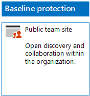

# Deploy SharePoint Online sites for three tiers of protection

Use the steps in this article to design and deploy baseline, sensitive, and highly confidential SharePoint Online team sites. For more information about these three tiers of protection, see [Secure SharePoint Online sites and files](../security/office-365-security/secure-sharepoint-online-sites-and-files.md).
  
## Baseline SharePoint Online team sites

Baseline protection includes both public and private team sites. Public team sites can be discovered and accessed by anybody in the organization. Private sites can only be discovered and accessed by members of the Office 365 group associated with the team site. Both of these types of team sites allow members to share the site with others.
  
### Public

To create a baseline SharePoint Online team site with public access and permissions, follow [these instructions](https://support.office.com/article/create-a-team-site-in-sharepoint-ef10c1e7-15f3-42a3-98aa-b5972711777d).

Here is your resulting configuration.
  

  
### Private

To create a baseline SharePoint Online team site with private access and permissions, follow [these instructions](https://support.office.com/article/create-a-team-site-in-sharepoint-ef10c1e7-15f3-42a3-98aa-b5972711777d).
  
Here is your resulting configuration.
  

  
## Sensitive SharePoint Online team sites

A sensitive SharePoint Online team site starts as a private team site.
  
First, create the private SharePoint Online team site with [these instructions](https://support.office.com/article/create-a-team-site-in-sharepoint-ef10c1e7-15f3-42a3-98aa-b5972711777d).

Next, from the new SharePoint Online team site, configure additional permission settings with these steps.

1.  In the tool bar of the SharePoint team site, click the settings icon, and then click **Site permissions**.
2.  In the **Site permissions** pane, under **Sharing Settings**, click **Change sharing settings**.
3.  Under **Sharing permissions**, choose **Only site owners can share files, folders, and the site**, and then click **Save**.

The results of these permission settings are:

- The ability for members to share with other members is disabled.
- The ability for non-members to request access is enabled.

Here is your resulting configuration.
  

  
The members of the site, through group membership in one of the access groups, can now securely collaborate on the resources of the site.
  
## Highly confidential SharePoint Online team sites

A highly confidential SharePoint Online team site is a private team site with additional permissions settings.

First, create the private SharePoint Online team site with [these instructions](https://support.office.com/article/create-a-team-site-in-sharepoint-ef10c1e7-15f3-42a3-98aa-b5972711777d).

Next, from the new SharePoint Online team site, configure additional permission settings with these steps.

1.  In the tool bar of the SharePoint team site, click the settings icon, and then click **Site permissions**.
2.  In the **Site permissions** pane, under **Sharing Settings**, click **Change sharing settings**.
3.  Under **Sharing permissions**, choose **Only site owners can share files, folders, and the site**.
4. Turn off **Allow access requests**, and then click **Save**.

The results of these permission settings are:

- The ability for members to share with other members is disabled.
- The ability for non-members to request access is disabled.

Here is your resulting configuration.
  

  
The members of the site, through group membership in one of the access groups, can now securely collaborate on the resources of the site.
  
## Next step

[Protect SharePoint Online files with Office 365 labels and DLP](protect-sharepoint-online-files-with-office-365-labels-and-dlp.md)

## See also

[Microsoft Security Guidance for Political Campaigns, Nonprofits, and Other Agile Organizations](../security/office-365-security/microsoft-security-guidance-for-political-campaigns-nonprofits-and-other-agile-o.md)
  
[Cloud adoption and hybrid solutions](https://docs.microsoft.com/office365/enterprise/cloud-adoption-and-hybrid-solutions)
