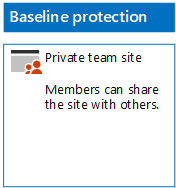

# Deploy SharePoint Online sites for three tiers of protection

 **Summary:** Create and configure SharePoint Online team sites for various levels of information protection.
  
Use the steps in this article to design and deploy baseline, sensitive, and highly confidential SharePoint Online team sites. For more information about these three tiers of protection, see [Secure SharePoint Online sites and files](/security/office-365-security/secure-sharepoint-online-sites-and-files.md).
  
## Baseline SharePoint Online team sites

Baseline protection includes both public and private team sites. Public team sites can be discovered and accessed by anybody in the organization. Private sites can only be discovered and accessed by members of the Office 365 group associated with the team site. Both of these types of team sites allow members to share the site with others.
  
### Public

To create a baseline SharePoint Online team site with public access and permissions, do the following:
  
1. Sign in to the admin center with an account that will also be used to administer the SharePoint Online team site (a SharePoint Online administrator). For help, see [Where to sign in to Office 365](https://support.office.com/Article/Where-to-sign-in-to-Office-365-e9eb7d51-5430-4929-91ab-6157c5a050b4).
    
2. In the list of tiles, click **SharePoint**.
    
3. On the new **SharePoint** tab in your browser, click **+ Create site**.
    
4. On the **Create a site** page, click **Team site**.
    
5. In **Site name**, type a name for the public team site. 
    
6. In **Team site description**, type a description of the purpose of the site.
    
7. In **Privacy settings**, select **Public - anyone in the organization can access this site**, and then click **Next**.
    
8. On the **Who do you want to add?** pane, click **Finish**.
    
Here is your resulting configuration.
  

  
### Private

To create a baseline SharePoint Online team site with private access and permissions, do the following:
  
1. Sign in to the admin center with an account that will also be used to administer the SharePoint Online team site (a SharePoint Online administrator). For help, see [Where to sign in to Office 365](https://support.office.com/Article/Where-to-sign-in-to-Office-365-e9eb7d51-5430-4929-91ab-6157c5a050b4).
    
2. In the list of tiles, click **SharePoint**.
    
3. On the new **SharePoint** tab in your browser, click **+ Create site**.
    
4. On the **Create a site** page, click **Team site**.
    
5. In **Site name**, type a name for the private team site. 
    
6. In **Team site description,** type a description of the purpose of the site.
    
7. In **Privacy settings**, select **Private - only members can access this site**, and then click **Next**.
    
8. On the **Who do you want to add?** pane, in **Add members**, type the names of user accounts that have access to this private team site.
    
9. When you are done adding the initial set of members to the site, click **Finish**
    
Here is your resulting configuration.
  

  
## Sensitive SharePoint Online team sites

A sensitive SharePoint Online team site is an isolated team site, which means that permissions are controlled through membership in SharePoint groups instead of membership in the Office 365 group associated with the team site.
  
To create an isolated team site, there are two main steps.
  
### Step 1: Design your isolated site

To design your isolated team site, you need to determine:
  
- Your SharePoint groups and permission levels.
    
- The set of access groups that will be members of your SharePoint groups.
    
     The recommended set of access groups is one for site members, one for site viewers, and one for site administrators.
    
- Whether you will use nested groups within your access groups.
    
For example, the recommended group structure and permission levels look like this:
  
|**SharePoint group**|**Permission level**|**Access group (examples)**|
|:-----|:-----|:-----|
|[site name] Members    |Edit    |[site name] Members    |
|[site name] Visitors    |Read    |[site name] Viewers    |
|[site name] Owners    |Full control    |[site name] Admins    |
   
The SharePoint groups and permission levels are created by default for a team site. You need to determine the names of your access groups.
  
For the details of the design process, see [Design an isolated SharePoint Online team site](/security/office-365-security/design-an-isolated-sharepoint-online-team-site.md).
  
### Step 2: Deploy your isolated site

To deploy your isolated site, you first need to:
  
- Determine the user accounts and groups to add to each of your access groups.
    
- Create the access groups and add the user and group members.
    
For the detailed steps, see **Phase 1** of [Deploy an isolated SharePoint Online team site](/security/office-365-security/design-an-isolated-sharepoint-online-team-site.md).
  
Next, you create the SharePoint Online team site with these steps.
  
1. Sign in to the admin center with an account that will also be used to administer the SharePoint Online team site (a SharePoint Online administrator). For help, see [Where to sign in to Office 365](https://support.office.com/Article/Where-to-sign-in-to-Office-365-e9eb7d51-5430-4929-91ab-6157c5a050b4).
    
2. In the list of tiles, click **SharePoint**.
    
3. In the new **SharePoint** tab of your browser, click **+ Create site**.
    
4. On the **Create a site** page, click **Team site**.
    
5. In **Site name**, type a name for the private team site.
    
6. In **Team site description**, type an optional description.
    
7. In **Privacy settings**, select **Private - only members can access this site**, and then click **Next**.
    
8. On the **Who do you want to add?** pane, click **Finish**.
    
Next, from the new SharePoint Online team site, configure permissions with these steps.
  
1. Determine the User Principal Name (UPN) of the IT administrator or other person who will be responsible for responding to and addressing requests for access to the site (belindan@contoso.com is an example of a UPN). 
    
2. In the tool bar, click the settings icon, and then click **Site permissions**.
    
3. In the **Site permissions** pane, click **Advanced permissions settings**.
    
4. On the new **Permissions** tab of your browser, click **Access Request Settings**.
    
5. In the **Access Requests Settings** dialog box:
    
  - Clear the **Allow members to share the site and individual files and folders** and **Allow members to invite others to the site members group** check boxes.
    
  - Type the UPN of your IT administrator from step 1 in **Send all requests for access**.
    
  - Click **OK**.
    
6. On the **Permissions** tab of your browser, click **[site name] Members** in the list.
    
7. In **People and Groups**, click **New**.
    
8. In the **Share** dialog box, type the name of your site members access group for this site, select it, and then click **Share**.
    
9. Click the back button on your browser.
    
10. Click **[site name] Owners** in the list.
    
11. In **People and Groups**, click **New**.
    
12. In the **Share** dialog box, type the name of the site administrators access group for this site, select it, and then click **Share**.
    
13. Click the back button on your browser.
    
14. Click **[site name] Visitors** in the list.
    
15. In **People and Groups**, click **New**.
    
16. In the **Share** dialog box, type the name of the site viewers access group for this site, select it, and then click **Share**.
    
17. Close the **Permissions** tab of your browser.
    
The results of these permission settings are:
  
- The **[site name] Owners** SharePoint group contains the site administrators access group, in which all the members have the **Full control** permission level.
    
- The **[site name] Members** SharePoint group contains the site members access group, in which all the members have the **Edit** permission level.
    
- The **[site name] Visitors** SharePoint group contains the site viewers access group, in which all the members have the **Read** permission level.
    
- The ability for members to invite other members is disabled.
    
- The ability for non-members to request access is enabled.
    
Here is your resulting configuration.
  

  
The members of the site, through group membership in one of the access groups, can now securely collaborate on the resources of the site.
  
## Highly confidential SharePoint Online team sites

A highly confidential SharePoint Online team site is an isolated team site, which means that permissions are controlled through membership in SharePoint groups instead of membership in the Office 365 group associated with the team site.
  
To create an isolated team site for highly confidential information and collaboration, there are two main steps.
  
### Step 1: Design your isolated site

To design your isolated team site, you need to determine:
  
- Your SharePoint groups and permission levels.
    
- The set of access groups that will be members of your SharePoint groups.
    
     The recommended set of access groups is one for site members, one for site viewers, and one for site administrators.
    
- Whether you will use nested groups within your access groups.
    
For example, the recommended group structure and permission levels look like this:
  
|**SharePoint group**|**Permission level**|**Access group (examples)**|
|:-----|:-----|:-----|
|[site name] Members    |Edit    |[site name] Members    |
|[site name] Visitors    |Read    |[site name] Viewers    |
|[site name] Owners    |Full control    |[site name] Admins    |
   
The SharePoint groups and permission levels are created by default for a team site. You need to determine the names of your access groups.
  
For the details of the design process, see [Design an isolated SharePoint Online team site](/security/office-365-security/design-an-isolated-sharepoint-online-team-site.md).
  
### Step 2: Deploy your isolated site

To deploy your isolated site, you first need to:
  
- Determine the user and group members of each of your access groups
    
- Create the access groups and add the user and group members
    
- Create an isolated team site that uses your access groups
    
For the detailed steps, see [Deploy an isolated SharePoint Online team site](/security/office-365-security/design-an-isolated-sharepoint-online-team-site.md).
  
The results of the permission settings are:
  
- The **[site name] Owners** SharePoint group contains the site administrators access group, in which all the members have the **Full control** permission level.
    
- The **[site name] Members** SharePoint group contains the site members access group, in which all the members have the **Edit** permission level.
    
- The **[site name] Visitors** SharePoint group contains the site viewers access group, in which all the members have the **Read** permission level.
    
- The ability for members to invite other members is disabled.
    
- The ability for non-members to request access is disabled.
    
Here is your resulting configuration.
  

  
The members of the site, through group membership in one of the access groups, can now securely collaborate on the resources of the site.
  
## Next step

[Protect SharePoint Online files with Office 365 labels and DLP](protect-sharepoint-online-files-with-office-365-labels-and-dlp.md)

## See also

[Secure SharePoint Online sites and files](/security/office-365-security/secure-sharepoint-online-sites-and-files.md)
  
[Microsoft Security Guidance for Political Campaigns, Nonprofits, and Other Agile Organizations](/security/office-365-security/microsoft-security-guidance-for-political-campaigns-nonprofits-and-other-agile-o.md)
  
[Cloud adoption and hybrid solutions](https://docs.microsoft.com/office365/enterprise/cloud-adoption-and-hybrid-solutions)
