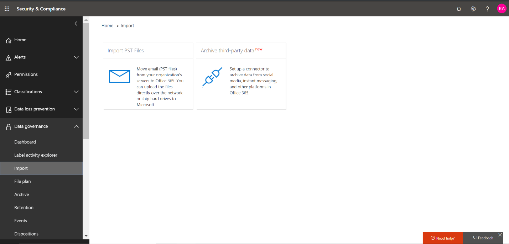

# Deploy a connector to archive Twitter data

This article contains the step-by-step process to deploy a connector that uses the Office 365 Import service to import data from your organization's Twitter account to Microsoft 365. For a high-level overview of this process and a list of prerequisites required to deploy a Twitter connector, see [Use a sample connector to archive Twitter data in Office 365 (Preview)](archive-twitter-data-with-sample-connector.md). 

## Step 1: Create an app in Azure Active Directory

1. Go to <https://portal.azure.com> and sign in using the credentials of an Office 365 global admin account.

   

2. In the left navigation pane, click **Azure Active Directory**.

   

3. In the left navigation pane, click **App registrations (Preview)** and then click **New registration**.

   

4. Register the application. Under **Redirect URI (optional)**, select **Web** in the application type dropdown list and then type `https://portal.azure.com` in the box for the URI.

   

5. Copy the **Application (client) ID** and **Directory (tenant) ID** and save them to a text file or other safe location. You use these IDs in later steps.

    

6. Go to **Certificates & secrets for the new app** and under **Client secrets** click **New client secret**.

   

7. Create a new secret. In the description box, type the secret and then choose an expiration period. 

   

8. Copy the value of the secret and save it to a text file or other storage location. This is the AAD application secret that you use in later steps.

   

9. Go to **Manifest** and copy the identifierUris (which is also called the AAD application Uri) as highlighted in the following screenshot. Copy the AAD application Uri to a text file or other storage location. You use it in Step 6.

    

## Step 2: Deploy the connector web service from GitHub to your Azure account

1. Go to [this GitHub site](https://github.com/microsoft/m365-sample-twitter-connector-csharp-aspnet) and click **Deploy to Azure**.

    

2. After you click **Deploy to Azure**, you will be redirected to an Azure portal with a custom template page. Fill in the **Basics** and **Settings** details and then click **Purchase**.

    - **Subscription** – Select your Azure subscription that you want to deploy the Twitter connector web service to.
    
    - **Resource group** — Choose or create a new resource group. A resource group is a container that holds related resources for an Azure solution.

    - **Location** – Choose a location.

    - **Web App Name** – Provide a unique name for the connector web app. Th name must be between 3 and 18 characters in length. This name is used to create the Azure app service URL; for example, if you provide the Web app name of **twitterconnector** then the Azure app service URL  will be **twitterconnector.azurewebsites.net**.
    
    - **tenantId** – The tenant ID of your Microsoft 365 organization that you copied after creating the Facebook connector app in Azure       Active Directory in Step 1.
    
   - **APISecretKey** – You can type any value as the secret. This is used to access the connector web app in Step 5.
   
    

3. After the deployment is successful, the page will look similar to the following screenshot:

    

## Step 3: Create the Twitter app

1. Go to https://developer.twitter.com, log in using the credentials for the developer account for your organization, and then click **Apps**.

   
2. Click **Create an app**.
   
   

3. Under **App details**, add information about the application.

   

4. On the Twitter developer dashboard, select the app that you just created and copy the App ID that's displayed  and save it to a text file or other storage location. Then click **Details**.
   
   

5. On the **Keys and tokens** tab, under **Consumer API keys** copy the API secret key and save it to a text file or other storage location. Then click **Create** to generate an access token and an access token secret, and copy these to a text file or other storage location.
   
   

   Then click **Create** to generate an access token and an access token secret, and copy these to a text file or other storage location.

6. Click the **Permissions** tab and configure the permissions as shown in the following screenshot:

   

7. After you save the permission settings, click the **App details** tab, and then click **Edit > Edit details**.

   

8. Do the following tasks:

   - Select the checkbox to allow the connector app to sign in to Twitter.
   
   - Add the OAuth redirect Uri using the following format: **\<connectorserviceuri>/Views/TwitterOAuth**, where the value of *connectorserviceuri* is the Azure app service URL for your organization; for example, https://twitterconnector.azurewebsites.net/Views/TwitterOAuth.

    

The Twitter developer app is now ready to use.

## Step 4: Configure the connector web app 

1. Go to https://\<AzureAppResourceName>.azurewebsites.net (where **AzureAppResourceName** is the name of your Azure app resource that you named in Step 4). For example, if the name is **twitterconnector**, go to https://twitterconnector.azurewebsites.net. The home page of the app looks like the following screenshot:

   

2. Click **Configure** to display a sign in page.

   

3. In the Tenant Id box, type or paste your tenant Id (that you obtained in Step 2). In the password box, type or paste the APISecretKey (that you obtained in Step 2), and then click **Set Configuration Settings** to display the **Configuration Details** page.

   

4. Under **Configuration Details**, enter the following configuration settings 

   - **Twitter Api Key** – The app ID for the Twitter application that you created in Step 3.
   - **Twitter Api Secret Key** – The API secret key for the Twitter application that you created in Step 3.
   - **Twitter Access Token** – The access token that you created in Step 3.
   - **Twitter Access Token Secret** – The access token secret that you created in Step 3.
   - **AAD Application ID** – The application ID for the Azure Active Directory app that you created in Step 1
   - **AAD Application Secret** – The value for the APISecretKey secret that you created in Step 1.
   - **AAD Application Uri** – The AAD application Uri obtained in Step 1; for example, `https://microsoft.onmicrosoft.com/2688yu6n-12q3-23we-e3ee-121111123213`.
   - **App Insights Instrumentation Key** – Leave this box blank.

5. Click **Save** to save the connector settings.

## Step 5: Set up Twitter connector in the Microsoft 365 compliance center

1. Go to <https://compliance.mcirosoft.com> and then click **Data connectors**.

   

2.  Click **View** and then click **Add connector**.

    

3. On the **Add Connector App** page, enter the following information and then click **Validate connector**.

    - In the first box, type a name for the connector, such as **Twitter help handle**.
    - In the second box, type or paste the Azure app service URL; for example `https://twitterconnector.azurewebsites.net`.
    - In the third box, type or paste the value of the APISecretKey that you added in Step 2.
    - In the fourth box, type or paste the value of the Application (client) ID also called as AAD Application ID that you created in Step 1.

   After the connector is successfully validated, click **Next**.

   

4. Type or paste the APISecretKey again and then click  **Login to Connector Service**.

   

5. Click **Continue with Twitter**.

6. On the Twitter sign in page, sign in using the credentials for the account for your organization’s Twitter account.

   

   After you sign in, the Twitter page will display the following message, "Twitter Connector Job Successfully set up."

7. Click **Finish** to complete setting up the Twitter connector.

8. On the **Set Filters** page, you can apply a filter to import (and archive) items that are a certain age. Click **Next**.

   

9. On the **Set Storage Account** page, type the email address of an Microsoft 365 mailbox that the Twitter items will be imported to.

    

10. Review your settings and then click **Finish** to complete the connector setup in the Security & Compliance Center.

    

    

11. Go to the **Connectors** tab on the **Data connectors** page to see the progress of the import process.

    
