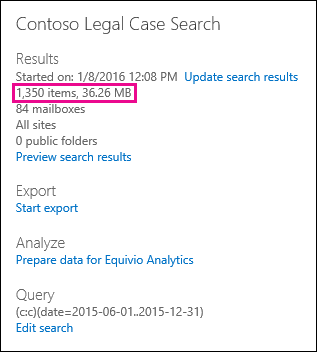
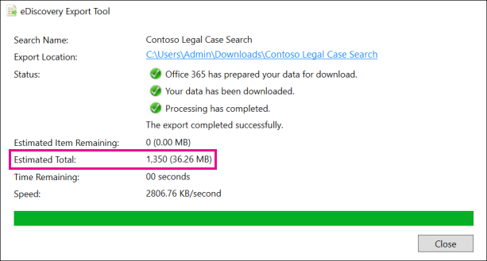
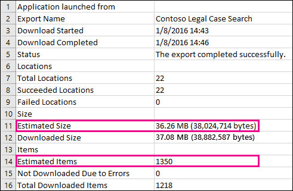

# Differences between estimated and actual eDiscovery search results

This topic applies to searches that you can run using one of the following Microsoft eDiscovery tools: 

- Content Search in the Security & Compliance Center     
- In-Place eDiscovery in the Exchange admin center (EAC)     
- The eDiscovery Center in SharePoint Online    
   
When you run an eDiscovery search, the tool you're using will return an estimate of the number of items (and their total size) that meet the search criteria. For example, when you run a search in the Security & Compliance Center, the estimated search results are displayed in the details pane for the selected search.
  

  
This is the same estimate of total size and number of items that is displayed in the eDiscovery Export Tool when you export results to a local computer and in the Export Summary report that's downloaded with the search results.
  
**Estimated results in the eDiscovery Export Tool**

  
**Estimated results in Export Summary report**

  
However, as you'll notice in the previous screenshot of the Export Summary report, the size and number of actual search results that are downloaded are different than the size and number of estimated search results.
  

  
Here are some reasons for these differences:
  
- **The way results are estimated**. An estimate of the search results is just that, an estimate (and not an actual count) of the items that meet the search query criteria. To compile the estimate of Exchange items, a list of the message IDs that meet the search criteria is requested from the Exchange database by the eDiscovery tool you're using. But when you export the search results, the search is rerun and the actual messages are retrieved from the Exchange database. So these differences might result because of how the estimated number of items and the actual number of items are determined.

- **Changes that happen between the time when estimating and exporting search results**. When you export search results, the search is restarted to collect that most recent items in the search index that meet the search criteria. It's possible there are additional items were created, sent, or received that meet the search criteria in the time between when the estimated search results were collected and when the search results were exported. It's also possible that items that were in the search index when the search results were estimated are no longer there because they were purged from the content location before the search results are exported. One way to mitigate this issue is to specify a date range for an eDiscovery search. Another way is to place a hold on content locations so that items are preserved and can't be purged. 

   Although rare, even in the case when a hold is applied, maintenance of built-in calendar items (which aren't editable by the user, but are included in many search results) may be removed from time to time. This periodic removal of calendar items will result in fewer items that are exported.

- **Unindexed items**. Items that are unindexed for search can cause differences between estimated and actual search results. For example, In-Place eDiscovery in Exchange and the eDiscovery Center in SharePoint don't include unindexed items (that don't meet the search criteria) when you run a search to estimate the search results. But you can include unindexed items when you export the search results. If you include unindexed items when exporting search results, there might be more items that are exported. This will cause a difference between the estimated and exported search results.

    When using the Content Search tool in the Security & Compliance Center, you have the option to include unindexed items in the search estimate. The number of unindexed items returned by the search is listed in the details pane together with the other estimated search results. Any unindexed items would also be included in the total size of the estimated search results. When you export search results, you have the option to include or not include unindexed items. How you configure these options might result in differences between estimated and the actual search results that are downloaded.

- **Exporting the results of a Content Search that includes all content locations**. If the search that you're exporting results from was a search of all content locations in your organization, then only the unindexed items from content locations that contain items that match the search criteria will be exported. In other words, if no search results are found in a mailbox or site, then any unindexed items in that mailbox or site won't be exported. However, unindexed items from all content locations (even those that don't contain items that match the search query) will be included in the estimated search results.

    Alternatively, if the search that you're exporting results from included specific content locations, then unindexed items (that aren't excluded by the search criteria) from all the content locations specified in the search will be exported. In this case, the estimated number of unindexed items and the number of unindexed items that are exported should be the same.

    The reason for not exporting unindexed items from every location in the organization is because it might increase the likelihood of export errors and increase the time it takes to export and download the search results.

- **Raw file formats versus exported file formats**. For Exchange items, the estimated size of the search results is calculated by using the raw Exchange message sizes. However, email messages are exported in a PST file or as individual messages (which are formatted as EML files). Both of these export options use a different file format than raw Exchange messages, which results in the total exported file size being different than the estimated file size.

- **Document versions**. For SharePoint documents, multiple versions of a document aren't included in the estimated search results. But you have the option to include all document versions when you export the search results, which will increase the actual number (and total size) of the exported documents. 

- **De-duplication**. For Exchange items, de-duplication reduces the number of items that are exported. You have the option to de-duplicate the search results when you export them. For Exchange messages, this means that only a single instance of a message is exported, even though that message might be found in multiple mailboxes. The estimated search results include every instance of a message. So if you choose the de-duplication option when exporting search results, the actual number of items that are exported might be considerably less than the estimated number of items.

    Another thing to keep in mind if you choose the de-duplication option is that all Exchange items are exported in a single PST file and the folder structure from the source mailboxes isn't preserved. The exported PST file just contains the email items. However, a search results report contains an entry for each exported message that identifies the source mailbox where the message is located. This helps you identify all mailboxes that contain a duplicate message. If you don't enable de-duplication, a separate PST file is exported for each mailbox included in the search. 
 
> [!NOTE]
> If you don't select the **Include items that are encrypted or have an unrecognized format** option when you export search results or just download the reports, the index error reports are downloaded but they don't have any entries. This doesn't mean there aren't any indexing errors. It just means that unindexed items weren't included in the export. 
