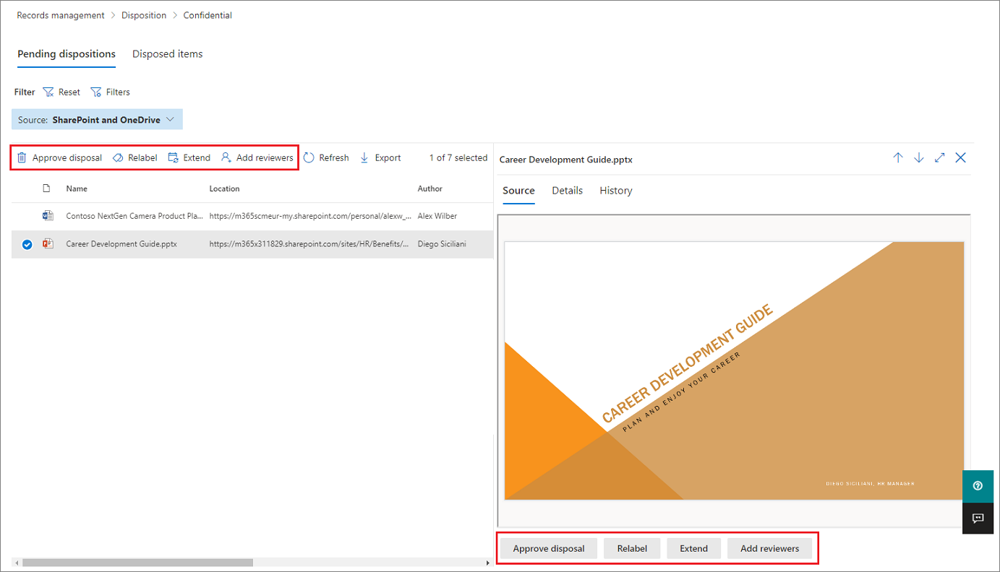

# Disposition of content

>*[Microsoft 365 licensing guidance for security & compliance](/office365/servicedescriptions/microsoft-365-service-descriptions/microsoft-365-tenantlevel-services-licensing-guidance/microsoft-365-security-compliance-licensing-guidance).*

Use the **Disposition** page from **Records Management** in the Microsoft Purview compliance portal to manage disposition reviews and view the metadata of [items marked as records](records-management.md#records) that have been automatically deleted at the end of their retention period.

[!INCLUDE [purview-preview](../includes/purview-preview.md)]

## Prerequisites for viewing content dispositions

To manage disposition reviews and confirm that items marked as records have been deleted, you must have sufficient permissions and auditing must be enabled. Also be aware of any [limitations](retention-limits.md#maximum-numbers-for-disposition-review) for disposition.

### Permissions for disposition

To successfully access the **Disposition** tab in the Microsoft Purview compliance portal, users must have the **Disposition Management** role. This role is included in the **Records Management** default role group.

> [!NOTE]
> By default, a global admin isn't granted the **Disposition Management** role. 

To grant users just the permissions they need for disposition reviews without granting them permissions to view and configure other features for retention and records management, create a custom role group (for example, named "Disposition Reviewers") and grant this group the **Disposition Management** role.

For instructions to add users to the default roles or create your own role groups, see [Permissions in the Microsoft Purview compliance portal](microsoft-365-compliance-center-permissions.md).

Additionally:

- To view the contents of items during the disposition process, add users to the **Content Explorer Content Viewer** role group. If users don't have the permissions from this role group, they can still select a disposition review action to complete the disposition review, but must do so without being able to view the item's contents from the mini-preview pane in the Microsoft Purview compliance portal.

- By default, each person that accesses the **Disposition** page sees only items that they're assigned to review. For a records management administrator to see all items assigned to all users, and all retention labels that are configured for disposition review: Navigate to **Records management settings** > **Disposition** to select and then enable a mail-enabled security group that contains the administrator accounts.
    
    Microsoft 365 groups and security groups that aren't mail-enabled don't support this feature and don't display in the list to select. If you need to create a new mail-enabled security group, use the link to the <a href="https://go.microsoft.com/fwlink/p/?linkid=2024339" target="_blank">Microsoft 365 admin center</a> to create the new group. 
    
    > [!IMPORTANT]
    > After you've enabled the group, you can't change it in the Microsoft Purview compliance portal. See the next section for how to enable a different group by using PowerShell.

- The **Records management settings** option is visible only to record management administrators. 

#### Enabling another security group for disposition

After you've enabled a security group for disposition from the **Records management settings** in the Microsoft Purview compliance portal, you can't disable this permission for the group or replace the selected group in the Microsoft Purview compliance portal. However, you can enable another mail-enabled security group by using the [Enable-ComplianceTagStorage](/powershell/module/exchange/enable-compliancetagstorage) cmdlet.

For example: 

```PowerShell
Enable-ComplianceTagStorage -RecordsManagementSecurityGroupEmail dispositionreviewers@contosoi.com
````

### Enable auditing

Make sure that auditing is enabled at least one day before the first disposition action. For more information, see [Search the audit log in the Microsoft Purview compliance portal](audit-log-search.md). 

## Disposition reviews

When content reaches the end of its retention period, there are several reasons why you might want to review that content and confirm whether it can be permanently deleted ("disposed"). For example, instead of deleting the content, you might need to:
  
- Suspend the deletion of relevant content for litigation or an audit.

- Assign a different retention period to the content, perhaps because the original retention settings were a temporary or provisional solution.

- Move the content from its existing location to an archive location, for example, if that content has research or historical value.

When a disposition review is triggered at the end of the retention period, the reviewers you choose receive an email notification that they have content to review. These reviewers can be individual users or mail-enabled security groups.

You can customize the notification email that reviewers receive, including instructions in different languages. For multi-language support, you must specify the translations yourself and this custom text is displayed to all reviewers irrespective of their locale.

Users receive an initial email notification per label at the end of the item's retention period, with a reminder per label once a week of all disposition reviews that they're assigned. They can click the link in the notification and reminder emails to go directly to the **Records management** > **Disposition** page in the Microsoft Purview compliance portal to review the content and take an action. Alternately, the reviewers can navigate to this **Disposition** page in the Microsoft Purview compliance portal. Then:

- Reviewers see only the disposition reviews that are assigned to them, whereas administrators who are added to the selected security group for records manager see all disposition reviews.

- Reviewers can add new users to the same disposition review. Note that this action doesn't automatically grant these added users the [required permissions](#permissions-for-disposition).

- For the disposition review process, a mini-review pane for each item shows a preview of the content if they have permissions to see it. If they don't have permissions, they can select the content link and request permissions. This mini-review pane also has tabs for additional information about the content:
   - **Details** to display indexed properties, where it's located, who created it and when, and who last modified it and when.
   - **History** that shows the history of any disposition review actions to date, with reviewer comments if available.

A disposition review can include content in Exchange mailboxes, SharePoint sites, and OneDrive accounts. Content pending a disposition review in those locations is permanently deleted only after a reviewer for the final stage of disposition chooses to permanently delete the content.

> [!NOTE]
> A mailbox must have at least 10 MB data to support disposition reviews.

Administrators can see an overview of all pending dispositions in the **Overview** tab. Reviewers see only their items pending disposition. For example:

:::image type="content" source="../media/dispositions-overview.png" alt-text="Pending dispositions in Records management overview.":::

When you select the **View all pending dispositions**, you're taken to the **Disposition** page. For example:

:::image type="content" source="../media/disposition-tab.png" alt-text="Dispositions page in the Microsoft Purview compliance portal.":::

### Workflow for a disposition review

The following diagram shows the basic workflow for a disposition review (single-stage) when a retention label is published and then manually applied by a user. Alternatively, a retention label configured for a disposition review can be automatically applied to content.

:::image type="content" source="../media/disposition-review-option.png" alt-text="Process chart showing the standard flow of how disposition works.":::

### Auto-approval for disposition

> [!NOTE]
> This feature is in preview and subject to change

You can optionally specify a time period (7-365 days) for auto-approval. The default period if you select this option is 14 days.

If designated reviewers don't take manual action during this time period by using the [standard disposition review process](#viewing-and-disposing-of-content), the item automatically passes to the next review stage. If the item is in the final review stage, the item is automatically disposed with permanent deletion.

> [!IMPORTANT]
> If you configure this option and items are already pending disposition review, they automatically become auto-approved if they have already exceeded the number of days that you specified for auto-approval. The time period always starts from when the item is ready for disposition review and not from when you configure the option.

As with all retention label changes, allow up to 7 days if you turn on, turn off, or change the number of days for this option.

There's no new auditing event for auto-approval. Instead, use the details in the existing [Approved disposal](audit-log-activities.md#disposition-review-activities) auditing event to identify whether the item was manually approved or automatically approved by using this option.

### How to configure a retention label for disposition review

Triggering a disposition review at the end of the retention period is a configuration option that's available only with a retention label. Disposition review isn't available for a retention policy. For more information about these two retention solutions, see [Learn about retention policies and retention labels](retention.md).

From the **Choose what happens after the retention period** page for a retention label:

:::image type="content" source="../media/disposition-review-option.png" alt-text="Retention settings for a label that include disposition review.":::

After you select the **Start a disposition review** option, select **+ Create stages and assign reviewers**. On the next page of the configuration, you'll specify how many consecutive stages of disposition you want and the disposition reviewers for each stage:

:::image type="content" source="../media/disposition-reviewers.png" alt-text="Disposition review configuration settings for a retention label.":::

Optionally, select whether you want to use [automatic-approval](#auto-approval-for-disposition). If you use this option, specify the number of days reviewers have to take manual action before the item is automatically moved to the next disposition stage or automatically disposed.

Select **+ Add a stage**, and name your stage for identification purposes. Then specify the reviewers for that stage.

For the reviewers, specify up to 10 individual users or mail-enabled security groups. Microsoft 365 groups aren't supported for this option.

If you need more than one person to review an item at the end of its retention period, select **Add another stage** and repeat the configuration process for the number of stages that you need, with a maximum of five stages. 

Within each individual stage of disposition, any of the users you specify for that stage are authorized to take the next action for the item at the end of its retention period. These users can also add other users to their disposition review stage.

> [!NOTE]
> If you configured retention labels before multi-staged disposition review was available, you can upgrade your labels to support this feature: Edit the label and select **Edit stages and reviewers** on the **Choose what happens after the retention period** page.

During the configuration phase, for each stage specified, you can rename it, reorder it, or remove it by selecting **Edit stages and reviewers** that now displays for the **Start a disposition review** option. Then for each stage, you can select the Stage actions option (**...**): 

:::image type="content" source="../media/stage-actions-disposition-review.png" alt-text="Stage actions for disposition reviews.":::

However, you can't reorder or remove a stage after you've created the retention label. You'll see only the **Add a stage** and **Rename a stage** options available. You can still edit the reviewers.

After you've specified your reviewers, remember to grant them the **Disposition Management** role permission. For more information, see the [Permissions for disposition](#permissions-for-disposition) section on this page.

### How to customize email messages for disposition review

Example default email notification sent to a reviewer:


You can customize the email messages that are sent to disposition reviewers for the initial notification and then reminders.

From any of the Records management pages in the Microsoft Purview compliance portal, select **Records management settings**:  

:::image type="content" source="../media/record-management-settings.png" alt-text="Records management settings.":::

From the **Disposition** tab, in the **Email notifications for disposition reviews** section, select and specify whether you want to use just the default email message, or add your own text to the default message. Your custom text is added to the email instructions after the information about the retention label and before the next steps instructions.

Text for all languages can be added, but formatting and images are unsupported. URLs and email addresses can be entered as text and depending on the email client, display as hyperlinks or unformatted text in the customized email.

Example text to add:

```console
If you need additional information, visit the helpdesk website (https://support.contoso.com) or send them an email (helpdesk@contoso.com).
```

Select **Save** to save any changes.

### Viewing and disposing of content

When a reviewer is notified by email that content is ready to review, they can click a link in the email that takes them directly to the **Disposition** page from **Records management** in the Microsoft Purview compliance portal. There, the reviewers can see how many items for each retention label are waiting disposition with the **Type** displaying **Pending disposition**. They then select a retention label, and **Open in new window** to see all content with that label:


From the **Pending dispositions** page, they see all pending dispositions for that label. When one or more items are selected, they can use the mini-preview pane and the **Source**, **Details**, and **History** tab to inspect the content before taking action on it:



If you use the horizontal scroll bar, or close the min-review pane, you see more columns that include the expiry date and the name of the disposition review stage.

As you can see from the example shown, the actions supported are: 
  
- **Approve disposal**:
    - When this action is selected for an interim stage of disposition review (you've configured multiple stages): The item moves to the next disposition stage.
    - When this action is selected for the final stage of disposition review, or there's only one stage of disposition: The item is marked as eligible for permanent deletion, which happens within 15 days.

- **Relabel**:
    - When this action is selected, the item exits the disposition review process for the original label. The item is then subject to the retention settings of the newly selected retention label.

- **Extend**:
    - When this action is selected, disposition review is effectively suspended until the end of the extended period and then disposition review is triggered again from the first stage.

- **Add reviewers**:
    - When this action is selected, the user is prompted to specify and add other users for review.
    > [!NOTE]
    > This action doesn't automatically grant the [required permissions](#permissions-for-disposition) to the users who are added. If they don't have these permissions, they can't participate in the disposition review.

Each action taken has a corresponding audit event in the [Disposition review activities](audit-log-activities.md#disposition-review-activities) auditing activities group.

During the disposition review process, unless you're using the optional setting of an [auto-approval timeout period](#auto-approval-for-disposition), the content never moves from its original location, and it's not marked for permanent deletion until this action is selected by a reviewer for the final or only disposition stage.

## Disposition of records

From the **Records management** main page > **Disposition** tab, you can identify:

- Items deleted as a result of a disposition review.
- Items marked as a record or regulatory record but not marked for disposition review and automatically deleted at the end of their retention period.

These items display **Records Disposed** in the **Type** column. For example:


> [!NOTE]
> This functionality uses information from the [unified audit log](audit-log-search.md) and therefore requires auditing to be [enabled and searchable](audit-log-enable-disable.md) so the corresponding events are captured.

For auditing of deleted items that were marked as records or regulatory records, search for **Deleted file marked as a record** in the **File and page activities** category. This audit event is applicable to documents and emails.

## Filter and export the views

When you select a retention label from the **Disposition** page, the **Pending disposition** tab (if applicable) and the **Disposed items** tab let you filter the views to help you more easily find items.

For pending dispositions, the time range is based on the expiration date. For disposed items, the time range is based on the deletion date.
  
You can export information about the items in either view as a .csv file that you can then sort and manage using Excel.