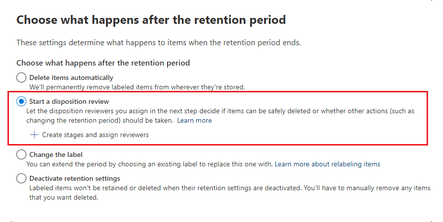

# Disposition of content

>*[Microsoft 365 licensing guidance for security & compliance](/office365/servicedescriptions/microsoft-365-service-descriptions/microsoft-365-tenantlevel-services-licensing-guidance/microsoft-365-security-compliance-licensing-guidance).*

Use the **Disposition** tab from **Records Management** in the Microsoft 365 compliance center to manage disposition reviews and view [records](records-management.md#records) that have been automatically deleted at the end of their retention period. 

## Prerequisites for viewing content dispositions

To manage disposition reviews and confirm that records have been deleted, you must have sufficient permissions and auditing must be enabled.

### Permissions for disposition

To successfully access the **Disposition** tab in the Microsoft 365 compliance center, users must have the **Disposition Management** admin role. From December 2020, this role is now included in the **Records Management** default admin role group.

> [!NOTE]
> By default, a global admin isn't granted the **Disposition Management** role. 

To grant users just the permissions they need for disposition reviews without granting them permissions to view and configure other features for retention and records management, create a custom role group (for example, named "Disposition Reviewers") and grant this group the Disposition Management role.

Additionally, to view the contents of items during the disposition process, add users to the following two role groups: **Content Explorer Content Viewer** and **Content Explorer List Viewer**. If users don't have the permissions from these role groups, they can still select a disposition review action to complete the disposition review, but must do so without being able to view the item's contents from the compliance center.

For instructions to configure these permissions, see [Give users access to the Office 365 Security & Compliance Center](../security/office-365-security/grant-access-to-the-security-and-compliance-center.md).

### Enable auditing

Make sure that auditing is enabled at least one day before the first disposition action. For more information, see [Search the audit log in the Office 365 Security &amp; Compliance Center](search-the-audit-log-in-security-and-compliance.md). 

## Disposition reviews

When content reaches the end of its retention period, there are several reasons why you might want to review that content and confirm whether it can be permanently deleted ("disposed"). For example, instead of deleting the content, you might need to:
  
- Suspend the deletion of relevant content in the event of litigation or an audit.

- Assign a different retention period to the content, perhaps because the original retention settings were a temporary or provisional solution.

- Move the content from its existing location to an archive location, for example, if that content has research or historical value.

When a disposition review is triggered at the end of the retention period:
  
- The people you choose receive an email notification that they have content to review. These reviewers can be individual users or mail-enabled security groups. Note that notifications are sent on a weekly basis.
    
- The reviewers go to the **Disposition** tab in the Microsoft 365 compliance center to review the content and decide whether to permanently delete it, extend its retention period, or apply a different retention label.

A disposition review can include content in Exchange mailboxes, SharePoint sites, OneDrive accounts, and Microsoft 365 groups. Content awaiting a disposition review in those locations is deleted only after a reviewer chooses to permanently delete the content.

> [!NOTE]
> A mailbox must have at least 10 MB data to support disposition reviews.

You can see an overview of all pending dispositions in the **Overview** tab. For example:

When you select the **View all pending dispositions**, you're taken to the **Disposition** page. For example:

### Workflow for a disposition review

The following diagram shows the basic workflow for a disposition review when a retention label is published and then manually applied by a user. Alternatively, a retention label configured for a disposition review can be auto-applied to content.
  

  
Triggering a disposition review at the end of the retention period is a configuration option that's available only with a retention label. This option is not available for a retention policy. For more information about these two retention solutions, see [Learn about retention policies and retention labels](retention.md).

From the **Define retention settings** page for a retention label:

 
After you select this **Trigger a disposition review** option, you specify the disposition reviewers on the next page of the wizard:

For the reviewers, specify a user or mail-enabled security group. Microsoft 365 groups ([formerly Office 365 groups](https://techcommunity.microsoft.com/t5/microsoft-365-blog/office-365-groups-will-become-microsoft-365-groups/ba-p/1303601)) are not supported for this option.

### Viewing and disposing of content

When a reviewer is notified by email that content is ready to review, they go to the **Disposition** tab from **Records Management** in the Microsoft 365 compliance center. The reviewers can see how many items for each retention label are awaiting disposition, and then select a retention label to see all content with that label.

After you select a retention label, you then see all pending dispositions for that label from the **Pending disposition** tab. Select one or more items where you can then choose an action and enter a justification comment:

As you can see from the picture, the actions supported are: 
  
- Permanently delete the item
- Extend the retention period
- Apply a different retention label

Providing you have permissions to the location and the content, you can use the link in the **Location** column to view documents in their original location. During a disposition review, the content never moves from its original location, and it's never deleted until the reviewer chooses to do so.

The email notifications are sent automatically to reviewers on a weekly basis. This scheduled process means that when content reaches the end of its retention period, it might take up to seven days for reviewers to receive the email notification that content is awaiting disposition.
  
All disposition actions can be audited and the justification text entered by the reviewer is saved and displayed in the **Comment** column on the **Disposed items** page.
  
### How long until disposed content is permanently deleted

Content awaiting a disposition review is deleted only after a reviewer chooses to permanently delete the content. When the reviewer chooses this option, the content in the SharePoint site or OneDrive account becomes eligible for the standard cleanup process described in [How retention settings work with content in place](retention.md#how-retention-settings-work-with-content-in-place).

## Disposition of records

Use the **Disposition** tab from the **Records Management** page to identify:

- Items deleted as a result of a disposition review.
- Items marked as a record or regulatory record that were automatically deleted at the end of their retention period.

These items display **Records Disposed** in the **Type** column. For example:

Items that are shown in the **Disposed Items** tab are kept for up to seven years after the item was disposed, with a limit of one million items per record for that period. If you see the **Count** number nearing this limit of one million, and you need proof of disposition for your records, contact [Microsoft Support](../business-video/get-help-support.md).

> [!NOTE]
> This functionality uses information from the [unified audit log](search-the-audit-log-in-security-and-compliance.md) and therefore requires auditing to be [enabled and searchable](turn-audit-log-search-on-or-off.md) so the corresponding events are captured.

For auditing of deleted items that were marked as records or regulatory records, search for **Deleted file marked as a record** in the **File and page activities** category. This audit event is applicable to documents and emails.

## Filter and export the views

When you select a retention label from the **Disposition** page, the **Pending disposition** tab (if applicable) and the **Disposed items** tab let you filter the views to help you more easily find items. 

For pending dispositions, the time range is based on the expiration date. For disposed items, the time range is based on the deletion date.
  
You can export information about the items in either view as a .csv file that you can then sort and manage using Excel:

