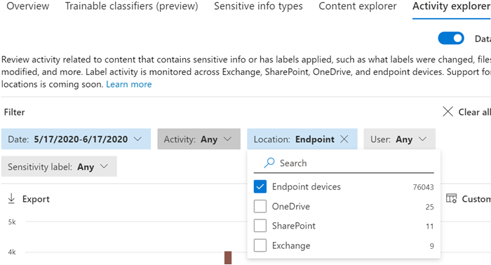

# Get started with Microsoft Compliance Extension (preview)

Use these procedures to roll out the Microsoft Compliance Extension.

## Before you begin

To use Microsoft Compliance Extension, the device must be onboarded into endpoint DLP. Review these articles if you are new to DLP or endpoint DLP

- [Learn about Microsoft Compliance Extension](dlp-chrome-learn-about.md)
- [Learn about data loss prevention](dlp-learn-about-dlp.md)
- [Create, test, and tune a DLP policy](create-test-tune-dlp-policy.md)
- [Create a DLP policy from a template](create-a-dlp-policy-from-a-template.md)
- [Learn about endpoint data loss prevention](endpoint-dlp-learn-about.md)
- [Get started with Endpoint data loss prevention](endpoint-dlp-getting-started.md)
- [Onboarding tools and methods for Windows 10 devices](dlp-configure-endpoints.md)
- [Configure device proxy and internet connection settings for Endpoint DLP](endpoint-dlp-configure-proxy.md)
- [Using Endpoint data loss prevention](endpoint-dlp-using.md)

### SKU/subscriptions licensing

Before you get started, you should confirm your [Microsoft 365 subscription](https://www.microsoft.com/microsoft-365/compare-microsoft-365-enterprise-plans?rtc=1) and any add-ons. To access and use Endpoint DLP functionality, you must have one of these subscriptions or add-ons.

- Microsoft 365 E5
- Microsoft 365 A5 (EDU)
- Microsoft 365 E5 compliance
- Microsoft 365 A5 compliance
- Microsoft 365 E5 information protection and governance
- Microsoft 365 A5 information protection and governance

For detailed licensing guidance, see [Microsoft 365 licensing guidance for security & compliance](https://docs.microsoft.com/office365/servicedescriptions/microsoft-365-service-descriptions/microsoft-365-tenantlevel-services-licensing-guidance/microsoft-365-security-compliance-licensing-guidance#information-protection).

- Your org must be licensed for Endpoint DLP
- Your devices must be running Windows 10 x64 build 1809 or later.
- The device must have Antimalware Client Version is 4.18.2101.9 or later. Check your current version by opening **Windows Security** app, select the **Settings** icon, and then select **About**.


### Permissions

Data from Endpoint DLP can be viewed in [Activity explorer](data-classification-activity-explorer.md). There are seven roles that grant permission to activity explorer, the account you use for accessing the data must be a member of any one of them.

- Global admin
- Compliance admin
- Security admin
- Compliance data admin
- Global reader
- Security reader
- Reports reader

### Overall installation workflow

Deploying Microsoft Compliance Extension is a multi-phase process. You can choose to install on one machine at a time, or use Microsoft Endpoint Manager or Group Policy for organization-wide deployments.

1. [Prepare your devices](#prepare-your-devices).
2. [Basic Setup Single Machine Selfhost](#basic-setup-single-machine-selfhost)
3. [Deploy using Microsoft Endpoint Manager](#deploy-using-microsoft-endpoint-manager)
4. [Deploy using Group Policy](#deploy-using-group-policy)
5. [Test the Extension](#test-the-extension)
6. [Use the Alerts Management Dashboard to viewing Chrome DLP alerts](#use-the-alerts-management-dashboard-to-viewing-chrome-dlp-alerts)
7. [Viewing Chrome DLP data in activity explorer](#viewing-chrome-dlp-data-in-activity-explorer) 

### Prepare infrastructure

If you are rolling out the Microsoft Compliance Extension to all your monitored Windows 10 devices, you should remove Google Chrome from the unallowed app and unallowed browser lists. For more information, see [Unallowed browsers](endpoint-dlp-using.md#unallowed-browsers). If you are only rolling it out to a few devices, you can leave Chrome on the unallowed browser or unallowed app lists. The Microsoft Compliance Extension will bypass the restrictions of both lists for those computers where it is installed.  

### Prepare your devices

1. Use the procedures in these topics to onboard your devices:
    1. [Get started with Endpoint data loss prevention](endpoint-dlp-getting-started.md)
    1. [Onboarding tools and methods for Windows 10 devices](dlp-configure-endpoints.md)
    1. [Configure device proxy and internet connection settings for Endpoint DLP](endpoint-dlp-configure-proxy.md)

### Basic Setup Single Machine Selfhost

This is the recommended method. 

1. Sign in to the Windows 10 computer on which you want to install the Microsoft Compliance Extension on, and run this PowerShell script as an administrator. 

   ```powershell
   Get-Item -path "HKLM:\SOFTWARE\Microsoft\Windows Defender\Miscellaneous Configuration" | New-ItemProperty -Name DlpDisableBrowserCache -Value 0 -Force
   ``` 

2.	Navigate to [Microsoft Compliance Extension - Chrome Web Store (google.com)](https://chrome.google.com/webstore/detail/microsoft-compliance-exte/echcggldkblhodogklpincgchnpgcdco).

3.	Install the extension using the instructions on the Chrome Web Store page.

### Deploy using Microsoft Endpoint Manager

Use this setup method for organization-wide deployments.


##### Enabling Required Registry Key via Microsoft Endpoint Manager

1.	Create a PowerShell script with the following contents:

    ```powershell
    Get-Item -path "HKLM:\SOFTWARE\Microsoft\Windows Defender\Miscellaneous Configuration" | New-ItemProperty -Name DlpDisableBrowserCache -Value 0 -Force
    ```

2.	Sign in to the [Microsoft Endpoint Manager Admin Center](https://endpoint.microsoft.com).

3.	Navigate to **Devices** > **Scripts** and select **Add**.

4.	Browse to the location of the script created when prompted.

5.	Select the following settings:
    1. Run this script using the logged-on credentials: YES
    1. Enforce script signature check: NO
    1. Run script in 64-bit PowerShell Host: YES

6.	Select the proper device groups and apply the policy.

#### Microsoft Endpoint Manager Force Install Steps

Before adding the Microsoft Compliance Extension to the list of force-installed extensions, it is important to ingest the Chrome ADMX. Steps for this process in Microsoft Endpoint Manager are documented by Google: [Manage Chrome Browser with Microsoft Intune - Google Chrome Enterprise Help](https://support.google.com/chrome/a/answer/9102677?hl=en#zippy=%2Cstep-ingest-the-chrome-admx-file-into-intune).

 After ingesting the ADMX, the steps below can be followed to create a configuration profile for this extension.

1.	Sign in to the Microsoft Endpoint Manager Admin Center (https://endpoint.microsoft.com).

2.	Navigate to Configuration Profiles.

3.	Select **Create Profile**.

4.	Select **Windows 10** as the platform.

5.	Select **Custom** as profile type.

6.	Select the **Settings** tab.

7.	Select **Add**.

8.	Enter the following policy information.
    
    OMA-URI: `./Device/Vendor/MSFT/Policy/Config/Chrome~Policy~googlechrome~Extensions/ExtensionInstallForcelist`<br/>
    Data type: `String`<br/>
    Value: `<enabled/><data id="ExtensionInstallForcelistDesc" value="1&#xF000; echcggldkblhodogklpincgchnpgcdco;https://clients2.google.com/service/update2/crx"/>`

9.	Click create.

### Deploy using Group Policy

If you don't want to use Microsoft Endpoint Manager, you can use group policies to deploy the Microsoft Compliance Extension across your organization

1. Your devices must be manageable via Group Policy, and you need to import all Chrome ADMXs into the Group Policy Central Store. For more information, see [How to create and manage the Central Store for Group Policy Administrative Templates in Windows](https://docs.microsoft.com/troubleshoot/windows-client/group-policy/create-and-manage-central-store).

2.	Create a PowerShell script using this PowerShell command:

    ```powershell
    Get-Item -path "HKLM:\SOFTWARE\Microsoft\Windows Defender\Miscellaneous Configuration" | New-ItemProperty -Name DlpDisableBrowserCache -Value 0 -Force
    ```

3.	Open the **Group Policy Management Console** and navigate to your organizational unit (OU).

4.	Right-click and select **Create a GPO in this domain and Link it here**. When prompted, assign a descriptive name to this group policy object (GPO) and finish creating it.

5.	Right-click the GPO and select **Edit**.

6.	Go to **Computer Configuration** > **Preferences** > **Control Panel Settings** > **Scheduled Tasks**.

7.	Create a new immediate task by selecting right-clicking and selecting **New** > **Immediate Task (At least Windows 7)**.

8.	Give the task a name & description.

9.	Choose the corresponding account to run the immediate task, for example NT Authority

10.	Select **Run with highest privileges**.

11.	Configure the policy for Windows 10.

12.	In the **Actions** tab, select the action **Start a program**.

13.	Enter the path to the Program/Script created in Step 1.

14.	Select **Apply**.

#### Adding the Chrome Extension to the ForceInstall List

1.	In the Group Policy Management Editor, navigate to your OU.

2.	Expand the following path **Computer/User configuration** > **Policies** > **Administrative templates** > **Classic administrative templates** > **Google** > **Google Chrome** > **Extensions**. This path may vary depending on your configuration.

3.	Select **Configure the list of force-installed extensions**.

4.	Right click and select **Edit**.

5.	Select **Enabled**.

6.	Select **Show**.

7.	Under **Value**, add the following entry: `echcggldkblhodogklpincgchnpgcdco;https://clients2.google.com/service/update2/crx`

8.	Select **OK** and then **Apply**.

### Test the Extension

#### Upload to cloud service, or access by unallowed browsers Cloud Egress  

1. Create or get a sensitive item and, try to upload a file to one of your organization’s restricted service domains. The sensitive data must match one of our built-in [Sensitive Info Types](sensitive-information-type-entity-definitions.md), or one of your organization’s sensitive information types. You should get a DLP toast notification on the device you are testing from that shows that this action is not allowed when the file is open.

#### Testing other DLP scenarios in Chrome 

Now that you’ve removed Chrome from the disallowed browsers/apps list, you can test the scenarios below to confirm the behavior meets your organization’s requirements:

- Copy data from a sensitive item to another document using the Clipboard
    - To test, open a file that is protected against copy to clipboard actions in the Chrome browser and attempt to copy data from the file.
    - Expected Result: A DLP toast notification showing that this action is not allowed when the file is open.
- Print a document
    - To test, open a file that is protected against print actions in the Chrome browser and attempt to print the file.
    - Expected Result: A DLP toast notification showing that this action is not allowed when the file is open.
- Copy to USB Removeable Media
    - To test, try to save the file to a removeable media storage.
    - Expected Result: A DLP toast notification showing that this action is not allowed when the file is open.
- Copy to Network Share
    - To test, try to save the file to a network share.
    - Expected Result: A DLP toast notification showing that this action is not allowed when the file is open.


### Use the Alerts Management Dashboard to viewing Chrome DLP alerts

1. Open the **Data loss prevention** page in the [Microsoft 365 Compliance center](https://compliance.microsoft.com) and select **Alerts**.

2. Refer to the procedures in [How to configure and view alerts for your DLP policies](dlp-configure-view-alerts-policies.md) to view alerts for your Endpoint DLP policies.


### Viewing Chrome DLP data in activity explorer

1. Open the [Data classification page](https://compliance.microsoft.com/dataclassification?viewid=overview) for your domain in the Microsoft 365 Compliance center and choose **Activity explorer**.

2. Refer to the procedures in [Get started with Activity explorer](data-classification-activity-explorer.md) to access and filter all the data for your Endpoint devices.

   > [!div class="mx-imgBorder"]
   > 

### Known Issues and Limitations

1. Block Override enforcement for cloud egress is not supported.
2. Incognito mode is not supported and must be disabled.

## Next steps
Now that you have onboarded devices and can view the activity data in Activity explorer, you are ready to move on to your next step where you create DLP policies that protect your sensitive items.

- [Using Endpoint data loss prevention](endpoint-dlp-using.md)

## See also

- [Learn about Endpoint data loss prevention ](endpoint-dlp-learn-about.md)
- [Using Endpoint data loss prevention ](endpoint-dlp-using.md)
- [Learn about data loss prevention](dlp-learn-about-dlp.md)
- [Create, test, and tune a DLP policy](create-test-tune-dlp-policy.md)
- [Get started with Activity explorer](data-classification-activity-explorer.md)
- [Microsoft Defender for Endpoint](https://docs.microsoft.com/windows/security/threat-protection/)
- [Onboarding tools and methods for Windows 10 machines](https://docs.microsoft.com/windows/security/threat-protection/microsoft-defender-atp/configure-endpoints)
- [Microsoft 365 subscription](https://www.microsoft.com/microsoft-365/compare-microsoft-365-enterprise-plans?rtc=1)
- [Azure AD joined devices](https://docs.microsoft.com/azure/active-directory/devices/concept-azure-ad-join)
- [Download the new Microsoft Edge based on Chromium](https://support.microsoft.com/help/4501095/download-the-new-microsoft-edge-based-on-chromium)
