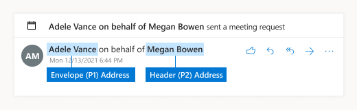

# DLP policy conditions, exceptions, and actions

Conditions and exceptions in DLP policies identify sensitive items that the policy is applied to. Actions define what happens as a consequence of a condition of exception being met.

- Conditions define what to include
- Exceptions define what to exclude.
- Actions define what happens as a consequence of condition or exception being met

Most conditions and exceptions have one property that supports one or more values. For example, if the DLP policy is being applied to Exchange emails, the **The sender** is condition requires the sender of the message. Some conditions have two properties. For example, the **A message header includes any of these words** condition requires one property to specify the message header field, and a second property to specify the text to look for in the header field. Some conditions or exceptions don't have any properties. For example, the **Attachment is password protected** condition simply looks for attachments in messages that are password protected.

Actions typically require additional properties. For example, when the DLP policy rule redirects a message, you need to specify where the message is redirected to.
<!-- Some actions have multiple properties that are available or required. For example, when the rule adds a header field to the message header, you need to specify both the name and value of the header. When the rule adds a disclaimer to messages, you need to specify the disclaimer text, but you can also specify where to insert the text, or what to do if the disclaimer can't be added to the message. Typically, you can configure multiple actions in a rule, but some actions are exclusive. For example, one rule can't reject and redirect the same message.-->

[!INCLUDE [purview-preview](../includes/purview-preview.md)]

## Conditions and exceptions for DLP policies

The tables in the following sections describe the conditions and exceptions that are available in DLP.

- [Senders](#senders)
- [Recipients](#recipients)
- [Message subject or body](#message-subject-or-body)
- [Attachments](#attachments)
- [Message headers](#message-headers)
- [Message properties](#message-properties)

### Senders

If you use the sender address as a condition or exception the actual field where the value is looked for varies depending on the sender address location configured. By default,  DLP rules use the Header address as the sender address.



At the tenant level, you can configure a sender address location to be used across all rules, unless overridden by a single rule. To set tenant DLP policy configuration to evaluate the sender address from the Envelope across all rules, you can run the following command:

```PowerShell
Set-PolicyConfig -SenderAddressLocation Envelope
```

To configure the sender address location at a DLP rule level, the parameter is *SenderAddressLocation*. The available values are:

- **Header**: Only examine senders in the message headers (for example, the **From**, **Sender**, or **Reply-To** fields). This is the default value.

- **Envelope**: Only examine senders from the message envelope (the **MAIL FROM** value that was used in the SMTP transmission, which is typically stored in the **Return-Path** field).

- **Header or envelope** (`HeaderOrEnvelope`) Examine senders in the message header and the message envelope.

|condition or exception in DLP|condition/exception parameters in Security & Compliance PowerShell|property type|description|
|---|---|---|---|
|Sender is|condition: *From* <br/><br/> exception: *ExceptIfFrom*|Addresses|Messages that are sent by the specified mailboxes, mail users, mail contacts, or Microsoft 365 groups in the organization.|
|The sender is a member of |*FromMemberOf* <br/><br/> *ExceptIfFromMemberOf*|Addresses|Messages that are sent by a member of the specified distribution group, mail-enabled security group, or Microsoft 365 group.|
|Sender IP address is|condition: *SenderIPRanges*<br/><br/> exception: *ExceptIfSenderIPRanges*|IPAddressRanges|Messages where the sender's IP address matches the specified IP address, or falls within the specified IP address range.|
|Sender address contains words|condition: *FromAddressContainsWords* <br/><br/> exception: *ExceptIfFromAddressContainsWords*|Words|Messages that contain the specified words in the sender's email address.|
|Sender address matches patterns|condition: *FromAddressMatchesPatterns* <br/><br/> exception: *ExceptFromAddressMatchesPatterns*|Patterns|Messages where the sender's email address contains text patterns that match the specified regular expressions.|
|Sender domain is|condition: *SenderDomainIs* <br/><br/> exception: *ExceptIfSenderDomainIs*|DomainName|Messages where the domain of the sender's email address matches the specified value. If you need to find sender domains that *contain* the specified domain (for example, any subdomain of a domain), use **The sender address matches**(*FromAddressMatchesPatterns*) condition and specify the domain by using the syntax: '\.domain\.com$'.|
|Sender scope|condition: *FromScope* <br/><br/> exception: *ExceptIfFromScope*|UserScopeFrom|Messages that are sent by either internal or external senders.|
|The sender's specified properties include any of these words|condition: *SenderADAttributeContainsWords* <br/><br/> exception: *ExceptIfSenderADAttributeContainsWords*|First property: `ADAttribute` <br/><br/> Second property: `Words`|Messages where the specified Active Directory attribute of the sender contains any of the specified words.|
|The sender's specified properties match these text patterns|condition: *SenderADAttributeMatchesPatterns* <br/><br/> exception: *ExceptIfSenderADAttributeMatchesPatterns*|First property: `ADAttribute` <br/><br/> Second property: `Patterns`|Messages where the specified Active Directory attribute of the sender contains text patterns that match the specified regular expressions.|

### Recipients

|condition or exception in DLP|condition/exception parameters in Security & Compliance PowerShell|property type|description|
|---|---|---|---|
|Recipient is|condition: *SentTo* <br/><br/> exception: *ExceptIfSentTo*|Addresses|Messages where one of the recipients is the specified mailbox, mail user, or mail contact in the organization. The recipients can be in the **To**, **Cc**, or **Bcc** fields of the message.|
|Recipient domain is|condition: *RecipientDomainIs* <br/><br/> exception: *ExceptIfRecipientDomainIs*|DomainName|Messages where the domain of the recipient's email address matches the specified value.|
|Recipient address contains words|condition: *AnyOfRecipientAddressContainsWords* <br/><br/> exception: *ExceptIfAnyOfRecipientAddressContainsWords*|Words|Messages that contain the specified words in the recipient's email address. <br/><br/>**Note**: This condition doesn't consider messages that are sent to recipient proxy addresses. It only matches messages that are sent to the recipient's primary email address.|
|Recipient address matches patterns|condition: *AnyOfRecipientAddressMatchesPatterns* <br/><br/> exception: *ExceptIfAnyOfRecipientAddressMatchesPatterns*|Patterns|Messages where a recipient's email address contains text patterns that match the specified regular expressions. <br/><br/> **Note**: This condition doesn't consider messages that are sent to recipient proxy addresses. It only matches messages that are sent to the recipient's primary email address.|
|Sent to member of|condition: *SentToMemberOf* <br/><br/> exception: *ExceptIfSentToMemberOf*|Addresses|Messages that contain recipients who are members of the specified distribution group, mail-enabled security group, or Microsoft 365 group. The group can be in the **To**, **Cc**, or **Bcc** fields of the message.|
|The recipient's specified properties include any of these words |*RecipientADAttributeContainsWords* <br/><br/> *ExceptIfRecipientADAttributeContainsWords*|First property: `ADAttribute` <br/><br/> Second property: `Words`|Messages where the specified Active Directory attribute of a recipient contains any of the specified words. <br/><br/> Note that the **Country** attribute requires the two-letter country code value (for example, DE for Germany).|
|The recipient's specified properties match these text patterns |*RecipientADAttributeMatchesPatterns* <br/><br/> *ExceptIfRecipientADAttributeMatchesPatterns*|First property: `ADAttribute` <br/><br/> Second property: `Patterns`|Messages where the specified Active Directory attribute of a recipient contains text patterns that match the specified regular expressions.|

### Message subject or body

|condition or exception in DLP|condition/exception parameters in Security & Compliance PowerShell|property type|description|
|---|---|---|---|
|Subject contains words or phrases|condition: *SubjectContainsWords* <br/> exception: *ExceptIf SubjectContainsWords*|Words|Messages that have the specified words in the Subject field.|
|Subject matches patterns|condition: *SubjectMatchesPatterns* <br/> exception: *ExceptIf SubjectMatchesPatterns*|Patterns|Messages where the Subject field contain text patterns that match the specified regular expressions.|
|Content contains|condition: *ContentContainsSensitiveInformation* <br/> exception *ExceptIfContentContainsSensitiveInformation*|SensitiveInformationTypes|Messages or documents that contain sensitive information as defined by Microsoft Purview Data Loss Prevention (DLP) policies.|
|Subject or Body matches pattern|condition: *SubjectOrBodyMatchesPatterns* <br/> exception: *ExceptIfSubjectOrBodyMatchesPatterns*|Patterns|Messages where the subject field or message body contains text patterns that match the specified regular expressions.|
|Subject or Body contains words|condition: *SubjectOrBodyContainsWords* <br/> exception: *ExceptIfSubjectOrBodyContainsWords*|Words|Messages that have the specified words in the subject field or message body|
|

### Attachments

|condition or exception in DLP|condition/exception parameters in Security & Compliance PowerShell|property type|description|
|---|---|---|---|
|Attachment is password protected|condition: *DocumentIsPasswordProtected* <br/><br/> exception: *ExceptIfDocumentIsPasswordProtected*|none|Messages where an attachment is password protected (and therefore can't be scanned). Password detection only works for Office documents, .zip files, and .7z files.|
|Attachment's file extension is|condition: *ContentExtensionMatchesWords* <br/><br/> exception: *ExceptIfContentExtensionMatchesWords*|Words|Messages where an attachment's file extension matches any of the specified words.|
|Any email attachment's content could not be scanned|condition: *DocumentIsUnsupported* <br/><br/>exception: *ExceptIf DocumentIsUnsupported*|n/a|Messages where an attachment isn't natively recognized by Exchange Online.|
|Any email attachment's content didn't complete scanning|condition: *ProcessingLimitExceeded* <br/><br/> exception: *ExceptIfProcessingLimitExceeded*|n/a|Messages where the rules engine couldn't complete the scanning of the attachments. You can use this condition to create rules that work together to identify and process messages where the content couldn't be fully scanned.|
|Document name contains words|condition: *DocumentNameMatchesWords* <br/><br/> exception: *ExceptIfDocumentNameMatchesWords*|Words|Messages where an attachment's file name matches any of the specified words.|
|Document name matches patterns|condition: *DocumentNameMatchesPatterns* <br/><br/> exception: *ExceptIfDocumentNameMatchesPatterns*|Patterns|Messages where an attachment's file name contains text patterns that match the specified regular expressions.|
|Document property is|condition: *ContentPropertyContainsWords* <br/><br/> exception: *ExceptIfContentPropertyContainsWords*|Words|Messages with documents where an attachment's custom property matches the given value.|
|Document size equals or is greater than|condition: *DocumentSizeOver* <br/><br/> exception: *ExceptIfDocumentSizeOver*|Size|Messages where any attachment is greater than or equal to the specified value.|
|Any attachment's content includes any of these words|condition: *DocumentContainsWords* <br/><br/> exception: *ExceptIfDocumentContainsWords*|`Words`|Messages where an attachment contains the specified words.|
|Any attachments content matches these text patterns|condition: *DocumentMatchesPatterns* <br/><br/> exception: *ExceptIfDocumentMatchesPatterns*|`Patterns`|Messages where an attachment contains text patterns that match the specified regular expressions.|

### Message Headers

|condition or exception in DLP|condition/exception parameters in Security & Compliance PowerShell|property type|description|
|---|---|---|---|
|Header contains words or phrases|condition: *HeaderContainsWords* <br/><br/> exception: *ExceptIfHeaderContainsWords*|Hash Table|Messages that contain the specified header field, and the value of that header field contains the specified words.|
|Header matches patterns|condition: *HeaderMatchesPatterns* <br/><br/> exception: *ExceptIfHeaderMatchesPatterns*|Hash Table|Messages that contain the specified header field, and the value of that header field contains the specified regular expressions.|

### Message properties

|condition or exception in DLP|condition/exception parameters in Security & Compliance PowerShell|property type|description|
|---|---|---|---|
|With importance|condition: *WithImportance* <br/><br/> exception: *ExceptIfWithImportance*|Importance|Messages that are marked with the specified importance level.|
|Content character set contains words|condition: *ContentCharacterSetContainsWords* <br/><br/> *ExceptIfContentCharacterSetContainsWords*|CharacterSets|Messages that have any of the specified character set names.|
|Has sender override|condition: *HasSenderOverride* <br/><br/> exception: *ExceptIfHasSenderOverride*|n/a|Messages where the sender has chosen to override a data loss prevention (DLP) policy. For more information about DLP policies see [Learn about data loss prevention](./dlp-learn-about-dlp.md)|
|Message type matches|condition: *MessageTypeMatches* <br/><br/> exception: *ExceptIfMessageTypeMatches*|MessageType|Messages of the specified type. **Note**: The available message types are Automatic reply, Auto-forward, Encrypted (S/MIME), Calendaring, Permission controlled (rights management), Voicemail, Signed, Read receipt, and Approval request. |
|The message size is greater than or equal to|condition: *MessageSizeOver* <br/><br/> exception: *ExceptIfMessageSizeOver*|`Size`|Messages where the total size (message plus attachments) is greater than or equal to the specified value. **Note**: Message size limits on mailboxes are evaluated before mail flow rules. A message that's too large for a mailbox will be rejected before a rule with this condition is able to act on the message.|

## Actions for DLP policies

This table describes the actions that are available in DLP.

|action in DLP|action parameters in Security & Compliance PowerShell|property type|description|
|---|---|---|---|
|Set header|SetHeader|First property: *Header Name* <br/><br/> Second property: *Header Value*|The SetHeader parameter specifies an action for the DLP rule that adds or modifies a header field and value in the message header. This parameter uses the syntax "HeaderName:HeaderValue". You can specify multiple header name and value pairs separated by commas|
|Remove header|RemoveHeader|First property: *MessageHeaderField*<br/><br/> Second property: *String*|The RemoveHeader parameter specifies an action for the DLP rule that removes a header field from the message header. This parameter uses the syntax "HeaderName" or "HeaderName:HeaderValue".You can specify multiple header names or header name and value pairs separated by commas|
|Redirect the message to specific users|*RedirectMessageTo*|Addresses|Redirects the message to the specified recipients. The message isn't delivered to the original recipients, and no notification is sent to the sender or the original recipients.|
|Forward the message for approval to sender's manager|Moderate|First property: *ModerateMessageByManager*<br/><br/> Second property: *Boolean*|The Moderate parameter specifies an action for the DLP rule that sends the email message to a moderator. This parameter uses the syntax: @{ModerateMessageByManager = <$true \|$false>;|
|Forward the message for approval to specific approvers|Moderate|First property: *ModerateMessageByUser*<br/><br/>Second property: *Addresses*|The Moderate parameter specifies an action for the DLP rule that sends the email message to a moderator. This parameter uses the syntax: @{ ModerateMessageByUser = @("emailaddress1","emailaddress2",..."emailaddressN")}|
|Add recipient|AddRecipients|First property: *Field*<br/><br/>Second property: *Addresses*|Adds one or more recipients to the To/Cc/Bcc field of the message. This parameter uses the syntax: @{<AddToRecipients \<CopyTo \| BlindCopyTo\> = "emailaddress"}|
|Add the sender's manager as recipient|AddRecipients|First property: *AddedManagerAction*<br/><br/>Second property: *Field*|Adds the sender's manager to the message as the specified recipient type (To, Cc, Bcc), or redirects the message to the sender's manager without notifying the sender or the recipient. This action only works if the sender's Manager attribute is defined in Active Directory. This parameter uses the syntax: @{AddManagerAsRecipientType = "\<To \| Cc \| Bcc\>"}|
Prepend subject|PrependSubject|String|Adds the specified text to the beginning of the Subject field of the message. Consider using a space or a colon (:) as the last character of the specified text to differentiate it from the original subject text.<br/><br/>To prevent the same string from being added to messages that already contain the text in the subject (for example, replies), add the "The subject contains words" (ExceptIfSubjectContainsWords) exception to the rule.|
|Apply HTML disclaimer|ApplyHtmlDisclaimer|First property: *Text*<br/><br/>Second property: *Location*<br/><br/>Third property: *Fallback action*|Applies the specified HTML disclaimer to the required location of the message.<br/><br/>This parameter uses the syntax: @{ Text = " " ; Location = \<Append \| Prepend\>; FallbackAction = \<Wrap \| Ignore \| Reject\> }|
|Remove message encryption and rights protection|RemoveRMSTemplate|n/a|Removes message encryption applied on an email|
|Deliver the message to the hosted quarantine |*Quarantine*|n/a| This action is currently in **public preview**. During this phase, emails quarantined by DLP policies will show policy type as ExchangeTransportRule.<br/><br/> Delivers the message to the quarantine in EOP. For more information, see [Quarantined email messages in EOP](/microsoft-365/security/office-365-security/quarantine-email-messages).|
|Modify Subject|ModifySubject|PswsHashTable | Remove text from the subject line that matches a specific pattern and replace it with different text. See the example below. You can: <br/><br/>- **Replace** all matches in the subject with the replacement text <br/><br/>- **Append** to remove all matches in the subject and inserts the replacement text at the end of the subject. <br/><br/>- **Prepend** to remove all matches and inserts the replacement text at the beginning of the subject. See ModifySubject parameter in, /powershell/module/exchange/new-dlpcompliancerule|
