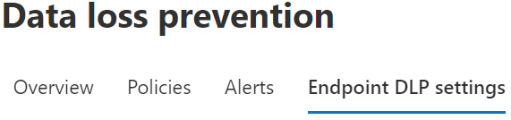

# Configure endpoint data loss prevention settings

Many aspects of Endpoint data loss prevention (DLP) behavior are controlled by centrally configured settings. Settings are applied to all DLP policies for devices.



You must configure these settings if you intend to control:

- Cloud egress restrictions
- Various types of restrictive actions on user activities per application.
- File path exclusions for Windows and macOS devices.
- Browser and domain restrictions.
- How business justifications for overriding policies appear in policy tips.
- If activities on Office, PDF, and CSV files are automatically audited.

[!INCLUDE [purview-preview](../includes/purview-preview.md)]

## DLP settings

Before you get started, you should set up your DLP settings. 

### Endpoint DLP Windows 10/11 and macOS settings

|Setting |Windows 10, 1809 and later, Windows 11  |macOS (three latest released versions) |Notes  |
|---------|---------|---------|---------|
|File path exclusions     |Supported         |Supported         |macOS includes a recommended list of exclusions that is on by default          |
|Restricted apps     |Supported         |Supported         |         |
|Restricted app groups |Supported |Not supported
|Unallowed Bluetooth apps    |Supported         |Not supported         |         |
|Browser and domain restrictions to sensitive items      |Supported         |Supported         |         |
|Additional settings for Endpoint DLP     |Supported         |Supported         |Only the default business justifications are supported for macOS devices         |
|Always audit file activity for devices     |Supported         |Supported         |         |
|Auto-quarantine file from unallowed apps | Supported | Not supported| |
|Advanced classification | Supported | Not supported| |
|Business justification in policy tips | Supported | Supported| |

### Advanced classification scanning and protection

Advanced classification scanning and protection allows the more advanced Microsoft Purview cloud based data classification service to scan items, classify them and return the results to the local machine. This means you can take advantage of classification techniques like [exact data match](create-custom-sensitive-information-types-with-exact-data-match-based-classification.md) classification, and [named entities](named-entities-learn.md) in your DLP policies.

When advanced classification is turned on, content is sent from the local device to the cloud services for scanning and classification. If bandwidth utilization is a concern, you can set a limit on how much can be used in a rolling 24 hour period. The limit is configured in Endpoint DLP settings and is applied per device. If you set a bandwidth utilization limit and it's exceeded, DLP stops sending the user content to the cloud. At this point data classification continues locally on the device but classification using exact data match, named entities, and trainable classifiers aren't available. When the cumulative bandwidth utilization drops below the rolling 24 hour limit, communication with the cloud services will resume.

If bandwidth utilization isn't a concern, you select **No limit** to allow unlimited bandwidth utilization.

These Windows versions support advanced classification scanning and protection:

- Windows 10 versions 20H1/20H2/21H1 (KB 5006738)
- Windows 10 versions 19H1/19H2 (KB 5007189)
- Windows 10 RS5 (KB 5006744)

> [!NOTE]
> Support for advanced classification is available for Office (Word, Excel, PowerPoint) and PDF file types.

> [!NOTE]
> DLP policy evaluation always occurs in the cloud, even if user content is not being sent.

### File path exclusions

Open [Microsoft Purview compliance portal](https://compliance.microsoft.com) > **Data loss prevention** > **Endpoint DLP settings** > **File path exclusions**.

You may want to exclude certain paths from DLP monitoring, DLP alerting, and DLP policy enforcement on your devices because they're too noisy or don’t contain files you're interested in. Files in those locations won't be audited and any files that are created or modified in those locations won't be subject to DLP policy enforcement. You can configure path exclusions in DLP settings.

#### Windows 10 devices

You can use this logic to construct your exclusion paths for Windows 10 devices:

- Valid file path that ends with `\`, which means only files directly under folder. <br/>For example: `C:\Temp\`

- Valid file path that ends with `\*`, which means only files under subfolders. Files directly under the folder aren't excluded. <br/>For example: `C:\Temp\*`

- Valid file path that ends without `\` or `\*`, which means all files directly under folder and all subfolders. <br/>For example: `C:\Temp`

- A path with wildcard between `\` from each side. <br/>For example: `C:\Users\*\Desktop\`

- A path with wildcard between `\` from each side and with `(number)` to give exact number of subfolders. <br/>For example: `C:\Users\*(1)\Downloads\`

- A path with SYSTEM environment variables. <br/>For example: `%SystemDrive%\Test\*`

- A mix of all the above. <br/>For example: `%SystemDrive%\Users\*\Documents\*(2)\Sub\`

#### macOS devices

Similar to Windows 10 devices you can add your own exclusions for macOS devices.

- File path definitions are case insensitive, so `User` is the same as `user`.

- Wildcard values are supported. So a path definition can contain a `*` in the middle of the path or at the end of the path. For example: `/Users/*/Library/Application Support/Microsoft/Teams/*`

##### Recommended file path exclusions (preview)

For performance reasons, Endpoint DLP includes a list of recommended file path exclusions for macOS devices. These exclusions are turned on by default. You can disable them if you want by toggling the **Include recommended file path exclusions for Mac** toggle. The list includes:

- /Applications/*
- /System/*
- /usr/*
- /Library/*
- /private/*
- /opt/*
- /Users/*/Library/Application Support/Microsoft/Teams/*

### Restricted apps and app groups

#### Restricted apps

**Restricted apps** (previously called **Unallowed apps**) is a list of applications that you create. You configure what actions DLP will take when a user uses an app on the list to ***access*** a DLP protected file on a device. It's available for Windows 10 and macOS devices.

When **Access by restricted apps** is selected in a policy and a user uses an app that is on the restricted apps list to access a protected file, the activity will be `audited`, `blocked`, or `blocked with override` depending on how you configured it. That is unless the same app is a member of a **Restricted app group**, then the actions configured for activities in the **Restricted app group** override the actions configured for the access activity for the **Restricted apps** list. All activity is audited and available to review in activity explorer.

> [!IMPORTANT]
> Do not include the path to the executable, but only the executable name (such as browser.exe).

> [!IMPORTANT]
> The action (`audit`, `block with override`, or `block`) defined for apps that are on the restricted apps list only applies when a user attempts to ***access*** a protected item. 

#### File activities for apps in restricted app groups

Restricted app groups are collections of apps that you create in DLP settings and then add to a rule in a policy. When you add a restricted app group to a policy, you can take the actions defined in this table.

|Restricted App group option  |What it allows you to do  |
|---------|---------|
|Don't restrict file activity     |Tells DLP to allow users to access DLP protected items using apps in the app group and don't take any actions when the user attempts to **Copy to clipboard**, **Copy to a USB removable drive**, **Copy to a network drive**, and **Print** from the app.          |
|Apply a restriction to all activity     |Tells DLP to `Audit only`, `Block with override`, or `Block` when a user attempts to access a DLP protected item using an app that's in this app group         |
|Apply restrictions to a specific activity     |This setting allows a user to access a DLP protected item using an app that is in the app group and allows you to select a default action (`Audit only`, `Block`, or `Block with override`) for DLP to take when a user attempts to **Copy to clipboard**, **Copy to a USB removable drive**, **Copy to a network drive**, and **Print**.          |

> [!IMPORTANT]
> Settings in a restricted app group override any restrictions set in the restricted apps list when they are in the same rule. So, if an app is on the restricted apps list and is a member of a restricted apps group, the settings of the restricted apps group is applied.

#### How DLP applies restrictions to activities

Interactions between **File activities for apps in restricted app groups**, **File activities for all apps** and the **Restricted app activities** list are scoped to the same rule.

##### Restricted app groups overrides

Configurations defined in **File activities for apps in restricted app groups** override the configurations in the **Restricted app activities** list and **File activities for all apps** in the same rule.

##### Restricted app activities and File activities for all apps

The configurations of **Restricted app activities** and **File activities for all apps** work in concert if the action defined for **Restricted app activities** is either `Audit only`, or `Block with override` in the same rule. This is because actions defined for **Restricted app activities** only apply when a user accesses a file using an app that's on the list. Once the user has access, the actions defined for activities in **File activities for all apps** apply. 

Here's an example:

If Notepad.exe is added to **Restricted apps** and **File activities for all apps** is configured to **Apply restrictions to specific activity** and both are configured like this:

|Setting in policy  |App name  |User activity  |DLP action to take  |
|---------|---------|---------|---------|
|Restricted app activities     |Notepad        |Access a DLP protected item         |Audit only         |
|File activities for all apps   |All apps        | Copy to clipboard        |Audit only         |
|File activities for all apps     |All apps         |Copy to a USB removeable device | Block       |
|File activities for all apps     |All apps         |Copy to a network share         |Audit only         |
|File activities for all apps   |All apps         |Print         |Block         |
|File activities for all apps     |All apps         |Copy or move using unallowed Bluetooth app         |Blocked         |
|File activities for all apps     |All apps         |Remote desktop services         |Block with override         |

User A opens a DLP protected file using Notepad. DLP allows the access and audits the activity. While still in Notepad, User A then tries to copy to clipboard from the protected item, this works and DLP audits the activity. User A then tries to print the protected item from Notepad and the activity is blocked.

> [!NOTE]
> When the DLP action to take in **Restricted app activities** is set to `block`, all access is blocked and the user cannot perform any activities on the file.
   
##### File activities for all apps only

If an app isn't in **File activities for apps in restricted app groups** or isn't in the **Restricted app activities** list or is in the **Restricted app activities** list with an action of `Audit only`, or 'Block with override`, any restrictions defined in the **File activities for all apps** are applied in the same rule.  

#### macOS devices

Just like on Windows devices, you'll now be able to prevent macOS apps from accessing sensitive data by defining them in the **Restricted app activities** list. 

> [!NOTE]
> Note that cross platform apps must be entered with their unique paths respective to the OS they are running on.

To find the full path of Mac apps:

1. On the macOS device, open **Activity Monitor**. Find and double-click the process you want to restrict

2. Choose **Open Files and Ports** tab.
  
3. For macOS apps, you need the full path name, including the name of the app.

#### Protect sensitive data from cloud synchronization apps

To prevent sensitive items from being synced to the cloud by cloud sync apps, like *onedrive.exe*, add the cloud sync app to the **Unallowed apps** list. When an unallowed cloud-sync app tries to access an item that is protected by a blocking DLP policy, DLP may generate repeated notifications. You can avoid these repeated notifications by enabling the **Auto-quarantine** option under **Unallowed apps**.  

##### Auto-quarantine (preview)

> [!NOTE]
> Auto-quarantine is supported in Windows 10 only

When enabled, Auto-quarantine kicks in when an unallowed app attempts to access a DLP protected sensitive item. Auto-quarantine moves the sensitive item to an admin configured folder and can leave a placeholder **.txt** file in the place of the original. You can configure the text in the placeholder file to tell users where the item was moved to and other pertinent information.  

You can use auto-quarantine to prevent an endless chain of DLP notifications for the user and admins—see [Scenario 4: Avoid looping DLP notifications from cloud synchronization apps with auto-quarantine (preview)](endpoint-dlp-using.md#scenario-4-avoid-looping-dlp-notifications-from-cloud-synchronization-apps-with-auto-quarantine-preview).

### Unallowed Bluetooth apps

Prevent people from transferring files protected by your policies via specific Bluetooth apps.

### Browser and domain restrictions to sensitive data

Restrict sensitive files that match your policies from being shared with unrestricted cloud service domains.

#### Unallowed browsers

For Windows devices, you add browsers, identified by their executable names, that will be blocked from accessing files that match the conditions of an enforced a DLP policy where the upload to cloud services restriction is set to block or block override. When these browsers are blocked from accessing a file, the end users will see a toast notification asking them to open the file through Microsoft Edge.

For macOS devices, you must add the full file path. To find the full path of Mac apps:

1. On the macOS device, open **Activity Monitor**. Find and double-click the process you want to restrict

2. Choose **Open Files and Ports** tab.
  
3. For macOS apps, you need the full path name, including the name of the app.

#### Service domains

> [!NOTE]
> The **Service domains** setting only applies to files uploaded using Microsoft Edge or Google Chrome with the [Microsoft Purview Extension](dlp-chrome-learn-about.md#learn-about-the-microsoft-purview-extension) installed.

You can control whether sensitive files that are protected by your policies can be uploaded to specific service domains from Microsoft Edge.

##### Allow

When the **Service domains** list is set to **Allow**, DLP policies won't be applied when a user attempts to upload a sensitive file to any of the domains on the list.

If the list mode is set to **Allow**, any user activity involving a sensitive item and a domain that's on the list will be audited. The activity is allowed. When a user attempts an activity involving a sensitive item and a domain that *isn't* on the list then DLP policies, and the actions defined in the polices, are applied.

For example, with this configuration:

- **Service domains** list mode is set to **Allow**.
    - Contoso.com is on the list.
-  A DLP policy is set to **Block** upload of sensitive items that contain credit card numbers.
 
User attempts to:

- Upload a sensitive file with credit card numbers to contoso.com.
    - The user activity is allowed, audited, an event is generated, but it won't list the policy name or the triggering rule name in the event details, and no alert is generated. 

but if a user attempts to: 

- Upload a sensitive file with credit card numbers to wingtiptoys.com (which is not on the list).
    - The policy is applied and the user activity is blocked. An event is generated, and an alert is generated. 
 
##### Block
 
When the **Service domains** list is set to **Block**, DLP policies will be applied when a user attempts to upload a sensitive file to any of the domains on the list.

If the list mode is set to **Block**, when a user attempts an activity involving a sensitive item and a domain that is on the list then DLP policies, and the actions defined in the polices, are applied. Any activity involving a sensitive item and a domain that is not on the list will be audited and the user activity is allowed.

For example, with this configuration:

- **Service domains** list mode is set to **Block**.
    - Contoso.com is on the list.
-  A DLP policy is set to **Block with override** for the upload of sensitive items that contain credit card numbers.
 
User attempts to:

- Upload a sensitive file with credit card numbers to contoso.com.
    - The user activity is blocked, but the user can override the block, an event is generated and an alert is triggered.

but if a user attempts to: 

- Upload a sensitive file with credit card numbers to wingtiptoys.com (which is not on the list).
    - The policy *isn't* applied and the user activity is audited. An event is generated, but it won't list the policy name or the triggering rule name in the event details, and no alert is generated. 

> [!IMPORTANT]
> When the service restriction mode is set to "Allow", you must have at least one service domain configured before restrictions are enforced.

Use the FQDN format of the service domain without the ending `.` when you add a domain to the list.

For example:

| Input | URL matching behavior |
|---|---|
| **CONTOSO.COM** |**Matches the specified domain name, and any subsite**: <p>*://contoso.com<p>*://contoso.com/ <p>*://contoso.com/anysubsite1 <p>*://contoso.com/anysubsite1/anysubsite2 (etc.) <p>**Does not match sub-domains or unspecified domains**: <p>*://anysubdomain.contoso.com <p>*://anysubdomain.contoso.com.AU |
| ***.CONTOSO.COM** |**Matches the specified domain name, any subdomain, and any site**: <p>*://contoso.com <p>*://contoso.com/anysubsite <p>*://contoso.com/anysubsite1/anysubsite2 <p>*://anysubdomain.contoso.com/ <p>*://anysubdomain.contoso.com/anysubsite/ <p>*://anysubdomain1.anysubdomain2.contoso.com/anysubsite/ <p>*://anysubdomain1.anysubdomain2.contoso.com/anysubsite1/anysubsite2 (etc.) <p>**Does not match unspecified domains** <p>*://anysubdomain.contoso.com.AU/ |
| **`www.contoso.com`** |**Matches the specified domain name**: <p>`www.contoso.com` <p>**Does not match unspecified domains or subdomains** <p>*://anysubdomain.contoso.com/, in this case, you have to put the FQDN domain name itself `www.contoso.com`|

#### Sensitive service domains

When you list a website in Sensitive services domains you can audit, block with override, or block users when they attempt to:

- print from a website
- copy data from a website
- save a website as local files
- upload a sensitive file to an excluded website (this is configured in the policy)

For the print, copy data and save actions, each website must be listed in a website group and the user must be accessing the website through Microsoft Edge. For the upload action, the user can be using Microsoft Edge or Google Chrome with the Purview extension. Sensitive service domains is used in conjunction with a DLP policy for Devices. You can also define website groups that you want to assign policy actions to that are different from the global website group actions. See, [Scenario 6 Monitor or restrict user activities on sensitive service domains](endpoint-dlp-using.md#scenario-6-monitor-or-restrict-user-activities-on-sensitive-service-domains) for more information.


### Additional settings for endpoint DLP

#### Business justification in policy tips

You can control how users interact with the business justification option in DLP policy tip notifications. This option appears when users perform an activity that's protected by the **Block with override** setting in a DLP policy. This is a global setting. You can choose from one the following options:

- **Show default options and custom text box**: By default, users can select either a built-in justification, or enter their own text.
- **Only show default options**: Users can only select a built-in justification.
- **Only show custom text box**: Users can only enter their own justification. Only the text box will appear in the end-user policy tip notification. 

##### Customizing the options in the drop-down menu

You can create up to five customized options that will appear when users interact with the policy notification tip by selecting the **Customize the options drop-down menu**. 


|Option |Default text  |
|---------|---------|
|option 1    | **This is part of an established business workflow**  or you can enter customized text        |
|option 2  |**My manager has approved this action** or you can enter customized text         |
|option 3   |**Urgent access required; I'll notify my manager separately** or you can enter customized text          |
|Show false positive option     |**The information in these files is not sensitive** or you can enter customized text          |
|option 5    |**Other** or you can enter customized text         |

### Always audit file activity for devices

By default, when devices are onboarded, activity for Office, PDF, and CSV files is automatically audited and available for review in activity explorer. Turn this feature off if you want this activity to be audited only when onboarded devices are included in an active policy.

File activity will always be audited for onboarded devices, regardless of whether they're included in an active policy.

> [!IMPORTANT]
> Before you can use [Printer groups (preview)](#printer-groups-preview), [Removable storage device groups](#removable-storage-device-groups-preview), [Network share groups](#network-share-groups-preview), and [VPN settings](#vpn-settings-preview) you must register [here](https://forms.office.com/r/GNVTFvxuZv).

### Printer groups (preview)

Use this setting to define groups of printers that you want to assign policy actions to that are different from the global printing actions. For example, say you want your DLP policy to block printing of contracts to all printers, except for printers that are in the legal department.

This feature is available for devices running any of the following Windows versions :  

- Windows 10 and later (20H2, 21H1, 21H2) 
- Win 11 21H2, 22H2
- Windows Server 2022

You define a printer by these parameters:

- Friendly printer name - Get the Friendly printer name value from the printer device property details in device manager.
- USB product ID - Get the Device Instance path value from the printer device property details in device manager. Convert it to Product ID and Vendor ID format, see [Standard USB identifiers](/windows-hardware/drivers/install/standard-usb-identifiers).
- USB vendor ID - Get the Device Instance path value from the printer device property details in device manager. Convert it to Product ID and Vendor ID format, see [Standard USB identifiers](/windows-hardware/drivers/install/standard-usb-identifiers).
- IP range
- Print to file - For example Microsoft Print to PDF or Microsoft XPS Document Writer.
- Universal print deployed on a printer - See, [Set up Universal Print](/universal-print/fundamentals/universal-print-getting-started.md) for more information on universal printers
- Corporate printer - is a print queue shared through on-premises Windows print server in your domain. Its path might look like  \\print-server\contoso.com\legal_printer_001
- Print to local

You assign each printer in the group a **Display name**. The name only appears in the Purview console. So, continuing with the example, you would create a printer group named **Legal printers** and add individual printers (with an alias) by their friendly name, like `legal_printer_001`, `legal_printer_002` and `legal_color_printer`.

You can multi-select the parameters to help you unambiguously identify a specific printer.

You can assign these policy actions to the group in a DLP policy:

- Allow (audit with no user notifications or alerts)
- Audit only (you can add notifications and alerts)
- Block with override (blocks the action, but the user can override)
- Block (blocks no matter what)

#### Create a Printer group

1. Open [Microsoft Purview compliance portal](https://compliance.microsoft.com) > **Data loss prevention** > **Endpoint DLP settings** > **Printer groups**.
1. Select **Create printer group**.
1. Give the group a name.
1. Select **Add printer**.
1. Give the printer an **Alias that will only appear here.
1. Select the parameters and provide the values to unambiguously identify the specific printer.
1. Select **Add**.
1. Add other printers as needed.
1. Select **Close**.

The most common use case is to use printers groups as an allowlist as in the above example for allowing the printing of contracts only to printers that are in the legal department. After you define a printer group here, it's available to be used in your policies that are scoped to **Devices**. See, [Scenario 7 Authorization groups](endpoint-dlp-using.md#scenario-7-authorization-groups-preview) for more information on configuring policy actions to use authorization groups.

### Removable storage device groups (preview)

Use this setting to define groups of removable storage devices, like USB thumb drives, that you want to assign policy actions to that are different from the global printing actions. For example, say you want your DLP policy to block copying of items with engineering specifications to all removeable storage devices, except for USB connected hard drives that are used to back up data and are then sent offsite.

This feature is available for devices running any of the following Windows versions :  

- Windows 10 and later (20H2, 21H1, 21H2) 
- Win 11 21H2, 22H2
- Windows 10 RS5 (KB 5006744) and Windows Server 2022 

You can define removeable storage devices by these parameters:

- Storage device friendly name - Get the Friendly name value from the storage device property details in device manager.
- USB product ID - Get the Device Instance path value from the USB device property details in device manager. Convert it to Product ID and Vendor ID format, see [Standard USB identifiers](/windows-hardware/drivers/install/standard-usb-identifiers).
- USB vendor ID - Get the Device Instance path value from the USB device property details in device manager. Convert it to Product ID and Vendor ID format, see [Standard USB identifiers](/windows-hardware/drivers/install/standard-usb-identifiers).
- Serial number ID - Get the serial number ID value from the storage device property details in device manager.
- Device ID - Get the device ID value from the storage device property details in device manager.
- Instance path ID - Get the device ID value from the storage device property details in device manager.
- Hardware ID - Get the hardware ID value from the storage device property details in device manager.

You assign each removable storage device in the group an **Alias**. The alias is a name that only appears in the Purview console. So, continuing with the example, you would create a removable storage device group named **Backup** and add individual devices  (with an alias) by their friendly name, like `backup_drive_001`, and `backup_drive_002`.

You can multi-select the parameters and the printer group will include all devices that satisfy those parameters.

You can assign these policy actions to the group in a DLP policy:

- Allow (audit with no user notifications or alerts)
- Audit only (you can add notifications and alerts)
- Block with override (blocks the action, but the user can override)
- Block (blocks no matter what)

#### Create a Removable storage device group

1. Open [Microsoft Purview compliance portal](https://compliance.microsoft.com) > **Data loss prevention** > **Endpoint DLP settings** > **Removable storage device groups**.
1. Select **Create removable storage device group**.
1. Provide a **Group name**.
1. Select **Add removable storage device**.
1. Provide an **Alias**.
1. Select the parameters and provide the values to unambiguously identify the specific device.
1. Select **Add**.
1. Add other devices to the group as needed.
1. Select **Close**.

The most common use case is to use removable storage devices groups as an allowlist as in the above example for allowing the copying of files only to devices that are in the **Backup** group. After you define a removable storage device group here, it's available to be used in your policies that are scoped to **Devices**. See, [Scenario 7 Authorization groups](endpoint-dlp-using.md#scenario-7-authorization-groups-preview) for more information on configuring policy actions to use authorization groups. While scenario 7 uses printer authorization groups as an example, the principles are identical. The only thing that changes are the names of the groups and the actions you select.

### Network share groups (preview)

Use this setting to define groups of network share paths that you want to assign policy actions to that are different from the global network share path actions. For example, say you want your DLP policy to block when users attempt to save or copy protected files to network shares except the network shares in this group.


This feature is available for devices running any of the following Windows versions:  

- Windows 10 and later (20H2, 21H1, 21H2) 
- Win 11 21H2, 22H2
- Windows 10 RS5 (KB 5006744)  and Windows Server 2022 


You include network share paths by defining the prefix that they all start with. For example:

- '\\Library' will match:
    -  \Library folder and all its subfolders.

- You can use Wildcards, for example '\\Users\*\Desktop' will match:
    - '\\USers\user1\Desktop'
    - '\\USers\user1\user2\Desktop'
    - '\\Users\*\Desktop'

- You can use Environmental variables, for example:
    - %AppData%\app123

You can assign these policy actions to the group in a DLP policy:

- Allow (audit with no user notifications or alerts)
- Audit only (you can add notifications and alerts)
- Block with override (blocks the action, but the user can override)
- Block (blocks no matter what)

#### Create a Network Share group

1. Open [Microsoft Purview compliance portal](https://compliance.microsoft.com) > **Data loss prevention** > **Endpoint DLP settings** > **Network share groups**.
1.Select **Create network share group**.
1. Provide a **Group name**.
1. Add the file path to the share.
1. Select **Add**.
1. Add other share paths to the group as needed.
1. Select **Close**.


The most common use case is to use network share group as an allowlist as in the above example for allowing users to save or copy protected files only to the network shares that are defined in the group. After you define a networks share group here, it's available to be used in your policies that are scoped to **Devices**. See, [Scenario 7 Authorization groups](endpoint-dlp-using.md#scenario-7-authorization-groups-preview) for more information on configuring policy actions to use authorization groups.

### VPN settings (preview)

Use the VPN list to control only those actions that are being carried out over that VPN.

This feature is available for devices running any of these versions of Windows:  
	
- Windows 10 and later (20H2, 21H1, 21H2) 
- Windows 11 21H2, 22H2
- Windows 10 RS5 (KB 5006744)

When you list a VPN in **VPN Settings** you can assign these policy actions to them:

- Allow (audit with no user notifications or alerts)
- Audit only (you can add notifications and alerts)
- Block with override (blocks the action, but the user can override)
- Block (blocks no matter what)

These actions can be applied individually or collectively to these user activities:

- Copy to clipboard
- Copy to a USB removable device
- Copy to a network share
- Print
- Copy or move using unallowed Bluetooth app
- Copy or move using RDP

When configuring a DLP policy to restrict activity on devices, you can control what happens to each activity performed when users are connected to your organization within any of the VPNs listed.

You define VPN by these parameters **Server address** or **Network address**. 

#### Get the Server address or Network address

1. On a DLP monitored Windows device, open a **Windows PowerShell** window as an administrator.
1. Run this cmdlet

```powershell-interactive
Get-VpnConnection
```
3. Running this cmdlet returns multiple fields and values.
1. Find the **ServerAddress** field and record that value. You'll use this when you create a VPN entry in the VPN list.
1. Find the **Name** field and record that value. The **Name** field maps to the **Network address** field when you create a VPN entry in the VPN list.

#### Add a VPN

1. Open [Microsoft Purview compliance portal](https://compliance.microsoft.com) > **Data loss prevention** > **Endpoint DLP settings** > **VPN settings**.
1. Select **Add or edit VPN addresses**.
1. Provide either the **Server address** or **Network address** from running Get-VpnConnection.
1. Select **Save**.
1. Close the item.

> [!IMPORTANT]
> When you use the VPN list in defining the actions of a policy, you will also see **Corporate network** as an option. **Corporate network** connections are are all connections to your organizations resources.These connections can include VPNs. 

See, [Scenario 8 Network exceptions](endpoint-dlp-using.md#scenario-8-network-exceptions-preview)for more information on configuring policy actions to use network exceptions.

## See also

- [Learn about Endpoint data loss prevention](endpoint-dlp-learn-about.md)
- [Get started with Endpoint data loss prevention](endpoint-dlp-getting-started.md)
- [Learn about data loss prevention](dlp-learn-about-dlp.md)
- [Create, test, and tune a DLP policy](create-test-tune-dlp-policy.md)
- [Get started with Activity explorer](data-classification-activity-explorer.md)
- [Microsoft Defender for Endpoint](/windows/security/threat-protection/)
- [Onboard Windows 10 and Windows 11 devices into Microsoft Purview overview](/microsoft-365/compliance/device-onboarding-overview)
- [Microsoft 365 subscription](https://www.microsoft.com/microsoft-365/compare-microsoft-365-enterprise-plans?rtc=1)
- [Azure Active Directory (AAD) joined](/azure/active-directory/devices/concept-azure-ad-join)
- [Download the new Microsoft Edge based on Chromium](https://support.microsoft.com/help/4501095/download-the-new-microsoft-edge-based-on-chromium)
- [Get started with the default DLP policy](get-started-with-the-default-dlp-policy.md)
- [Create a DLP policy from a template](create-a-dlp-policy-from-a-template.md)
