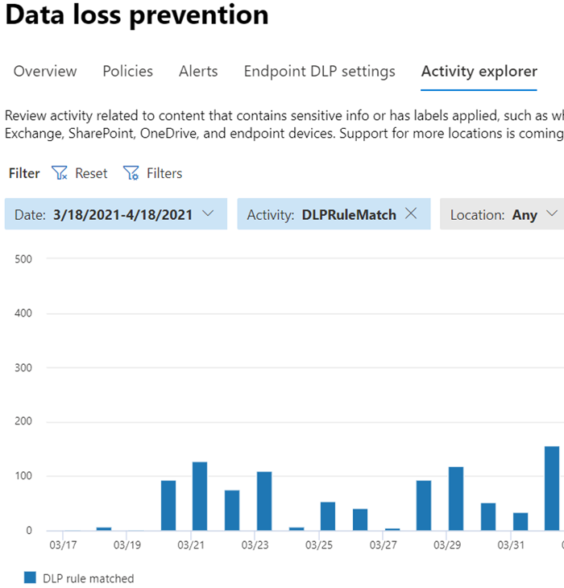

# Learn about data loss prevention

Organizations have sensitive information under their control such as financial data, proprietary data, credit card numbers, health records, or social security numbers. To help protect this sensitive data and reduce risk, they need a way to prevent their users from inappropriately sharing it with people who shouldn't have it. This practice is called data loss prevention (DLP).

In Microsoft 365, you implement data loss prevention by defining and applying DLP policies. With a DLP policy, you can identify, monitor, and automatically protect sensitive items across:

- Microsoft 365 services such as Teams, Exchange, SharePoint, and OneDrive
- Office applications such as Word, Excel, and PowerPoint
- Windows 10 endpoints
- non-Microsoft cloud apps
- on-premises file shares and on-premises SharePoint.

Microsoft 365 detects sensitive items by using deep content analysis, not by just a simple text scan. Content is analyzed for primary data matches to keywords, by the evaluation of regular expressions, by internal function validation, and by secondary data matches that are in proximity to the primary data match. Beyond that DLP also uses machine learning algorithms and other methods to detect content that matches your DLP policies.
  
## DLP is part of the larger Microsoft 365 Compliance offering

Microsoft 365 DLP is just one of the Microsoft 365 Compliance tools that you will use to help protect your sensitive items wherever they live or travel. You should understand the other tools in the Microsoft 365 Compliance tools set, how they interrelate, and work better together.  See, [Microsoft 365 compliance tools](protect-information.md) to learn more about the information protection process.

## Protective actions of DLP policies

Microsoft 365 DLP policies are how you monitor the activities that users take on sensitive items at rest, sensitive items in transit, or sensitive items in use and take protective actions. For example, when a user attempts to take a prohibited action, like copying a sensitive item to an unapproved location or sharing medical information in an email or other conditions laid out in a policy, DLP can:

- show a pop-up policy tip to the user that warns them that they may be trying to share a sensitive item inappropriately
- block the sharing and, via a policy tip, allow the user to override the block and capture the users' justification
- block the sharing without the override option
- for data at rest, sensitive items can be locked and moved to a secure quarantine location
- for Teams chat, the sensitive information will not be displayed

All DLP monitored activities are recorded to the [Microsoft 365 Audit log](search-the-audit-log-in-security-and-compliance.md) by default and routed to [Activity explorer](data-classification-activity-explorer.md). When a user performs an action that meets the criteria of a DLP policy, and you have alerts configured, DLP provides alerts in the [DLP alert management dashboard](dlp-configure-view-alerts-policies.md).

## DLP lifecycle

A DLP implementation typically follows these major phases.

- [Plan for DLP](#plan-for-dlp)
- [Prepare for DLP](#prepare-for-dlp)
- [Deploy your policies in production](#deploy-your-policies-in-production)

<!--ADD DIAGRAM OF THE DLP LIFECYCLE WORK ON WITH MAS-->

### Plan for DLP

Microsoft 365 DLP monitoring and protection are native to the applications that users use every day. This helps to protect your organizations' sensitive items from risky activities even if your users are unaccustomed to data loss prevention thinking and practices. If your organization and your users are new to data loss prevention practices, the adoption of DLP may require a change to your business processes and there will be a culture shift for your users. But, with proper planning, testing and tuning, your DLP policies will protect your sensitive items while minimizing any potential business process disruptions.

**Technology planning for DLP**

Keep in mind that DLP as a technology can monitor and protect your data at rest, data in use and data in motion across Microsoft 365 services, Windows 10 devices, on-premises file shares, and on-premises SharePoint. There are planning implications for the different locations, the type of data you want to monitor and protect, and the actions to be taken when a policy match occurs.  

**Business processes planning for DLP**

DLP policies can block prohibited activities, like inappropriate sharing of sensitive information via email. As you plan your DLP policies, you must identify the business processes that touch your sensitive items. The business process owners can help you identify appropriate user behaviors that should be allowed and inappropriate user behaviors that should be protected against. You should plan your policies and deploy them in test mode, and evaluate their impact via [activity explorer](data-classification-activity-explorer.md) first, before applying them in more restrictive modes.

**Organizational culture planning for DLP**

A successful DLP implementation is as much dependent on getting your users trained and acclimated to data loss prevention practices as it is on well planned and tuned policies. Since your users are heavily involved, be sure to plan for training for them too. You can strategically use policy tips to raise awareness with your users before changing the policy enforcement from test mode to more restrictive modes.

<!--For more information on planning for DLP, including suggestions for deployment based on your needs and resources, see [Planning for Microsoft 365 data loss prevention](dlp-plan-for-dlp.md).-->

### Prepare for DLP

You can apply DLP policies to data at rest, data in use, and data in motion in locations, such as:

- Exchange Online email
- SharePoint Online sites
- OneDrive accounts
- Teams chat and channel messages
- Microsoft Cloud App Security
- Windows 10 devices
- On-premises repositories

Each one has different pre-requisites. Sensitive items in some locations, like Exchange online, can be brought under the DLP umbrella by just configuring a policy that applies to them. Others, such as on-premises file repositories require a deployment of Azure Information Protection (AIP) scanner. You'll need to prepare your environment, code draft policies, and test them thoroughly before activating any blocking actions.

### Deploy your policies in production

#### Design your policies

Start by defining your control objectives, and how they apply across each respective workload. Draft a policy that embodies your objectives. Feel free to start with one workload at a time, or across all workloads - there's no impact yet.

#### Implement policy in test mode

Evaluate the impact of the controls by implementing them with a DLP policy in test mode. It's ok to apply the policy to all workloads in test mode, so that you can get the full breadth of results, but you can start with one workload if you need to.

#### Monitor outcomes and fine-tune the policy

While in test mode, monitor the outcomes of the policy and fine-tune it so that it meets your control objectives while ensuring you aren't adversely or inadvertently impacting valid user workflows and productivity. Here are some examples of things to fine-tune:

- adjusting the locations and people/places that are in or out of scope
- tune the conditions and exceptions that are used to determine if an item and what is being done with it matches the policy
- the sensitive information definition/s
- the actions
- the level of restrictions
- add new controls
- add new people
- add new restricted apps
- add new restricted sites

#### Enable the control and tune your policies

Once the policy meets all your objectives, turn it on. Continue to monitor the outcomes of the policy application and tune as needed. In general, policies take effect about an hour after being turned on. <!--See, LINK TO topic for SLAs for location specific  details-- >

## DLP policy configuration overview

You have flexibility in how you create and configure your DLP policies. You can start from a predefined template and create a policy in just a few clicks or you can design your own from the ground up. No matter which you choose, all DLP policies require the same information from you.

1. **Choose what you want to monitor** - Microsoft 365 comes with many predefined policy templates to help you get started or you can create a custom policy.
    - A predefined policy template: Financial data, Medical and health data, Privacy data all for various countries and regions.
    - A custom policy that uses the available sensitive information types, retention labels, and sensitivity labels.
2. **Choose where you want to monitor** - You pick one or more locations that you want DLP to monitor for sensitive information. You can monitor:
    
location | include/exclude by|
|---------|---------|
|Exchange email| distribution groups|
|SharePoint sites |sites |
|OneDrive accounts |accounts or distribution groups |
|Teams chat and channel messages |accounts |
|Windows 10 devices |user or group |
|Microsoft Cloud App Security |instance |
|On-premises repositories| repository file path|

3. **Choose the conditions that must be matched for a policy to be applied to an item** - you can accept pre-configured conditions or define custom conditions. Some examples are:

- item contains a specified kind of sensitive information that is being used in a certain context. For example, 95 social security numbers being emailed to recipient outside your org.
- item has a specified sensitivity label
- item with sensitive information is shared either internally or externally

4. **Choose the action to take when the policy conditions are met** - The actions depend on the location where the activity is happening.  Some examples are:

- SharePoint/Exchange/OneDrive: Block people who are outside your organization form accessing the content. Show the user a tip and send them an email notification that they are taking an action that is prohibited by the DLP policy.
- Teams Chat and Channel: Block sensitive information from being shared in the chat or channel
- Windows 10 Devices: Audit or restrict copying a sensitive item to a removeable USB device 
- Office Apps: Show a popup notifying the user that they are engaging in a risky behavior and block or block but allow override.
- On-premises file shares: move the file from where it is stored to a quarantine folder

> [!NOTE]
> The conditions and the actions to take are defined in an object called a Rule.

<!--## Create a DLP policy

All DLP policies are created and maintained in the Microsoft 365 Compliance center. See, INSERT LINK TO ARTICLE THAT WILL START WALKING THEM THROUGH THE POLICY CREATION PROCEDURES for more information.-->

After you create a DLP policy in the Compliance Center, it's stored in a central policy store, and then synced to the various content sources, including:
  
- Exchange Online, and from there to Outlook on the web and Outlook.
- OneDrive for Business sites.
- SharePoint Online sites.
- Office desktop programs (Excel, PowerPoint, and Word).
- Microsoft Teams channels and chat messages.
    
After the policy's synced to the right locations, it starts to evaluate content and enforce actions.

## Viewing policy application results

DLP reports a vast amount of information into Microsoft 365 from monitoring, policy matches and actions, and user activities. You'll need to consume and act on that information to tune your policies and triage actions taken on sensitive items. The telemetry goes into the [Microsoft 365 Compliance center Audit Logs](search-the-audit-log-in-security-and-compliance.md#search-the-audit-log-in-the-compliance-center) first, is processed, and makes its way to different reporting tools. Each reporting tool has a different purpose.  

### DLP Alerts Dashboard

When DLP takes an action on a sensitive item, you can be notified of that action via a configurable alert. Rather than having these alerts pile up in a mailbox for you to sift through, the Compliance center makes them available in the [DLP Alerts Management Dashboard](dlp-configure-view-alerts-policies.md). Use the DLP Alerts dashboard to configure alerts, review them, triage them and track resolution of DLP Alerts. Here's an example of alerts generated by policy matches and activities from Windows 10 devices.

> [!div class="mx-imgBorder"]
> 

You can also view details of the associated event with rich metadata in the same dashboard

> [!div class="mx-imgBorder"]
> 

### Reports

The [DLP reports](view-the-dlp-reports.md#view-the-reports-for-data-loss-prevention) show broad trends over time and give specific insights into:

- **DLP Policy Matches** over time and filter by date range, location, policy, or action
- **DLP incident matches** also shows matches over time, but pivots on the items rather than the policy rules.
- **DLP false positives and overrides** shows the count of false positives and, if configured, user-overrides along with the user justification.

### DLP Activity Explorer

The Activity explorer tab on the DLP page has the *Activity* filter preset to *DLPRuleMatch*. Use this tool to review activity related to content that contains sensitive info or has labels applied, such as what labels were changed, files were modified, and matched a rule.

For more information, see [Get started with activity explorer](data-classification-activity-explorer.md)

To learn more about Microsoft 365 DLP, see:

- [Learn about Microsoft 365 Endpoint data loss prevention](endpoint-dlp-learn-about.md)
- [Learn about the default data loss prevention policy in Microsoft Teams (preview)](dlp-teams-default-policy.md)
- [Learn about the Microsoft 365 data loss prevention on-premises scanner (preview)](dlp-on-premises-scanner-learn.md)
- [Learn about the Microsoft Compliance Extension (preview)](dlp-chrome-learn-about.md)
- [Learn about the data loss prevention Alerts dashboard](dlp-alerts-dashboard-learn.md)

To learn how to use data loss prevention to comply with data privacy regulations, see [Deploy information protection for data privacy regulations with Microsoft 365](../solutions/information-protection-deploy.md)  (aka.ms/m365dataprivacy).