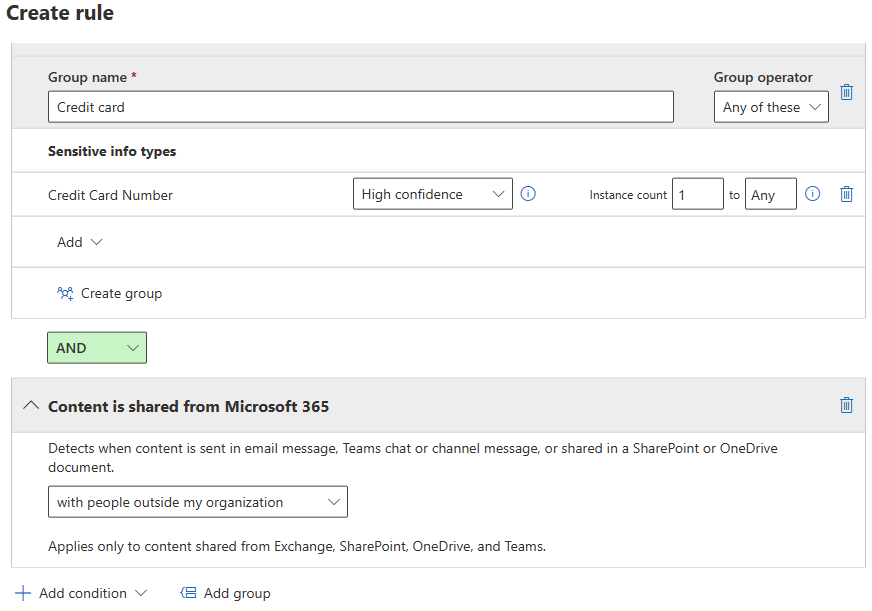
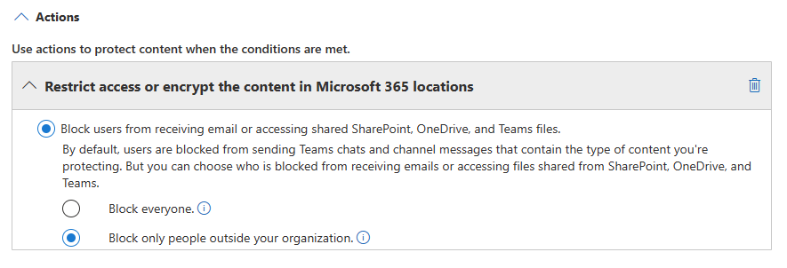

# Data loss prevention and Microsoft Teams

If your organization has Microsoft Purview Data Loss Prevention (DLP), you can define policies that prevent people from sharing sensitive information in a Microsoft Teams channel or chat session. Here are some examples of how this protection works:

- **Example 1: Protecting sensitive information in messages**. Suppose that someone attempts to share sensitive information in a Teams chat or channel with guests (external users). If you have a DLP policy defined to prevent this, messages with sensitive information that are sent to external users are deleted. This happens automatically, and within seconds, according to how your DLP policy is configured.

    > [!NOTE]
    > DLP for Microsoft Teams blocks sensitive content when shared with Microsoft Teams users who have: - [guest access](/MicrosoftTeams/guest-access) in teams and channels; or - [external access](/MicrosoftTeams/manage-external-access) in meetings and chat sessions. 
DLP for external chat sessions will only work if both the sender and the receiver are in Teams Only mode and using [Microsoft Teams native federation](/microsoftteams/manage-external-access). DLP for Teams does not block messages in [interop](/microsoftteams/teams-and-skypeforbusiness-coexistence-and-interoperability#interoperability-of-teams-and-skype-for-business) with Skype for Business or non-native federated chat sessions.

- **Example 2: Protecting sensitive information in documents**. Suppose that someone attempts to share a document with guests in a Microsoft Teams channel or chat, and the document contains sensitive information. If you have a DLP policy defined to prevent this, the document won't open for those users. Your DLP policy must include SharePoint and OneDrive in order for protection to be in place. This is an example of DLP for SharePoint that shows up in Microsoft Teams, and therefore requires that users are licensed for Office 365 DLP (included in Office 365 E3), but does not require users to be licensed for Office 365 Advanced Compliance. 
   
You can extend the Teams DLP policy to cover SharePoint Online and OneDrive for Business by selecting **Automatic file protection** from the banner in **DLP** > **Policies**. This will enable DLP protection for all the files shared in Teams chats and channels with the same rules that apply to Teams messages. Once enabled, the extension will apply to all existing as well as future Teams DLP policies, so you don't have to create separate policies for SharePoint and OneDrive for file protection. 

> [!NOTE]
> Only those Teams policies that have rules with conditions of **content contains** or **content is shared from Microsoft 365** can be extended for automatic file protection. If the condition or exception configuration has **Sender is**, **sender domain is**, **recipient is**, and **recipient domain is** present, the extension action will fail because these conditions don’t apply to SharePoint and OneDrive.

- **Example 3: Protecting communications in Teams Shared Channels**. For shared channels, the host Teams team DLP policy is applied. For example let’s say there's a shared channel owned by TeamA of Contoso. Team A has a DLP policy P1. There are 3 ways to share a channel:
    - **Share with member**: You invite User1 from Contoso to join the shared channel without making him a member of Team A. Everyone in this shared channel, including User1, will be covered by P1.
    - **Share with team (internally)**: You share the channel with another team Team B in Contoso. That another team may have a different DLP policy, but that doesn’t matter. P1 will apply to everyone in this shared channel, including both Team A and Team B users.
    - **Share with team (cross tenant)**: You share the channel with a team Team F in Fabrikam. Fabrikam may have its own DLP policy, but that doesn’t matter. P1 will apply to everyone in this shared channel, including both Team A (Contoso) and Team F (Fabrikam) users.

- **Example 4: Protecting communications when chatting with external users in Microsoft Teams**. When using the *external access* feature in Microsoft Teams, people from different Microsoft 365 organizations can all join the same chat session. Each user is subject to the DLP policies of their own organization. For instance, say that UserA, UserB and UserC, all from Contoso, and UserX, UserY, and UserZ, all from Fabrikam, are in the same Teams chat. Contoso's DLP policies with regard to sharing information in Teams apply to UserA, UserB and UserC, while Fabrikam's DLP policies apply to UserX, UserY, and UserZ. For more information on using Microsoft Teams to chat with people external to your organization, see [Manage external meetings and chat with people and organizations using Microsoft identities](/microsoftteams/trusted-organizations-external-meetings-chat)

 
[!INCLUDE [purview-preview](../includes/purview-preview.md)]

## DLP Licensing for Microsoft Teams

[Data loss prevention](dlp-learn-about-dlp.md) capabilities include Microsoft Teams chat and channel messages, **including private channel messages** for:

- Office 365 E5/A5/G5
- Microsoft 365 E5/A5/G5
- Microsoft 365 E5/A5/G5 Information Protection and Governance
- Microsoft 365 E5/A5/G5/F5 Compliance and F5 Security & Compliance

Office 365 and Microsoft 365 E3 include DLP protection for SharePoint Online, OneDrive, and Exchange Online. This also includes files that are shared through Teams because Teams uses SharePoint Online and OneDrive to share files.

Support for DLP protection in Teams Chat requires E5.

To learn more about licensing requirements, see [Microsoft 365 Tenant-Level Services Licensing Guidance](/office365/servicedescriptions/microsoft-365-service-descriptions/microsoft-365-tenantlevel-services-licensing-guidance/microsoft-365-security-compliance-licensing-guidance).

> [!IMPORTANT]
> DLP applies only to the actual messages in the chat or channel thread. Activity notifications—which include a short message preview and appear based on a user's notification settings—are **not** included in Teams DLP. Any sensitive information present in the part of the message that appears in the preview will remain visible in the notification even after the DLP policy has been applied and removed sensitive information the message itself.

## Scope of DLP protection

DLP protection is applied differently to Teams entities.

|When policy is scoped by |These Teams Entities |Will have DLP protection available|
|---------|---------|---------|
|Individual user accounts     |1:1/n chats         |Yes         |
|     |Standard and shared channel messages         |No         |
|     |Private channel messages         |Yes         |
|Security groups/distribution lists  | 1:1/n chats         |Yes         |
|     |Standard and shared channel messages  |No         |
|     |Private channel messages         |Yes        |
|Microsoft 365 group    |1:1/n chats          |No         |
|     |Standard and shared channel messages          |Yes        |
|     |Private channel messages|No| 

## Policy tips help educate users

Similar to how DLP works in [Exchange, Outlook, Outlook on the web](dlp-learn-about-dlp.md), [SharePoint Online, OneDrive for Business sites](dlp-learn-about-dlp.md), and [Office desktop clients](dlp-learn-about-dlp.md), policy tips appear when an action triggers with a DLP policy. Here's an example of a policy tip:

Here, the sender attempted to share a social security number in a Microsoft Teams channel. The **What can I do?** link opens a dialog box that provides options for the sender to resolve the issue. Notice that, the sender can opt to override the policy, or notify an admin to review and resolve it.

In your organization, you can choose to allow users to override a DLP policy. When you configure your DLP policies, you can use the default policy tips, or [customize policy tips](#to-customize-policy-tips) for your organization.

Returning to our example, where a sender shared a social security number in a Teams channel, here's what the recipient saw:

> [!div class="mx-imgBorder"]
> 

### To customize policy tips

To perform this task, you must be assigned a role that has permissions to edit DLP policies. To learn more, see [Permissions in the Microsoft Purview compliance portal](microsoft-365-compliance-center-permissions.md).

1. Go to the Purview Compliance Center ([https://compliance.microsoft.com](https://compliance.microsoft.com)) and sign in.

2. Choose **Data loss prevention** > **Policies**.

3. Select a policy, and then choose **Edit** (the pencil icon).

4. Click through the wizard until you come to the **Customize advanced DLP rules** screen.

5. Either create a new rule, or edit an existing rule for the policy.

6. Scroll down to **User notifications** and select **Customize the email text** and/or **Customize the policy tip text** options.

7. Specify the text you want to use for email notifications and/or policy tips, and then choose **Save**.

8. Choose **Save**.
 
9. Finish working through the wizard. On the last screen, choose **Submit**.

Allow approximately one hour for your changes to work their way through your data center and sync to user accounts.
 <!-- why are these syncing to user accounts? -->

## Add Microsoft Teams as a location to existing DLP policies

To perform this task, you must be assigned a role that has permissions to edit DLP policies. To learn more, see [Permissions in the Microsoft Purview compliance portal](microsoft-365-compliance-center-permissions.md).md#permissions).

1. Go to the Compliance Center ([https://compliance.microsoft.com](https://compliance.microsoft.com)) and sign in.

2. Choose **Data loss prevention** > **Policies**.

3. Select a policy, and then choose **Extend to Teams**. 

4. In the **Update Options** window, choose **Extend to Teams**.

5. Choose **Close**.

Allow approximately one hour for your changes to work their way through your data center and sync to user accounts.
<!-- again, why user accounts? -->

## Define a new DLP policy for Microsoft Teams

For information about how to create and implement a new DLP policy, see [Create and Deploy data loss prevention policies](dlp-create-deploy-policy.md#create-and-deploy-data-loss-prevention-policies).

## Prevent external access to sensitive documents

To ensure that SharePoint documents that contain sensitive information cannot be accessed by external guests either from SharePoint or Teams by default, select the following:

- You can ensure that documents are protected until DLP scans and marks them as safe to share by [marking new files as sensitive by default](/sharepoint/sensitive-by-default).

- Recommended DLP policy structure

    - **Conditions**
        - Content contains any of these sensitive information types: [Select all that apply]
        
        - Content is shared from Microsoft 365 with people outside my organization
        
          > [!div class="mx-imgBorder"]
          > 

    - **Actions**
        - Restrict access to the content for external users
        
        - Notify users with email and policy tips
        
        - Send incident reports to the Administrator
        
        > [!div class="mx-imgBorder"]
        > 

DLP policy in action when attempting to share a document in SharePoint that contains sensitive information with an external guest:

> [!div class="mx-imgBorder"]
> 

<!--DLP policy in action when guest attempts to open a document in Teams with block external:
can't use the below image it contains a non-approved name.
> [!div class="mx-imgBorder"]
> -->

## Related articles

- [Create and Deploy data loss prevention policies](dlp-create-deploy-policy.md)
- [Send email notifications and show policy tips for DLP policies](use-notifications-and-policy-tips.md)
