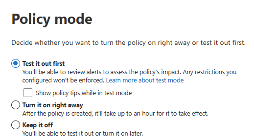
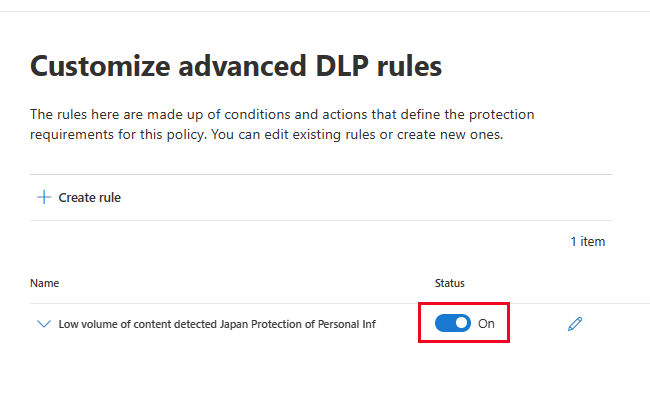

# Plan for data loss prevention (DLP)

Every organization plans for and implements data loss prevention (DLP) differently. Why? Because every organization's business needs, goals, resources, and situation are unique. However, there are elements that are common to all successful DLP implementations. This article presents the best practices for planning a DLP deployment.

[!INCLUDE [purview-preview](../includes/purview-preview.md)]

## Before you begin

If you're new to Microsoft Purview DLP, here's a list of the core articles you need as you implement DLP:

1. [Administrative units](microsoft-365-compliance-center-permissions.md#administrative-units-preview)
1. [Learn about Microsoft Purview Data Loss Prevention](dlp-learn-about-dlp.md) - The article introduces you to the data loss prevention discipline and Microsoft's implementation of DLP.
1. [Plan for data loss prevention (DLP)](dlp-overview-plan-for-dlp.md#plan-for-data-loss-prevention-dlp) - By working through the article that you're reading now, you will:
    1. [Identify stakeholders](dlp-overview-plan-for-dlp.md#identify-stakeholders)
    1. [Describe the categories of sensitive information to protect](dlp-overview-plan-for-dlp.md#describe-the-categories-of-sensitive-information-to-protect)
    1. [Set goals and strategy](dlp-overview-plan-for-dlp.md#set-goals-and-strategy)
1. [Data Loss Prevention policy reference](dlp-policy-reference.md#data-loss-prevention-policy-reference) - This article introduces all the components of a DLP policy and how each one influences the behavior of a policy.
1. [Design a DLP policy](dlp-policy-design.md) - This article walks you through creating a policy intent statement and mapping it to a specific policy configuration.
1. [Create and Deploy data loss prevention policies](dlp-create-deploy-policy.md) - This article presents some common policy intent scenarios that you can map to configuration options. It then walks you through configuring those options.

## Multiple starting points

Many organizations choose to implement DLP to comply with various governmental or industry regulations. For example, the European Union's General Data Protection Regulation (GDPR), or the Health Insurance Portability and Accountability Act (HIPAA), or the California Consumer Privacy Act (CCPA). They also implement data loss prevention to protect their intellectual property. However, the starting place and ultimate destination in the DLP journey vary.

Organizations can start their DLP journey from several different points:

- With a platform focus, like wanting to protect information in Teams Chat and Channel messages or on Windows 10 or 11 devices
- Knowing the sensitive information they want to prioritize protecting, such as health care records, and jumping in by defining policies to protect it
- With discovery and categorization, because they don't know what their sensitive information is, where it is, and who is doing what with it
- By defining policies as a starting place (without knowing what their sensitive information is, where it is, or who is doing what with it) and then using those outcomes to refine their policies
- Knowing that they need to implement the full Microsoft Purview Information Protection stack, with a plan to take a longer term, methodical approach

These are just some examples of how customers can approach DLP. It doesn't matter where you start from. DLP is flexible enough to accommodate various types of information protection journeys from start to a fully realized data loss prevention strategy.

## Overview of planning process

The [Learn about Microsoft Purview Data Loss Prevention](dlp-learn-about-dlp.md#learn-about-data-loss-prevention) introduces the three different aspects of the [DLP planning process](dlp-learn-about-dlp.md#plan-for-dlp). We go into more detail here on the elements that are common to all DLP plans.

### Identify stakeholders

When implemented, DLP policies can be applied across large portions of your organization. Your IT department can't develop a broad ranging plan on their own without negative consequences. You need to identify the stakeholders who can:

- the regulations, laws, and industry standards your organization is subject to
- the categories of sensitive items to be protected
- the business processes they're used in
- the risky behavior that should be limited
- prioritize which data should be protected first, based on the sensitivity of the items and risk involved
- outline the DLP policy match event review and remediation process
 
In general, these needs tend to be 85% regulatory and compliance protection, and 15% intellectual property protection. Here are some suggestions on roles to include in your planning process:

- Regulatory and compliance officers
- Chief risk officer
- Legal officers
- Security and compliance officers
- Business owners for the data items
- Business users
- IT

### Describe the categories of sensitive information to protect

Once identified, the stakeholders then describe the categories of sensitive information to be protected and the business processes that they're used in. For example, DLP defines these categories:

- Financial
- Medical and health information
- Privacy
- Custom

Stakeholders might identify the sensitive information as "We are a data processor, so we have to implement privacy protections on data subject information and financial information".

  <!-- The business process is important as it informs the ‘data at rest’, ‘data in transit’, ‘data in use’ aspect of DLP planning and who should be sharing the items and who should not.-->

### Set goals and strategy

Once you have identified your stakeholders, know which sensitive information needs protection, and where it's used, the stakeholders can set their protection goals and IT can develop an implementation plan.

 <!--
### Discovery
 for the locations (DLP workloads) of these types of items.  (mapping DLP locations and data at rest, data in transit, data in use)

### IT can start coding test policies
start small and always in test mode. Note that DLP policies can feed into insider risk.

### Business process owners help with tuning
 false positive/false negative results and fitting DLP into their business processes.

-->

### Set implementation plan

Your implementation plan should include:

- a map of your starting state, desired end state, and the steps to get from one to the other
- a plan for how you'll address discovery of sensitive items
- a plan for developing policies and the order in which policies you'll implement them
- a plan for how you'll address any prerequisites
- a plan for how you'll test policies before implementing them for enforcement
- a plan for how you'll train your end users
- a plan for how you'll tune your policies
- a plan for how you'll review and update your data loss prevention strategy based on changing regulatory, legal, industry standard, or intellectual property protection and business needs

#### Map out path from start to desired end state

Documenting how your organization is going to get from its starting state to the desired end state is essential to communicating with your stakeholders and setting the project scope. Here's a set of steps that are commonly used to deploy DLP. You'll want more detail than the graphic shows, but you can use it to frame your DLP adoption path.

#### Sensitive item discovery

There are multiple ways to discover what individual sensitive items are and where they're located. You may have sensitivity labels already deployed or you may have decided to deploy a broad DLP policy to all locations that only discovers and audits items. To learn more, see [Know your data](information-protection.md#know-your-data).

#### Policy planning

As you begin your DLP adoption, you can use these questions to focus your policy design and implementation efforts.

##### What laws, regulations, and industry standards must your organization comply with?

Because many organizations come to DLP with the goal of regulatory compliance, answering this question is a natural starting place for planning your DLP implementation. But, as the IT implementer, you're probably not positioned to answer it. Rather, you should consult your legal team and business executives for an answer.
 
**Example** Your organization is subject to U.K. financial regulations.

##### What sensitive items must your organization protect from leakage?

Once you know where your organization stands in terms of regulatory compliance needs, you'll have some idea of what sensitive items need to be protected from leakage. You'll also have an idea about how you want to prioritize policy implementation to protect those items. This knowledge helps you choose the most appropriate DLP policy templates. Microsoft Purview comes with preconfigured DLP templates for Financial, Medical and health, and Privacy policy templates. Additionally, you can build your own using the Custom template. As you design and create your actual DLP policies, having a working knowledge of the sensitive items you need to protect helps you choose the right [sensitive information type](sensitive-information-type-learn-about.md#learn-about-sensitive-information-types).

**Example** To get started quickly, you might pick the preconfigured `U.K. Financial Data` policy template, which includes the `Credit Card Number`, `EU Debit Card Number`, and `SWIFT Code` sensitive information types. 

##### How you want your policies scoped

If your organization has implemented [administrative units](microsoft-365-compliance-center-permissions.md#administrative-units-preview), you can scope your DLP policies by administrative unit or leave the scope default, which applies policies to the full directory. For more information, see [Policy Scoping](dlp-policy-reference.md#policy-scoping).

##### Where are the sensitive items and what business processes are they involved in?

The items that contain your organization's sensitive information are used every day in the course of doing business. You need to know where instances of that sensitive information may occur and what business processes they're used in. Knowing this helps you choose the right locations to apply your DLP policies. DLP policies can be applied to the following locations:

- Exchange email
- SharePoint sites
- OneDrive accounts
- Teams chat and channel messages
- Windows 10/11 and macOS Devices
- Microsoft Defender for Cloud Apps
- On-premises repositories

**Example** Your organization's internal auditors are tracking a set of credit card numbers. They keep a spreadsheet of them in a secure SharePoint site. Several of the employees make copies and save them to their work OneDrive site, which is synced to their Windows 10 device. One of these employees pastes a list of 14 credit card numbers into an email and tries to send it to the outside auditors for review. In this case, you'd want to apply the policy to the secure SharePoint site, all the internal auditors OneDrive accounts, their Windows 10 devices, and Exchange email.

##### What is your organization's tolerance for leakage?

Different groups in your organization may have different views on what counts as an acceptable level of sensitive item leakage. Achieving the perfection of zero leakage may come at too high a cost to the business.

**Example** Your organization's security group and legal team both feel that there should be no sharing of credit card numbers with anyone outside the org. They  insist on zero leakage. However, as part of their regular review of credit card number activity, the internal auditors must share some credit card numbers with third-party auditors. If your DLP policy prohibits all sharing of credit card numbers outside the org, there will be a significant business process disruption and added cost to mitigate the disruption in order for the internal auditors to complete their tracking. This extra cost is unacceptable to the executive leadership. To resolve this issue, there needs to be an internal conversation to decide an acceptable level of leakage. Once that is decided, the policy can provide exceptions for certain individuals to share the information, or, it can be applied in audit-only mode.

> [!IMPORTANT]
> To learn how to create a policy intent statement and map it to policy configurations see, [Design a data loss prevention policy](dlp-policy-design.md#design-a-data-loss-prevention-policy)

#### Planning for prerequisites

Before you can monitor some DLP locations, there are prerequisites that must be met. See the **Before you begin** sections of the following articles:

- [Get started with the data loss prevention on-premises scanner](dlp-on-premises-scanner-get-started.md#before-you-begin)
- [Get started with Endpoint data loss prevention](endpoint-dlp-getting-started.md#before-you-begin)
- [Get started with the Microsoft compliance extension](dlp-chrome-get-started.md#before-you-begin)
- [Use data loss prevention policies for non-Microsoft cloud apps](dlp-use-policies-non-microsoft-cloud-apps.md#before-you-begin)

#### Policy deployment

When you create your DLP policies, you should consider rolling them out gradually, so you can assess their impact and test their effectiveness before fully enforcing them. For example, you don't want a new DLP policy to unintentionally block access to thousands of documents or to break an existing business process.
  
If you're creating DLP policies with a large potential impact, we recommend following this sequence:
  
1. **Start in test mode, without Policy Tips** and then use the DLP reports, and any incident reports, to assess the impact of the policies. You can use DLP reports to view the number, location, type, and severity of policy matches. Based on the results, you can fine-tune your policies as needed. In test mode, DLP policies won't impact the productivity of people working in your organization. It's also good to use this stage for testing out your workflow for DLP event review and issue remediation.
    
2. **Move to Test mode with notifications and Policy Tips** so that you can begin to teach users about your compliance policies and prepare them for when the policies are applied. It's useful to have a link to an organization policy page that provides more details about the policy in the Policy Tip. At this stage, you can also ask users to report false positives, so that you can further refine the conditions and reduce the number of false positives. Move to this stage once you have confidence that the results of applying the policies match what they stakeholders had in mind.
    
3. **Start full policy enforcement** so that the actions in the rules are applied and the content is protected. Continue to monitor the DLP reports and any incident reports or notifications to make sure that the results are what you intend.

    

    You can turn off a DLP policy at any time, which affects all rules in the policy. However, each rule can also be turned off individually by toggling its status in the rule editor.

    

    You can also change the priority of multiple rules in a policy. To do that, open a policy for editing. In the row for a rule, choose the ellipses (**...**), and then move an item down in the list to the desired position.

    

#### End-user training

You can configure your policies so that, when a DLP policy is triggered, [email notifications are sent automatically, and policy tips are shown](use-notifications-and-policy-tips.md#send-email-notifications-and-show-policy-tips-for-dlp-policies) to admins and end users. Policy tips are useful ways to raise awareness of risky behaviors on sensitive items and train users to avoid those behaviors in the future.  

#### Review DLP requirements and update strategy

The regulations, laws, and industry standards that your organization is subject to will change over time, as will your business goals for DLP. Be sure to include regular reviews of all these areas so that your organization stays in compliance and so your DLP implementation continues to meet your business needs.

## Approaches to deployment

|Customer business needs description  | Approach  |
|---------|---------|
|**Contoso Bank** is in a highly regulated industry and has many different types of sensitive items in many different locations.     Contoso:   - knows which types of sensitive information are top priority   - must minimize business disruption as policies are rolled out   - has involved business process owners   -  has IT resources and can hire experts to help plan, design, and deploy  - has a premier support contract with Microsoft| - Take time to understand what regulations they must comply with and how they're going to comply.   - Take time to understand the "better together" value of the Microsoft Purview Information Protection stack   - Develop a sensitivity labeling scheme for prioritized items and apply it   - Design and code policies, deploy them in test mode, and train users  - Repeat and refine policies|
|**TailSpin Toys** doesn’t know what sensitive data they have or where it is, and they have little to no resource depth. They use Teams, OneDrive, and Exchange extensively.     |- Start with simple policies on the prioritized locations.  - Monitor what gets identified  - Apply sensitivity labels accordingly  - Refine policies and train users       |
|**Fabrikam** is a small startup. They want to protect their intellectual property and must move quickly. They're willing to dedicate some resources, but can't afford to hire outside experts.   Other considerations:   - Sensitive items are all in Microsoft 365 OneDrive / SharePoint  - Adoption of OneDrive and SharePoint is slow. Many employees still use DropBox and Google drive to store and share items  - Employees value speed of work over data protection discipline  - All 18 employees have new Windows devices   | - Take advantage of the default DLP policy in Teams  - Use the "restricted by default" setting for SharePoint items  - Deploy policies that prevent external sharing  - Deploy policies to prioritized locations  - Deploy policies to Windows devices  - Block uploads to cloud storage solutions other than OneDrive      |

## Next steps

> [!IMPORTANT]
> To learn more about DLP policy deployment, see [Deployment](dlp-create-deploy-policy.md#deployment)

## See also
- [Learn about data loss prevention](dlp-learn-about-dlp.md#learn-about-data-loss-prevention)
