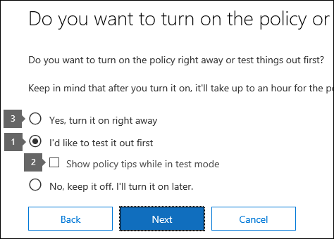
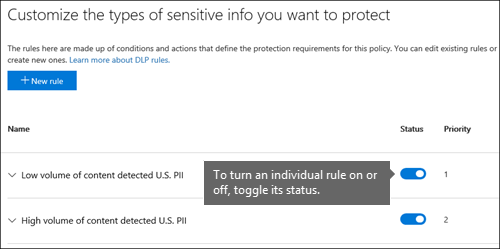
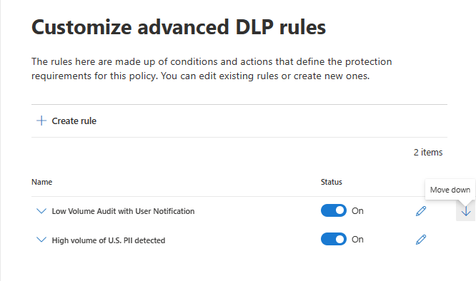

# Plan for data loss prevention (DLP)

Every organization will plan for and implement DLP differently, because every organization's business needs, goals, resources, and situation are unique to them. However, there are elements that are common to all successful DLP implementations. This article presents the best practices that are used by organizations in their DLP planning.

## Multiple starting points

Organizations choose to implement DLP to comply with various governmental or industry regulations. For example, the European Union's General Data Protection Regulation (GDPR), or the Health Insurance Portability and Accountability Act (HIPAA), or the California Consumer Privacy Act (CCPA). They also implement data loss prevention to protect their intellectual property. But the starting place and ultimate destination in the DLP journey vary. 

Organizations can start their DLP journey:

- from a platform focus, like wanting to protect information in Teams Chat and Channel messages or on Windows 10 devices
- knowing what sensitive information they want to prioritize protecting, like health care records, and going straight to defining policies to protect it
- without knowing what their sensitive information is, where it is, and who is doing what with it so they start with discovery and categorization and take a more methodical approach
- without knowing what their sensitive information is, or where it is, or who is doing what with it, but they will move straight to defining policies and use those outcomes as a starting place and then refine their policies from there.
- knowing that they need to implement the full M365 Information Protection stack and so intend to take a longer term, methodical approach

These are just some examples of how customers can approach DLP and it doesn't matter where you start from, Microsoft 365 DLP is flexible enough to accommodate various types of information protection journeys from start to a fully realized data loss prevention strategy. 

## Overview of planning process

The [Learn about data loss prevention](dlp-learn-about-dlp.md#learn-about-data-loss-prevention) introduce the three different aspect of the [DLP planning process](dlp-learn-about-dlp.md#plan-for-dlp). We'll go into more detail here on the elements that are common to all DLP plans. Planning requirements that are unique to a location, like On-premises scanner are covered in  <!--LIST OF LINKS TO THOSE DOCS-->
<!--
- DLP planning for Exchange email
- DLP planning for SharePoint sites
- DLP planning for OneDrive accounts
- DLP planning for Teams chat and channel messages
- DLP planning for Windows 10 Devices
- DLP planning for Microsoft Cloud App Security
- DLP planning for On-premises repositories -->

### Identify stakeholders

When implemented, DLP policies can be applied across large portions of your organization. IT can't develop a broad ranging plan on their own without negative consequences. You need to identify the stakeholders who can describe the regulations, laws and industry standards your organization is subject to, the categories of sensitive items to be protected, the business processes they are used in and the risky behavior that should be limited. In general these needs tend to be 85% regulatory and compliance protection, and 15% intellectual property protection. Here are some suggestions on roles to include in your planning process:

- Regulatory and compliance officers
- Chief risk officer
- Legal officers
- Security and compliance officers
- Business owners for the data items
- Business users
- IT

### Identify the categories of sensitive information to protect

The stakeholders then describe the categories of sensitive information to be protected and the business process that they're used in. <!-- The business process is important as it informs the ‘data at rest’, ‘data in transit’, ‘data in use’ aspect of DLP planning and who should be sharing the items and who should not.-->

### Set goals and strategy

Once you have identified your stakeholders and you know which sensitive information needs protection and where it's used, the stakeholders can set their protection goals and IT can develop an implementation strategy. 
 <!--
### Discovery
 for the locations (DLP workloads) of these types of items.  (mapping DLP locations and data at rest, data in transit, data in use)

### IT can start coding test policies
start small and always in test mode. Note that DLP policies can feed into insider risk.

### Business process owners help with tuning
 false positive/false negative results and fitting DLP into their business processes.

-->

### Set implementation plan

## Questions that impact policy design that you need to get answers to

As you begin your DLP adoption you can use questions to focus your policy design and implementation efforts.

#### What laws, regulations and industry standards must your organization comply with?

Because many organizations come to DLP with the goal of regulatory compliance, answering this question is a natural starting place for planning your DLP implementation. But, as the IT implementer, you're probably not positioned to answer it. It needs to be answered by your legal team and business executives. 
 
**Example** Your organization is subject to U.K. financial regulations.

#### What sensitive items does your organization have that must be protected from leakage?

Once your organization knows where it stands in terms of regulatory compliance needs, you'll have some idea of what sensitive items need to be protected from leakage and how you want to prioritize policy implementation to protect them. This will help you choose the most appropriate DLP policy templates. Microsoft 365 comes with pre-configured DLP templates for Financial, Medical and health, Privacy, and you can build your own using the Custom template. As you design and create your actual DLP policies, knowing the answer to this question will also help you choose the right [sensitive information type](sensitive-information-type-learn-about.md#learn-about-sensitive-information-types).

**Example** To get started quickly, you pick the `U.K. Financial Data` policy template which includes the `Credit Card Number`, `EU Debit Card Number`, and `SWIFT Code` sensitive information types. 

#### Where are the sensitive items and what business processes are they involved in?

The items that contain your organizations sensitive information are used every day in the course of doing business. You need to know where instances of that sensitive information may occur and what business processes they are used in. This will help you choose the right locations to apply your DLP policies to. Microsoft 365 DLP policies are applied to locations:

- Exchange email
- SharePoint sites
- OneDrive accounts
- Teams chat and channel messages
- Windows 10 Devices
- Microsoft Cloud App Security
- On-premises repositories

**Example** Your organizations' internal auditors are tracking a set of credit card numbers. They keep a spreadsheet of them in a secure SharePoint site. Several of the employees make copies and save them to their work OneDrive for Business site which is synced to their Windows 10 device. One of them pastes a list of 14 of them in an email and tries to send it to the outside auditors for review. You'd want to apply the policy to the secure SharePoint site, all the internal auditors OneDrive for Business accounts, their Windows 10 devices and Exchange email.

#### What is your organizations tolerance for leakage?

Different groups in your organization may have different views on what's an acceptable level of sensitive item leakage and what's not.

**Example** Your organizations' security group, along with the legal team both feel that there should be no sharing of credit card numbers with anyone outside the org and insist on zero leakage. But, as part of regular review of credit card number activity, the internal auditors must share some credit card numbers with third party auditors. If your DLP policy prohibits all sharing of credit card numbers outside the org, it will require an extra 500 person hours per quarter for the internal auditors to complete the tracking process. This extra cost is unacceptable to the executive leadership. To resolve this, there needs to be an internal conversation to decide an acceptable level of leakage.

### Plan for training of end users

## Mapping data state to DLP location

maybe put this into policy design

### Data at rest

Data at rest is blah blah blah. These DLP locations cover data at rest

- On-premises scanner
- Windows 10 devices

### Data in use

Data in use is blah blah blah. These DLP location cover data in use

### Data in motion

Data in motion is blah, blah, blah. These DLP locations cover data in motion

Data state	DLP location to include
Data at rest	On-premises scanner for file shares and SharePoint, Windows 10 devices, ODB
Data in motion	Exchange, Teams Chat and Channel, MCAS
Data in use	Office apps, Windows 10 devices

## Common steps for deploying DLP

<!--ADD GRAPHIC FROM ERIC's SLIDE WITH ARROW REDIRECTS-->

### Prioritize data
 
### Categorize data

### Establish policies

### Develop controls

### Train users

### Monitor data movement

### Tune 
Adjust/refine

## Approaches to deployment    REALLY BIG GAP

|Customer biz needs description  | approach  |
|---------|---------|
|**Customer ABC** is in a highly regulated industry and has  many different types of sensitive items in many different locations.   - knows which types of sensitive information are top priority.   - must minimize biz disruption as policies are rolled out.   -  has IT resources and can hire experts to help plan, design deploy.   - has a top tier CSS contract| - Take the time to understand what regulations they must comply with and how they are going to comply.   -Take the time to understand the better together value of the M365 IP stack   - Develop sensitivity labelling scheme for prioritized items and apply   - Involve biz process owners  - Design/code policies, deploy in test mode, train users  - repeat|        |
|**Customer DEF** doesn’t know what they have or where it is, little to no resource depth. Customer uses mostly Teams, ODB and Exchange     |- Start with simple policies on the prioritized locations.  - Monitor what gets identified  - Apply labels accordingly  - Refine policies, train users       |
|**Customer GHI** is a small startup and wants to protect its intellectual property, must move quickly, willing to dedicate some resources, no deep pockets  - Sensitive items are all in M365 ODB/SharePoint  - Adoption of  ODB and SharePoint is slow, employees/shadow IT use DropBox and Google drive to share/store  - Employees value speed of work over data protection discipline  - Customer splurged and bought all 18 employees new Windows 10 devices     |- Use restricted by default setting for SharePoint items  - Deploy policies that prevent external sharing  - Deploy policies to prioritized locations  - Block uploads to non ODB cloud storage      |

## Planning for workloads

### Exchange

### SharePoint

### OneDrive for Business

### Teams

### Windows 10 Devices

### Microsoft Cloud App Security (MCAS)

### On-premises Scanner

## See also
- 

move to plan for  
## Roll out DLP policies gradually with test mode

When you create your DLP policies, you should consider rolling them out gradually to assess their impact and test their effectiveness before fully enforcing them. For example, you don't want a new DLP policy to unintentionally block access to thousands of documents that people require access to in order to get their work done.
  
If you're creating DLP policies with a large potential impact, we recommend following this sequence:
  
1. **Start in test mode without Policy Tips** and then use the DLP reports and any incident reports to assess the impact. You can use DLP reports to view the number, location, type, and severity of policy matches. Based on the results, you can fine tune the rules as needed. In test mode, DLP policies will not impact the productivity of people working in your organization. 
    
2. **Move to Test mode with notifications and Policy Tips** so that you can begin to teach users about your compliance policies and prepare them for the rules that are going to be applied. At this stage, you can also ask users to report false positives so that you can further refine the rules. 
    
3. **Start full enforcement on the policies** so that the actions in the rules are applied and the content's protected. Continue to monitor the DLP reports and any incident reports or notifications to make sure that the results are what you intend. 

    

    You can turn off a DLP policy at any time, which affects all rules in the policy. However, each rule can also be turned off individually by toggling its status in the rule editor.

    

    You can also change the priority of multiple rules in a policy. To do that, open a policy for editing. In a row for a rule, choose the ellipses (**...**), and then choose an option, such as **Move down** or **Bring to last**.

    

move to plan for
### Policy evaluation in OneDrive for Business and SharePoint Online sites

Across all of your SharePoint Online sites and OneDrive for Business sites, documents are constantly changing — they're continually being created, edited, shared, and so on. This means documents can conflict or become compliant with a DLP policy at any time. For example, a person can upload a document that contains no sensitive information to their team site, but later, a different person can edit the same document and add sensitive information to it.
  
For this reason, DLP policies check documents for policy matches frequently in the background. You can think of this as asynchronous policy evaluation.
 
***INLINE COMMENT what is the frequency? looks like it is tied to the search crawl schedule***
  
#### How it works
 
As people add or change documents in their sites, the search engine scans the content, so that you can search for it later. While this is happening, the content's also scanned for sensitive information and to check if it's shared. Any sensitive information that's found is stored securely in the search index, so that only the compliance team can access it, but not typical users. Each DLP policy that you've turned on runs in the background (asynchronously), checking search frequently for any content that matches a policy, and applying actions to protect it from inadvertent leaks.
  

  
***INLINE COMMENT conflict with a DLP policy is bad wording***

Finally, documents can conflict with a DLP policy, but they can also become compliant with a DLP policy. For example, if a person adds credit card numbers to a document, it might cause a DLP policy to block access to the document automatically. But if the person later removes the sensitive information, the action (in this case, blocking) is automatically undone the next time the document is evaluated against the policy.
  
DLP evaluates any content that can be indexed. For more information on what file types are crawled by default, see [Default crawled file name extensions and parsed file types in SharePoint Server](https://docs.microsoft.com/SharePoint/technical-reference/default-crawled-file-name-extensions-and-parsed-file-types).

> [!NOTE]
> External sharing of new files in SharePoint can be blocked by default until at least one DLP policy scans the new item. See, [Mark new files as sensitive by default](https://docs.microsoft.com/sharepoint/sensitive-by-default) for detailed information. 

