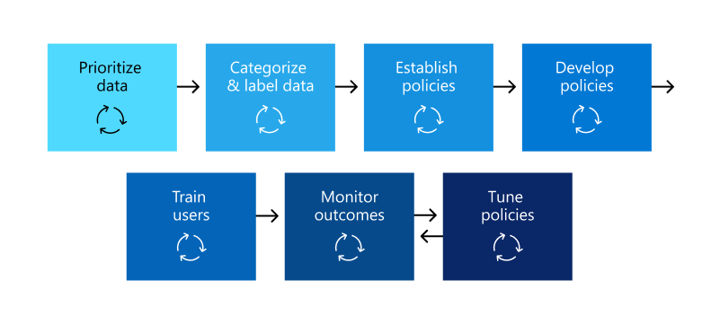

# Plan for data loss prevention (DLP)

Every organization will plan for and implement data loss prevention (DLP) differently, because every organization's business needs, goals, resources, and situation are unique to them. However, there are elements that are common to all successful DLP implementations. This article presents the best practices that are used by organizations in their DLP planning.

## Multiple starting points

Many organizations choose to implement DLP to comply with various governmental or industry regulations. For example, the European Union's General Data Protection Regulation (GDPR), or the Health Insurance Portability and Accountability Act (HIPAA), or the California Consumer Privacy Act (CCPA). They also implement data loss prevention to protect their intellectual property. But the starting place and ultimate destination in the DLP journey vary. 

Organizations can start their DLP journey:

- from a platform focus, like wanting to protect information in Teams Chat and Channel messages or on Windows 10 devices
- knowing what sensitive information they want to prioritize protecting, like health care records, and going straight to defining policies to protect it
- without knowing what their sensitive information is, where it is, and who is doing what with it so they start with discovery and categorization and take a more methodical approach
- without knowing what their sensitive information is, or where it is, or who is doing what with it, but they will move straight to defining policies and use those outcomes as a starting place and then refine their policies from there
- knowing that they need to implement the full Microsoft 365 Information Protection stack and so intend to take a longer term, methodical approach

These are just some examples of how customers can approach DLP and it doesn't matter where you start from, Microsoft 365 DLP is flexible enough to accommodate various types of information protection journeys from start to a fully realized data loss prevention strategy. 

## Overview of planning process

The [Learn about data loss prevention](dlp-learn-about-dlp.md#learn-about-data-loss-prevention) introduces the three different aspect of the [DLP planning process](dlp-learn-about-dlp.md#plan-for-dlp). We'll go into more detail here on the elements that are common to all DLP plans.

### Identify stakeholders

When implemented, DLP policies can be applied across large portions of your organization. IT can't develop a broad ranging plan on their own without negative consequences. You need to identify the stakeholders who can:

- describe the regulations, laws and industry standards your organization is subject to
- the categories of sensitive items to be protected
- the business processes they are used in
- the risky behavior that should be limited
- prioritize which data should be protected first based on the sensitivity of the items and risk involved
- outline the DLP policy match event review and remediation process 
 
In general these needs tend to be 85% regulatory and compliance protection, and 15% intellectual property protection. Here are some suggestions on roles to include in your planning process:

- Regulatory and compliance officers
- Chief risk officer
- Legal officers
- Security and compliance officers
- Business owners for the data items
- Business users
- IT

### Describe the categories of sensitive information to protect

The stakeholders then describe the categories of sensitive information to be protected and the business process that they're used in. For example, Microsoft 365 DLP defines these categories:

- Financial 
- Medical and health information
- Privacy
- Custom

The stakeholders might identify the sensitive information as "We are a data processor, so we have to implement privacy protections on data subject information and financial information".

 
  <!-- The business process is important as it informs the ‘data at rest’, ‘data in transit’, ‘data in use’ aspect of DLP planning and who should be sharing the items and who should not.-->

### Set goals and strategy

Once you have identified your stakeholders and you know which sensitive information needs protection and where it's used, the stakeholders can set their protection goals and IT can develop an implementation plan. 

 <!--
### Discovery
 for the locations (DLP workloads) of these types of items.  (mapping DLP locations and data at rest, data in transit, data in use)

### IT can start coding test policies
start small and always in test mode. Note that DLP policies can feed into insider risk.

### Business process owners help with tuning
 false positive/false negative results and fitting DLP into their business processes.

-->

### Set implementation plan

Your implementation plan should include:

- Mapping out your starting state and desired end state and the steps to get from one to the other
- how you will address discovery of sensitive items
- policy planning and the order that they will be implemented
- how you will address any prerequisites
- planning on how policies will first be tested before moving to enforcement
- how you will train your end users
- how you will test and tune your policies
- how you will review and update your data loss prevention strategy based on changing regulatory, legal, industry standard or intellectual property protection and business needs

#### Map out path from start to desired end state

Documenting how your organization is going to get from its starting state to the desired end state is essential to communicating with your stakeholders and setting the project scope. Here are a set of steps that are commonly used to deploy DLP. You'll want more detail than this, but you can use this to frame your DLP adoption path.

#### Sensitive item discovery

There are multiple ways to discover what individual sensitive items are and where they are located. You may have sensitivity labels already deployed or you may have decided to deploy a very broad DLP policy to all locations that only discovers and audits items. To learn more, see [Know your data](information-protection.md#know-your-data).

#### Policy planning

As you begin your DLP adoption you can use these questions to focus your policy design and implementation efforts.

##### What laws, regulations and industry standards must your organization comply with?

Because many organizations come to DLP with the goal of regulatory compliance, answering this question is a natural starting place for planning your DLP implementation. But, as the IT implementer, you're probably not positioned to answer it. It needs to be answered by your legal team and business executives. 
 
**Example** Your organization is subject to U.K. financial regulations.

##### What sensitive items does your organization have that must be protected from leakage?

Once your organization knows where it stands in terms of regulatory compliance needs, you'll have some idea of what sensitive items need to be protected from leakage and how you want to prioritize policy implementation to protect them. This will help you choose the most appropriate DLP policy templates. Microsoft 365 comes with pre-configured DLP templates for Financial, Medical and health, Privacy, and you can build your own using the Custom template. As you design and create your actual DLP policies, knowing the answer to this question will also help you choose the right [sensitive information type](sensitive-information-type-learn-about.md#learn-about-sensitive-information-types).

**Example** To get started quickly, you pick the `U.K. Financial Data` policy template which includes the `Credit Card Number`, `EU Debit Card Number`, and `SWIFT Code` sensitive information types. 

##### Where are the sensitive items and what business processes are they involved in?

The items that contain your organizations sensitive information are used every day in the course of doing business. You need to know where instances of that sensitive information may occur and what business processes they are used in. This will help you choose the right locations to apply your DLP policies to. Microsoft 365 DLP policies are applied to locations:

- Exchange email
- SharePoint sites
- OneDrive accounts
- Teams chat and channel messages
- Windows 10 Devices
- Microsoft Cloud App Security
- On-premises repositories

**Example** Your organizations' internal auditors are tracking a set of credit card numbers. They keep a spreadsheet of them in a secure SharePoint site. Several of the employees make copies and save them to their work OneDrive for Business site which is synced to their Windows 10 device. One of them pastes a list of 14 of them in an email and tries to send it to the outside auditors for review. You'd want to apply the policy to the secure SharePoint site, all the internal auditors OneDrive for Business accounts, their Windows 10 devices and Exchange email.

##### What is your organizations tolerance for leakage?

Different groups in your organization may have different views on what's an acceptable level of sensitive item leakage and what's not. Achieving the perfection of zero leakage may come at too high a cost to the business.

**Example** Your organizations' security group, along with the legal team both feel that there should be no sharing of credit card numbers with anyone outside the org and insist on zero leakage. But, as part of regular review of credit card number activity, the internal auditors must share some credit card numbers with third party auditors. If your DLP policy prohibits all sharing of credit card numbers outside the org, there will be a significant business process disruption and added cost to mitigate the disruption in order for the internal auditors to complete their tracking. This extra cost is unacceptable to the executive leadership. To resolve this, there needs to be an internal conversation to decide an acceptable level of leakage. Once that is decided the policy can provide exceptions for certain individuals to share the information or it can be applied in audit only mode.

#### Planning for prerequisites

Before you can monitor some DLP locations, there are prerequisites that must be met. See the **Before you begin** sections of:

- [Get started with the data loss prevention on-premises scanner (preview)](dlp-on-premises-scanner-get-started.md#before-you-begin)
- [Get started with Endpoint data loss prevention](endpoint-dlp-getting-started.md#before-you-begin)
- [Get started with the Microsoft compliance extension (preview)](dlp-chrome-get-started.md#before-you-begin)
- [Use data loss prevention policies for non-Microsoft cloud apps (preview)](dlp-use-policies-non-microsoft-cloud-apps.md#before-you-begin)

#### Policy deployment

When you create your DLP policies, you should consider rolling them out gradually to assess their impact and test their effectiveness before fully enforcing them. For example, you don't want a new DLP policy to unintentionally block access to thousands of documents or to break an existing business process.
  
If you're creating DLP policies with a large potential impact, we recommend following this sequence:
  
1. **Start in test mode without Policy Tips** and then use the DLP reports and any incident reports to assess the impact. You can use DLP reports to view the number, location, type, and severity of policy matches. Based on the results, you can fine tune the policies as needed. In test mode, DLP policies will not impact the productivity of people working in your organization. Also, use this stage to test out your workflow for DLP event review and issue remediation.
    
2. **Move to Test mode with notifications and Policy Tips** so that you can begin to teach users about your compliance policies and prepare them for the policies that are going to be applied. Its useful to have a link to an organization policy page that provides additional details about the policy in the policy tip. At this stage, you can also ask users to report false positives so that you can further refine the policies. Move to this stage once you have confidence that the results of policy application match what they stakeholders had in mind. 
    
3. **Start full enforcement on the policies** so that the actions in the rules are applied and the content's protected. Continue to monitor the DLP reports and any incident reports or notifications to make sure that the results are what you intend. 

    

    You can turn off a DLP policy at any time, which affects all rules in the policy. However, each rule can also be turned off individually by toggling its status in the rule editor.

    

    You can also change the priority of multiple rules in a policy. To do that, open a policy for editing. In a row for a rule, choose the ellipses (**...**), and then choose an option, such as **Move down** or **Bring to last**.

    

#### End user training

When a DLP policy is triggered, you can configure your policies to [Send email notifications and show policy tips for DLP policies](use-notifications-and-policy-tips.md#send-email-notifications-and-show-policy-tips-for-dlp-policies) to admins and end users. While your policies are still in test mode and before they are set to enforce a blocking action, policy tips are useful ways to raise awareness of risky behaviors on sensitive items and train users to avoid those behaviors in the future.  

#### Review DLP requirements and update strategy

The regulations, laws and industry standards that your organization is subject to will change over time and your business goals for DLP will too. Be sure to include regular reviews of all these areas so that your organization stays in compliance and your DLP implementation continues to meet your business needs.

## Approaches to deployment

|Customer business needs description  | approach  |
|---------|---------|
|**Contoso Bank** is in a highly regulated industry and has  many different types of sensitive items in many different locations.   - knows which types of sensitive information are top priority.   - must minimize business disruption as policies are rolled out.   -  has IT resources and can hire experts to help plan, design deploy   - has a premier support contract with Microsoft| - Take the time to understand what regulations they must comply with and how they are going to comply.   -Take the time to understand the better together value of the Microsoft 365 Information Protection stack   - Develop sensitivity labelling scheme for prioritized items and apply   - Involve business process owners  - Design/code policies, deploy in test mode, train users  - repeat|
|**TailSpin Toys** doesn’t know what they have or where it is, and have little to no resource depth. They use Teams, ODB and Exchange extensively.     |- Start with simple policies on the prioritized locations.  - Monitor what gets identified  - Apply sensitivity labels accordingly  - Refine policies, train users       |
|**Fabrikam** is a small startup and wants to protect its intellectual property, and must move quickly. They are willing to dedicate some resources, but can't afford hiring outside experts.  - Sensitive items are all in Microsoft 365 OneDdrive for Business/SharePoint  - Adoption of OneDrive for Business and SharePoint is slow, employees/shadow IT use DropBox and Google drive to share/store items  - Employees value speed of work over data protection discipline  - Customer splurged and bought all 18 employees new Windows 10 devices     |- Take advantage of the default DLP policy in Teams  - Use restricted by default setting for SharePoint items  - Deploy policies that prevent external sharing  - Deploy policies to prioritized locations  - Deploy policies to Windows 10 devices  - Block uploads to non OneDrive for Business cloud storage      |

<!--

## Planning for workloads

### Exchange

### SharePoint

### OneDrive for Business

### Teams

### Windows 10 Devices

### Microsoft Cloud App Security (MCAS)

### On-premises Scanner
-->

## See also
- [Learn about data loss prevention](dlp-learn-about-dlp.md#learn-about-data-loss-prevention)
