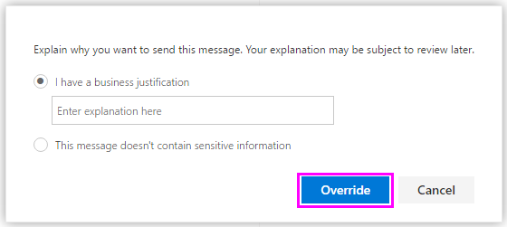

# Data loss prevention policy tip reference for Outlook on the Web

[!INCLUDE [purview-preview](../includes/purview-preview.md)]

## DLP policy tips supported

Yes.

> [!IMPORTANT]
> When emails are encrypted with Microsoft Purview Message Encryption and the policy used to detect them uses the *detect encryption* condition, policy tips will not appear.

## Email notification supported for Outlook on the Web

Yes.

## Conditions that support policy tips in Outlook on the Web

- Content contains (SIT)
- Content is shared from M365
- Sender is a member of
- Recipient Domain Is
- Recipient is
- Subject Contains Words or phrases
- Sender is
- Sender domain is
- File extension is
- Subject matches patterns
- Subject or Body contains words or phrases
- Doc or Attachment is password protected
- Document name contains words or phrases
- Sender address contains words
- Document size equals or is greater than
- Subject or Body matches patterns
- Recipient address contains words
- Sender address matches patterns
- Document name matches patterns
- Recipient address matches patterns
- Message importance is
- Any email attachment's content could not be scanned (DocIsUnsupported)
- Document property is
- Content is not labeled

## Actions that support policy tips in Outlook on the Web

- Restrict access or encrypt the content in Microsoft 365 locations
- Set headers
- Remove header
- Redirect the message to specific users
- Forward the message for approval to sender's manager
- Forward the message for approval to specific approvers
- Add recipient to the To box
- Add recipient to the Cc box
- Add recipient to the Bcc box
- Add the sender's manager as recipient
- Removed O365 Message Encryption and rights protection
- Prepend Email Subject
- Add HTML Disclaimer
- Modify Email Subject
- Deliver the message to the hosted quarantine

## Sensitive information types that support policy tips in Outlook on the Web

These preconfigured sensitive information types (SITs) support policy tips in Outlook on the Web.

- [ABA routing number](sit-defn-aba-routing.md)
- [Argentina national identity (DNI) number](sit-defn-argentina-national-identity-numbers.md)
- [Australia bank account number](sit-defn-australia-bank-account-number.md)
- [Australia medical account number](sit-defn-australia-medical-account-number.md)
- [Australia passport number](sit-defn-australia-passport-number.md)
- [Australia tax file number](sit-defn-australia-tax-file-number.md)
- [Azure DocumentDB auth key](sit-defn-azure-document-db-auth-key.md)
- [Azure IAAS database connection string and Azure SQL connection string](sit-defn-azure-iaas-database-connection-string-azure-sql-connection-string.md)
- [Azure IoT connection string](sit-defn-azure-iot-connection-string.md)
- [Azure publish setting password](sit-defn-azure-publish-setting-password.md)
- [Azure Redis cache connection string](sit-defn-azure-redis-cache-connection-string.md)
- [Azure SAS](sit-defn-azure-sas.md)
- [Azure service bus connection string](sit-defn-azure-service-bus-connection-string.md)
- [Azure storage account key](sit-defn-azure-storage-account-key.md)
- [Azure Storage account key (generic)](sit-defn-azure-storage-account-key-generic.md)
- [Belgium national number](sit-defn-belgium-national-number.md)
- [Brazil CPF number](sit-defn-brazil-cpf-number.md)
- [Brazil legal entity number (CNPJ)](sit-defn-brazil-legal-entity-number.md)
- [Brazil national identification card (RG)](sit-defn-brazil-national-identification-card.md)
- [Canada bank account number](sit-defn-canada-bank-account-number.md)
- [Canada driver's license number](sit-defn-canada-drivers-license-number.md)
- [Canada health service number](sit-defn-canada-health-service-number.md)
- [Canada passport number](sit-defn-canada-passport-number.md)
- [Canada personal health identification number (PHIN)](sit-defn-canada-personal-health-identification-number.md)
- [Canada social insurance number](sit-defn-canada-social-insurance-number.md)
- [Chile identity card number](sit-defn-chile-identity-card-number.md)
- [China resident identity card (PRC) number](sit-defn-china-resident-identity-card-number.md)
- [Credit card number](sit-defn-credit-card-number.md)
- [Croatia identity card number](sit-defn-croatia-identity-card-number.md)
- [Croatia personal identification (OIB) number](sit-defn-croatia-personal-identification-number.md)
- [Czech personal identity number](sit-defn-czech-personal-identity-number.md)
- [Denmark personal identification number](sit-defn-denmark-personal-identification-number.md)
- [Drug Enforcement Agency (DEA) number](sit-defn-drug-enforcement-agency-number.md)
- [EU debit card number](sit-defn-eu-debit-card-number.md)
- [EU driver's license number](sit-defn-eu-drivers-license-number.md)
- [EU national identification number](sit-defn-eu-national-identification-number.md)
- [EU passport number](sit-defn-eu-passport-number.md)
- [EU social security number or equivalent identification](sit-defn-eu-social-security-number-equivalent-identification.md)
- [EU Tax identification number](sit-defn-eu-tax-identification-number.md)
- [Finland national ID](sit-defn-finland-national-id.md)
- [Finland passport number](sit-defn-finland-passport-number.md)
- [France driver's license number](sit-defn-france-drivers-license-number.md)
- [France national id card (CNI)](sit-defn-france-national-id-card.md)
- [France passport number](sit-defn-france-passport-number.md)
- [France social security number (INSEE)](sit-defn-france-social-security-number.md)
- [Germany driver's license number](sit-defn-germany-drivers-license-number.md)
- [Germany passport number](sit-defn-germany-passport-number.md)
- [Germany identity card number](sit-defn-germany-identity-card-number.md)
- [Greece national ID card](sit-defn-greece-national-id-card.md)
- [Hong Kong identity card (HKID) number](sit-defn-hong-kong-identity-card-number.md)
- [India permanent account number (PAN)](sit-defn-india-permanent-account-number.md)
- [India unique identification (Aadhaar) number](sit-defn-india-unique-identification-number.md)
- [Indonesia identity card (KTP) number](sit-defn-indonesia-identity-card-number.md)
- [International banking account number (IBAN)](sit-defn-international-banking-account-number.md)
- [International classification of diseases (ICD-10-CM)](sit-defn-international-classification-of-diseases-icd-10-cm.md)
- [International classification of diseases (ICD-9-CM)](sit-defn-international-classification-of-diseases-icd-9-cm.md)
- [IP address](sit-defn-ip-address.md)
- [Ireland personal public service (PPS) number](sit-defn-ireland-personal-public-service-number.md)
- [Israel bank account number](sit-defn-israel-bank-account-number.md)
- [Israel national identification number](sit-defn-israel-national-identification-number.md)
- [Italy driver's license number](sit-defn-italy-drivers-license-number.md)
- [Japan bank account number](sit-defn-japan-bank-account-number.md)
- [Japan driver's license number](sit-defn-japan-drivers-license-number.md)
- [Japan passport number](sit-defn-japan-passport-number.md)
- [Japan resident registration number](sit-defn-japan-resident-registration-number.md)
- [Japan social insurance number (SIN)](sit-defn-japan-social-insurance-number.md)
- [Japan residence card number](sit-defn-japan-residence-card-number.md)
- [Malaysia identification card number](sit-defn-malaysia-identification-card-number.md)
- [Netherlands citizens service (BSN) number](sit-defn-netherlands-citizens-service-number.md)
- [New Zealand ministry of health number](sit-defn-new-zealand-ministry-of-health-number.md)
- [Norway identification number](sit-defn-norway-identification-number.md)
- [Philippines unified multi-purpose identification number](sit-defn-philippines-unified-multi-purpose-identification-number.md)
- [Poland identity card](sit-defn-poland-identity-card.md)
- [Poland national ID (PESEL)](sit-defn-poland-national-id.md)
- [Poland passport number](sit-defn-poland-passport-number.md)
- [Portugal citizen card number](sit-defn-portugal-citizen-card-number.md)
- [Saudi Arabia National ID](sit-defn-saudi-arabia-national-id.md)
- [Singapore national registration identity card (NRIC) number](sit-defn-singapore-national-registration-identity-card-number.md)
- [South Africa identification number](sit-defn-south-africa-identification-number.md)
- [South Korea resident registration number](sit-defn-south-korea-resident-registration-number.md)
- [Spain social security number (SSN)](sit-defn-spain-social-security-number.md)
- [SQL Server connection string](sit-defn-sql-server-connection-string.md)
- [Sweden national ID](sit-defn-sweden-national-id.md)
- [Sweden passport number](sit-defn-sweden-passport-number.md)
- [SWIFT code](sit-defn-swift-code.md)
- [Taiwan national identification number](sit-defn-taiwan-national-identification-number.md)
- [Taiwan passport number](sit-defn-taiwan-passport-number.md)
- [Taiwan-resident certificate (ARC/TARC) number](sit-defn-taiwan-resident-certificate-number.md)
- [Thai population identification code](sit-defn-thai-population-identification-code.md)
- [Turkey national identification number](sit-defn-turkey-national-identification-number.md)
- [U.K. drivers license number](sit-defn-uk-drivers-license-number.md)
- [U.K. electoral roll number](sit-defn-uk-electoral-roll-number.md)
- [U.K. national health service number](sit-defn-uk-national-health-service-number.md)
- [U.K. national insurance number (NINO)](sit-defn-uk-national-insurance-number.md)
- [U.S./U.K. passport number](sit-defn-us-uk-passport-number.md)
- [U.S. bank account number](sit-defn-us-bank-account-number.md)
- [U.S. driver's license number](sit-defn-us-drivers-license-number.md)
- [U.S. individual taxpayer identification number (ITIN)](sit-defn-us-individual-taxpayer-identification-number.md)
- [U.S. social security number (SSN)](sit-defn-us-social-security-number.md)

## Exact data match sensitive information types support for policy tips in Outlook on the Web

Yes.

All exact data match sensitive information types are custom created. For more details, see [Learn about exact data match based sensitive information types](sit-learn-about-exact-data-match-based-sits.md).

## Custom sensitive information types support for policy tips in Outlook on the Web

Yes.

Custom sensitive information types that use REGEX, functions, keyword lists, and keyword dictionaries support policy tips in Outlook on the Web. For more details, see [Create custom sensitive information types in the compliance portal](create-a-custom-sensitive-information-type.md) and [Create a custom sensitive information type using PowerShell](create-a-custom-sensitive-information-type-in-scc-powershell.md).

## Sensitivity labels support for policy tips in Outlook on the Web

No.

## Retention labels support for policy tips in Outlook on the Web

No.

## Trainable classifiers support for policy tips in Outlook on the Web

No.

<!-- END USER CONTENT ## Policy tips in Outlook on the web

When you compose a new email in Outlook on the web and Outlook 2013 and later, you'll see a policy tip if you add content that matches a rule in a DLP policy, and that rule uses policy tips. The policy tip appears at the top of the message, above the recipients, while the message is being composed.

Policy tips work whether the sensitive information appears in the message body, subject line, or even a message attachment as shown here.

If the policy tips are configured to allow override, you can choose **Show Details** \> **Override** \> enter a business justification or report a false positive \> **Override**.

Note that when you add sensitive information to an email, there may be latency between when the sensitive information is added and when the policy tip appears. When emails are encrypted with Microsoft Purview Message Encryption and the policy used to detect them uses the detect encryption condition policy tips will not appear.
-->

