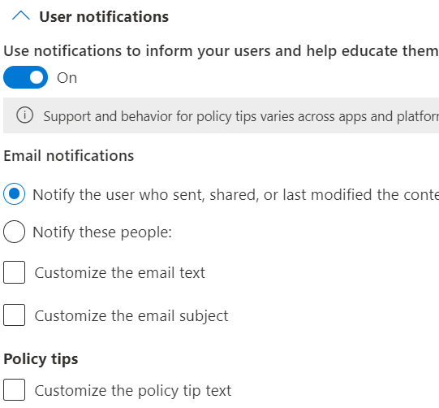

# Data Loss Prevention policy reference

Microsoft Purview Data Loss Prevention (DLP) policies have many components to configure. To create an effective policy, you need to understand what the purpose of each component is and how its configuration alters the behavior of the policy. This article provides a detailed anatomy of a DLP policy.

[!INCLUDE [purview-preview](../includes/purview-preview.md)]

## Before you begin

If you're new to Microsoft Purview DLP, here's a list of the core articles you'll need as you implement DLP:

1. [Administrative units](microsoft-365-compliance-center-permissions.md#administrative-units)
1. [Learn about Microsoft Purview Data Loss Prevention](dlp-learn-about-dlp.md) - the article introduces you to the data loss prevention discipline and Microsoft's implementation of DLP
1. [Sensitive Information Type Limits](/microsoft-365/compliance/sit-limits) - these limits apply to all Microsoft Purview policies that use sensitive information types.
1. [Plan for data loss prevention (DLP)](dlp-overview-plan-for-dlp.md#plan-for-data-loss-prevention-dlp) - by working through this article you will:
    1. [Identify stakeholders](dlp-overview-plan-for-dlp.md#identify-stakeholders)
    1. [Describe the categories of sensitive information to protect](dlp-overview-plan-for-dlp.md#describe-the-categories-of-sensitive-information-to-protect)
    1. [Set goals and strategy](dlp-overview-plan-for-dlp.md#set-goals-and-strategy)
1. [Data Loss Prevention policy reference](dlp-policy-reference.md#data-loss-prevention-policy-reference) - this article that you're reading now introduces all the components of a DLP policy and how each one influences the behavior of a policy
1. [Design a DLP policy](dlp-policy-design.md) - this article walks you through creating a policy intent statement and mapping it to a specific policy configuration. 
1. [Create and Deploy data loss prevention policies](dlp-create-deploy-policy.md) - This article presents some common policy intent scenarios that you'll map to configuration options. It also walks you through configuring those options.

Also, you need to be aware of the following constraints of the platform:

- Maximum number of MIP + MIG policies in a tenant: 10,000
- Maximum size of a DLP policy (100 KB)
- Maximum number of DLP rules:
    - In a policy: Limited by the size of the policy
    - In a tenant: 600
- Maximum size of an individual DLP rule: 100 KB (102,400 characters)
- GIR evidence limit: 100, with each SIT evidence, in proportion of occurrence
- Text extraction limit: 1 MB
- Regex size limit for all matches predicted: 20 KB
- Policy name length limit: 64 characters
- Policy rule length limit: 64 characters
- Comment length limit: 1024 characters
- Description length limit: 1024 characters

## Policy templates

DLP policy templates are sorted into four categories:

- policies that can detect and protect types of **Financial** information.
- policies that can detect and protect types of **Medical and health** information.
- policies that can detect and protect types of **Privacy** information.
- A **Custom** policy template that you can use to build your own policy if none of the others meet your organization's needs.

The following table lists all policy templates and the sensitive information types (SIT) that they cover.

|Category|Template | SIT |
|---------|---------|---------|
|Financial| Australia Financial Data| - [SWIFT code](sit-defn-swift-code.md) </br> -  [Australia tax file number](sit-defn-australia-tax-file-number.md) </br> - [Australia bank account number](sit-defn-australia-bank-account-number.md) </br> - [Credit card number](sit-defn-credit-card-number.md)|
|Financial| Canada Financial data |- [Credit card number](sit-defn-credit-card-number.md) </br> - [Canada bank account number](sit-defn-canada-bank-account-number.md)|
|Financial| France Financial data |- [Credit card number](sit-defn-credit-card-number.md) </br> - [EU debit card number](sit-defn-eu-debit-card-number.md)|
|Financial| Germany Financial Data |- [Credit card number](sit-defn-credit-card-number.md) </br> - [EU debit card number](sit-defn-eu-debit-card-number.md)|
|Financial| Israel Financial Data |- [Israel bank account number](sit-defn-israel-bank-account-number.md) </br> - [SWIFT code](sit-defn-swift-code.md) </br> - [Credit card number](sit-defn-credit-card-number.md)|
|Financial| Japan Financial Data |- [Japan bank account number](sit-defn-japan-bank-account-number.md)</br> - [Credit card number](sit-defn-credit-card-number.md)|
|Financial| PCI Data Security Standard (PCI DSS)|- [Credit card number](sit-defn-credit-card-number.md)|
|Financial| Saudi Arabia Anti-Cyber Crime Law|- [SWIFT code](sit-defn-swift-code.md) </br> - [International banking account number (IBAN)](sit-defn-international-banking-account-number.md)|
|Financial| Saudi Arabia Financial Data |- [Credit card number](sit-defn-credit-card-number.md) </br> - [SWIFT code](sit-defn-swift-code.md) </br> - [International banking account number (IBAN)](sit-defn-international-banking-account-number.md)|
|Financial| UK Financial Data|- [Credit card number](sit-defn-credit-card-number.md) </br> - [EU debit card number](sit-defn-eu-debit-card-number.md) </br> - [SWIFT code](sit-defn-swift-code.md)|
|Financial| US Financial Data|- [Credit card number](sit-defn-credit-card-number.md) </br> - [U.S. bank account number](sit-defn-us-bank-account-number.md)</br> - [ABA Routing Number](sit-defn-aba-routing.md)|
|Financial| U.S. Federal Trade Commission (FTC) Consumer Rules|- [Credit card number](sit-defn-credit-card-number.md) </br> - [U.S. bank account number](sit-defn-us-bank-account-number.md)</br> - [ABA Routing Number](sit-defn-aba-routing.md)|
|Financial| U.S. Gramm-Leach-Bliley Act (GLBA) Enhanced|- [Credit card number](sit-defn-credit-card-number.md) </br> - [U.S. bank account number](sit-defn-us-bank-account-number.md)</br> - [U.S. Individual Taxpayer Identification Number (ITIN)](sit-defn-us-individual-taxpayer-identification-number.md)  </br> - [U.S. social security number (SSN)](sit-defn-us-social-security-number.md)</br> - [U.S./U.K. passport number](sit-defn-us-uk-passport-number.md) </br> -[U.S. driver's license number](sit-defn-us-drivers-license-number.md)</br> - [All Full Names](sit-defn-all-full-names.md)</br> - [U.S. Physical Addresses](sit-defn-us-physical-addresses.md)|
|Financial| U.S. Gramm-Leach-Bliley Act (GLBA)|- [Credit card number](sit-defn-credit-card-number.md) </br> - [U.S. bank account number](sit-defn-us-bank-account-number.md)</br> - [U.S. Individual Taxpayer Identification Number (ITIN)](sit-defn-us-individual-taxpayer-identification-number.md)  </br> - [U.S. social security number (SSN)](sit-defn-us-social-security-number.md)|
|Medical and health| Australia Health Records Act (HRIP Act) Enhanced |- [Australia tax file number](sit-defn-australia-tax-file-number.md)</br> - [Australia medical account number](sit-defn-australia-medical-account-number.md)</br> - [All Full Names](sit-defn-all-full-names.md) </br> - [All Medical Terms And Conditions](sit-defn-all-medical-terms-conditions.md) </br> - [Australia Physical Addresses](sit-defn-australia-physical-addresses.md)|
|Medical and health| Australia Health Records Act (HRIP Act)|- [Australia tax file number](sit-defn-australia-tax-file-number.md) </br> - [Australia medical account number](sit-defn-australia-medical-account-number.md)|
|Medical and health| Canada Health Information Act (HIA) |- [Canada passport number](sit-defn-canada-passport-number.md) </br> - [Canada social insurance number](sit-defn-canada-social-insurance-number.md) </br> - [Canada health service number](sit-defn-canada-health-service-number.md) </br> - [Canada Personal Health Identification Number](sit-defn-canada-personal-health-identification-number.md)|
|Medical and health| Canada Personal Health Information Act (PHIA) Manitoba|- [Canada social insurance number](sit-defn-canada-social-insurance-number.md) </br> - [Canada health service number](sit-defn-canada-health-service-number.md) </br> - [Canada Personal Health Identification Number](sit-defn-canada-personal-health-identification-number.md)|
|Medical and health| Canada Personal Health Act (PHIPA) Ontario |- [Canada passport number](sit-defn-canada-passport-number.md) </br> - [Canada social insurance number](sit-defn-canada-social-insurance-number.md) </br> - [Canada health service number](sit-defn-canada-health-service-number.md) </br> - [Canada Personal Health Identification Number](sit-defn-canada-personal-health-identification-number.md)|
|Medical and health| U.K. Access to Medical Reports Act|- [U.K. national health service number](sit-defn-uk-national-health-service-number.md) </br> - [U.K. national insurance number (NINO)](sit-defn-uk-national-insurance-number.md)|
|Medical and health| U.S. Health Insurance Act (HIPAA) Enhanced|</br> - [International classification of diseases (ICD-9-CM)](sit-defn-international-classification-of-diseases-icd-9-cm.md) </br> - [International classification of diseases (ICD-10-CM)](sit-defn-international-classification-of-diseases-icd-10-cm.md) </br> - [All Full Names](sit-defn-all-full-names.md) </br> - [All Medical Terms And Conditions](sit-defn-all-medical-terms-conditions.md) </br> - [U.S. Physical Addresses](sit-defn-us-physical-addresses.md)|
|Medical and health| U.S. Health Insurance Act (HIPAA)| - [International classification of diseases (ICD-9-CM)](sit-defn-international-classification-of-diseases-icd-9-cm.md) </br> - [International classification of diseases (ICD-10-CM)](sit-defn-international-classification-of-diseases-icd-10-cm.md)|
|Privacy| Australia Privacy Act Enhanced|- [Australia driver's license number](sit-defn-australia-drivers-license-number.md) </br> - [Australia passport number](sit-defn-australia-passport-number.md) </br> - [All Full Names](sit-defn-all-full-names.md) </br> - [All Medical Terms And Conditions](sit-defn-all-medical-terms-conditions.md) </br> - [Australia Physical Addresses](sit-defn-australia-physical-addresses.md)|
|Privacy| Australia Privacy Act|- [Australia drivers license number](sit-defn-australia-drivers-license-number.md)</br> - [Australia passport number](sit-defn-australia-passport-number.md)|
|Privacy| Australia Personally Identifiable Information (PII) Data|- [Australia tax file number](sit-defn-australia-tax-file-number.md) </br> - [Australia driver's license number](sit-defn-australia-drivers-license-number.md)|
|Privacy| Canada Personally Identifiable Information (PII) Data|- [Canada driver's license number](sit-defn-canada-drivers-license-number.md) </br> - [Canada bank account number](sit-defn-canada-bank-account-number.md) </br> - [Canada passport number](sit-defn-canada-passport-number.md) </br> - [Canada social insurance number](sit-defn-canada-social-insurance-number.md) </br> - [Canada health service number](sit-defn-canada-health-service-number.md) </br> - [Canada Personal Health Identification Number](sit-defn-canada-personal-health-identification-number.md)|
|Privacy| Canada Personal Information Protection Act (PIPA)|- [Canada passport number](sit-defn-canada-passport-number.md) </br> - [Canada social insurance number](sit-defn-canada-social-insurance-number.md) </br> - [Canada health service number](sit-defn-canada-health-service-number.md) </br> - [Canada Personal Health Identification Number](sit-defn-canada-personal-health-identification-number.md)|
|Privacy| Canada Personal Information Protection Act (PIPEDA)|- [Canada driver's license number](sit-defn-canada-drivers-license-number.md) </br> - [Canada bank account number](sit-defn-canada-bank-account-number.md) </br> - [Canada passport number](sit-defn-canada-passport-number.md) </br> - [Canada social insurance number](sit-defn-canada-social-insurance-number.md) </br> - [Canada health service number](sit-defn-canada-health-service-number.md) </br> - [Canada Personal Health Identification Number](sit-defn-canada-personal-health-identification-number.md)|
|Privacy| France Data Protection Act|- [France national id card (CNI)](sit-defn-france-national-id-card.md)</br> - [France social security number (INSEE)](sit-defn-france-social-security-number.md)|
|Privacy| France Personally Identifiable Information (PII) Data|- [France social security number (INSEE)](sit-defn-france-social-security-number.md) </br> - [France driver's license number](sit-defn-france-drivers-license-number.md) </br> - [France passport number](sit-defn-france-passport-number.md) </br> - [France national id card (CNI)](sit-defn-france-national-id-card.md)|
|Privacy| General Data Protection Regulation (GDPR) Enhanced|- [Austria Physical Addresses](sit-defn-austria-physical-addresses.md) </br> - [Belgium Physical Addresses](sit-defn-belgium-physical-addresses.md) </br> - [Bulgaria Physical Addresses](sit-defn-bulgaria-physical-addresses.md) </br> - [Croatia Physical Addresses](sit-defn-croatia-physical-addresses.md) </br> - [Cyprus Physical Addresses](sit-defn-cyprus-physical-addresses.md) </br> - [Czech Republic Physical Addresses](sit-defn-czech-republic-physical-addresses.md)</br> - [Denmark Physical Addresses](sit-defn-denmark-physical-addresses.md)</br> - [Estonia Physical Addresses](sit-defn-estonia-physical-addresses.md)</br> - [Finland Physical Addresses](sit-defn-finland-physical-addresses.md)</br> - [France Physical Addresses](sit-defn-france-physical-addresses.md)</br> - [Germany Physical Addresses](sit-defn-germany-physical-addresses.md)</br> - [Greece Physical Addresses](sit-defn-greece-physical-addresses.md)</br> - [Hungary Physical Addresses](sit-defn-hungary-physical-addresses.md)</br> - [Ireland Physical Addresses](sit-defn-ireland-physical-addresses.md)</br> - [Italy Physical Addresses](sit-defn-italy-physical-addresses.md)</br> - [Latvia Physical Addresses](sit-defn-latvia-physical-addresses.md)</br> - [Lithuania Physical Addresses](sit-defn-lithuania-physical-addresses.md)</br> - [Luxembourg Physical Addresses](sit-defn-luxemburg-physical-addresses.md)</br> - [Malta Physical Addresses](sit-defn-malta-physical-addresses.md)</br> - [Netherlands Physical Addresses](sit-defn-netherlands-physical-addresses.md)</br> - [Poland Physical Addresses](sit-defn-poland-physical-addresses.md)</br> - [Portuguese Physical Addresses](sit-defn-portugal-physical-addresses.md)</br> - [Romania Physical Addresses](sit-defn-romania-physical-addresses.md)</br> - [Slovakia Physical Addresses](sit-defn-slovakia-physical-addresses.md)</br> - [Slovenia Physical Addresses](sit-defn-slovenia-physical-addresses.md)</br> - [Spain Physical Addresses](sit-defn-spain-physical-addresses.md)</br> - [Sweden Physical Addresses](sit-defn-sweden-physical-addresses.md)</br> - [Austria Social Security Number](sit-defn-austria-social-security-number.md) </br> - [France Social Security Number (INSEE)](sit-defn-france-social-security-number.md)</br> - [Greece Social Security Number (AMKA)](sit-defn-greece-social-security-number.md)</br> - [Hungarian Social Security Number (TAJ)](sit-defn-hungary-social-security-number.md)</br> - [Spain Social Security Number (SSN)](sit-defn-spain-social-security-number.md)</br> - [Austria Identity Card](sit-defn-austria-identity-card.md) </br> - [Cyprus Identity Card](sit-defn-cyprus-identity-card.md) </br> - [Germany Identity Card Number](sit-defn-germany-identity-card-number.md)</br> - [Malta Identity Card Number](sit-defn-malta-identity-card-number.md)</br> - [France National ID Card (CNI)](sit-defn-france-national-id-card.md)</br> - [Greece National ID Card](sit-defn-greece-national-id-card.md)</br> - [Finland National ID](sit-defn-finland-national-id.md)</br> - [Poland National ID (PESEL)](sit-defn-poland-national-id.md)</br> - [Sweden National ID](sit-defn-sweden-national-id.md)</br> - [Croatia Personal Identification (OIB) Number](sit-defn-croatia-personal-identification-number.md) </br> - [Czech Personal Identity Number](sit-defn-czech-personal-identity-number.md)</br> - [Denmark Personal Identification Number](sit-defn-denmark-personal-identification-number.md)</br> - [Estonia Personal Identification Code](sit-defn-estonia-personal-identification-code.md)</br> - [Hungary Personal Identification Number](sit-defn-hungary-personal-identification-number.md)</br> - [Luxemburg National Identification Number natural persons](sit-defn-luxemburg-national-identification-number-natural-persons.md)</br> - [Luxemburg National Identification Number (Non-natural persons)](sit-defn-luxemburg-national-identification-number-non-natural-persons.md)</br> - [Italy Fiscal Code](sit-defn-italy-fiscal-code.md)</br> - [Latvia Personal Code](sit-defn-latvia-personal-code.md)</br> - [Lithuania Personal Code](sit-defn-lithuania-personal-code.md)</br> - [Romania Personal Numerical Code (CNP)](sit-defn-romania-personal-numeric-code.md)</br> - [Netherlands Citizen's Service (BSN) Number](sit-defn-netherlands-citizens-service-number.md)</br> - [Ireland Personal Public Service (PPS) Number](sit-defn-ireland-personal-public-service-number.md)</br> - [Bulgaria Uniform Civil Number](sit-defn-bulgaria-uniform-civil-number.md) </br> - [Belgium National Number](sit-defn-belgium-national-number.md) </br> - [Spain DNI](sit-defn-spain-dni.md)</br> - [Slovenia Unique Master Citizen Number](sit-defn-slovenia-unique-master-citizen-number.md)</br> - [Slovakia Personal Number](sit-defn-slovakia-personal-number.md)</br> - [Portugal Citizen Card Number](sit-defn-portugal-citizen-card-number.md)</br> - [Malta Tax ID Number](sit-defn-malta-tax-identification-number.md)</br> - [Austria Tax Identification Number](sit-defn-austria-tax-identification-number.md) </br> - [Cyprus Tax Identification Number](sit-defn-cyprus-tax-identification-number.md) </br> -[France Tax Identification Number (numéro SPI.)](sit-defn-france-tax-identification-number.md)</br> - [Germany Tax Identification Number](sit-defn-germany-tax-identification-number.md)</br> - [Greek Tax identification Number](sit-defn-greece-tax-identification-number.md)</br> - [Hungary Tax identification Number](sit-defn-hungary-tax-identification-number.md)</br> - [Netherlands Tax Identification Number](sit-defn-netherlands-tax-identification-number.md)</br> - [Poland Tax Identification Number](sit-defn-poland-tax-identification-number.md)</br> - [Portugal Tax Identification Number](sit-defn-portugal-tax-identification-number.md)</br> - [Slovenia Tax Identification Number](sit-defn-slovenia-tax-identification-number.md)</br> - [Spain Tax Identification Number](sit-defn-spain-tax-identification-number.md)</br> - [Sweden Tax Identification Number](sit-defn-sweden-tax-identification-number.md)</br> - [Austria Driver's License](sit-defn-austria-drivers-license-number.md) </br> - [Belgium Driver's License Number](sit-defn-belgium-drivers-license-number.md) </br> - [Bulgaria Driver's License Number](sit-defn-bulgaria-drivers-license-number.md) </br> - [Croatia Driver's License Number](sit-defn-croatia-drivers-license-number.md) </br> - [Cyprus Driver's License Number](sit-defn-cyprus-drivers-license-number.md) </br> - [Czech Driver's License Number](sit-defn-czech-drivers-license-number.md) </br> - [Denmark Driver's License Number](sit-defn-denmark-drivers-license-number.md)</br> - [Estonia Driver's License Number](sit-defn-estonia-drivers-license-number.md)</br> - [Finland Driver's License Number](sit-defn-finland-drivers-license-number.md)</br> - [France Driver's License Number](sit-defn-france-drivers-license-number.md)</br> - [German Driver's License Number](sit-defn-germany-drivers-license-number.md)</br> - [Greece Driver's License Number](sit-defn-greece-drivers-license-number.md) </br> - [Hungary Driver's License Number](sit-defn-hungary-drivers-license-number.md)</br> - [Ireland Driver's License Number](sit-defn-ireland-drivers-license-number.md)</br> - [Italy Driver's License Number](sit-defn-italy-drivers-license-number.md)</br> - [Latvia Driver's License Number](sit-defn-latvia-drivers-license-number.md)</br> - [Lithuania Driver's License Number](sit-defn-lithuania-drivers-license-number.md)</br> - [Luxemburg Driver's License Number](sit-defn-luxemburg-drivers-license-number.md)</br> - [Malta Driver's License Number](sit-defn-malta-drivers-license-number.md)</br> - [Netherlands Driver's License Number](sit-defn-netherlands-drivers-license-number.md)</br> - [Poland Driver's License Number](sit-defn-poland-drivers-license-number.md)</br> - [Portugal Driver's License Number](sit-defn-portugal-drivers-license-number.md)</br> - [Romania Driver's License Number](sit-defn-romania-drivers-license-number.md)</br> - [Slovakia Driver's License Number](sit-defn-slovakia-drivers-license-number.md)</br> - [Slovenia Driver's License Number](sit-defn-slovenia-drivers-license-number.md)</br> - [Spain Driver's License Number](sit-defn-spain-drivers-license-number.md)</br> - [Sweden Driver's License Number](sit-defn-sweden-drivers-license-number.md)</br> - [Austria Passport Number](sit-defn-austria-passport-number.md) </br> - [Belgium Passport Number](sit-defn-belgium-passport-number.md) </br> - [Bulgaria Passport Number](sit-defn-bulgaria-passport-number.md) </br> - [Croatia Passport Number](sit-defn-croatia-passport-number.md) </br> - [Cyprus Passport Number](sit-defn-cyprus-passport-number.md) </br> - [Czech Republic Passport Number](sit-defn-czech-passport-number.md) </br> - [Denmark Passport Number](sit-defn-denmark-passport-number.md)</br> - [Estonia Passport Number](sit-defn-estonia-passport-number.md)</br> - [Finland Passport Number](sit-defn-finland-passport-number.md)</br> - [France Passport Number](sit-defn-france-passport-number.md)</br> - [German Passport Number](sit-defn-germany-passport-number.md)</br> - [Greece Passport Number](sit-defn-greece-passport-number.md)</br> - [Hungary Passport Number](sit-defn-hungary-passport-number.md)</br> - [Ireland Passport Number](sit-defn-ireland-passport-number.md)</br> - [Italy Passport Number](sit-defn-italy-passport-number.md)</br> - [Latvia Passport Number](sit-defn-latvia-passport-number.md)</br> - [Lithuania Passport Number](sit-defn-lithuania-passport-number.md)</br> - [Luxemburg Passport Number](sit-defn-luxemburg-passport-number.md)</br> - [Malta Passport Number](sit-defn-malta-passport-number.md)</br> - [Netherlands Passport Number](sit-defn-netherlands-passport-number.md)</br> - [Poland Passport](sit-defn-poland-passport-number.md)</br> - [Portugal Passport Number](sit-defn-portugal-passport-number.md)</br> - [Romania Passport Number](sit-defn-romania-passport-number.md)</br> - [Slovakia Passport Number](sit-defn-slovakia-passport-number.md)</br> - [Slovenia Passport Number](sit-defn-slovenia-passport-number.md)</br> - [Spain Passport Number](sit-defn-spain-passport-number.md)</br> - [Sweden Passport Number](sit-defn-sweden-passport-number.md)</br> - [EU Debit Card Number](sit-defn-eu-debit-card-number.md)</br> - [All Full Names](sit-defn-all-full-names.md)|
|Privacy| General Data Protection Regulation (GDPR)|- [EU debit card number](sit-defn-eu-debit-card-number.md) </br> - [EU driver's license number](sit-defn-eu-drivers-license-number.md) </br> - [EU national identification number](sit-defn-eu-national-identification-number.md)</br> - [EU passport number](sit-defn-eu-passport-number.md) </br> - [EU social security number or equivalent identification](sit-defn-eu-social-security-number-equivalent-identification.md)</br> - [EU Tax identification number](sit-defn-eu-tax-identification-number.md)|
|Privacy| Germany Personally Identifiable Information (PII) Data|- [Germany driver's license number](sit-defn-germany-drivers-license-number.md) </br> - [Germany passport number](sit-defn-germany-passport-number.md)|
|Privacy| Israel Personally Identifiable Information (PII) Data|- [Israel national identification number](sit-defn-israel-national-identification-number.md)|
|Privacy| Israel Protection of Privacy|- [Israel national identification number](sit-defn-israel-national-identification-number.md)</br> - [Israel bank account number](sit-defn-israel-bank-account-number.md)|
|Privacy| Japan Personally Identifiable Information (PII) Data enhanced|- [Japan Social Insurance Number (SIN)](sit-defn-japan-social-insurance-number.md)</br> - [Japan My Number - Personal](sit-defn-japan-my-number-personal.md)</br> - [Japan passport number](sit-defn-japan-passport-number.md)</br> - [Japan driver's license number](sit-defn-japan-drivers-license-number.md)</br> - [All Full Names](sit-defn-all-full-names.md)</br> - [Japan Physical Addresses](sit-defn-all-physical-addresses.md)|
|Privacy| Japan Personally Identifiable Information (PII) Data|- [Japan resident registration number](sit-defn-japan-resident-registration-number.md) </br> - [Japan Social Insurance Number (SIN)](sit-defn-japan-social-insurance-number.md)|
|Privacy| Japan Protection of Personal Information Enhanced|- [Japan Social Insurance Number (SIN)](sit-defn-japan-social-insurance-number.md) </br> - [Japan My Number - Personal](sit-defn-japan-my-number-personal.md)</br> - [Japan passport number](sit-defn-japan-passport-number.md) </br> - [Japan driver's license number](sit-defn-japan-drivers-license-number.md)</br> - [All Full Names](sit-defn-all-full-names.md)</br> - [Japan Physical Addresses](sit-defn-all-physical-addresses.md)|
|Privacy| Japan Protection of Personal Information|- [Japan resident registration number](sit-defn-japan-resident-registration-number.md)</br> - [Japan Social Insurance Number (SIN)](sit-defn-japan-social-insurance-number.md)|
|Privacy| Saudi Arabia Personally Identifiable (PII) Data|- [Saudi Arabia National ID](sit-defn-saudi-arabia-national-id.md)|
|Privacy| U.K. Data Protection Act|- [U.K. national insurance number (NINO)](sit-defn-uk-national-insurance-number.md) </br> - [U.S./U.K. passport number](sit-defn-us-uk-passport-number.md) </br> - [SWIFT code](sit-defn-swift-code.md)|
|Privacy| U.K. Privacy and Electronic Communications Regulations|- [SWIFT code](sit-defn-swift-code.md)|
|Privacy| U.K. Personally Identifiable Information (PII) Data|- [U.K. national insurance number (NINO)](sit-defn-uk-national-insurance-number.md) </br> - [U.S./U.K. passport number](sit-defn-us-uk-passport-number.md)|
|Privacy| U.K. Personal Information Online Code of Practice (PIOCP)|- [U.K. national insurance number (NINO)](sit-defn-uk-national-insurance-number.md) </br> - [U.K. national health service number](sit-defn-uk-national-health-service-number.md) </br> - [SWIFT code](sit-defn-swift-code.md)|
|Privacy| U.S Patriot Act Enhanced|- [Credit card number](sit-defn-credit-card-number.md) </br> - [U.S. bank account number](sit-defn-us-bank-account-number.md)</br> - [U.S. Individual Taxpayer Identification Number (ITIN)](sit-defn-us-individual-taxpayer-identification-number.md)  </br> - [U.S. social security number (SSN)](sit-defn-us-social-security-number.md)</br> - [All Full Names](sit-defn-all-full-names.md)</br> - [U.S. Physical Addresses](sit-defn-us-physical-addresses.md)|
|Privacy| U.S. Patriot Act|- [Credit card number](sit-defn-credit-card-number.md) </br> - [U.S. bank account number](sit-defn-us-bank-account-number.md)</br> - [U.S. Individual Taxpayer Identification Number (ITIN)](sit-defn-us-individual-taxpayer-identification-number.md)  </br> - [U.S. social security number (SSN)](sit-defn-us-social-security-number.md)|
|Privacy| U.S. Personally Identifiable Information (PII) Data Enhanced|- [U.S. Individual Taxpayer Identification Number (ITIN)](sit-defn-us-individual-taxpayer-identification-number.md)  </br> - [U.S. social security number (SSN)](sit-defn-us-social-security-number.md)</br> - [U.S./U.K. passport number](sit-defn-us-uk-passport-number.md)</br> - [All Full Names](sit-defn-all-full-names.md)</br> - [U.S. Physical Addresses](sit-defn-us-physical-addresses.md)|
|Privacy| U.S. Personally Identifiable Information (PII) Data|- [U.S. Individual Taxpayer Identification Number (ITIN)](sit-defn-us-individual-taxpayer-identification-number.md)  </br> - [U.S. social security number (SSN)](sit-defn-us-social-security-number.md)</br> - [U.S./U.K. passport number](sit-defn-us-uk-passport-number.md)|
|Privacy| U.S. State Breach Notification Laws Enhanced|- [Credit card number](sit-defn-credit-card-number.md) </br> - [U.S. bank account number](sit-defn-us-bank-account-number.md)</br> -[U.S. driver's license number](sit-defn-us-drivers-license-number.md) </br> - [U.S. social security number (SSN)](sit-defn-us-social-security-number.md)</br> - [All Full Names](sit-defn-all-full-names.md) </br> - [U.S./U.K. passport number](sit-defn-us-uk-passport-number.md)</br> - [All Medical Terms And Conditions](sit-defn-all-medical-terms-conditions.md)|
|Privacy| U.S. State Breach Notification Laws|- [Credit card number](sit-defn-credit-card-number.md) </br> - [U.S. bank account number](sit-defn-us-bank-account-number.md)</br> -[U.S. driver's license number](sit-defn-us-drivers-license-number.md) </br> - [U.S. social security number (SSN)](sit-defn-us-social-security-number.md)|
|Privacy| U.S. State Social Security Number Confidentiality Laws|- [U.S. social security number (SSN)](sit-defn-us-social-security-number.md)|

## Policy Scoping

See, [Administrative units](microsoft-365-compliance-center-permissions.md#administrative-units) to make sure you understand the difference between an unrestricted admin and an administrative unit restricted admin.

DLP policies are scoped at two different levels. The first level applies unrestricted admin scope policies to all:

- users
- groups
- distribution groups
- accounts
- sites
- cloud app instances
- on-premises repositories
- Power BI workspaces

in your organization (depending on the locations that are selected) or to subgroups of your organization called [Administrative Unit restricted policies](#administrative-unit-restricted-policies).

At this level, an administrative unit restricted admin will only be able to pick from the administrative units that they're assigned to.

The second level of DLP policy scoping is by the [locations](#locations) that DLP supports. At this level, both unrestricted and administrative unit restricted administrators will see only the users, distribution groups, groups, and accounts that were included in the first level of policy scoping and that are available for that location. 

### Unrestricted policies

Unrestricted policies are created and managed by users in these role groups:

- Compliance administrator
- Compliance data administrator
- Information Protection
- Information Protection Admin
- Security administrator

See, [Permissions](dlp-create-deploy-policy.md#permissions) for more details. 

Unrestricted administrators can manage all policies and see all the alerts and events that flow from policy matches into the [Alerts dashboard](dlp-alerts-dashboard-learn.md#learn-about-the-data-loss-prevention-alerts-dashboard) and [DLP Activity Explorer](dlp-learn-about-dlp.md#dlp-activity-explorer-and-reports).

### Administrative Unit restricted policies

Administrative units are subsets of your Azure Active Directory and are created for the purposes of managing collections of users, groups, distribution groups, and accounts. These collections are typically created along business group lines or geopolitical areas. Administrative units have a delegated administrator who is associated with an administrative unit in the role group. These are called administrative unit restricted admins.
  
DLP supports associating policies with administrative units. See [Administrative units](microsoft-365-compliance-center-permissions.md#administrative-units) for implementation details in the Microsoft Purview compliance portal. Administrative unit admins need to be assigned to one of the same roles or role groups as administrators of unrestricted DLP policies in order to create and manage DLP policies for their administrative unit

|DLP Administrative Role Group  |Can |
|---------|---------|
|Unrestricted administrator |- create and scope DLP policies to entire organization</br>- edit all DLP policies </br>- create and scope DLP policies to administrative units </br>- view all alerts and events from all DLP policies          |
|Administrative Unit Restricted administrator </br>- must be a member of/assigned to a role group/role that can administer DLP    |- create and scope DLP policies only to the administrative unit that they're assigned to </br>- edit DLP policies that are associated to their administrative unit </br>- view alerts and events only from the DLP policies that are scoped to their administrative unit         |

### Locations

A DLP policy can find and protect items that contain sensitive information across multiple locations.

|Location |Supports Administrative Units |Include/Exclude scope  |Data state  |Additional prerequisites |
|---------|---------|---------|---------|---------|
|Exchange |Yes |- Distribution groups </br> - Security groups </br> - Non-mail enabled security groups </br> - Dynamic distribution lists </br> - Microsoft 365 groups (Group members only, not the group as an entity) | data-in-motion | No |
|SharePoint |No   |Sites       | data-at-rest </br> data-in-use | No|
|OneDrive |Yes| - Distribution groups </br> - Security groups </br> - Non-mail enabled security groups </br> - Microsoft 365 groups (Group members only, not the group as an entity) |data-at-rest </br> data-in-use|No|
|Teams chat and channel messages|Yes     | - Distribution groups </br> - Security groups </br> - Non-mail enabled security groups </br> - Microsoft 365 groups (Group members only, not the group as an entity)|data-in-motion </br> data-in-use |  No       |
|Microsoft Defender for Cloud Apps|No   | Cloud app instance       |data-at-rest         | - [Use data loss prevention policies for non-Microsoft cloud apps](dlp-use-policies-non-microsoft-cloud-apps.md#use-data-loss-prevention-policies-for-non-microsoft-cloud-apps)        |
|Devices|Yes  |- Distribution groups </br> - Security groups </br> - Non-mail enabled security groups </br> - Microsoft 365 groups (Group members only, not the group as an entity)   | data-in-use </br>  data-in-motion         |- [Learn about Endpoint data loss prevention](endpoint-dlp-learn-about.md) </br>- [Get started with Endpoint data loss prevention](endpoint-dlp-getting-started.md) </br>- [Configure device proxy and internet connection settings for Information Protection](device-onboarding-configure-proxy.md#configure-device-proxy-and-internet-connection-settings-for-information-protection) |
|On-premises repositories (file shares and SharePoint)|No    |Repository         | data-at-rest         | - [Learn about the data loss prevention on-premises repositories](dlp-on-premises-scanner-learn.md) </br> - [Get started with the data loss prevention on-premises repositories](dlp-on-premises-scanner-get-started.md#get-started-with-the-data-loss-prevention-on-premises-repositories) |
|Power BI |No| Workspaces | data-in-use | No|
| Third-party apps | None | No | No | No |
| Power BI | No | None | No | No |


#### Exchange location scoping

If you choose to include specific distribution groups in Exchange, the DLP policy is scoped only to the emails sent by members of that group. Similarly, excluding a distribution group excludes all the emails sent by the members of that distribution group from policy evaluation. 


|Sender is  |Recipient is  |Resultant behavior  |
|---------|---------|---------|
|In scope     |N/A     |Policy is applied         |
|Out of scope     |In scope         |Policy isn't applied         |

##### Exchange location scope calculation

Here's an example of how Exchange location scope is calculated

Say you have four users in your org, *U1*, *U2*, *U3*, *U4* and two distribution groups *DG1*, and *DG2* that you'll use for defining Exchange location inclusion and exclusion scopes. Group membership is set up like this:


|Distribution Group  |Membership  |
|---------|---------|
|DG1     |U1, U2 |
|DG2     |U2, U3 |

U4 isn't a member of any group.


|Include setting |Exclude setting  |Policy applies to  |Policy doesn't apply to   |Explanation of behavior|
|---------|---------|---------|---------|---------|
|All  |None         |All senders in the Exchange org (U1, U2, U3, U4)         |N/A         |When neither are defined, all senders are included|
|DG1     |None         |Member senders of DG1 (U1, U2)         |All senders who aren't members of DG1 (U3, U4)         |When one setting is defined and the other isn't the defined setting is used|
|All  |DG2         |All senders in the Exchange org who aren't members of DG2  (U1, U4)      |All senders who are members of DG2 (U2, U3)  |When one setting is defined and the other isn't the defined setting is used         |
|DG1  |DG2         |U1         |U2, U3, U4         |Exclude overrides include|
  
You can choose to scope a policy to the members of distribution lists, dynamic distribution groups, and security groups. A DLP policy can contain no more than 50 such inclusions and exclusions.

#### SharePoint and OneDrive location scoping

If you choose to include or exclude specific SharePoint sites or OneDrive accounts, a DLP policy can contain no more than 100 such inclusions and exclusions. Although this limit exists, you can exceed this limit by applying either an org-wide policy or a policy that applies to entire locations.

If you choose to include or exclude specific OneDrive accounts or groups, a DLP policy can contain no more than 100 user accounts or 50 groups as inclusion or exclusion.

### Location support for how content can be defined

DLP policies detect sensitive items by matching them to a sensitive information type (SIT), or to a sensitivity label or a retention label. Each location supports different methods of defining sensitive content. When you combine locations in a policy, how the content can be defined can change from how it can be defined by a single location.

> [!IMPORTANT]
> When you select multiple locations for a policy, a "no" value for a content definition category takes precedence over "yes" value. For example, when you select SharePoint sites only, the policy will support detecting sensitive items by one or more of SIT, by sensitivity label or by retention label. But, when you select SharePoint sites ***and*** Teams chat and channel messages locations, the policy will only support detecting sensitive items by SIT.

|Location| Content can be defined by SIT| Content can be defined sensitivity label| Content can be defined by retention label|
|---------|---------|---------|---------|
|Exchange email online|Yes| Yes| No|
|SharePoint online sites| Yes| Yes| Yes|
|OneDrive for Business accounts| Yes| Yes| Yes|
|Teams Chat and Channel messages | Yes| No| No|
|Devices |Yes | Yes|  No|
|Microsoft Defender for Cloud Apps | Yes| Yes| Yes|
|On-premises repositories| Yes| Yes| No|
|Power BI|Yes | Yes| No|

DLP supports using trainable classifiers as a condition to detect sensitive documents. Content can be defined by trainable classifiers in Exchange, SharePoint sites, OneDrive accounts, Teams Chat and Channels, and Devices. For more information, see [Trainable Classifiers](classifier-learn-about.md).

> [!NOTE]
> DLP supports detecting sensitivity labels on emails and attachments. For more information, see [Use sensitivity labels as conditions in DLP policies](dlp-sensitivity-label-as-condition.md#use-sensitivity-labels-as-conditions-in-dlp-policies).

## Rules
Rules are the business logic of DLP policies. They consist of:

- [**Conditions**](#conditions) that when matched, trigger the policy
- [**Actions**](#actions) to take when the policy is triggered
- [**User notifications**](#user-notifications-and-policy-tips) to inform your users when they're doing something that triggers a policy and help educate them on how your organization wants sensitive information treated
- [**User Overrides**](#user-overrides) when configured by an admin, allow users to selectively override a blocking action
- [**Incident reports**](#incident-reports) that notify admins and other key stakeholders when a rule match occurs
- [**Additional options**](#additional-options) which define the priority for rule evaluation and can stop further rule and policy processing.

 A policy contains one or more rules. Rules are executed sequentially, starting with the highest-priority rule in each policy.

### The priority by which rules are evaluated and applied

#### Hosted service workloads

For the hosted service workloads, like Exchange, SharePoint, and OneDrive, each rule is assigned a priority in the order in which it's created. This means that the rule created first has first priority, the rule created second has second priority, and so on.


When content is evaluated against rules, the rules are processed in priority order. If content matches multiple rules, the first rule evaluated that has the *most* restrictive action is enforced. For example, if content matches all of the following rules, *Rule 3* is enforced because it's the highest priority, most restrictive rule:

- Rule 1: only notifies users
- Rule 2: notifies users, restricts access, and allows user overrides
- *Rule 3: notifies users, restricts access, and doesn't allow user overrides*
- Rule 4: restricts access

Rules 1, 2, and 4 would be evaluated, but not applied. In this example, matches for all of the rules are recorded in the audit logs and shown in the DLP reports, even though only the most restrictive rule is applied.

You can use a rule to meet a specific protection requirement, and then use a DLP policy to group together common protection requirements, such as all of the rules needed to comply with a specific regulation.

For example, you might have a DLP policy that helps you detect the presence of information subject to the Health Insurance Portability and Accountability Act (HIPAA). This DLP policy could help protect HIPAA data (the what) across all SharePoint sites and all OneDrive sites (the where) by finding any document containing this sensitive information that's shared with people outside your organization (the conditions) and then blocking access to the document and sending a notification (the actions). These requirements are stored as individual rules and grouped together as a DLP policy to simplify management and reporting.


#### For endpoints

When an item matches multiple DLP rules, DLP goes uses through a complex algorithm to decide which actions to apply. Endpoint DLP will apply the aggregate or sum of most restrictive actions. DLP uses these factors when making the calculation.

**Policy priority order** 
When an item matches multiple policies and those policies have identical actions, the actions from the highest priority policy is applied.

**Rule priority order**
When an item matches multiple rules in a policy and those rules have identical actions, the actions from the highest priority rule is applied.

[**Mode of the policy**](/microsoft-365/compliance/dlp-create-deploy-policy#state) 
When an item matches multiple policies and those policies have identical actions, the actions from all policies that are in *Turn it on* state (enforce mode) are applied preferentially over the policies in *Test with policy tips* and *Test* state.

**The type of [action](#actions)** assigned to a [user activity](/microsoft-365/compliance/endpoint-dlp-learn-about#endpoint-activities-you-can-monitor-and-take-action-on)
When an item matches multiple policies and those policies differ in actions, the aggregate or sum of the most restrictive actions are applied.

**[Authorization groups](/microsoft-365/compliance/endpoint-dlp-using#scenario-7-authorization-groups-preview)** configuration
When an item matches multiple policies and those policies differ in action, the aggregate or sum of the most restrictive actions are applied.

**[override options](#user-overrides)**
When an item matches multiple policies and those policies differ in the override option, actions are applied in this order:

*No override* > *Allow override*

Here are scenarios that illustrate the runtime behavior. For the first three scenarios, you have three DLP policies configured like this:

|Policy name|Condition to match|Action|Policy priority|
|---------|---------|---------|---------|
|ABC|Content contains credit card number|Block print, audit all other user egress activities| 0| 
|MNO|Content contains credit card number|Block copy to USB, audit all other user egress activities|1|
|XYZ|Content contains U.S. social security number|Block copy to clipboard, audit all other user egress activities|2|

##### Item contains credit card numbers

An item on a monitored device contains credit card numbers, so it matches policy ABC and policy MNO. Both ABC and MNO are in *Turn it on* mode.

|Policy|Cloud egress action|Copy to clipboard action|Copy to USB action|Copy to network share action|Unallowed apps action|Print action|Copy via Bluetooth action|Copy to remote desktop action|
|-----|-----|-----|-----|-----|-----|-----|-----|-----|
|ABC|Audit|Audit|Audit|Audit|Audit|**Block**|Audit|Audit|
|MNO|Audit|Audit|**Block**|Audit|Audit|Audit|Audit|Audit|
|Actions applied at runtime|Audit|Audit|**Block**|Audit|Audit|**Block**|Audit|Audit|

##### Item contains credit card numbers and U.S. social security numbers

An item on a monitored device contains credit card numbers and U.S. social security numbers, so this item matches policy ABC, policy MNO, and policy XYZ. All three policies are in *Turn it on* mode.

|Policy|Cloud egress action|Copy to clipboard action|Copy to USB action|Copy to network share action|Unallowed apps action|Print action|Copy via Bluetooth action|Copy to remote desktop action|
|-----|-----|-----|-----|-----|-----|-----|-----|-----|
|ABC|Audit|Audit|Audit|Audit|Audit|**Block**|Audit|Audit|
|MNO|Audit|Audit|**Block**|Audit|Audit|Audit|Audit|Audit|
|XYZ|Audit|**Block**|Audit|Audit|Audit|**Block**|Audit|Audit|
|Actions applied at runtime|Audit|**Block**|**Block**|Audit|Audit|**Block**|Audit|Audit|

##### Item contains credit card numbers, different policy state

An item on a monitored device contains credit card number, so it matches policy ABC and policy MNO. Policy ABC is in *Turn it on* mode and policy *MNO* is in *Test* state.

|Policy|Cloud egress action|Copy to clipboard action|Copy to USB action|Copy to network share action|Unallowed apps action|Print action|Copy via Bluetooth action|Copy to remote desktop action|
|-----|-----|-----|-----|-----|-----|-----|-----|-----|
|ABC|Audit|Audit|Audit|Audit|Audit|**Block**|Audit|Audit|
|MNO|Audit|Audit|**Block**|Audit|Audit|Audit|Audit|Audit|
|Actions applied at runtime|Audit|Audit|Audit|Audit|Audit|**Block**|Audit|Audit|

##### Item contains credit card numbers, different override configuration

An item on a monitored device contains credit card number, so it matches policy ABC and policy MNO. Policy ABC is in *Turn it on* state and policy *MNO* is in *Turn it on* state. They have different *Override* actions configured

|Policy|Cloud egress action|Copy to clipboard action|Copy to USB action|Copy to network share action|Unallowed apps action|Print action|Copy via Bluetooth action|Copy to remote desktop action|
|-----|-----|-----|-----|-----|-----|-----|-----|-----|
|ABC|Audit|Audit|**Block with override**|Audit|Audit|**Block**|Audit|Audit|
|MNO|Audit|Audit|**Block without override**|Audit|Audit|Audit|Audit|Audit|
|Actions applied at runtime|Audit|Audit|**Block without override**|Audit|Audit|**Block**|Audit|Audit|

##### Item contains credit card numbers, different authorization groups configuration

An item on a monitored device contains credit card number, so it matches policy ABC and policy MNO. Policy ABC is in *Turn it on* state and policy *MNO* is in *Turn it on* state. They have different *authorization group* actions configured

|Policy|Cloud egress action|Copy to clipboard action|Copy to USB action|Copy to network share action|Unallowed apps action|Print action|Copy via Bluetooth action|Copy to remote desktop action|
|-----|-----|-----|-----|-----|-----|-----|-----|-----|
|ABC|Audit|Audit|**Auth group A - Block**|Audit|Audit|**Auth group A - Block**|Audit|Audit|
|MNO|Audit|Audit|**Auth group A - Block with override**|Audit|Audit|**Auth group B - block**|Audit|Audit|
|Actions applied at runtime|Audit|Audit|**Auth group A - Block**|Audit|Audit|**Auth group A - Block, Auth group B - Block**|Audit|Audit|

### Conditions

Conditions are where you define what you want the rule to look for and the context in which those items are being used. They tell the rule: when you find an item that looks like *this* and is being used like *that*—it's a match and the rest of the actions in the policy should be taken on it. You can use conditions to assign different actions to different risk levels. For example, sensitive content shared internally might be lower risk and require fewer actions than sensitive content shared with people outside the organization.

> [!NOTE]
> Users who have non-guest accounts in a host organization's Active Directory or Azure Active Directory tenant are considered as people inside the organization.

#### Content contains

 All locations support the **Content contains** condition. You can select multiple instances of each content type and further refine the conditions by using the **Any of these** (logical OR) or **All of these** (logical AND) operators:

- [sensitive information types](sensitive-information-type-learn-about.md#learn-about-sensitive-information-types)
- [sensitivity labels](sensitivity-labels.md)
- [retention labels](retention.md#using-a-retention-label-as-a-condition-in-a-dlp-policy)
- [Trainable Classifiers](classifier-learn-about.md) 

depending on the [location(s)](#location-support-for-how-content-can-be-defined) you choose to apply the policy to.

The rule will only look for the presence of any **sensitivity labels** and **retention labels** you pick.

SITs have a predefined [**confidence level**](https://www.microsoft.com/videoplayer/embed/RE4Hx60) which you can alter if needed. For more information, see [More on confidence levels](sensitive-information-type-learn-about.md#more-on-confidence-levels).

> [!IMPORTANT]
> SITs have two different ways of defining the maximum unique instance count parameters. To learn more, see [Instance count supported values for SIT](sit-limits.md#instance-count-supported-values-for-sit).

#### Adaptive Protection in Microsoft Purview (preview)

Adaptive protection integrates Microsoft Purview Insider Risk Management risk profiles into DLP policies so that DLP can help protect against dynamically identified risky behaviors. When configured in insider risk management, the **User's risk level for adaptive protection is** will show up as condition for Exchange Online, Devices, and Teams locations. Refer to [Learn about Adaptive Protection in Data Loss Prevention (preview)](dlp-adaptive-protection-learn.md) for more details.

##### Conditions that adaptive protection supports

- User's risk level for adaptive protection is

with these values:

- Elevated risk level
- Moderate risk level
- Minor risk level

#### Condition context

The available context options change depending on which location you choose. If you select multiple locations, only the conditions that the locations have in common are available.

##### Conditions Exchange supports

- Content contains
- User's risk level for Adaptive Protection is
- Content is not labeled
- Content is shared from Microsoft 365
- Content is received from
- Sender IP address is
- Header contains words or phrases
- Sender AD Attribute contains words or phrases
- Content character set contains words
- Header matches patterns
- Sender AD Attribute matches patterns
- Recipient AD Attribute contains words or phrases
- Recipient AD Attribute matches patterns
- Recipient is member of
- Document property is
- Any email attachment's content could not be scanned
- Document or attachment is password protected
- Has sender overridden the policy tip
- Sender is a member of
- Any email attachment's content didn't complete scanning
- Recipient address contains words
- File extension is
- Recipient domain is
- Recipient is
- Sender is
- Sender domain is
- Recipient address matches patterns
- Document name contains words or phrases
- Document name matches patterns
- Subject contains words or phrases
- Subject matches patterns
- Subject or body contains words or phrases
- Subject or body matches patterns
- Sender address contains words
- Sender address matches patterns
- Document size equals or is greater than
- Document content contains words or phrases
- Document content matches patterns
- Message size equals or is greater than
- Message type is
- Message importance is

> [!TIP]
> For more information on the conditions that Exchange supports, including PowerShell values, see: [Data loss prevention Exchange conditions and actions reference](dlp-exchange-conditions-and-actions.md).

##### Conditions SharePoint supports

- Content contains
- Content is shared from Microsoft 365
- Document property is
- File extension is
- Document name contains words or phrases
- Document size equals or is greater than
- Document created by
- Document created by member of  

##### Conditions OneDrive accounts supports

- Content contains
- Content is shared from Microsoft 365
- Document property is
- File extension is
- Document name contains words or phrases
- Document size equals or is greater than
- Document created by
- Document created by member of 
- Document is shared

##### Conditions Teams chat and channel messages supports

- Content contains
- Users risk level for Adaptive Protection is
- Content is shared from Microsoft 365
- Recipient domain is
-Recipient is
- Sender is
- Sender domain is

##### Conditions Devices supports

- Content contains
- User's risk level for Adaptive Protection is
- Content is not labeled (PDF and Office files are fully supported). This predicate detects content that doesn't have a sensitivity label applied. To help ensure only supported file types are detected, you should use this condition with the **File extension is** or **File type is** conditions.
- Document or attachment is password protected (PDF, Office files, .ZIP, .7z, and Symantec PGP encrypted files are fully supported). This condition detects only open protected files.
- File type is
- File extension is
- The user accessed a sensitive website from Microsoft Edge. For more information, see, [Scenario 6 Monitor or restrict user activities on sensitive service domains (preview)](endpoint-dlp-using.md#scenario-6-monitor-or-restrict-user-activities-on-sensitive-service-domains).
- See, [Endpoint activities you can monitor and take action on](endpoint-dlp-learn-about.md#endpoint-activities-you-can-monitor-and-take-action-on)

[!INCLUDE [dlp-pdf-adobe-requirements](../includes/dlp-pdf-adobe-requirements.md)]

##### Conditions Microsoft Defender for Cloud Apps supports

- Content contains
- Content is shared from Microsoft 365

##### Conditions On-premises repositories supports

- Content contains
- File extension is
- Document property is

##### Conditions Power BI supports

- Content contains

#### Condition groups

Sometimes you need a rule to identify only one thing, such as all content that contains a U.S. Social Security Number, which is defined by a single SIT. However, in many scenarios where the types of items you're trying to identify are more complex and therefore harder to define, more flexibility in defining conditions is required.

For example, to identify content subject to the U.S. Health Insurance Act (HIPAA), you need to look for:

- Content that contains specific types of sensitive information, such as a U.S. Social Security Number or Drug Enforcement Agency (DEA) Number.

    AND

- Content that's more difficult to identify, such as communications about a patient's care or descriptions of medical services provided. Identifying this content requires matching keywords from large keyword lists, such as the International Classification of Diseases (ICD-9-CM or ICD-10-CM).

You can identify this type of data by grouping conditions and using logical operators (AND, OR) between the groups.

For the **U.S. Health Insurance Act (HIPPA)**, conditions are grouped like this:


The first group contains the SITs that identify an individual and the second group contains the SITs that identify medical diagnosis.

Conditions can be grouped and joined by boolean operators (AND, OR, NOT) so that you define a rule by stating what should be included and then defining exclusions in a different group joined to the first by a NOT. To learn more about how Purview DLP implements booleans and nested groups see, [Complex rule design](dlp-policy-design.md#complex-rule-design).

#### DLP Platform Limitations for Conditions

|Predicate | Workload |  Limit | Cost of Evaluation |
|----------|----------|--------|--------------------|
|Content Contains | EXO/SPO/ODB | 125 SITs per rule | High |
|Content is shared from Microsoft 365 | EXO/SPO/ODB |  - | High |
|Sender IP address is | EXO | Individual range length <= 128; Count <= 600 |Low|
|Has sender overridden the policy tip |EXO |  - | Low |
|Sender is | EXO | Individual email length <= 256; Count <= 600|   Medium |
|Sender is a member of | EXO | Count <= 600 | High |
|Sender domain is | EXO | Domain name length <= 67; Count <= 600 |Low |
|Sender address contains words | EXO |Individual word length <= 128; Count <= 600 | Low |
|Sender address matches patterns | EXO |Regex length <= 128 char; Count <= 600 | Low |
|Sender AD attribute contains words | EXO | Individual word length <= 128; Count <= 600 | Medium |
|Sender AD attribute matches patterns | EXO | Regex length <= 128 char; Count <= 600 | Medium |
|Content of email attachment(s) can't be scanned|EXO| [Supported file types](/exchange/security-and-compliance/mail-flow-rules/inspect-message-attachments#supported-file-types-for-mail-flow-rule-content-inspection)  | Low |
|Incomplete scan of email attachment content | EXO | Size > 1 MB  | Low |
|Attachment is password-protected | EXO | File types: Office files, .PDF, .ZIP, and 7z |Low|
|Attachment's file extension is |EXO/SPO/ODB | Count <= 50 | High|
|Recipient is a member of |EXO | Count <= 600 | High |
|Recipient domain is | EXO| Domain name length <= 67; Count <= 5000  | Low |
|Recipient is | EXO | Individual email length <= 256; Count <= 600 |Low |
|Recipient address contains words | EXO | Individual word length <= 128; Count <= 600 | Low |
|Recipient address matches patterns | EXO | Count <= 300 | Low|
|Document name contains words or phrases | EXO | Individual word length <= 128; Count <=600  |Low|
|Document Name matches patterns| EXO | Regex length <= 128 char; Count <= 300  |Low|
|Document property is | EXO/SPO/ODB | - | Low |
|Document size equals or is greater than | EXO | - | Low|
|Subject contains words or phrases | EXO | Individual word length <= 128; Count <= 600| Low|  
|Header contains words or phrases | EXO | Individual word length <= 128; Count <= 600  |Low| 
|Subject or body contains words or phrases |EXO| Individual word length <= 128; Count <= 600  |Low|
|Content character set contains words |EXO | Count <= 600  |Low|
|Header matches patterns |EXO | Regex length <= 128 char; Count <= 300  | Low|
|Subject matches patterns|EXO | Regex length <= 128 char;  Count <= 300  | Low|
|Subject or body matches patterns |EXO |Regex length <= 128 char;  Count <= 300 | Low|
|Message type is | EXO| - | Low| 
|Message size over | EXO | - | Low|
|With importance | EXO | -  | Low|
|Sender AD attribute contains words |EXO| Each attribute key value pair: has Regex length <= 128 char; Count <= 600 | Medium |
|Sender AD attribute matches patterns |EXO | Each attribute key value pair: has Regex length <= 128 char; Count <= 300  | Medium|
|Document contains words | EXO | Individual word length <= 128; Count <= 600  |  Medium|
|Document matches patterns| EXO| Regex length <= 128 char; Count <= 300  | Medium|

### Actions

Any item that makes it through the ***conditions*** <!--and exclusive ***exceptions***--> filter will have any ***actions*** that are defined in the rule applied to it. You'll have to configure the required options to support the action. For example, if you select Exchange with the **Restrict access or encrypt the content in Microsoft 365 locations** action, you need to choose from these options:

- Block users from accessing shared SharePoint, OneDrive, and Teams content
  - Block everyone. Only the content owner, last modifier, and site admin will continue to have access
  - Block only people from outside your organization. Users inside your organization will continue to have access.
- Encrypt email messages (applies only to content in Exchange)

The actions that are available in a rule depend on the locations that have been selected. The available actions for each individual location are listed below.

> [!IMPORTANT]
> For SharePoint and OneDrive locations, documents will be proactively blocked right after detection of sensitive information (regardless of whether the document is shared or not) for all external users; internal users will continue to have access to the document.

#### Exchange location actions

- Restrict access or encrypt the content in Microsoft 365 locations
- Set headers
- Remove header
- Redirect the message to specific users
- Forward the message for approval to sender's manager
- Forward the message for approval to specific approvers
- Add recipient to the To box
- Add recipient to the Cc box
- Add recipient to the Bcc box
- Add the sender's manager as recipient
- Removed O365 Message Encryption and rights protection
- Prepend Email Subject
- Add HTML Disclaimer
- Modify Email Subject
- Deliver the message to the hosted quarantine
- Apply branding to encrypted messages 

> [!TIP]
> For the **Apply branding to encrypted messages** action, if you already have Office Message Encryption implemented, the templates will automatically show up in the drop down list. If you want to implement Microsoft Purview Message Encryption, see  for background on OME and procedure to create and configure your branding templates.

> [!TIP]
> For more information on the actions that Exchange supports, including PowerShell values, see: [Data loss prevention Exchange conditions and actions reference](dlp-exchange-conditions-and-actions.md).

#### SharePoint sites location actions

- Restrict access or encrypt the content in Microsoft 365 locations

#### OneDrive account location actions

- Restrict access or encrypt the content in Microsoft 365 locations

#### Teams Chat and Channel Messages actions

- Restrict access or encrypt the content in Microsoft 365 locations

#### Devices actions

- Restrict access or encrypt the content in Microsoft 365 locations
- Audit or restricted activities when users access sensitive websites in Microsoft Edge browser on Windows devices (See, [Scenario 6 Monitor or restrict user activities on sensitive service domains)](endpoint-dlp-using.md#scenario-6-monitor-or-restrict-user-activities-on-sensitive-service-domains) for more information.)
- Audit or restrict activities on devices

To use `Audit or restrict activities on Windows devices`, you have to configure options in **DLP settings** and in the policy in which you want to use them. See, [Restricted apps and app groups](dlp-configure-endpoint-settings.md#restricted-apps-and-app-groups) for more information.

The devices location provides many sub-activities (conditions) and actions. To learn more, see [Endpoint activities you can monitor and take action on](endpoint-dlp-learn-about.md#endpoint-activities-you-can-monitor-and-take-action-on).

When you select **Audit or restrict activities on Windows devices**, you can restrict the user activities by service domain or browser, and scope the actions that DLP takes by:

- All apps
- By a list of restricted apps that you define
- A restricted app group (preview) that you define.

##### Service domain and browser activities

When you configure the **Allow/Block cloud service domains** and the **Unallowed browsers** list (see [Browser and domain restrictions to sensitive data](dlp-configure-endpoint-settings.md#browser-and-domain-restrictions-to-sensitive-data)) and a user attempts to upload a protected file to a cloud service domain or access it from an unallowed browser, you can configure the policy action to `Audit only`, `Block with override`, or `Block` the activity.

##### File activities for all apps

With the **File activities for all apps** option, you select either **Don't restrict file activities** or **Apply restrictions to specific activities**. When you select **Apply restrictions to specific activities**, the actions that you select here are applied when a user has accessed a DLP protected item. You can tell DLP to `Audit only`, `Block with override`, or `Block` (the actions) these user activities:

- **Copy to clipboard**
- **Copy to a USB removable drive**
- **Copy to a network share**
- **Print**
- **Copy or move using an unallowed Bluetooth app**
- **Remote desktop services**

##### Restricted app activities

Previously called Unallowed apps, *restricted app activities* are apps that you want to place restrictions on. You define these apps in a list in Endpoint DLP settings. When a user attempts to access a DLP protected file using an app that is on the list, you can either `Audit only`, `Block with override`, or `Block` the activity. DLP actions defined in **Restricted app activities** are overridden if the app is a member of restricted app group. Then the actions defined in the restricted app group are applied.

##### File activities for apps in restricted app groups (preview)

You define your restricted app groups in Endpoint DLP settings and add restricted app groups to your policies. When you add a restricted app group to a policy, you must select one of these options:

- Don't restrict file activity
- Apply restrictions to all activity
- Apply restrictions to specific activity

When you select either of the *Apply restrictions* options, and a user attempts to access a DLP protected file using an app that is in the restricted app group, you can either `Audit only`, `Block with override`, or `Block` by activity. DLP actions that you define here override actions defined in **Restricted app activities** and **File activities for all apps** for the app.

See, [Restricted apps and app groups](dlp-configure-endpoint-settings.md#restricted-apps-and-app-groups) for more information.

#### Microsoft Defender for Cloud Apps actions

- Restrict access or encrypt the content in Microsoft 365 locations
- Restrict Third Party Apps

#### On-premises repositories actions

- Restrict access or remove on-premises files.
    - Block people from accessing files stored in on-premises repositories
    - Set permissions on the file (permissions inherited from the parent folder)
    - Move file from where it's stored to a quarantine folder

 See, [DLP On-premises repository actions](dlp-on-premises-scanner-learn.md#dlp-on-premises-repository-actions) for full details.

#### Power BI actions

- Notify users with email and policy tips
- Send alerts to Administrator

#### Actions available when you combine locations

If you select Exchange and any other single location for the policy to be applied to, the

- Restrict access or encrypt the content in Microsoft 365 locations and all actions for the non-Exchange location actions are available.

If you select two or more non-Exchange locations for the policy to be applied to, the

- Restrict access or encrypt the content in Microsoft 365 locations and all actions for non-Exchange locations actions will be available.

For example, if you select the Exchange and Devices locations, these actions will be available:

- Restrict access or encrypt the content in Microsoft 365 locations
- Audit or restrict activities on Windows devices

If you select Devices and Microsoft Defender for Cloud Apps, these actions will be available:

- Restrict access or encrypt the content in Microsoft 365 locations
- Audit or restrict activities on Windows devices
- Restrict Third Party Apps

Whether an action takes effect or not depends on how you configure the mode of the policy. You can choose to run the policy in test mode with or without showing policy tip by selecting the **Test it out first** option. You choose to run the policy as soon as an hour after it's created by selecting the **Turn it on right away** option, or you can choose to just save it and come back to it later by selecting the **Keep it off** option.

<!-- This section needs to explain that the actions available depend on the locations selected AND that the observed behavior of a policy is produced through an interaction of the configured actions AND the configured status (off, test, apply) of a policy. It will detail the purpose of each of the available actions and the location/desired outcome interaction and provide examples eg. how to use the Restrict Third Party apps in the context of a policy that is applied to endpoints so that users can't use a upload content to a third party site or the interaction of on-premises scanner with restrict access or remove on-premises files.  Also what happens when I select multiple locations? provide abundant examples for most common scenarios-->

#### DLP Platform Limitations for Actions

|Action Name | Workload   | Limits     |
|------------|------------|------------|
|Restrict access or encrypt content in Microsoft 365| EXO/SPO/ODB |  |
|Set headers | EXO | |
|Remove header | EXO | |
|Redirect the message to specific users | EXO| Total of 100 across all DLP rules. Can't be DL/SG|
|Forward the message for approval to sender's manager | EXO | Manager should be defined in AD|
|Forward the message for approval to specific approvers |EXO | Groups aren't supported|
|Add recipient to the **To** box | EXO | Recipient count <= 10; Can't be DL/SG|
|Add recipient to the **Cc** box | EXO | Recipient count <= 10; Can't be DL/SG|
|Add recipient to the **Bcc** box | EXO | Recipient count <= 10; Can't be DL/SG|
|Add the sender's manager as recipient | EXO | Manager attribute should be defined in AD|
|Apply HTML disclaimer| EXO| |
|Prepend subject| EXO| |
|Apply OME| EXO |  |
|Remove OME | EXO | |

### User notifications and policy tips

<!--This section introduces the business need for user notifications, what they are, their benefit, how to use them, how to customize them, and links out to

- /microsoft-365/compliance/use-notifications-and-policy-tips
- /microsoft-365/compliance/dlp-policy-tips-reference

for where they are used/expected behavior-->

<!--You can use notifications and overrides to educate your users about DLP policies and help them remain compliant without blocking their work. For example, if a user tries to share a document containing sensitive information, a DLP policy can both send them an email notification and show them a policy tip in the context of the document library that allows them to override the policy if they have a business justification.-->

When a user attempts an activity on a sensitive item in a context that meets the conditions of a rule (for example, content such as an Excel workbook on a OneDrive site that contains personally identifiable information (PII) and is shared with a guest), you can let them know about it through user notification emails and in-context policy tip popups. These notifications are useful because they increase awareness and help educate people about your organization's DLP policies.


> [!IMPORTANT]
>
> - Notification emails are sent unprotected.
> - Email notifications are only supported for the Microsoft 365 services.

#### Email notifications support by selected location

|Selected location  |Email notifications supported  |
|---------|---------|
|Devices     |- Not supported         |
|Exchange + Devices     |- Supported for Exchange </br>- Not supported for Devices  |
|Exchange    |- Supported        |
|SharePoint + Devices  |- Supported for SharePoint </br>- Not supported for Devices         |
|SharePoint    |- Supported |
|Exchange + SharePoint    |- Supported for Exchange </br>- Supported for SharePoint  |
|Devices + SharePoint + Exchange    |- Not supported for Devices </br>- Supported for SharePoint </br> Supported for Exchange |
|Teams    |- Not supported |
|OneDrive for Business   |- Supported         |
|OneDrive for Business + Devices     |- Supported for OneDrive for Business </br>- Not supported for Devices         |
|Power-BI|- Not supported|
|Microsoft Defender for Cloud Apps|- Not supported|
|On-premises repositories|- Not supported|

You can also give people the option to [override the policy](#user-overrides), so that they're not blocked if they have a valid business need or if the policy is detecting a false positive.

The user notifications and policy tips configuration options vary depending on the monitoring locations you've selected. If you selected:

- Exchange
- SharePoint
- OneDrive
- Teams Chat and Channel
- Defender for Cloud Apps

You can enable/disable user notifications for various Microsoft apps, see [Data Loss Prevention policy tips reference](dlp-policy-tips-reference.md#data-loss-prevention-policy-tips-reference)

- You can enable/disable notifications with a policy tip.
  - email notifications to the user who sent, shared, or last modified the content
  OR
  - notify specific people

and customize the email text, subject, and the policy tip text.



If you selected Devices only, you'll get all the same options that are available for Exchange, SharePoint, OneDrive, Teams Chat and Channel, and Defender for Cloud Apps, plus the option to customize the notification title and content that appears on the Windows 10/11 device.


You can customize the title and body of text with using these parameters. The body text supports these:

|Common name  |Parameter  |Example
|---------|---------|---------|
|file name     |%%FileName%% | Contoso doc 1 |
|process name     |%%ProcessName%% | Word |
|policy name     |%%PolicyName%%| Contoso highly confidential |
|action | %%AppliedActions%% | pasting document content from the clipboard to another app |

**%%AppliedActions%%** substitutes these values into the message body:

|action common name |value substituted in for %%AppliedActions%% parameter |
|---------|---------|
|copy to removeable storage    |*writing to removable storage*         |
|copy to network share     |*writing to a network share*         |
|print     |*printing*         |
|paste from clipboard  |*pasting from the clipboard*         |
|copy via bluetooth   |*transferring via Bluetooth*         |
|open with an unallowed app     |*opening with this app*         |
|copy to a remote desktop (RDP)     |*transferring to remote desktop*         |
|uploading to an unallowed website     |*uploading to this site*         |
|accessing the item via an unallowed browser     |*opening with this browser*         |

Using this customized text

*%%AppliedActions%% File name %%FileName%% via %%ProcessName%% isn't allowed by your organization. Select  'Allow' if you want to bypass the policy %%PolicyName%%*

produces this text in the customized notification:

*pasting from the clipboard File Name: Contoso doc 1 via WINWORD.EXE isn't allowed by your organization. Select the 'Allow' button if you want to bypass the policy Contoso highly confidential*

You can localize your custom policy tips by using the [Set-DlpComplianceRule -NotifyPolicyTipCustomTextTranslations cmdlet](/powershell/module/exchange/new-dlpcompliancerule#-notifypolicytipcustomtexttranslations).

> [!NOTE]
> User notifications and policy tips are not available for the On-premises location
>
> Only the policy tip from the highest priority, most restrictive rule will be shown. For example, a policy tip from a rule that blocks access to content will be shown over a policy tip from a rule that simply sends a notification. This prevents people from seeing a cascade of policy tips.

To learn more about user notification and policy tip configuration and use, including how to customize the notification and tip text, see

- [Send email notifications and show policy tips for DLP policies](use-notifications-and-policy-tips.md#send-email-notifications-and-show-policy-tips-for-dlp-policies).

#### Policy tip references

Details on support for policy tips and notifications for different apps can be found here:

- [Data loss prevention policy tip reference for Outlook for Microsoft 365](dlp-ol365-win32-policy-tips.md)
- [Data loss prevention policy tip reference for Outlook on the Web](dlp-owa-policy-tips.md)

#### Blocking and notifications in SharePoint Online and OneDrive for Business

This table shows the DLP blocking and notification behavior for policies that are scoped to SharePoint Online and OneDrive for Business.

|Conditions  |Actions config |User Notification config|Incident Reports config |Blocking and Notification behavior|
|---------|---------|---------|---------|---------|
|- **Content is shared from Microsoft 365** </br>- **with people outside my organization**     |No actions are configured         |- **User notifications** set to **On** </br>- **Notify users in Office 365 service with a policy tip** is selected </br>- **Notify the user who sent, shared, or last modified the content** is selected         |- **Send an alert to admins when a rule match occurs** set to **On** </br>- **Send alert every time an activity matches the rule** set to **On** </br>- **Use email incident reports to notify you when a policy match occurs** set to **On**         |- Notifications will be sent only when a file is shared with an external user and an external user access the file.  |
|- **Content is shared from Microsoft 365** </br>- **only with people inside my organization**        | No actions are configured         |-  **User notifications** set to **On**   </br>- **Notify users in Office 365 service with a policy tip** is selected  </br>- **Notify the user who sent, shared, or last modified the content** is selected    |  - **Send an alert to admins when a rule match occurs** set to **On** </br>- **Send alert every time an activity matches the rule** is selected </br>- **Use email incident reports to notify you when a policy match occurs** set to **On**       |- Notifications are sent when a file is uploaded |
|- **Content is shared from Microsoft 365** </br>- **with people outside my organization**    | - **Restrict access or encrypt the content in Microsoft 365 locations** is selected </br>- **Block users from receiving email or accessing shared SharePoint, OneDrive, and Teams files** is selected </br>- **Block only people outside your organization** is selected          |- **User notifications** set to **On** </br>- **Notify users in Office 365 service with a policy tip** is selected </br>- **Notify the user who sent, shared, or last modified the content** is selected  |  - **Send an alert to admins when a rule match occurs** set to **On** </br>- **Send alert every time an activity matches the rule** is selected </br>- **Use email incident reports to notify you when a policy match occurs** set to **On**             | - Access to a sensitive file is blocked as soon as it's uploaded </br>- Notifications sent when content is shared from Microsoft 365 with people outside my organization         |
|- **Content is shared from Microsoft 365** </br>- **with people outside my organization** |  - **Restrict access or encrypt the content in Microsoft 365 locations** is selected </br>- **Block users from receiving email or accessing shared SharePoint, OneDrive, and Teams files** is selected </br>- **Block everyone** is selected        | - **User notifications** set to **On** </br>- **Notify users in Office 365 service with a policy tip** is selected </br>- **Notify the user who sent, shared, or last modified the content** is selected         | - **Send an alert to admins when a rule match occurs** set to **On** </br>- **Send alert every time an activity matches the rule** is selected </br>- **Use email incident reports to notify you when a policy match occurs** set to **On**        |Notifications are sent when a file is shared with an external user and an external user access that file.         |
|- **Content is shared from Microsoft 365**    |- **Restrict access or encrypt the content in Microsoft 365 locations** is selected </br>- **Block only people who were given access to the content through the "Anyone with the link" option** is selected.         |  - **User notifications** set to **On** </br>- **Notify users in Office 365 service with a policy tip** is selected.  </br>- **Notify the user who sent, shared, or last modified the content** is selected     |- **Send an alert to admins when a rule match occurs** set to **On**   </br>- **Send alert every time an activity matches the rule** is selected </br>- **Use email incident reports to notify you when a policy match occurs** set to **On**       |Notifications are sent as soon as a file is uploaded         |

#### Learn more URL

Users may want to learn why their activity is being blocked. You can configure a site or a page that explains more about your policies. When you select **Provide a compliance URL for the end user to learn more about your organization's policies (available for Exchange workload only)**, and the user receives a policy tip notification in Outlook Win 32, the *Learn more* link will point to the site URL that you provide. This URL has priority over the global compliance URL configured with [Set-PolicyConfig -ComplainceURL](/powershell/module/exchange/set-policyconfig?view=exchange-ps&preserve-view=true ).

> [!IMPORTANT]
> You must configure the site or page that *Learn more* points to from scratch. Microsoft Purview doesn't provide this functionality out of the box.


### User overrides

The intent of **User overrides** is to give users a way to bypass, with justification, DLP policy blocking actions on sensitive items in Exchange, SharePoint, OneDrive, or Teams, so that they can continue their work. User overrides are enabled only when **Notify users in Office 365 services with a policy tip** is enabled, so user overrides go hand-in-hand with Notifications and Policy tips.


> [!NOTE]
> User overrides are not available for the On-premises repositories location.

Typically, user overrides are useful when your organization is first rolling out a policy. The feedback that you get from any override justifications and identifying false positives helps in tuning the policy.

- If the policy tips in the most restrictive rule allow people to override the rule, then overriding this rule also overrides any other rules that the content matched.

#### Business justification X-Header

When a user overrides a block with override action on an email, the override option and the text that they provide are stored in the [Audit log](/microsoft-365/compliance/audit-solutions-overview.md) and in the email X-header. To view the business justification overrides [search the audit log in the compliance portal](audit-log-search.md) for `ExceptionInfo` value for the details. Here's an example of the audit log values:
```xml
{
    "FalsePositive"; false,
    "Justification"; My manager approved sharing of this content",
    "Reason"; "Override",
    "Rules": [
         "<message guid>"
    ]
}
```
If you have an automated process that makes use of the business justification values, the process can access that information programmatically in the email X-header data.

> [!NOTE]
> The `msip_justification` values are stored in the following order: 
>
> `False Positive; Recipient Entitled; Manager Approved; I Acknowledge; JustificationText_[free text]`. 
>
>  Notice that the values are separated by semicolons. The maximum free text allowed is 500 characters.

### Incident reports

When a rule is matched, you can send an incident report to your compliance officer (or any people you choose) with details of the event. The report includes information about the item that was matched, the actual content that matched the rule, and the name of the person who last modified the content. For email messages, the report also includes the original message as an attachment that matches a DLP policy.

DLP feeds incident information to other Microsoft Purview Information Protection services, like [insider risk management](insider-risk-management.md). In order to get incident information to insider risk management, you must set the **Incident reports** severity level to **High**.

Alerts can be sent every time an activity matches a rule, which can be noisy or they can be aggregated into fewer alerts based on number of matches or volume of items over a set period of time.


DLP scans email differently than it does SharePoint or OneDrive items. In SharePoint and OneDrive, DLP scans existing items as well as new ones and generates an incident report whenever a match is found. In Exchange, DLP only scans new email messages and generates a report if there's a policy match. DLP ***does not*** scan or match previously existing email items that are stored in a mailbox or archive.

#### Evidence collection for file activities on devices (preview)

If you've enabled **Setup evidence collection for file activities on devices (preview)** and added Azure storage accounts, you can select **Collect original file as evidence for all selected file activities on Endpoint** and the Azure storage account you want to copy the items to. You must also choose the activities you want to copy items for. For example, if you select **Print** but not **Copy to a network share**, then only items that are printed from monitored devices will be copied to the Azure storage account.

### Additional options

If you have multiple rules in a policy, you can use the **Additional options** to control further rule processing if there's a match to the rule you're editing as well as setting the priority for evaluation of the rule.

## See also

- [Learn about data loss prevention](dlp-learn-about-dlp.md#learn-about-data-loss-prevention)
- [Plan for data loss prevention (DLP)](dlp-overview-plan-for-dlp.md#plan-for-data-loss-prevention-dlp)
- [Create and Deploy data loss prevention policies](dlp-create-deploy-policy.md
