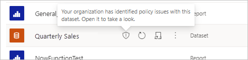
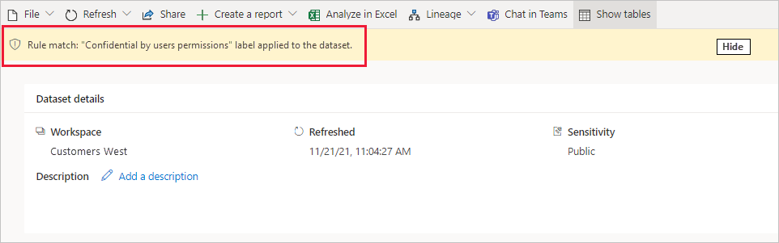
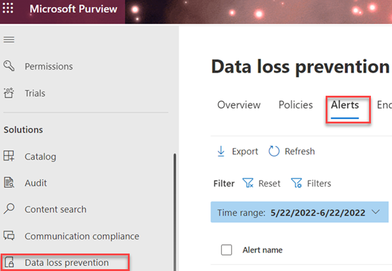

# Get started with Data loss prevention policies for Power BI (preview)

To help organizations detect and protect their sensitive data, [Microsoft Purview data loss prevention (DLP) polices](/microsoft-365/compliance/dlp-learn-about-dlp) support Power BI. When a PowerBI data set matches the criteria in a DLP policy, an alert that explains the nature of the sensitive content can be triggered. This alert is also registered in the data loss prevention **Alerts** tab in the Microsoft compliance portal for monitoring and management by administrators. In addition, email alerts can be sent to administrators and specified users.

## Considerations and limitations

- DLP policies apply to workspaces. Only workspaces hosted in Premium Gen2 capacities are supported. For more information, see [What is Power BI Premium Gen2?](/power-bi/enterprise/service-premium-gen2-what-is).
- DLP dataset evaluation workloads impact capacity. Metering for DLP evaluation workloads is not supported.
- Both classic and new experience workspaces are supported, as long as they are hosted in Premium Gen2 capacities.
- You must create a custom DLP custom policy for Power BI. DLP templates are not supported.
- DLP polices that are applied to the DLP location support sensitivity labels and sensitive information types as conditions. 
- DLP policies for Power BI are not supported for sample datasets, [streaming datasets](/power-bi/connect-data/service-real-time-streaming), or datasets that connect to their data source via [DirectQuery](/power-bi/connect-data/desktop-use-directquery) or [live connection](/power-bi/connect-data/desktop-directquery-about#live-connections).
- DLP policies for Power BI are not supported in sovereign clouds.

## Licensing and permissions

### SKU/subscriptions licensing

Before you get started with DLP for Power BI, you should confirm your [Microsoft 365 subscription](https://www.microsoft.com/microsoft-365/compare-microsoft-365-enterprise-plans?rtc=1). For full licensing guidance, see [Microsoft 365 guidance for security & compliance](/office365/servicedescriptions/microsoft-365-service-descriptions/microsoft-365-tenantlevel-services-licensing-guidance/microsoft-365-security-compliance-licensing-guidance#information-protection).

### Permissions

Data from DLP for Power BI can be viewed in [Activity explorer](/microsoft-365/compliance/data-classification-activity-explorer). There are four roles that grant permission to activity explorer; the account you use for accessing the data must be a member of any one of them.

- Global administrator
- Compliance administrator
- Security administrator
- Compliance data administrator

## How DLP policies for Power BI work

You define a DLP policy in the data loss prevention section of the compliance portal. See, [Design a data loss prevention policy](dlp-policy-design.md#design-a-data-loss-prevention-policy). In the policy, you specify sensitivity label(s) you want to detect. You also specify the action(s) that will happen when the policy detects a dataset that has a specified sensitivity label applied. DLP policies support two actions for Power BI:

- User notification via policy tips.
- Alerts. Alerts can be sent by email to administrators and users. Additionally, administrators can monitor and manage alerts on the **Alerts** tab in the compliance center. 

When a dataset is evaluated by DLP and matches the conditions in a DLP policy, the actions defined in the policy are applied. A dataset is evaluated occurs when a dataset is:

- Publish
- Republish
- On-demand refresh
- Scheduled refresh

>[!NOTE]
> DLP evaluation of the dataset does not occur if either of the following is true:
> - The initiator of the event is a service principal.
> - The dataset owner is either a service principal or a B2B user.

### What happens when a dataset matches a DLP policy

When a dataset matches a DLP policy:

- If the policy has user notification configured, it will be marked in the Power BI service with a shield icon to indicate that it matches a DLP policy.

    

    Open the dataset details page to see a policy tip that explains the policy match and how the detected type of sensitive information should be handled.

    

    >[!NOTE]
    > If you hide the policy tip, it doesn’t get deleted. It will appear the next time you visit the page.

- If alerts are enabled in the policy, an alert will be recorded on the dlp **Alerts** tab in the compliance center, and (if configured) an email will be sent to administrators and/or specified users. The following image shows the **Alerts** tab in the data loss prevention section of the Microsoft Purview compliance portal.

    

## Configure a DLP policy for Power BI

Follow the procedures in [Create, test, and tune a DLP policy](create-test-tune-dlp-policy.md#create-test-and-tune-a-dlp-policy) and use the custom template.

> [!IMPORTANT]
> When you select the locations for your DLP policy for Power BI, select only the Power BI location. Do not select any other locations, this configuration is not supported. 

<!--1. Log into the [Microsoft Purview compliance portal](https://compliance.microsoft.com).

1. Choose the **Data loss prevention** solution in the navigation pane, select the **Policies** tab, choose **Create policy**.

    

1. Choose the **Custom** category and then the **Custom policy** template.
    
    >[!NOTE]
    >No other categories or templates are currently supported.

    
 
    When done, click **Next**.

1. Name the policy and provide a meaningful description.

    
 
    When done, click **Next**.

1. Enable Power BI as a location for the DLP policy. **Disable all other locations**. Currently, DLP policies for Power BI must specify Power BI as the sole location.

    

    By default the policy will apply to all workspaces. Alternatively, you can specify particular workspaces to include in the policy as well as workspaces to exclude from the policy.
    >[!NOTE]
    > DLP actions are supported only for workspaces hosted in Premium Gen2 capacities.

    If you select **Choose workspaces** or **Exclude workspaces**, a dialog will allow you to create a list of included (or excluded) workspaces. You must specify workspaces by workspace object ID. Click the info icon for information about how to find workspace object IDs.

    
 
    After enabling Power BI as a DLP location for the policy and choosing which workspaces the policy will apply to, click **Next**.

1. The **Define policy settings** page appears. Choose **Create or customize advanced DLP rules** to begin defining your policy.

    
 
    When done, click **Next**.

1. On the **Customize advanced DLP rules** page, you can either start creating a new rule or choose an existing rule to edit. Click **Create rule**.

    

1. The **Create rule** page appears. On the create rule page, provide a name and description for the rule, and then configure the other sections, which are described following the image below.

    
 
### Conditions

In the condition section, you define the conditions under which the policy will apply to a dataset. Conditions are created in groups. Groups make it possible to construct complex conditions.

1. Open the conditions section, choose **Add condition** and then **Content contains**.

    
 
    This opens the first group (named Default – you can change this).

1. Choose **Add**, and then **Sensitivity labels**.
        
    >[!NOTE]
    > Sensitive info types are currently not supported.
    
    
 
    When you choose **Sensitivity labels**, you will be able to choose a particular sensitivity label from a list that will appear.

    You can add additional sensitivity labels to the group. To the right of the group name, you can specify **Any of these** or **All of these**. This determines whether matches on all or any of the labels is required for the condition to hold. Make sure **Any of these** is selected, since datasets can’t have more than one label applied.

    The image below shows a group (Default) that contains two sensitivity label conditions. The logic Any of these means that a match on any one of the sensitivity labels in the group constitutes “true” for that group.

     
 
    You can create more than one group, and you can control the logic between the groups with **AND** or **OR** logic. 

    The image below shows a rule containing two groups, joined by **OR** logic.

     
 
### Exceptions

If the sensitivity label of the dataset matches any of the defined exceptions, the rule won’t be applied to the dataset. 

Exceptions are configured in the same way as conditions, described above.
    

 
### Actions

Protection actions are currently unavailable for Power BI DLP policies.

### User notifications

The user notifications section is where you configure your policy tip. Turn on the toggle, select the **Notify users in Office 365 service with a policy tip** and **Policy tips** checkboxes, and write your policy tip in the text box.

 
### User overrides
 
User overrides are currently unavailable for Power BI DLP policies.

 
 
### Incident reports

Assign a severity level that will be shown in alerts generated from this policy. Enable (default) or disable email notification to admins, specify users or groups for email notification, and configure the details about when notification will occur.

   
### Additional options

 
## Monitor and manage policy alerts

Log into the Microsoft Purview compliance portal and navigate to **Data loss prevention > Alerts**.

Click on an alert to start drilling down to its details and to see management options.
-->
## Next steps

- [Learn about data loss prevention](/microsoft-365/compliance/dlp-learn-about-dlp)
- [Sensitivity labels in Power BI](/power-bi/enterprise/service-security-sensitivity-label-overview)
- [Audit schema for sensitivity labels in Power BI](/power-bi/enterprise/service-security-sensitivity-label-audit-schema)
