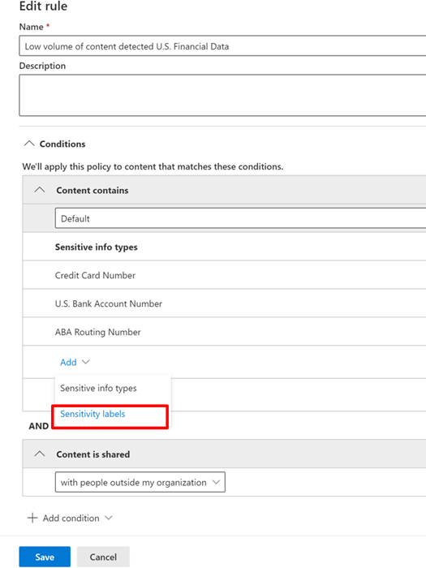

# Use sensitivity labels as conditions in DLP policies

You can use [sensitivity labels](sensitivity-labels.md) as a condition in DLP policies for these location:

- Exchange Online email messages
- SharePoint Online
- OneDrive for Business sites
- Windows 10 devices

Sensitivity labels appear as an option in the **Content contains** list.

> [!div class="mx-imgBorder"]
> 

> [!IMPORTANT]
> **Sensitivity Labels** as a condition will not be available if you have selected **Teams chat and channel messages** as a location to apply the DLP policy.

## Supported items, scenarios, and policy tips

You can use sensitivity labels as conditions on these items and in these scenarios.

### Supported items

|Service  |Item type  |Available to policy tip  |Enforceable  |
|---------|---------|---------|---------|
|Exchange    |email message         |yes         |yes         |
|Exchange    |email attachment         |no         |yes *         |
|SharePoint Online     |items in SharePoint Online         |yes         |yes         |
|OneDrive for Business     |items         |yes         |yes         |
|Teams     |Teams and channel messages         |not applicable         |not applicable         |
|Teams     |attachments         |yes **         |yes **         |
|Windows 10 devices     |items         |yes         |yes         |
|MCAS (preview) |items         |yes         |yes         |

\* DLP detection of sensitivity labeled email attachments are supported for Office file types only.

\** Attachments sent in Teams over 1:1 chat or channels are automatically uploaded to OneDrive for Business and SharePoint. So if SharePoint Online or OneDrive for Business are included as locations in your DLP policy, then labeled attachments sent in Teams will be automatically included in the scope of this condition. Teams as a location does not need to be selected in the DLP policy.

> [!NOTE]
> DLP's ability to detect sensitivity labels in SharePoint and OneDrive for business is limited. For more information, see [Enable sensitivity labels for Office files in SharePoint and OneDrive](sensitivity-labels-sharepoint-onedrive-files.md#limitations).

### Supported scenarios

- DLP Admin will be able to see a list of all sensitivity labels in the tenant when they choose to include one or more sensitivity labels as a condition.

- Using sensitivity labels as a condition is supported across all workloads as indicated in the support matrix above.

- DLP policy tips will continue to be shown across workloads (except Outlook Win32) for DLP policies which contain sensitivity label as a condition.

- Sensitivity labels will also appear as a part of the incident report email if a DLP policy with sensitivity label as a condition is matched.

- Sensitivity label details will also be shown in the DLP rule match audit log for a DLP policy match which contains sensitivity label as a condition.

### Support policy tips

|Workload  |Policy tips supported/not supported  |
|---------|---------|
|OWA |    supported     |
|Outlook Win 32    |  not supported       |
|SharePoint   |   supported      |
|OneDrive for Business    |    supported     |
|endpoint devices   |  not supported       |
